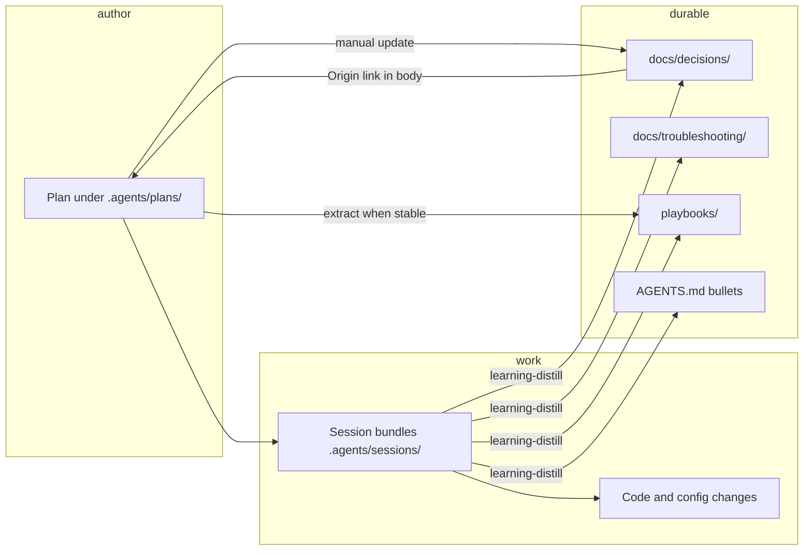

# Plans in the published kit

## Repository context

The repository uses a **single-tree** layout: canonical portable content lives under root `.agents/`, and a **generated** full consumer illustration lives under `example/.agents/` (see [Single-tree architecture (`.agents/`)](../docs/decisions/single-tree-architecture-agents.md)). This document was historically titled “scaffold”; treat **published kit copy** as `example/.agents/` **or** the same paths after a consumer merges the kit into their repo.

**Today:** maintainer and roadmap-style plans already live under `.agents/plans/`. They are called out from [`.agents/docs/index.md`](../docs/index.md) but are **not** yet part of the default portable contract the way `decisions/`, `troubleshooting/`, `playbooks/`, and `sessions/` are.

## Purpose (tool-agnostic)

Plans capture **durable intent for multi-step initiatives**: roadmaps, phased work, investigations, and meta-kit evolution. They are **markdown-first** and **agent-tool-agnostic**—any editor or agent can read and edit them without a proprietary database.

Industry pattern (aligned with common ADR guidance): keep **accepted rationale** short and in decision records; link out to **supporting narrative, scope, and phasing** in separate documents rather than inflating decisions or `AGENTS.md`. See [Architecture Decision Record (bliki)](https://martinfowler.com/bliki/ArchitectureDecisionRecord.html) and [AWS ADR guidance](https://docs.aws.amazon.com/prescriptive-guidance/latest/architectural-decision-records/adr-process.html) for the “brief record + links” shape.

## Placement in this repo

| Location | Role |
| -------- | ---- |
| `.agents/plans/*.md` | **Active** plans: current maintainer and starter-roadmap work (this repo’s working set). |
| `.agents/plans/archive/*.md` | **Cold storage** for finished, cancelled, superseded, or otherwise retired plans (same `id` and filename stem as before the move). |
| `example/.agents/plans/` | **Optional future** mirror for the generated example tree once `generate-example` and docs agree to ship a starter `README.md` + one sample plan. |
| Consumer repo after merge | Same relative path `.agents/plans/` if the adopting team wants initiatives beside the rest of the kit. |

**Naming:** one initiative per file, filename stem equals frontmatter `id`, lowercase `[a-z0-9_-].md`. The same rule applies under `plans/archive/` (path changes; **`id` does not**).

**Collision rule:** plan `id` values must **not** match any `id` under `.agents/docs/decisions/` or `.agents/docs/troubleshooting/` (those ids share a single global namespace per [MAINTENANCE.md](../docs/MAINTENANCE.md)). Prefix plan ids with a clear token (for example `plan-` or a short project slug) if names might clash.

## How plans differ from siblings

| Artifact | Holds | Lifetime |
| -------- | ----- | -------- |
| `.agents/plans/` (top level) | Intent, scope, phasing, success criteria, links | While active or not yet filed into `archive/` |
| `.agents/plans/archive/` | Same as plans, retired | Indefinite retention; optional trim after link graph is stable |
| `.agents/playbooks/` | Repeatable **how-to** procedures | Long-lived; update in place |
| `.agents/sessions/` | Raw evidence for **one** task (closeout bundles) | Short-lived; gitignored bundles |
| `.agents/docs/decisions/` | Accepted (or provisional) **architectural/policy** outcomes | Long-lived; supersede in place with links |
| `.agents/AGENTS.md` | Concise operational rules | Small; stable bullets only |

**Anti-patterns**

- Duplicating a stable procedure in a plan instead of **extracting** a playbook once the steps are known.
- Parking long-term rationale only in a plan instead of **distilling** a decision when the choice stabilizes.
- Using a plan as a dumping ground for **one-off** debugging (use a session bundle + troubleshooting entry instead).

## YAML frontmatter contract (plans)

Applies to each plan markdown file under `.agents/plans/` or `.agents/plans/archive/` (same contract in both places). Optional `plans/README.md` or `plans/archive/README.md` index files are excluded unless they adopt plan frontmatter on purpose.

### Required keys

- `id`: stable slug, **must match** the filename without `.md`, lowercase `[a-z0-9_-]`, **must not** collide with any decision or troubleshooting entry `id`.
- `title`: short human title (quoted if it contains colons).
- `last_updated`: ISO calendar date `YYYY-MM-DD` (update when the plan meaningfully changes).
- `description`: one or two sentences, machine-oriented (indexes, search, agent context).
- `tags`: non-empty YAML **list** of lowercase `[a-z0-9_-]` labels (same style as durable entries).
- `status`: plan lifecycle (lowercase):

  | Value | Meaning |
  | ----- | ------- |
  | `draft` | Outline; not committed as team direction. |
  | `active` | Current initiative; work may proceed. |
  | `paused` | Intentionally on hold (time or dependency). |
  | `completed` | Outcomes achieved or explicitly closed; see body for where knowledge landed. |
  | `cancelled` | Stopped without the planned outcomes; record why in the body. |
  | `archived` | Obsolete context kept for history only (often after a move to `plans/archive/`). |
  | `superseded` | Replaced by another plan; set `superseded_by`. |

**Note:** this `status` vocabulary is **only** for files under `plans/`. Do not confuse it with decision `status` (`accepted` / `provisional` / `superseded`) in `.agents/docs/decisions/`.

### Optional keys

- `kind`: `initiative` | `meta` | `exploration` (default treat as `initiative` if omitted).
- `related_decisions`: list of durable entry **ids** (from `decisions/` or `troubleshooting/`) this plan **depends on** or **implements**.
- `anticipated_decisions`: list of **planned** decision slugs or short titles **not yet filed**—a queue for distillation (remove or replace with real ids once files exist).
- `outcome_decisions`: list of durable entry ids **created or materially updated** because of this plan (maintainers fill in near completion).
- `supersedes` / `superseded_by`: other plan **`id`** values (filename stems under `plans/`), forming a simple chain.
- `related_plans`: list of other plan `id` values for parallel tracks or dependencies.
- `consumer_portable`: boolean; if `true`, the plan is intended to ship in consumer-facing trees (for example copied into `example/.agents/plans/`). Maintainer-only roadmaps default `false` or omit.

### Optional provenance (human / AI)

When useful for audit, not for runtime tools:

- `author_kind`: `human` | `ai`
- `prompter`: free text (who requested the work, if `author_kind` is `ai`)

### Example frontmatter

```yaml
---
id: plan-api-keys-rotation
title: "API key rotation hardening"
last_updated: 2026-04-19
description: >
  Multi-release initiative to rotate signing keys, update deployment docs,
  and record the policy decision once behavior is stable.
tags: [security, release, ops]
status: active
kind: initiative
related_decisions: [single-tree-architecture-agents]
anticipated_decisions: [api-key-rotation-policy]
related_plans: [plan-secrets-audit]
consumer_portable: false
---
```

## Recommended plan body

Keep the body scannable; prefer links over prose walls.

1. **Goal** — one paragraph.
2. **Scope / non-goals** — bullets.
3. **Phasing or milestones** — optional; numbered.
4. **Success criteria** — testable outcomes.
5. **Execution notes** — optional links to session bundles (path + `task_id`), PRs, or external trackers **by reference** (no secrets).
6. **Knowledge routing** — where outputs should land (playbook path, decision ids, troubleshooting ids).

## Flow through the system



### Typical lifecycle

1. **Author** — create `plans/<id>.md` with required frontmatter and a clear goal.
2. **Execute** — day-to-day work uses **task-closeout** bundles under `.agents/sessions/` (evidence, not the plan).
3. **Distill** — **learning-distill** promotes stable lessons to decisions, troubleshooting, playbooks, or `AGENTS.md`.
4. **Tie back** — when a new decision exists because of the initiative, add an **Origin** (or **Related plan**) subsection in the decision body with a **relative** Markdown link to the plan file (top-level `../../plans/<id>.md` or, after archival, `../../plans/archive/<id>.md`). Optionally add the decision’s `id` to the plan’s `outcome_decisions` and bump `last_updated`.
5. **Complete** — set terminal `status` (`completed`, `cancelled`, `superseded`, or `archived` as appropriate); list final artifact paths; **move** the file to `.agents/plans/archive/` when it should leave the active set (see [Plan archive](#plan-archive-cold-storage)); run a **link sweep** so no durable doc still points at the old path.
6. **Supersede** — set `superseded_by`, link the replacement plan, then archive the old file if it is no longer an active working document.

### Session ↔ plan link (`summary.json`)

Contract (see also [task-closeout](../skills/task-closeout/SKILL.md)):

- **General tasks:** do **not** add plan linkage fields to `summary.json`.
- **Plan-involved tasks:** when the session materially executes, updates, or closes work **scoped to one or more plans** (editing plan files, delivering plan milestones, or producing distillations **in service of** a plan’s acceptance criteria), `summary.json` **must** include a non-empty `related_plans` array of plan **`id`** strings (stable slugs; path-agnostic so a plan can move to `archive/` without rewriting past sessions).

```json
"related_plans": ["plans-in-scaffold"]
```

If unsure whether the task “involves” a plan, default to **including** `related_plans` when any `.agents/plans/**/*.md` file for that initiative was touched or explicitly named as scope in `active-task.md`.

Planning-only note: this contract lives here as a **proposed policy** until the corresponding skill work is intentionally scheduled; do not change `task-closeout` behavior as part of this planning document alone.

## Plan archive (cold storage)

When a plan is **finished, cancelled, superseded, or otherwise retired** as a day-to-day working document, **move** it off the top-level plans list instead of leaving broken or stale links across the repo.

1. **Move the file** — from `.agents/plans/<id>.md` to `.agents/plans/archive/<id>.md` (same basename; same frontmatter `id`). Prefer `git mv` so history follows the file.
2. **Set or confirm terminal `status`** in frontmatter (`completed`, `cancelled`, `superseded`, or `archived`) and bump `last_updated`.
3. **Link sweep** — search the repo for references to the old path (`plans/<id>.md`, `../plans/<id>.md`, `../../plans/<id>.md`, index bullets, playbooks, decisions, other plans) and update them to `plans/archive/<id>.md` (adjust relative depth per file). **Do not** orphan navigational docs: if `docs/index.md` or similar listed the plan, either point to `archive/` or remove the bullet if the plan is no longer worth surfacing.
4. **Decisions** — update `### Related initiative` (or equivalent) links from `../../plans/<id>.md` to `../../plans/archive/<id>.md`.

Past **task-closeout** bundles may keep their original `related_plans` ids unchanged; ids are stable across the move.

## Linking decisions back to plans

Decisions remain governed by [MAINTENANCE.md](../docs/MAINTENANCE.md): `depends_on` links **other durable entry ids**, not plan ids.

**Recommended cross-link shape**

- From **plan** → decision: use `related_decisions` / `outcome_decisions` in plan frontmatter, and/or body links to `../docs/decisions/<id>.md`.
- From **decision** → plan: add a short subsection in the decision body, for example `### Related initiative`, with a relative link to `../../plans/<id>.md` or `../../plans/archive/<id>.md` (from `docs/decisions/`), matching where the plan file currently lives.

That keeps parsers simple (no new required frontmatter on decisions) while preserving human- and agent-visible traceability.

## Skills roadmap (not all need to exist on day one)

All of these are **optional** workflow skills under `.agents/skills/`—plain `SKILL.md` contracts, no vendor lock-in.

| Skill (proposed) | Responsibility |
| ---------------- | ---------------- |
| **write-plan** | Scaffold a new `plans/<id>.md` with valid frontmatter; check id collision with `decisions/` and `troubleshooting/`; suggest `related_decisions` from context. |
| **update-plan-status** | Bump `last_updated`, transition `status`, set `superseded_by` / `supersedes`, and ensure body “Knowledge routing” matches reality. |
| **archive-plan** | Move a terminal plan to `plans/archive/`, then **link sweep** durable docs (decisions, indexes, playbooks, cross-plan links) so nothing points at the old top-level path. |
| **plan-to-playbook** | When steps stabilize, extract procedure to `.agents/playbooks/` and replace the plan section with a link (avoid duplication). |
| **distill / lint hooks (future)** | Extend **learning-distill** or **knowledge-lint** to warn on `anticipated_decisions` that never became files, or plans `status: active` with stale `last_updated` (human-reviewed warnings only until schema is stable). |

**write-plan** is the highest-leverage first skill: it encodes the frontmatter contract and collision rules as executable checklists.

Maintainer-only skills (if any) should follow [Maintainer-only skills use `metadata.internal: true`](../docs/decisions/maintainer-skills-mark-internal-in-frontmatter.md).

### Existing skills to reuse/reference

Use these as direct dependencies or implementation templates when building the planned plan skills.

| Candidate skill | Use directly for planned work | Reuse notes for planned skills |
| --------------- | ----------------------------- | ------------------------------ |
| [`.agents/skills/task-closeout/SKILL.md`](../skills/task-closeout/SKILL.md) | **Yes**, for plan-involved session evidence capture and `summary.json.related_plans` enforcement. | Copy its "required vs optional fields" language style, explicit procedure numbering, and canonical-id emphasis (`task_id` in `summary.json`). `write-plan` can mirror this by enforcing filename/id equality and required frontmatter keys. |
| [`.agents/skills/learning-distill/SKILL.md`](../skills/learning-distill/SKILL.md) | **Yes**, for converting session evidence into durable decisions/playbooks/troubleshooting tied back to plans. | Reuse its classification model (ephemeral vs durable targets) to define `plan-to-playbook` promotion criteria and `update-plan-status` completion gates (for example, only mark `completed` after outputs are routed). |
| [`.agents/skills/knowledge-lint/SKILL.md`](../skills/knowledge-lint/SKILL.md) | **Yes**, as the lint pass that can eventually check plan freshness and link integrity. | Reuse metadata-contract checks, cross-index consistency checks, and mechanical path-hygiene patterns for `archive-plan` link sweep checks (old path to `plans/archive/` updates). |
| [`.agents/skills/generate-example/SKILL.md`](../skills/generate-example/SKILL.md) | **Yes** (maintainer-only) when promoting plans into generated `example/.agents/`. | Reuse the "canonical playbook is source of truth" pattern; if plans become portable, add any `example/.agents/plans/` seed files through bootstrap/generation rather than manual drift. |
| `create-skill` (Cursor built-in skill) | **Reference only** for authoring style and structure, not as repo runtime dependency. | Reuse naming/description conventions, progressive disclosure, and validation checklist style when drafting `write-plan`, `update-plan-status`, and `archive-plan` `SKILL.md` files. |
| `find-skills` helper skill | **Reference only** when evaluating external ecosystem skills to avoid reinventing. | Use as a periodic discovery step before implementing new repo-local plan skills; record what was evaluated and why local implementation was still needed. |

### Notes for later implementation

- Build **`write-plan` first** by composing existing patterns: strict frontmatter contract (`knowledge-lint` style) + deterministic authoring steps (`task-closeout` style).
- Add **`archive-plan` second** with an explicit link-sweep checklist modeled on `knowledge-lint` path-hygiene checks.
- Implement **`update-plan-status` third** with lifecycle gates tied to `learning-distill` outcomes (decision/playbook/troubleshooting routing complete).
- Defer automated checks to lint hooks only after enough real plans exist to tune false positives (match current out-of-scope policy).

## Promotion into `example/` and portable kit

**Goal:** adopters who want initiative tracking can opt in with the same layout as this repo.

**Steps (when ready)**

- Add `example/.agents/plans/README.md` via `generate-example` bootstrap describing plans vs playbooks vs sessions, and document `plans/archive/` for retired plans.
- Optionally seed one **generic** sample plan with `consumer_portable: true` as a template.
- Update [Regenerate `example/` when the portable kit or bootstrap changes](../docs/decisions/regenerate-example-when-portable-kit-changes.md) workflows if new paths are added.
- Keep **meta** maintainer roadmaps (`consumer_portable: false`) out of the generated example unless explicitly copied for demonstration.

Automated plan lint in CI stays **out of scope** until the frontmatter schema has baked in real use (see original scope note below).

## Original scope and success criteria (retained)

**Scope**

- Add `example/.agents/plans/` (or agreed name) with a short README or index describing purpose vs `.agents/playbooks/` and `.agents/sessions/`.
- Standardize YAML frontmatter (this document is the contract).
- Document transitions: when a plan becomes a playbook, a repo decision, log-only, or is archived/deleted.

**Out of scope (for this plan)**

- Implementing published-kit plan files until the layout and `generate-example` contract are agreed.
- Automating plan lint in CI until the schema stabilizes.

**Success criteria**

- Adopters can file approved work as plans without overloading `AGENTS.md` or session bundles.
- Maintainers have a single authoritative description of plan lifecycle and linking; discovery continues from [`.agents/docs/index.md`](../docs/index.md) and [`.agents/docs/MAINTENANCE.md`](../docs/MAINTENANCE.md) as indexes evolve.

## Notes

- This file is **meta**: it defines how “plans” behave in the kit while the pattern is validated under `.agents/plans/`.
- **Pre-migration plans** may still use informal frontmatter (`writer`, `prompter`, `created` without `id`); normalize to this contract when touching a file for other reasons.
