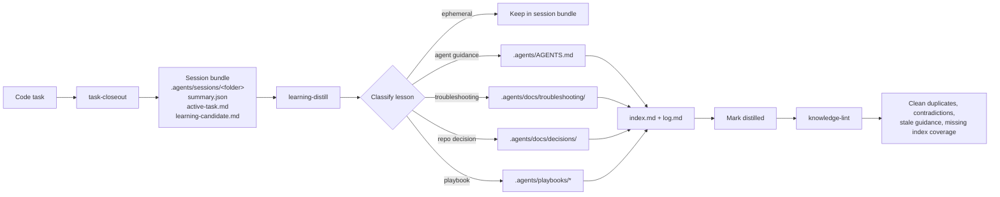

# Agent Knowledge Starter Kit v2.0a

A shareable, tool-agnostic starter kit for maintaining a compiled repo knowledge layer for coding agents.

Durable decisions and troubleshooting patterns live as separate markdown files under `.agents/docs/decisions/` and `.agents/docs/troubleshooting/`, each with its own `index.md`.

This pattern separates three concerns:

1. **Temporary session outputs** live inside the repo under `.agents/sessions/`, with one folder per task-closeout bundle.
2. **Durable repo knowledge** lives under `.agents/`.
3. **Agent roles and skills** live in that same `.agents/` tree and describe how coding, learning, and maintenance workflows run.

Important: in this repository, adoption is skill/bootstrap-first. Install the kit skills with your Skills CLI and run each skill's **Skill initialization** once so the repo gains only the folders and template files needed for the installed skills. Default `npx skills add` often places skills under `.agents/skills/`; user or global installs are fine too—session bundles and durable knowledge still belong under this repo’s `.agents/`. Details: [INSTALL.md](INSTALL.md#skill-first-install-default).

The goal is to avoid bloating a single `.agents/AGENTS.md` with temporary notes, while still preserving useful lessons from completed work.

## Disclaimer

This repository and the kit under `.agents/` were produced with the help of AI tools. Everything here is **as-is**; **use at your own risk**. Validate instructions, commands, and policies for your environment before relying on them.

## Why this exists

Most coding agents can edit code well enough, but repo learning often degrades into one of two bad outcomes:

- useful lessons are lost after the session ends
- too much low-quality context gets stuffed into instruction files

This starter kit introduces a small maintenance system:

- a **coding agent** finishes work and emits a structured handoff packet
- a **learning agent** distills only the durable parts into `.agents/`
- an optional **lint agent** keeps the knowledge layer coherent over time

This is intentionally generic. It should work with any system that supports user-defined agents or personas, reusable skill or instruction files, full repo file access, and a **gitignored** `.agents/sessions/` area for temporary task artifacts.

## Quick start

### For humans

You can install the kit manually, copy the pre-initialized `example/.agents/` into a fresh repo, or ask an agent to do it.

Manual install:

1. Install skills with `npx skills add Hypercubed/Agent-Knowledge-Starter-Kit`, then follow each installed `SKILL.md`'s **Skill initialization** once (see [INSTALL.md](INSTALL.md#skill-first-install-default)).
2. If the project already has `.agents/`, merge instead of replacing; preserve repo-specific `rules/`, `playbooks/`, and `skills/`.
3. Edit `.agents/AGENTS.md` with real build, test, and project conventions (or keep the template created by skill initialization until you are ready).
4. Wire `.agents/skills/*/SKILL.md` into your editor or agent product. Use [`.agents/AGENTS.md`](.agents/AGENTS.md) and [`docs/architecture.md`](docs/architecture.md) for repo-wide and role-boundary guidance.

Copy the example (fresh repo):

1. Create a new empty repository (or project folder).
2. Copy this repository’s [`example/.agents/`](example/.agents/) directory into your project root as `.agents/`. You do not need anything else from [`example/`](example/) (for example its README).
3. Wire `.agents/skills/*/SKILL.md` into your tools (see [`INSTALL.md`](INSTALL.md)).

Agent-assisted install:

```text
Install the Agent Knowledge Starter Kit into this repo. Prefer using
`npx skills add Hypercubed/Agent-Knowledge-Starter-Kit`. If npx is
unavailable, you can clone the repository to a temporary folder and copy
the `.agents/skills/` directory manually. Next, read the kit's INSTALL.md
and follow the setup instructions (including running each skill's
initialization). Preserve any existing repo-specific `.agents/` content.
Finally, summarize the changed files and any manual tool-integration
steps I still need to do.
```

### For agents

Follow [INSTALL.md](INSTALL.md). Run `npx skills add Hypercubed/Agent-Knowledge-Starter-Kit` to install the skills. Then run each installed skill's initialization from its `SKILL.md`. If `.agents/` already exists, merge conservatively and preserve existing repo-specific knowledge.

## How to use this kit

Use the kit as a lightweight maintenance loop around normal agent work:

1. **Start with the repo knowledge layer.** Keep a short root `AGENTS.md` or tool rule that points agents to `.agents/AGENTS.md` and `.agents/docs/index.md`. Put durable repo policy in `.agents/`, not in each tool's native config.
2. **Do the implementation work normally.** Have the coding agent read the relevant durable guidance, use playbooks or files under `.agents/docs/troubleshooting/` when needed, and keep tool-specific prompts as thin wiring.
3. **Close meaningful tasks with `task-closeout`.** At completion, blockage, or abandonment, invoke the repo-local `task-closeout` skill. It should write raw evidence and a structured bundle under `.agents/sessions/<folder>/`, which is usually gitignored. The canonical task/session identifier is the `task_id` field inside that bundle's `summary.json`; the folder name is only a sortable storage label.
4. **Promote durable lessons with `learning-distill`.** After closeout, run a separate learning pass with `learning-distill`. Pass the session bundle path and use the `task_id` field in `summary.json` when referring to the task. Promote only stable, reusable lessons into `.agents/AGENTS.md`, `.agents/docs/`, or `.agents/playbooks/`; leave one-off task history in `.agents/sessions/`.
5. **Keep the knowledge layer clean with `knowledge-lint`.** Periodically invoke `knowledge-lint` to find duplicate, stale, contradictory, oversized, or uncategorized guidance before the layer becomes noisy.
6. **Review the diff.** Treat durable knowledge changes like code: inspect what changed, make sure session bundles stayed temporary, and commit only the files that should become shared repo knowledge.



Tool-specific guides in [`docs/integrations/`](docs/integrations/) show how to wire this same workflow into individual products.

Repo-local session storage is the default because bundles stay close to the code, diffs, commands, and durable docs they describe. In cloud, ephemeral, or shared-agent environments, adapt the storage location if local `.agents/sessions/` data may disappear or cross machine boundaries. Keep per-task session artifacts out of commits, either with the kit's `.agents/.gitignore` or equivalent repo-root ignore rules.

## Adopting into an existing `.agents/`

Do not replace an existing `.agents/` tree wholesale unless it is already disposable template content. Preserve repo-specific knowledge first, especially existing `rules/`, `playbooks/`, and `skills/`, then merge in the missing starter-kit pieces.

Use this checklist:

1. Inventory existing `.agents/` content and mark domain-specific files to keep.
2. Install the skills you need with `npx skills add Hypercubed/Agent-Knowledge-Starter-Kit` (or copy selected skill folders from `.agents/skills/`) and run each skill's **Skill initialization** so missing template files and session layout are created without overwriting existing content.
3. Add the portable maintenance skills if they are not already present: `task-closeout`, `learning-distill`, and `knowledge-lint`.
4. Merge `.agents/AGENTS.md` by hand so stable repo guidance stays concise and temporary history stays out.
5. Confirm session ignore rules. Prefer the kit default in `.agents/.gitignore`: `sessions/*` and `!sessions/README.md`. Use repo-root `.gitignore` patterns only as an alternative: `.agents/sessions/*` and `!.agents/sessions/README.md`.
6. Optional: append a minimal adoption note to `.agents/docs/log.md` only if you use that file as a maintenance audit trail (see `.agents/docs/MAINTENANCE.md`, Logging policy). Record any durable rationale in a new or existing file under `.agents/docs/decisions/` (update `decisions/index.md` when adding a decision).
7. Update `.agents/docs/index.md` so pre-existing repo-specific `rules/`, `playbooks/`, and `skills/` are discoverable.

If both root `AGENTS.md` and `.agents/AGENTS.md` exist, treat root `AGENTS.md` as the agent entrypoint for that checkout and `.agents/AGENTS.md` as the portable knowledge-layer file. Keep one source of truth for each instruction: root `AGENTS.md` should point agents into `.agents/` or contain only bootstrap guidance, while durable repo conventions live in `.agents/AGENTS.md`.

## Architecture

Design principles, repository layout, agent roles, durable knowledge files, task lifecycle, and distillation rules live in [docs/architecture.md](docs/architecture.md).

## Tool integration

This kit ships **content** (markdown, layout, and conventions), not a single vendor-specific config. You still need to register `.agents/skills/*/SKILL.md` however your stack expects. Keep the on-disk layout under `.agents/` stable so the knowledge layer stays portable when you change tools.

## Integrations

Tool-specific integration guides live in [`docs/integrations/`](docs/integrations/). Start with the shared [Integration Patterns](docs/integrations/patterns.md) guide, then use the product-specific quick reference for exact setup details.

Currently available:

- [Integration Patterns](docs/integrations/patterns.md)
- [Agentic Sandbox](docs/integrations/agentic-sandbox.md)
- [Antigravity](docs/integrations/antigravity.md)
- [Claude Code](docs/integrations/claude-code.md)
- [Codex](docs/integrations/codex.md)
- [Copilot](docs/integrations/copilot.md)
- [Cursor](docs/integrations/cursor.md)
- [Gemini CLI](docs/integrations/gemini-cli.md)
- [Hermes](docs/integrations/hermes.md)
- [Kilo Code](docs/integrations/kilo-code.md)
- [OpenClaw](docs/integrations/openclaw.md)
- [OpenCode](docs/integrations/opencode.md)
- [Warp](docs/integrations/warp.md)
- [Zo Computer](docs/integrations/zo-computer.md)

---

## License

Released under the [MIT License](LICENSE).
