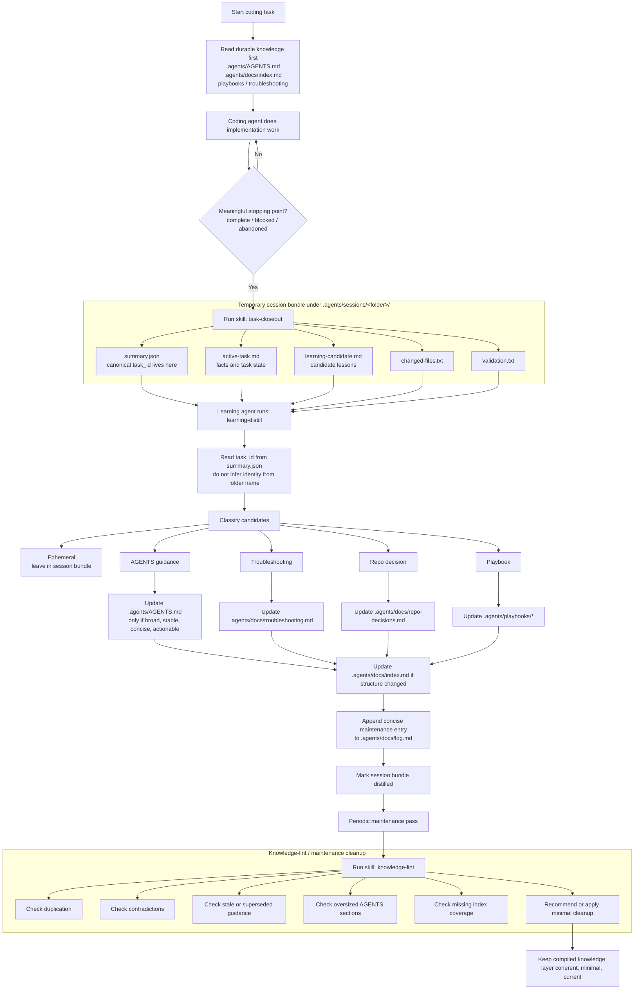

# Architecture

## Design principles

### 1. Raw evidence is not the same as durable knowledge

Task packets are evidence. They capture what happened during one task.

The `.agents/` directory is a compiled knowledge layer. It should contain only information that is stable, reusable, and likely to help future agents.

### 2. `.agents/AGENTS.md` should stay small

`.agents/AGENTS.md` is for concise, repo-wide guidance.

It should not contain:

- session history
- long rationale
- failed experiments
- speculative notes
- one-off debugging details

Those belong in `.agents/sessions/` bundles, `.agents/docs/troubleshooting.md`, `.agents/playbooks/`, or `.agents/docs/repo-decisions.md`.

### 3. Distillation should be a separate role

The same agent that is busy implementing code is often not the best judge of what should become durable repo guidance.

A separate learning pass creates better boundaries:

- coding agent handles execution
- learning agent handles classification and compression
- lint agent handles cleanup and consistency

### 4. Knowledge should be maintained incrementally

Future agents should consult the compiled `.agents/` layer first, not rediscover lessons from raw task history every time.

---

## Repository layout

```text
starter repo
.
├── scaffold/
│   ├── AGENTS.md
│   ├── docs/
│   │   ├── MAINTENANCE.md
│   │   ├── index.md
│   │   ├── log.md
│   │   ├── repo-decisions.md
│   │   └── troubleshooting.md
│   ├── playbooks/
│   │   └── README.md
│   ├── agents/
│   │   ├── coding-agent.md
│   │   ├── learning-agent.md
│   │   └── lint-agent.md
│   ├── sessions/
│   │   └── README.md
│   └── skills/
│       ├── task-closeout/
│       │   ├── SKILL.md
│       │   └── example/
│       │       └── task-bundle/
│       │           ├── summary.json
│       │           ├── active-task.md
│       │           ├── learning-candidate.md
│       │           ├── changed-files.txt
│       │           └── validation.txt
│       ├── learning-distill/
│       │   └── SKILL.md
│       └── knowledge-lint/
│           └── SKILL.md

consumer repo after adoption
.
└── .agents/
    ├── AGENTS.md
    ├── docs/
    │   ├── MAINTENANCE.md
    │   ├── index.md
    │   ├── log.md
    │   ├── repo-decisions.md
    │   └── troubleshooting.md
    ├── playbooks/
    │   └── README.md
    ├── agents/
    │   ├── coding-agent.md
    │   ├── learning-agent.md
    │   └── lint-agent.md
    ├── sessions/
    │   └── README.md
    └── skills/
        ├── task-closeout/
        │   ├── SKILL.md
        │   └── example/
        │       └── task-bundle/
        │           ├── summary.json
        │           ├── active-task.md
        │           ├── learning-candidate.md
        │           ├── changed-files.txt
        │           └── validation.txt
        ├── learning-distill/
        │   └── SKILL.md
        └── knowledge-lint/
            └── SKILL.md
```

---

## Scaffold vs consumer layout

- `scaffold/` is the **published kit**: treat it as if it were already rooted at `.agents/` in a consumer project. It should not describe this GitHub repo’s layout or maintainer-only workflows.
- This starter repository may also keep an optional `.agents/` for dogfood; that tree **does not** have to stay identical to `scaffold/` (maintainer-specific notes may live only under `.agents/` here).
- After adoption elsewhere, the consumer’s `.agents/` is the contract; adjust only wiring in your tool, not the overall layout, when possible.

## Task and session identity

Each task-closeout bundle has one canonical task/session identifier: the `task_id` field inside `.agents/sessions/<session-folder>/summary.json`.

The session folder name is a sortable storage label. It should be human-readable and usually aligned with the task, but agents should not infer canonical identity from the folder name.

Use `repo_id` for the stable repository or project context. Use `task_id` for the specific task/session.

When passing work between agents, provide both:

- the session bundle path
- the `task_id` value from `summary.json`

Example:

```text
Bundle path: .agents/sessions/20260411-122921-auth-timeout-fix/
Task ID: t-20260411-122921-auth-timeout-fix
Repo ID: agent-knowledge-starter
```

## In-repo session output location

Store temporary task and session outputs inside the repo under `.agents/sessions/`.

Recommended default:

```text
.agents/sessions/YYYYMMDD-HHMMSS-short-topic/
```

Each session folder contains one task-closeout bundle, including:

- `summary.json`
- `active-task.md`
- `learning-candidate.md`
- `changed-files.txt`
- `validation.txt`

These files are temporary working-memory artifacts that stay inside the repo so they are easy to inspect, reuse, and distill across editor sessions.

Keep `.agents/sessions/` gitignored so bundles stay local and do not become committed durable knowledge.

Repo-local storage is the default because session evidence stays near the code and durable docs it describes. If agents run in cloud, ephemeral, or multi-machine environments, adapt the storage location or backup process so bundles survive long enough to distill. Keep the same bundle shape and keep per-task artifacts out of commits.

Recommended naming guidance:

- use one folder per task-closeout bundle
- use a deterministic, sortable format such as `YYYYMMDD-HHMMSS-short-topic`
- keep the trailing slug short, lowercase, and specific to the task
- if multiple bundles start in the same second, extend the slug rather than changing the timestamp format

Example:

```text
.agents/sessions/20260411-122921-auth-timeout-fix/
```

---

## Agent roles

### Coding agent

Responsibilities:

- implement code changes
- run tests and validation
- capture a session bundle at meaningful stopping points
- optionally delegate to the learning agent

### Learning agent

Responsibilities:

- read a completed session bundle from `.agents/sessions/`
- classify candidate lessons
- update the correct durable file under `.agents/`
- keep `.agents/AGENTS.md` concise
- record a maintenance log entry

### Lint agent

Responsibilities:

- find duplication and contradictions in `.agents/`
- identify stale or oversized guidance
- recommend or apply minimal cleanup

---

## Durable knowledge files

### `.agents/AGENTS.md`

Compact, high-signal instructions for future coding agents.

Put here:

- build and test commands
- coding conventions
- architecture constraints
- recurring high-confidence pitfalls
- short checklists

### `.agents/docs/repo-decisions.md`

Durable rationale and architectural choices.

Put here:

- why a convention exists
- tradeoffs and exceptions
- decisions that may need explanation later

### `.agents/docs/troubleshooting.md`

Recurring failure and recovery patterns.

Put here:

- symptoms
- likely causes
- known fixes
- validation steps

### `.agents/playbooks/`

Durable multi-step procedures (sibling of `.agents/docs/`, not inside `.agents/docs/`).

Put here:

- release flows
- special build or deploy steps
- recurring maintenance procedures
- workflows that require multiple ordered steps

### `.agents/docs/index.md`

Catalog of knowledge assets and when to consult them.

### `.agents/docs/log.md`

Append-only record of maintenance actions.

### `.agents/docs/MAINTENANCE.md`

The schema and policy document for the knowledge layer.

---

## Task lifecycle

1. A coding task begins.
2. The coding agent creates or adopts a stable `repo_id` and a task-specific `task_id`.
3. At completion, blockage, or abandonment, the coding agent runs `task-closeout`.
4. A structured task-closeout bundle is written to `.agents/sessions/<session-folder>/`.
5. The canonical task/session identifier is recorded in the `task_id` field inside the bundle's `summary.json`.
6. The learning agent runs `learning-distill` on that session bundle.
7. Durable lessons are written into `.agents/`.
8. The learning agent appends a summary to `.agents/docs/log.md`.
9. Periodically, the lint agent runs `knowledge-lint`.



---

## Distillation rules

A candidate lesson belongs in `.agents/AGENTS.md` only if it is:

- high confidence
- broadly useful in this repo
- concise
- actionable
- likely to recur

Otherwise it probably belongs in:

- `.agents/docs/repo-decisions.md`
- `.agents/docs/troubleshooting.md`
- `.agents/playbooks/`
- nowhere at all
