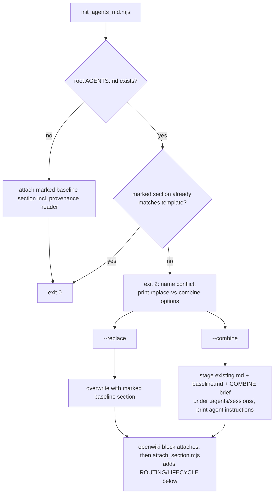

## Context

See proposal.md for motivation. Current state:

- `attach_section.mjs` appends marker-delimited AKSK sections to root router files and **creates** a missing file containing only those sections — today there is no upstream behavioral initializer.
- `openwiki/decisions/use-the-routing-pattern-for-agentic-tool-bootstrap-files.md` records that root bootstrap files should stay thin and route knowledge to `.agents/`. This change adds non-think behavioral content to `AGENTS.md`, so it must reconcile with that decision (see Decisions).
- Kit conventions that constrain the implementation: scripts are deterministic Node `.mjs`, never install anything, fail fast with exit 2 plus exact remediation; temporary session artifacts live under `.agents/sessions/`; `docs-lint` integrity-checks AKSK wiring.

## Goals / Non-Goals

**Goals:**

- One deterministic command that seeds `AGENTS.md` from a vendored baseline when absent.
- Explicit, user-mediated resolution (replace vs LLM-combine) when the file exists — no silent overwrite ever.
- Provenance tracking and opt-in refresh of the vendored baseline.
- Composition with `attach_section.mjs`: seed first, then attach ROUTING/LIFECYCLE sections.

**Non-Goals:**

- Symlinking `CLAUDE.md` / `GEMINI.md` (per-tool wiring stays out of scope; kit is tool-agnostic).
- Runtime network fetch during seeding (offline-safe by design).
- Calling any LLM from kit scripts — combination is an agent procedure, not script logic.
- Editing sections 0–9 semantics of the baseline itself.

## Decisions

### D1: New script `init_agents_md.mjs`, not overloading `attach_section.mjs`

`attach_section.mjs` has an append-only invariant ("existing content is never replaced"). Seeding introduces replace/combine semantics that would muddy that contract and risk regressions in every existing caller. A separate script composes cleanly: `init_agents_md.mjs` runs before `attach_section.mjs` in the documented bootstrap order.

*Alternative considered:* a `--seed-template` flag on `attach_section.mjs` — rejected because two different write contracts in one script invites exactly the silent-overwrite bug this change guards against.

### D2: Vendor the baseline as a marked template; refresh is explicit

The FerroxLabs `AGENTS.md` is vendored at `.agents/skills/aksk-bootstrap/references/agents-md-baseline-template.md` whose body is wrapped in `<!-- AKSK:AGENTS-BASELINE:BEGIN/END -->` markers with a provenance header inside the block (upstream URL, capture date, MIT license notice). Seeding never touches the network. A separate `refresh_agents_baseline.mjs` re-fetches upstream on explicit invocation, validates the response (non-empty, contains expected section anchors), writes to a temp file, then swaps only the content between the baseline markers — OpenWiki and AKSK zones are never touched — and updates the header date.

*Alternative considered:* fetch-at-seed-time for freshness — rejected: network becomes a bootstrap precondition, content is non-reproducible across runs, and it violates the kit's never-installs/offline-safe philosophy.

### D3: Conflict prompt = exit code + flags, not interactive stdin

Kit scripts run inside agent sessions where stdin prompts hang. On conflict the script exits 2 printing the exact question the agent must relay to the user ("Replace AGENTS.md with the FerroxLabs baseline, or combine both using the LLM?") and the flags that encode each answer (`--replace`, `--combine`). This matches the existing fail-fast-with-remediation convention (`check_peer_tools.mjs` prints install commands on exit 2).

### D4: Combine stages inputs under `.agents/sessions/`; the LLM does the merging

With `--combine`, the script copies the current `AGENTS.md` and the vendored baseline into `.agents/sessions/agents-md-combine/<timestamp>/` alongside a generated `COMBINE.md` brief (merge rules: preserve project-specific learnings and filled-in context; prefer baseline structure for sections 0–9; keep AKSK-managed marker blocks verbatim). It prints instructions for the agent to write the merged result back to the repo root. The script itself never modifies the original.

*Alternative considered:* script shells out to an LLM API — rejected: adds runtime dependencies and credentials to a deterministic tool; merge quality judgment belongs to the agent already in context.

### D5: Reconciliation with the thin-router decision

The routing-pattern decision targets *repo knowledge*: root files must not fork durable guidance, they route to `.agents/`. The FerroxLabs baseline is a *behavioral operating contract* (how the agent works: verification loops, surgical diffs), not repo knowledge — routing blocks for this specific repo still attach below it via `attach_section.mjs`. Implementation includes a scoped amendment note on the existing decision page stating this exception, rather than a contradictory new decision. Practice already points this way: this repo's own root `AGENTS.md` predates the kit with full behavioral content attached below OpenWiki/AKSK blocks.

### D6: Zoned file layout with owner-prefixed markers

A fully bootstrapped `AGENTS.md` is a stack of marker-delimited zones, each owned by one writer, ordered upstream-first:

| Zone | Markers | Owner |
| --- | --- | --- |
| FerroxLabs behavioral baseline | `AKSK:AGENTS-BASELINE:BEGIN/END` | `init_agents_md.mjs` / refresh script |
| OpenWiki block | `OPENWIKI:START/END` | OpenWiki tooling (existing mechanism) |
| AKSK routing + lifecycle | `AKSK:ROUTING`, `AKSK:LIFECYCLE` | `attach_section.mjs` (existing) |

Markers follow the established convention that each template carries its own markers and scripts read them from the template, never hard-code them. The baseline markers are prefixed `AKSK:` rather than vendor-named (`FERROXLABS:`): kit scripts own every block they write, and if the upstream source ever changes, provenance inside the header identifies the actual origin without renaming blocks. Zone ordering matters only for fresh files; in combine mode the merged file should preserve this order per the COMBINE brief. docs-lint treats each zone as an independent integrity unit.

## Risks / Trade-offs

- [Vendored baseline drifts upstream] → Provenance header makes drift visible; `refresh_agents_baseline.mjs` makes sync a one-command operation; docs-lint reports a stale capture date (>6 months) as informational advice.
- [--replace destroys user customizations] → Replace requires an explicit flag that only exists after the conflict message was shown; combine brief instructs preserving user-filled sections; original is recoverable from git in any case.
- [LLM merge produces bad output] → COMBINE.md constrains the merge (keep markers verbatim, preserve section 10/11 edits); the agent presents the diff to the user before writing, mirroring the upstream repo's own install guidance.
- [Seeded ~200-line file grows session token cost] → Accepted trade-off, same one the upstream project makes; the file replaces nothing thinner that existed before (previously: bare markers).
- [Byte-compare idempotency false-negatives from trailing whitespace] → Normalize trailing whitespace/newline-at-EOF before comparing.

## Migration Plan

1. Land vendored baseline + scripts + SKILL.md updates behind the existing skill folder (additive; nothing existing changes behavior).
2. Update the routing-pattern decision page with the scoped amendment note.
3. Regenerate `example/` per the regenerate-example decision (its `AGENTS.md` now includes the seeded baseline).
4. Rollback: delete the new files; `attach_section.mjs` behavior is untouched.

## Open Questions

None blocking. Flag names (`--replace` / `--combine`) and staging directory layout can be adjusted during implementation without changing the spec contracts.
