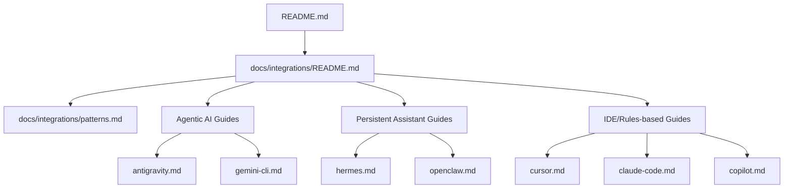

# Design: Integration Guides Architecture

## Guide Structure
Each guide MUST follow a consistent 7-section structure to ensure quality and predictability:

1. **Prerequisites**: Tool version, API keys, access levels.
2. **Discovery Mechanism**: How the tool finds repo knowledge (e.g., `AGENTS.md`, `.cursor/rules`).
3. **Setup Steps**: Exact files to copy and configuration to set.
4. **Workflow**: Interaction model between the tool and `.agents/`.
5. **Two-tool Example**: Scenario where two different tools share the repo.
6. **Troubleshooting**: Verified gotchas and debug tips.
7. **References**: Links to official tool documentation.

## Documentation Map

## Implementation Strategy
- **Verification First**: No guide should be published without real behavior verification (dogfooding).
- **Thin Configuration**: Tool-specific configuration files (like `.cursorrules`) should be thin wrappers that point back to the canonical `.agents/` source.
- **Separation of Concerns**: Distinguish between root `AGENTS.md` (bootstrap) and `.agents/AGENTS.md` (durable guidance).
