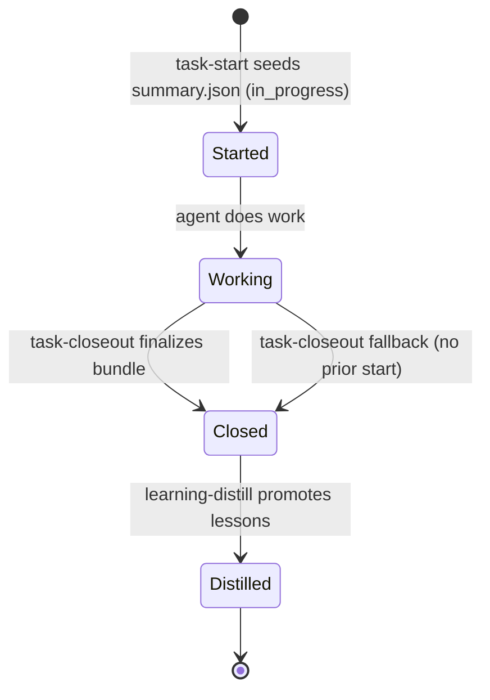

## Context

AKSK currently relies on a post-facto `task-closeout` to encapsulate session history. This misses early-stage context and makes the implementation sensitive to interruptions. Since this change was drafted, the kit has evolved: durable knowledge moved to `openwiki/` and the session bundle contract is defined in `.agents/skills/task-closeout/CONTRACT.md` (`summary.json` + 4 markdown/txt files, folder pattern `YYYYMMDD-HHMMSS-short-topic`).

## Goals / Non-Goals

**Goals:**
- Architect a proactive state machine for agent tasks: `start` → `work` → `closeout` → `distill`.
- Formalize seeding of `summary.json` so a session is discoverable from the moment work begins.

**Non-Goals:**
- Modifying non-AKSK agent platforms; this change focuses exclusively on repository-local session and knowledge-capture plumbing.
- Writing durable knowledge (`openwiki/`, `.agents/AGENTS.md`, `.agents/playbooks/`) during start/closeout — that remains `learning-distill`'s job.

## Decisions

- **Seed `summary.json`, not a second manifest**: `task-start` creates `.agents/sessions/YYYYMMDD-HHMMSS-short-topic/` and seeds `summary.json` per `CONTRACT.md` (`task_id` canonical, `created_at`, `status: in_progress`, optional `openspec_change`, `repo_id`, `agent`). This avoids dual-source-of-truth with a parallel `manifest.json`. `task-closeout` finalizes the same file. If `task-start` was skipped, `task-closeout` falls back to its current generation path.
- **Folder pattern alignment**: Use the contract's `YYYYMMDD-HHMMSS-short-topic` pattern (sortable label, not identity). Identity remains `summary.json:task_id`.
- **Idempotent initialization**: Initialization also ensures `.agents/sessions/README.md` and `.agents/.gitignore` entries (`sessions/*`, `!sessions/README.md`) exist — same scope as `task-closeout`'s existing init, safe to repeat.
- **Manifest-first closeout**: `task-closeout` detects an existing seeded `summary.json` and updates it in place, preserving `task_id` and any `openspec_change` seeded at start. This eliminates ID re-generation races.

## Risks / Trade-offs

- **Risk:** Increased filesystem overhead (empty session folders if task is abandoned).
- **Mitigation:** Document pruning guidance (e.g., `docs-lint` / housekeeping checks); optional future `session-cleanup` skill can prune `in_progress` bundles older than N days. Not required for this change.
- **Risk:** Agents failing to trigger `task-start`.
- **Mitigation:** Update `openspec/config.yaml` and `.agents/AGENTS.md` to list `task-start` as a pre-condition for implementation tasks; `task-closeout` fallback preserves backward compatibility.
- **Risk:** Concurrent agents seeding colliding folders.
- **Mitigation:** `task_id` includes timestamp + random suffix; folder name includes `HHMMSS` + slug — collision negligible. Closeout never renames the folder.

## Migration Plan

1. Define `task-start` skill in `.agents/skills/task-start/` (SKILL.md + CONTRACT.md or section in SKILL.md referencing the shared contract).
2. Update `.agents/skills/task-closeout/SKILL.md` to detect existing seeded `summary.json` and finalize it.
3. Update `.agents/AGENTS.md` routing/lifecycle section and `openspec/config.yaml` context/rules to reference `openwiki/` + `task-start` → `task-closeout` → `learning-distill` loop.
4. Verify lifecycle with a test task (`task-start` → work → `task-closeout` → `learning-distill`) and run `docs-lint`.

## Open Questions

- Should `task-start` accept an optional `task_id` / `openspec_change` override for manual tracking? (Proposed: yes, optional params.)
- Retention policy for abandoned `in_progress` bundles — defer to follow-up cleanup guidance.
