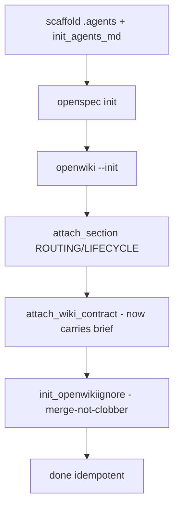

## Context

Phase 1 adopts the budget in this repo; Phase 2 makes `aksk-init` distribute it to every new consumer. Current `aksk-init` flow (`bootstrap-repo.mjs`) is: scaffold `.agents`, `init_agents_md.mjs`, `openspec init`, `openwiki --init`, `attach_section` (ROUTING/LIFECYCLE), `attach_wiki_contract.mjs`. `attach_wiki_contract.mjs` appends `references/wiki-contract-template.md` between `AKSK:WIKI-CONTRACT` markers. `.openwikiignore` is currently a hand-written 2-line file, not template-owned.

See proposal.md for motivation.

## Goals / Non-Goals

**Goals:**
- Expand `wiki-contract-template.md` with Documentation brief inside existing markers (Option A) — single source, single refresh
- Own `.openwikiignore` via `references/openwikiignore-template.md` + installer with merge-not-clobber
- Wire installer into `bootstrap-repo.mjs` after contract attach, idempotent and non-interactive

**Non-Goals:**
- New `AKSK:DOC-BUDGET` markers (Option B) — deferred; can split later
- Changing curation contract semantics (preserve-and-link etc.)
- Modifying `openwiki --init` upstream defaults

## Decisions

**Decision: Option A — brief inside AKSK:WIKI-CONTRACT**
- Rationale: User choice for Phase 2; reuses existing idempotent attachment, one template to version. Alternative Option B (new markers) is cleaner separation but adds marker churn; migrate by splitting block in a future change if needed.
- Trade-off: Coupling curation + budget means updating one refreshes both — acceptable while both are small and versioned together.

**Decision: Dedicated `init_openwikiignore.mjs` over reusing `attach_section.mjs`**
- Rationale: `.openwikiignore` is not a markdown file with HTML markers in the same sense as `AGENTS.md`; its semantics are gitignore globs with comments. A dedicated installer can handle anchored `/example/` correctness, `!.agents/sessions/README.md` exception, and merge-not-clobber clearly. Alternative reuse would force HTML comments into ignore file.
- Alternative: Extend `attach_section.mjs` to support ignore files — rejected, adds conditional complexity.

**Decision: Merge-not-clobber with AKSK markers inside ignore**
- Template carries ` # AKSK:OPENWIKIIGNORE:BEGIN/END` comment markers. Installer: missing file → write template; file without markers → append tagged section; file with markers → refresh tagged section only; outside content never removed.
- Alternative: Overwrite — rejected; deletes user customizations.

**Decision: Wire after `openwiki --init` + contract attach in `bootstrap-repo.mjs`**
- Order: `openwiki --init` creates `openwiki/` and `.openwikiignore` may be created by upstream; installer runs after so it can merge. Contract attach runs before or after — independent (different files).

## Risks / Trade-offs

- **Agentic drift still possible** → Mitigation: Brief + Update threshold as durable instruction; batch wiki updates after merges per threshold.
- **Ignore too broad** → Mitigation: Anchored `/example/` not bare; specs/archive explicitly not ignored; commented categories let consumers prune `.next/`/`.vite/` if irrelevant.
- **Existing repos don't get budget** → Mitigation: Re-running `aksk-init` (or at least `init_openwikiignore.mjs` + `attach_wiki_contract.mjs`) migrates them; document in change notes.
- **Template divergence between Phase 1 and Phase 2** → Mitigation: Phase 2 template is canonical; Phase 1 patch is interim and will be superseded by installer on next init.

## Migration Plan

1. Update `references/wiki-contract-template.md` (add brief)
2. Add `references/openwikiignore-template.md` with markers
3. Add `scripts/init_openwikiignore.mjs`
4. Wire into `bootstrap-repo.mjs`; ensure `--yes`/non-interactive path does not block
5. Re-run `aksk-init` in this repo to validate idempotence; `openspec validate --strict` passes

## Open Questions

- None blocking; installer marker comment syntax to be finalized during implementation (e.g., `# AKSK:OPENWIKIIGNORE:BEGIN`).
