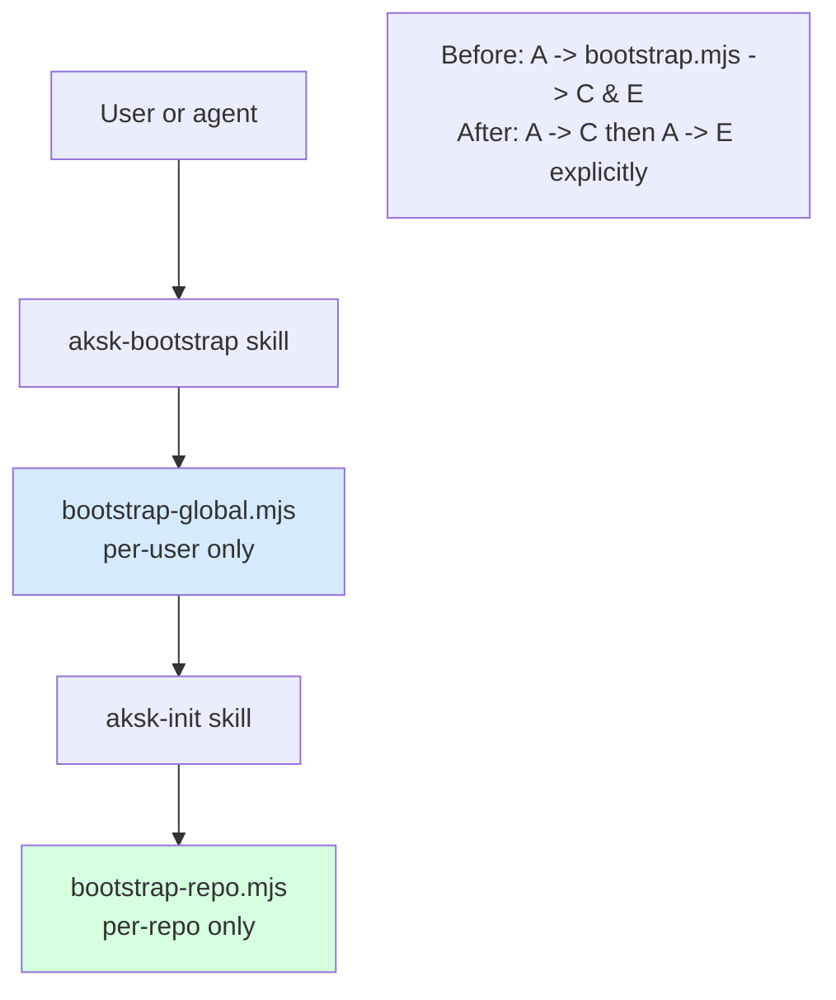

## Context

After `split-bootstrap-init`, `aksk-bootstrap` is spec'd as global-only and `aksk-init` as per-repo, but `bootstrap.mjs` was kept as a shim spawning both lanes. It is the sole remaining coupling point — the global lane's file is invoked and, if `aksk-init` is present, the repo lane runs implicitly. That caused the observed bug where `aksk-bootstrap` appeared to modify `AGENTS.md` (a per-repo file) despite `aksk-bootstrap/spec.md:Global lane scope` forbidding it. About 70 docs references still present `bootstrap.mjs` as the EXECUTE lane. See `proposal.md` — Why.

## Goals / Non-Goals

**Goals:**
- Make the two lanes mechanically independent: deleting one skill or script never silently invokes the other.
- Make the two-step sequence visible in every entry point (README, INSTALL, openwiki, skill prompts) so ordering (global then repo) is explicit.
- Remove all `bootstrap.mjs` references from docs, scripts, and validation checks without changing lane behavior.

**Non-Goals:**
- No change to global lane behavior (Node check, `npm i -g`, skill spread, PATH verify) or per-repo lane behavior (scaffold, `init_agents_md.mjs`, `openspec init`, `openwiki --init`, attachments). Deltas only delete shim delegation.
- No new entry points or wrappers are added — the two existing `*.mjs` files become the docs' entry points.
- No change to OpenSpec skill scope (that is the parallel `install-openspec-skills-global` change).

## Decisions

**D1 — Delete, don't deprecate (no shim, no wrapper, hard remove).**

Why delete: deprecation keeps the bug alive (any `bootstrap.mjs` call still mutates per-repo files). The file is tiny (19 lines) and has no consumer outside docs/scripts in this repo; external consumers are told of the two-command migration. Alternative rejected: keep file as error-shim printing "run bootstrap-global then bootstrap-repo" — that would still be invoked accidentally and adds maintenance; a hard `ENOENT` is a clearer signal and forces docs to be updated.

**D2 — Update specs first (delta REMOVED/MODIFIED), then docs/scripts in implementation.**

Why: `aksk-bootstrap` needs a `REMOVED: Shim sequential execution` requirement (with Reason/Migration) and `MODIFIED: Bootstrap now global-only` to forbid delegation; `aksk-init` and `install-lanes` need `MODIFIED` to state explicit two-command ordering. Docs-only changes without spec deltas would fail `openspec validate`.

**D3 — Doc sweep is exhaustive (grep-driven) and tool-agnostic.**

Search pattern `bootstrap\.mjs` across `README.md`, `INSTALL.md`, `openwiki/**/*.md`, `.agents/skills/**/SKILL.md`, `scripts/*.sh`, `.agents/skills/verify-install/**`. Each hit is replaced with the two explicit commands or removed if it was a validation assertion (`test -f bootstrap.mjs`). Mermaid diagrams in `openwiki/integrations/*` and `openwiki/architecture/overview.md` are redrawn to show two separate lane boxes without the shim arrow.

**D4 — No behavioral change to `verify-install` beyond check target.**

`verify-install` currently asserts `test -f bootstrap.mjs`; after removal it asserts `test -f bootstrap-global.mjs` and `test -f bootstrap-repo.mjs`. Its run script that previously invoked the shim with a timeout will invoke the two lanes sequentially (global then repo) where the test intends end-to-end coverage.

## Risks / Trade-offs

- [External consumers calling the shim] → Mitigation: **BREAKING** noted in proposal; `openspec validate` will catch any remaining docs refs; a grep in CI (`grep -r bootstrap.mjs` should return 0 hits outside `openspec/changes/**/`) guards reintroduction. A docs note in `INSTALL.md` and `openwiki` shows the one-line two-command replacement.
- [Stale openwiki claims referencing shim Claims] → Mitigation: OpenWiki will re-plan on next `openwiki --update`; shim-related claims (e.g., `bootstrap.mjs is a shim that sequentially runs...`) will be retracted automatically when source files disappear. No manual claim edit needed before merge.
- [Verify-install flake if both lanes not run] → Mitigation: update `run.sh` to run global then repo lanes sequentially; keep the 300s timeout per lane. Existing idempotency checks remain.
- [Accidental reintroduction via `npx skills add` older registry] → Mitigation: `check-agents-structure.sh` and `check-publish.sh` will fail if shim reappears; `docs-lint` cross-tool pass flags stale curated pages referencing it.

## Migration Plan

1. Delete `.agents/skills/aksk-bootstrap/scripts/bootstrap.mjs` and its copy under `~/.agents/skills/` (next `npx skills add` will sync).
2. Edit `aksk-bootstrap/SKILL.md` (remove shim row, keep global lane), `aksk-init/SKILL.md` (note explicit ordering, no shim), `README.md`, `INSTALL.md`.
3. Sweep `openwiki/**/*.md` and `scripts/*.sh` for `bootstrap.mjs` → replace with `bootstrap-global.mjs` / `bootstrap-repo.mjs` pair; remove shim-specific tables/claims.
4. Run `openspec validate --changes --strict`, `bash scripts/check-agents-structure.sh .agents`, and `grep -R bootstrap.mjs --exclude-dir=.git` to confirm zero hits outside `openspec/changes/archive`.
5. Rollback: restore `bootstrap.mjs` from git (`git restore`) and revert doc sweep — no data migration; failure is isolated to docs not finding the shim.

## Open Questions

- None — scope is mechanically deleting a shim and updating the 70 doc references that point to it. An open question would imply deferring a design choice, which would change the spec deltas or task breakdown.
