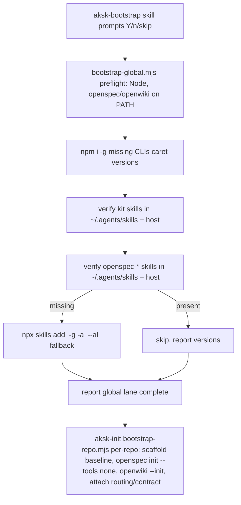

## Context

`aksk-bootstrap` today owns the global lane: Node >=22 preflight, `npm i -g` for `openspec`/`openwiki` from `references/versions.json:caret`, PATH verification, and kit skill spread via `npx skills add -g -a <agent>`. `aksk-init` owns the per-repo lane and explicitly runs `openspec init --tools none` (`bootstrap-repo.mjs:71`), so no `openspec-*` skills are ever written per-repo by default. This leaves a gap: the CLI is globally present but the `openspec-explore|propose|apply|...` skills are not, so they must be spread globally like kit skills. See `proposal.md` — Why. The system must stay idempotent-by-detection, never-half-install, and partitioned-INSTRUCT (global failures never print repo commands).

## Goals / Non-Goals

**Goals:**
- Make `openspec-*` skills available from `~/.agents/skills` (+ host mirror) immediately after a successful `aksk-bootstrap`, with a single idempotent call and no per-repo duplication.
- Reuse existing delivery: `npx skills add` with `-g -a <agent>` / `-g --all`, `versionsFromPackageJson()` caret resolution, and detection via file probes/`npx skills list -g`.
- Keep repo lane default unchanged: inherit globals; only `openspec init --tools none`; opt-in `--local-skills` for vendored repo copies.

**Non-Goals:**
- Changing per-repo scaffolding order (baseline-first, then `openspec init`, then routing/lifecycle/contract) — untouched.
- Generating `openspec-*` skills via `openspec init --tools ...` in the global lane — use the Skills CLI path so versions are pinned and the host is self-reported.
- Auto-installing host integrations (`openwiki integrations install <host>`) as part of the global lane — remains manual opt-in.
- Changing the `openspec` CLI version source beyond adding an entry to `references/versions.json` for the skills package.

## Decisions

**D1 — Global lane owns OpenSpec skill spread (extend `bootstrap-global.mjs`, not `bootstrap-repo.mjs`).**

Why: Mirrors kit skill spread, satisfies `aksk-bootstrap/spec.md:Global skills default`, and prevents drift where each repo re-prompts for tool selection. Alternative rejected: installing during `aksk-init` via `openspec update` with tool detection — that would write per-repo `skillsDir` copies (`.claude/skills`, `.cursor/skills`) and conflict with `--tools none`.

**D2 — Use `npx skills add <source> -g -a <agent>` with the same host detection as kit spread.**

Why: `aksk-bootstrap/SKILL.md:25` already documents the positional-first arg order (`npx skills add <source> -g -a <agent>`, not `-g -a <source>`) and the universal shorthand `--all`. Reuse that code path so verification and INSTRUCT messages are uniform. Alternative rejected: invoking `openspec`'s own skill generator globally — it targets per-project `skillsDir` per `dist/core/init.js:generateSkillsAndCommands` and needs a project path.

**D3 — Resolve OpenSpec skills source via `references/versions.json` (single source) with fallback to canonical registry id.**

How: Add an entry like `"@fission-ai/openspec-skills"` or reuse `"@fission-ai/openspec"` (to be confirmed via the published skills package name) and read it with a `versionsFromPackageJson()`-equivalent helper. First try consumer `package.json`, then bundled `references/versions.json`, then bare id (=> `@latest` semantics). No hard-coded caret outside the JSON. Matches `aksk-bootstrap/spec.md:Version source` and avoids `openwiki@latest` anti-pattern.

**D4 — Idempotency by detection before install.**

Probe 1: `~/.agents/skills/openspec-*/SKILL.md` existence (canonical store) and host mirror. Probe 2 (optional): `npx skills list -g` output contains `openspec-*`. If either shows presence at a compatible version, skip install. This is the same detection the kit uses for `aksk-*` skills; no journal file.

**D5 — Never-half-install extends to the skill step.**

If `npx` is missing or `npx skills add` fails, the script prints `INSTRUCT lane — run these commands manually: npx skills add <source> -g -a <agent>` and exits clean (`status 0`) without partial state from that step, exactly as `bootstrap-global.mjs:108 instructRemaining()` does for `npm i -g`. Partitioned INSTRUCT still applies: global failures never print `bootstrap-repo.mjs` commands.

**D6 — Keep shim behavior simple.**

> SUPERSEDED at implementation: archived change `eliminate-bootstrap-shim` (commit `27a052b`) deleted `aksk-bootstrap/scripts/bootstrap.mjs`. There is no shim; the two lanes run explicitly. Task 4.2 dropped.

`aksk-bootstrap/scripts/bootstrap.mjs` remains a thin shim: `bootstrap-global.mjs` then `bootstrap-repo.mjs` if present. No new logic in the shim; each lane owns its skill subset. This avoids breaking `INSTALL.md:18` / `openwiki/architecture/overview.md:175` callers.

## Risks / Trade-offs

- [Stale pin in `references/versions.json`] → Mitigation: use same caret bump process as kit (`npm install --save-dev` then copy to `references/`) and document in `openwiki/decisions/pin-global-tool-versions-via-caret-and-bundled-versions-json.md`; fallback to `@latest` keeps installs working if pin drifts.
- [Multiple hosts (`opencode`, `codex`, `claude`)] → Mitigation: reuse self-reported host detection; install to universal `~/.agents/skills` first, then host mirror via `-a <agent>`. Universal covers unknown hosts per `canonical-user-skills-scope`.
- [Publish name mismatch (`@fission-ai/openspec` vs separate skills package)] → Mitigation: resolve source as a constant in `bootstrap-global.mjs` with a lookup in `versionsFromPackageJson()` keyed by that constant; verify with `npx skills add --help` / registry lookup before merge; open question below captures confirmation.
- [Global skills mask repo-local iteration (user testing unreleased skills)] → Mitigation: preserve `--local-skills` opt-in in `aksk-init` to allow repo-local override; document that global is the default, repo-local is for iteration.
- [Sandboxed agents (no `npx`/no write)] → Mitigation: INSTRUCT fallback prints exact commands; no partial state — matches existing `Never half-install` guarantee.

## Migration Plan

1. Add OpenSpec skills pin to `references/versions.json` (and `package.json` devDependencies if needed for single-source lookup).
2. Patch `bootstrap-global.mjs`: insert OpenSpec skills detection + install step after kit skill spread, reusing host detection and `instructRemaining()` for failure.
3. Update `aksk-bootstrap/SKILL.md` global lane description (add second skill-spread verb) and `aksk-init/SKILL.md` / `openwiki` docs noting repo lane inherits globals and keeps `--tools none`.
4. Update `openwiki` pages: `distribution/packaging-and-install.md`, `integrations/distribution-and-tool-wiring.md`, `quickstart.md`, `skills/aksk-bootstrap.md` — note canonical store now also holds `openspec-*`.
5. Rollback: revert pin and delete the new skill-spread step; re-running bootstrap is no-op (idempotent) and `npx skills remove` is manual for cleanup — no automatic uninstall needed.
6. Verification: `node .agents/skills/aksk-bootstrap/scripts/check_peer_tools.mjs openspec openwiki`; `node .agents/skills/aksk-bootstrap/scripts/bootstrap-global.mjs --json` reports tools + skills present; `npx skills list -g` shows `openspec-*`; second run is no-op; sandboxed run prints INSTRUCT with exact `npx skills add` line.

## Open Questions

- Q: Exact published skills package id for OpenSpec skills — is it `@fission-ai/openspec` itself, or a separate id like `fission-ai/openspec-skills`? Confirm via registry / `npx skills add --help` source arg before implementation. Resolution does not change specs — only the constant pulled from `references/versions.json`.
- Q: Whether to pin OpenSpec skills version independently from the CLI (`@fission-ai/openspec`) or reuse the CLI pin — preference is reuse unless registry shows a distinct package with its own semver. Confirm before tasks step T1.
