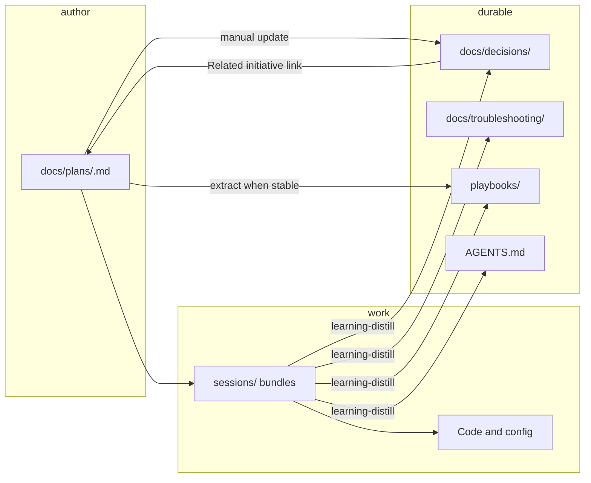

# Plans as first-class artifacts

## Related decisions

- [Single-tree architecture (`.agents/`)](../../../.agents/docs/decisions/single-tree-architecture-agents.md)
- [Regenerate `example/` when the portable kit or bootstrap changes](../../../.agents/docs/decisions/regenerate-example-when-portable-kit-changes.md)
- [`docs-search` stays canonical for `.agents/` knowledge; host-native search is not the default fallback policy](../../../.agents/docs/decisions/docs-search-remains-canonical-over-host-native-search.md)
- [Maintainer plans live under `.agents/docs/plans/`, not `.agents/plans/`](../../../.agents/docs/decisions/plans-live-under-docs-plans-not-agents-plans.md)

## Goal

Plans capture **durable intent for multi-step initiatives**: roadmaps, phased
work, investigations, and meta-kit evolution. Plans now live under
`.agents/docs/plans/` and are indexed by `docs-search`. The remaining work is
frontmatter normalization, the `write-plan` skill, and propagating the contract
into `.agents/docs/MAINTENANCE.md`, `.agents/docs/index.md`, and the `example/` tree.

## What is already done

- Plans live under `.agents/docs/plans/`
- `docs-search` indexes plans with the rest of `.agents/docs/`
- `rules-in-scaffold` superseded by this plan
- Phases 1–3 of this plan implemented (frontmatter normalization, contract propagation, `write-plan` skill)

## Why docs/plans/ not plans/

`index-docs.py` uses `rglob("*.md")` over all of `.agents/docs/` — plans under
`docs/plans/` are automatically indexed with no script changes. Co-locating
plans with decisions and troubleshooting means a single query surfaces all
related artifacts. This aligns with the ADR community's standard practice of
keeping `docs/decisions/` and `docs/plans/` together in one documentation tree
(AWS, Microsoft Azure Well-Architected, joelparkerhenderson ADR collection,
JetBrains spec-driven development guidance).

Plans are **living documents**, not append-only records like ADRs. The
archive-on-terminal model (move to `plans/archive/` when done) keeps the active
set clean while preserving history — distinct from ADR immutability conventions,
which apply to decisions, not plans.

## Placement

| Location                          | Role                                                  |
| --------------------------------- | ----------------------------------------------------- |
| `.agents/docs/plans/*.md`         | Active plans                                          |
| `.agents/docs/plans/archive/*.md` | Retired plans (completed, cancelled, superseded)      |
| `example/.agents/docs/plans/`     | Generated consumer illustration (README + one sample) |
| Consumer repo after merge         | Same relative path `.agents/docs/plans/`              |

**Naming:** one initiative per file; filename stem equals frontmatter `id`;
lowercase `[a-z0-9_-].md`. Archive moves the file; `id` stays stable.

**Collision rule:** plan `id` values must be unique within `plans/` and
`plans/archive/` only. The same stem may exist under `decisions/` or
`troubleshooting/`; use **qualified** `decisions/<slug>`, `troubleshooting/<slug>`,
and `plans/<slug>` in YAML metadata when the target kind matters (see
`MAINTENANCE.md`).

## How plans differ from siblings

| Artifact              | Holds                                    | Lifetime                            |
| --------------------- | ---------------------------------------- | ----------------------------------- |
| `docs/plans/`         | Intent, scope, phasing, success criteria | While active; archive when terminal |
| `docs/plans/archive/` | Same, retired                            | Indefinite                          |
| `playbooks/`          | Repeatable how-to procedures             | Long-lived; update in place         |
| `sessions/`           | Raw evidence for one task                | Short-lived; gitignored bundles     |
| `docs/decisions/`     | Accepted architectural/policy outcomes   | Long-lived; supersede in place      |
| `AGENTS.md`           | Concise operational rules                | Small; stable bullets only          |

**Anti-patterns:**

- Parking stable rationale only in a plan instead of distilling a decision once
  the choice is made.
- Treating a plan as append-only (update in place; archive when terminal).
- Duplicating a stable procedure in a plan body instead of extracting a playbook.
- One plan for the entire roadmap — one plan per initiative.

## Frontmatter contract

Applies to every `*.md` under `docs/plans/` and `docs/plans/archive/`.
Index and README files are excluded unless they adopt plan frontmatter
deliberately.

### Required keys

- `id` — stable slug matching filename without `.md`; lowercase `[a-z0-9_-]`;
  unique within `plans/` and `plans/archive/`.
- `title` — short human title (quoted if it contains colons).
- `last_updated` — ISO date `YYYY-MM-DD`; bump on meaningful changes.
- `description` — one or two sentences, machine-oriented; this is what
  `docs-search` surfaces in results.
- `tags` — non-empty YAML list of lowercase `[a-z0-9_-]` labels.
- `status` — plan lifecycle value (see table below).

**Status vocabulary** (plans only — distinct from decision `status`):

| Value        | Meaning                                              |
| ------------ | ---------------------------------------------------- |
| `draft`      | Outline; not committed as direction                  |
| `active`     | Current initiative; work may proceed                 |
| `paused`     | Intentionally on hold                                |
| `completed`  | Outcomes achieved; body lists where knowledge landed |
| `cancelled`  | Stopped without outcomes; body records why           |
| `superseded` | Replaced by another plan; set `superseded_by`        |
| `archived`   | Obsolete context kept for history only               |

### Optional keys

- `kind` — `initiative` | `meta` | `exploration` (default: `initiative`).
- `anticipated_decisions` — planned **`decisions/<slug>`** pointers not yet filed; a distillation
  queue. Replace with real qualified refs once files exist.
- `outcome_decisions` — durable **`decisions/<slug>`** or **`troubleshooting/<slug>`** pointers created or updated because of this
  plan. Fill in near completion.
- `supersedes` / `superseded_by` — other **`plans/<slug>`** pointers forming a chain.
- `related_plans` — parallel tracks or dependencies (**`plans/<slug>`** pointers).
- `consumer_portable` — `true` if this plan ships in `example/`. Maintainer
  roadmaps default `false`.
- `author_kind` / `prompter` — audit provenance; not used by runtime tools.

### Example frontmatter

```yaml
---
id: auth-hardening
title: "Auth hardening initiative"
last_updated: 2026-04-21
description: >
  Multi-release initiative to tighten auth token handling, update deployment
  docs, and record the policy decision once behavior is stable.
tags: [security, release, ops]
status: active
kind: initiative
anticipated_decisions: [decisions/auth-token-rotation-policy]
consumer_portable: false
---
```

Then continue the file body with **`## Related decisions`** and Markdown links to `../decisions/<slug>.md` or `../troubleshooting/<slug>.md` (not a YAML `related_decisions` list).

### Normalization gap in existing plans

The moved plans use informal or partial frontmatter. Required fixes per file:

| File                             | Missing required keys                       | Status to normalize                |
| -------------------------------- | ------------------------------------------- | ---------------------------------- |
| `add-integrations.md`            | `id`, `last_updated`, `description`, `tags` | inline `active` → frontmatter      |
| `add-knowledge-search.md`        | `id`, `last_updated`, `description`, `tags` | `planned` → `draft` or `active`    |
| `add-script-tests.md`            | `id`, `last_updated`                        | `draft` ✓                          |
| `agent-role-guidance.md`         | `id`, `last_updated`                        | `planned` → `draft`                |
| `consumer-upgrade-path.md`       | `id`, `last_updated`                        | `partially implemented` → `active` |
| `integrate-docs-search-*.md`     | `id`, `last_updated`, `description`, `tags` | `implemented` → `completed`        |
| `out-of-repo-trees.md`           | `id`, `last_updated`                        | `draft` ✓                          |
| `repo-centric-wiki-tooling.md`   | `id`, `last_updated`                        | `in-progress` → `active`           |
| `rules-in-scaffold.md`           | `id`, `last_updated`                        | `draft` ✓                          |
| `ship-structure-check-script.md` | all (no frontmatter block)                  | —                                  |
| `wiki-system.md`                 | all (no frontmatter block)                  | `Draft` → `draft`                  |
| `worked-lifecycle-example.md`    | `id`, `last_updated`                        | `planned` → `draft`                |

Also normalize across all files: `writer` → `author_kind` (value `ai`);
`created` → `last_updated`; remove non-standard field variants.

## Recommended plan body

Sections in order; all optional except Goal:

1. **Related decisions** — bullet links to `../decisions/<slug>.md` or `../troubleshooting/<slug>.md` (body only; do not use YAML `related_decisions`).
2. **Goal** — one paragraph; why this initiative exists and what gap it closes.
3. **Scope / non-goals** — bullets; sets agent and execution boundaries.
4. **Approach** — method or strategy; link to prior decisions or playbooks
   rather than restating them.
5. **Phases or milestones** — numbered; each names a concrete deliverable.
6. **Success criteria** — checkboxes (`- [ ]`); binary and observable.
7. **Risks** — known unknowns and mitigations; short table preferred.
8. **Knowledge routing** — where outputs land: playbook paths, decision ids,
   troubleshooting ids. Used by `learning-distill` to route correctly.

## Lifecycle



### Typical lifecycle steps

1. **Author** — run `write-plan` skill (or manually create) `docs/plans/<id>.md`.
   File is immediately searchable via `docs-search`.
2. **Execute** — day-to-day work uses `task-closeout` bundles under `sessions/`.
   Link sessions to the plan via `related_plans` in `summary.json`.
3. **Distill** — `learning-distill` promotes stable lessons to decisions,
   troubleshooting, playbooks, or `AGENTS.md`. Update `outcome_decisions`.
4. **Tie back** — when a new decision exists because of the initiative, add a
   `### Related initiative` subsection in the decision body linking back to
   `../plans/<id>.md` (from `docs/decisions/`). Add the decision `id` to
   `outcome_decisions` and bump `last_updated`. Placement is recorded in
   [decisions/plans-live-under-docs-plans-not-agents-plans](../../../.agents/docs/decisions/plans-live-under-docs-plans-not-agents-plans.md).
5. **Complete** — set terminal `status`; list final artifact paths in body;
   move to `docs/plans/archive/` via `archive-plan` skill; run link sweep.
6. **Supersede** — set `superseded_by`, link replacement plan, archive old file.

### Session ↔ plan link (`summary.json`)

- **General tasks:** do not add plan linkage to `summary.json`.
- **Plan-involved tasks:** include a non-empty `related_plans` array of **`plans/<slug>`**
  strings (path-agnostic; stable across archive moves):

```json
"related_plans": ["plans/plans-as-first-class-artifacts"]
```

## Archive (cold storage)

1. Move `docs/plans/<id>.md` → `docs/plans/archive/<id>.md` (`git mv`).
2. Set terminal `status` in frontmatter; bump `last_updated`.
3. **Link sweep** — update all references in decisions, playbooks, indexes,
   and other plans. Do not orphan navigational docs.
4. Past session bundles keep their original `related_plans` strings unchanged.

## Linking decisions ↔ plans

- **Plan → decision:** **`## Related decisions`** in the plan body with links to
  `../decisions/<slug>.md` or `../troubleshooting/<slug>.md`; optional `outcome_decisions`
  in frontmatter when you need machine-readable **qualified** pointers for tooling.
- **Decision → plan:** `### Related initiative` subsection in the decision body
  with a relative link. Keeps decision frontmatter clean; no new required fields.

## Skills roadmap

| Skill                  | Responsibility                                                                                     | Priority  |
| ---------------------- | -------------------------------------------------------------------------------------------------- | --------- |
| **write-plan**         | Scaffold `docs/plans/<slug>.md`; check plan id collision; emit related entry **links** in the body | **First** |
| **archive-plan**       | Move terminal plan to `archive/`; link sweep durable docs                                          | Second    |
| **update-plan-status** | Bump `last_updated`, transition `status`, enforce lifecycle gates                                  | Third     |
| **plan-to-playbook**   | Extract stable procedure to `playbooks/`; replace plan section with link                           | Fourth    |
| **lint hooks**         | Extend `docs-lint` to warn on stale `active` plans and orphaned `anticipated_decisions`       | Deferred  |

### Existing skills to reuse

| Skill              | Reuse notes                                                                   |
| ------------------ | ----------------------------------------------------------------------------- |
| `task-closeout`    | Copy "required vs optional fields" style; enforce filename/id equality        |
| `learning-distill` | Classification model informs `plan-to-playbook` criteria and completion gates |
| `docs-lint`   | Path-hygiene patterns for `archive-plan` link sweep; metadata contract checks |
| `generate-example` | Canonical source for seeding `example/.agents/docs/plans/` bootstrap          |

## Phases

**Phase 1 — Frontmatter normalization** *(on current branch, before merge)*
Audit and update all moved plans against the contract above. Normalize `writer`
→ `author_kind`, `created` → `last_updated`, non-standard `status` values.
Verify each folder’s `id` rules: unique within `decisions/`, within
`troubleshooting/`, and within `plans/` (see `MAINTENANCE.md` for qualified graph edges).
Run `index-docs.py` and spot-check `search-docs.py` results.
*Deliverable: all plans have conforming frontmatter on the branch.*

**Phase 2 — Contract propagation** *(before or alongside branch merge)*

- Update `.agents/docs/MAINTENANCE.md` to extend the frontmatter contract to cover
  `docs/plans/` (required keys, status vocabulary, collision rule, archive
  pattern).
- Update `.agents/docs/index.md` to list `docs/plans/` alongside decisions and
  troubleshooting (and reference the canonical plan contract).
- File `decisions/plans-live-under-docs-plans-not-agents-plans` as a decision record under `.agents/docs/decisions/`. *(Done.)*
  *Deliverable: updated `MAINTENANCE.md`, `index.md`, new decision file.*

**Phase 3 — `write-plan` skill** *(first skill after merge)*
Implement `.agents/skills/write-plan/SKILL.md` and `scripts/write-plan.py`. The skill must:

- Prompt for or infer `id`, `title`, `description`, `tags`, `status`
- Check `id` uniqueness within `plans/` and `plans/archive/`
- Suggest related durable entry refs and render **`## Related decisions`** links in the body
- Write `docs/plans/<id>.md` with valid frontmatter and stub body sections
  *Deliverable: `.agents/skills/write-plan/SKILL.md` and `scripts/write-plan.py`.* *(Done.)*

**Phase 4 — Example promotion** *(after write-plan)*

- Add `example/.agents/docs/plans/README.md` via `generate-example` bootstrap
- Seed one `consumer_portable: true` sample plan as a template
- Update `.agents/docs/index.md` to list `write-plan` among kit skills
- Update `decisions/regenerate-example-when-portable-kit-changes` if new paths are added
  *Deliverable: `example/.agents/docs/plans/` in generated tree.*

## Success criteria

- [x] All existing plans have conforming frontmatter (no missing required keys,
  no non-standard status values)
- [x] `search-docs.py "planning"` returns plan results with correct `kind`
- [x] `.agents/docs/MAINTENANCE.md` covers the plan frontmatter contract
- [x] `.agents/docs/index.md` lists `docs/plans/` as a first-class knowledge location
- [x] `write-plan` skill exists and produces valid plan files
- [x] `id` collision check in `write-plan` prevents duplicate slugs
- [ ] At least one `consumer_portable: true` sample plan ships via
  `generate-example`
- [x] Decision record filed for `decisions/plans-live-under-docs-plans-not-agents-plans`
- [ ] This plan's status updated to `completed` and archived

## Knowledge routing

| Output                  | Destination                                                              |
| ----------------------- | ------------------------------------------------------------------------ |
| Path placement decision | `.agents/docs/decisions/plans-live-under-docs-plans-not-agents-plans.md` |
| Frontmatter contract    | `.agents/docs/MAINTENANCE.md`                                            |
| Index coverage update   | `.agents/docs/index.md`                                                  |
| `write-plan` skill      | `.agents/skills/write-plan/SKILL.md`                                     |
| Consumer sample plan    | `example/.agents/docs/plans/` via `generate-example`                     |
