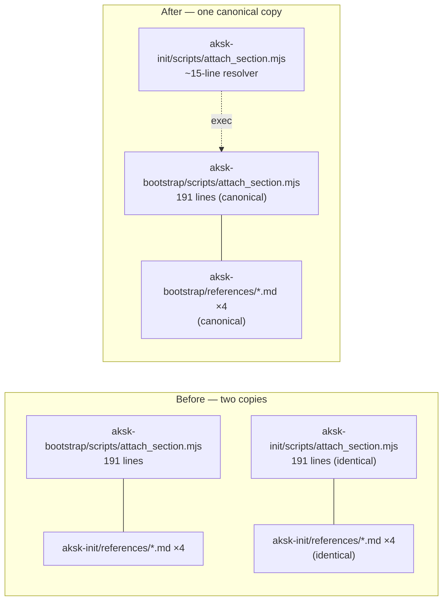

## Context

See proposal.md — Why. The kit already codified the single-source principle for tool versions (`aksk-init` reads `versions.json` from `aksk-bootstrap/references/` and must not duplicate it); the three shared scripts and four templates are the remaining duplicated implementation. The archived split-bootstrap design listed "drift between two copies" as an explicit risk, and the wiki currently papers over the state with "shipped duplicate" / "mirrored for backwards compatibility" notes. Relevant current state:

- `npx skills add` copies whole skill folders; `.claude-plugin/plugin.json` ships all five skills together, so a resolver in one skill can reliably locate a sibling.
- The duplicated scripts resolve templates relative to their own location (`../references`), so the canonical copies need no code change.
- Third-party maintenance references already point at `aksk-bootstrap` paths: `docs-lint` (attach_section, init_agents_md, refresh_agents_baseline) and `learning-distill` (attach_wiki_contract). All `docs/integrations/*` guides and `INSTALL.md` also use `aksk-bootstrap/scripts/attach_section.mjs`.
- `aksk-init`'s `bootstrap-repo.mjs` already cross-references `aksk-bootstrap/references/versions.json` — sibling resolution into `aksk-bootstrap` is an established pattern (the `bootstrap.mjs` shim delegates the same way, in the other direction).
- `verify-install/run.sh` asserts `aksk-init/scripts/bootstrap-repo.mjs`, `aksk-bootstrap/scripts/bootstrap-global.mjs`, and `aksk-bootstrap/references/versions.json` — none of the duplicated files — so the harness passes before and after.
- `scripts/check-agents-structure.sh` manifests only the four portable SKILL.md paths plus the task-closeout example bundle; it does not assert `aksk-init` internals.

## Goals / Non-Goals

**Goals:**
- Exactly one copy of each shared script and template, owned by `aksk-bootstrap`.
- Zero behavior change for callers: same names, same CLI, same output, same exit codes.
- Every existing reference to `aksk-init/scripts/{attach_section,attach_wiki_contract,init_agents_md}.mjs` keeps working.
- A regression guard that fails if anyone re-introduces a mirrored copy.

**Non-Goals:**
- Merging the two skills, changing the `split-bootstrap-init` lane ownership, or renaming entry points (that is Candidate 2, the bootstrap-ladder cleanup — deliberately separate).
- Touching `versions.json` (already single-sourced) or `bootstrap.mjs` (the compat shim stays for now).
- Rewriting `docs/integrations/*` or `INSTALL.md` — they already reference `aksk-bootstrap` paths.

## Decisions

### D1: `aksk-bootstrap` owns the canonical copies; `aksk-init` ships thin resolvers

The real scripts and four templates live only under `aksk-bootstrap/{scripts,references}/`. `aksk-init/scripts/{attach_section,attach_wiki_contract,init_agents_md}.mjs` become ~15-line resolver scripts that locate the canonical sibling (`../../aksk-bootstrap/scripts/<name>.mjs`), `spawnSync` it with `stdio: "inherit"`, and propagate its exit code. They print nothing of their own, so caller-side greps of output are unaffected. If the sibling is missing, the resolver exits 2 with remediation naming both skills — the kit's fail-fast-with-remediation convention.

**Rationale:** `docs-lint` and `learning-distill` already invoke these scripts from `aksk-bootstrap` paths; `docs/integrations/*` and `INSTALL.md` do too; `bootstrap-repo.mjs` already resolves `versions.json` into `aksk-bootstrap`. `aksk-bootstrap`'s own SKILL.md designates it the preconditions/executor owner ("other skills reuse its preconditions"). Making it canonical means zero edits to the maintenance references and no new cross-references.

**Alternative considered — `aksk-init` as canonical owner:** matches the spec language that repo-scaffolding *behavior* is specified under `aksk-init`, and would literally remove the scripts from `aksk-bootstrap` (reading "Bootstrap now global-only" as file-level). Rejected: it would require updating every third-party reference (`docs-lint`, `learning-distill`, ten `docs/integrations/*` guides, `INSTALL.md`, `openwiki` pages) from `aksk-bootstrap` to `aksk-init` paths, and would add a new `aksk-bootstrap → aksk-init` cross-reference for `refresh_agents_baseline.mjs`'s baseline template. The lane-scope requirement governs what the global *lane runs*, not where shared executor files physically live; D4 makes that explicit in the spec.

### D2: Keep the resolver file names — references to `aksk-init/scripts/*` stay valid

Because only the implementation changes and not the names, every existing command and `repo://` claim pointing at `aksk-init/scripts/{attach_section,attach_wiki_contract,init_agents_md}.mjs` — `aksk-init/SKILL.md`, `openwiki/{skills,concepts,workflows,distribution,inventory,architecture}/*`, `quickstart.md` — keeps working with zero edits. Only the prose that describes the mirror ("shipped duplicate", "mirrored for backwards compatibility") is rewritten to describe delegation.

**Alternative considered — repoint all references to canonical paths:** more churn (~40 references across the wiki), no behavioral gain; rejected.

### D3: Delete `aksk-init/references/*` and retarget claims to `aksk-bootstrap/references/*`

The four templates under `aksk-init/references/` are deleted. OpenWiki pages that carry `repo://` evidence claims on those paths are retargeted to the identical canonical file under `aksk-bootstrap/references/` — the documented retarget rule for identical-content sources (see `openwiki/troubleshooting/openwiki-evidence-path-excluded-by-ignore.md`). Template paths in prose and commands are updated the same way.

### D4: Pin the contract in specs and the harness

- `aksk-init` spec: new requirements — no duplicated scripts/templates, resolvers delegate with identical behavior, fail-fast when the sibling is missing; the existing `versions.json` single-source requirement stays untouched.
- `aksk-bootstrap` spec: new requirement — canonical ownership of the shared executor scripts and templates; plus an explicit note that file ownership does not loosen the global lane's per-repo scope.
- `verify-install` fresh scenario: add `test ! -d .agents/skills/aksk-init/references` and resolver-presence assertions, so a mirrored copy fails the install harness. The scenario already exercises the resolvers because `bootstrap-repo.mjs` calls them.
- New decision page under `openwiki/decisions/` recording the single-source ownership contract, distilled via `learning-distill` at closeout.

## Risks / Trade-offs

- [Partial installation: only `aksk-init` copied, resolvers fail] → Mitigation: fail-fast exit 2 with remediation naming both skills; `aksk-init`'s SKILL.md already documents that it verifies `aksk-bootstrap` readiness; add a prerequisites line. `plugin.json` ships all five skills together, so this is an edge case, not the norm.
- [Missed `aksk-init/references` reference leaves a broken wiki claim] → Mitigation: verification step greps the whole repo for `aksk-init/references` and expects zero hits before closeout; retarget per the documented rule.
- [A future edit re-adds a copy] → Mitigation: spec requirements on both capabilities + the `verify-install` regression assertion make re-duplication a visible failure.
- [Resolver indirection adds one process hop for repo-lane runs] → Mitigation: negligible (spawnSync of a sibling node script, sub-millisecond); identical to the existing `bootstrap.mjs` delegation pattern.

## Migration Plan

1. Replace the three `aksk-init/scripts` files with resolvers; delete the four `aksk-init/references` templates.
2. Update `aksk-init/SKILL.md` (delegation note + prerequisites), rewrite mirror prose in the affected `openwiki` pages, retarget `repo://` claims.
3. Add the regression assertions to `verify-install` and update its SKILL.md prose.
4. Verify: `bash scripts/check-agents-structure.sh .agents`; `bash scripts/check-publish.sh`; `bash .agents/skills/verify-install/scripts/run.sh fresh`; double-run idempotency of each resolver against a temp repo; `grep -rn "aksk-init/references"` → no hits; `sync_wiki_indexes.mjs`; a `docs-lint` pass.
5. Rollback: restore the deleted files from git — the canonical `aksk-bootstrap` copies never change, so rollback is trivial and non-destructive.

## Open Questions

None that would change the specs or task breakdown. One deliberate deferral: whether `bootstrap.mjs` (the compat shim) should also be retired is Candidate 2 and explicitly out of scope here.