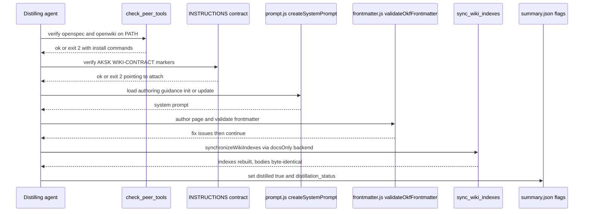

# The Knowledge Layer: `.agents/` and Curated Wiki Trees

Durable knowledge lives in two complementary layers. **Prescriptive** guidance — how agents should behave — lives under `.agents/` as plain markdown. **Descriptive** knowledge — facts, rationale, decisions, troubleshooting patterns — lives as curated OKF pages under `openwiki/{decisions,troubleshooting}/` plus two curated root pages. Ephemeral evidence lives under `.agents/sessions/` and never becomes durable until distillation routes it. The former single-tree layout with `.agents/docs/`, hand-built indexes, and `log.md` was deleted by the consolidation (decision `knowledge-consolidation-into-openwiki`, which supersedes the location aspect of `single-tree-architecture-agents`). The lifecycle that writes into these layers is covered by [Task Lifecycle and Distillation](../workflows/task-lifecycle-and-distill.md); the skills are indexed under [Skills](../skills/index.md).

## Tree shape

```text
.agents/                          # prescriptive layer + capture machinery
├── AGENTS.md                     # portable routing directives + project learnings + self-improvement loop
├── .gitignore                    # sessions/* + !sessions/README.md
├── playbooks/                    # durable multi-step procedures
│   ├── README.md
│   ├── pre-publish.md
│   ├── major-version-release.md
│   └── writing-integration-guides.md
├── sessions/                     # ephemeral bundles (gitignored except README.md)
│   └── README.md
├── workflows/opsx-*.md           # OpenSpec command definitions
└── skills/                       # task-closeout, learning-distill, docs-lint,
                                  #   aksk-bootstrap, generate-example (internal)

openwiki/                         # descriptive layer (curated OKF concept pages)
├── INSTRUCTIONS.md               # OpenWiki-owned scope brief + AKSK curation contract
├── index.md                      # OpenWiki-owned catalog (never hand-edited)
├── overview.md                   # curated entry point indexing both trees
├── maintenance-format.md         # curated schema and policy reference
├── decisions/<slug>.md           # one page per decision, aksk_status lifecycle
└── troubleshooting/<slug>.md     # one page per recurring failure pattern

/AGENTS.md                        # root behavioral contract (zoned; see below)
```

`docs/architecture.md` still describes the pre-consolidation `.agents/docs/` layout and is retained for historical schema reference only; the consolidated truth is this page plus `openwiki/overview.md` and `openwiki/maintenance-format.md`.

## `.agents/AGENTS.md` — prescriptive layer

The portable file holds routing directives, project learnings, and the self-improvement loop summary and must stay small:

- **Routing directives** — behavioral triggers: upon startup read `openwiki/index.md` and `.agents/AGENTS.md` before any file modification; on a failing test/build/runtime error, first search durable knowledge with `grep -ri "<error or symptom>" openwiki/ .agents/`; before architectural changes, search `openwiki/decisions/`.
- **Project learnings** — short distilled rules (e.g., skill-renaming workflow; always include an initial "Starting..." message and a `--verbose` flag in npx-based scripts so agents do not assume hangs; OpenWiki concurrency guard checking `openwiki/.run.json` before editing).
- **Self-improvement loop** — summary of the closeout → distill → prune loop with pointers to the full loop in `.agents/AGENTS.md`, curated outcomes in `openwiki/decisions/` and `openwiki/troubleshooting/`, and procedures in `.agents/playbooks/`.

Placement discipline: rationale goes to `openwiki/decisions/`, recurring failures to `openwiki/troubleshooting/`, multi-step procedures to `playbooks/`, temporary artifacts stay in `sessions/`. Distillation adds to this file only when a lesson is high-confidence, broadly useful, likely to recur, concise, and actionable; otherwise it routes elsewhere or stays ephemeral.

### Relationship to root `AGENTS.md`

Root `AGENTS.md` is the checkout entrypoint. It is a stacked, marker-delimited file (see [AGENTS.md Zoning](../concepts/agents-md-zoning.md)): Zone 1 FerroxLabs behavioral baseline (`AKSK:AGENTS-BASELINE`) owned by `init_agents_md.mjs`/`refresh_agents_baseline.mjs`, Zone 2 OpenWiki block (`OPENWIKI:START/END`) owned by OpenWiki tooling, Zone 3a AKSK Routing (`AKSK:ROUTING`) and Zone 3b AKSK Lifecycle (`AKSK:LIFECYCLE`) owned by `attach_section.mjs`. Each zone has one writer and one integrity check. The doctrine from `/INSTALL.md` is: root file = behavioral operating contract (how the agent works); `.agents/AGENTS.md` = portable repo knowledge (what the agent should know about this repo). Exactly one source of truth per instruction. A fully bootstrapped file contains all three families ordered baseline → OpenWiki → AKSK; in this repo the baseline zone has not yet been seeded so only OpenWiki and AKSK zones are present until `init_agents_md.mjs` runs. Refreshing the baseline swaps only content between `AKSK:AGENTS-BASELINE` markers; OpenWiki and AKSK blocks remain byte-identical.

## Curated wiki trees — descriptive layer

| Tree | Content | Lifecycle field | Owner |
| --- | --- | --- | --- |
| `openwiki/decisions/` | Durable decision records with rationale and consequences | `aksk_status` required | Distilling agent / maintainer |
| `openwiki/troubleshooting/` | Recurring failure patterns and fixes | none | Distilling agent / maintainer |
| `openwiki/overview.md` | Curated entry point indexing both trees | none | AKSK-authored, preserved |
| `openwiki/maintenance-format.md` | Schema and graph-edge reference | none | AKSK-authored, preserved |
| `openwiki/index.md` | Generated catalog of all wiki pages | — | OpenWiki-owned, never hand-edited |
| `openwiki/.last-update.json`, `.run.json` | Run metadata | — | OpenWiki-owned |

All pages under the four curated locations are authored directly by the distilling agent or maintainer in OKF format, never by `openwiki --update`. Decision and troubleshooting entries each occupy one file whose **filename stem is the entry identity** — lowercase `[a-z0-9_-]`, unique **within its tree**. Filenames carry no type prefix; disambiguation lives in qualified references (`decisions/<slug>` or `troubleshooting/<slug>`) and in relative Markdown links. Generated catalogs (`index.md` per directory, `openwiki/index.md`) are rebuilt deterministically and never hand-edited.

## Frontmatter contract (OKF base + AKSK extensions)

Curated pages follow OpenWiki's OKF base (`type`, `title`, `description`, `tags`, `timestamp`) extended with AKSK lifecycle fields. JSON Schemas live at `.agents/skills/learning-distill/references/decision-frontmatter.schema.json` and `troubleshooting-frontmatter.schema.json`; both require the OKF base keys and allow additional properties. Validation also runs via the installed package's `openwiki/dist/okf/frontmatter.js` (`validateOkfFrontmatter`).

| Field | Applies to | Contract |
| --- | --- | --- |
| `type`, `title`, `description`, `tags`, `timestamp` | all pages | OKF base; `tags` is a non-empty list of lowercase `[a-z0-9_-]` slugs |
| `aksk_status` | decision pages (**required**) | `accepted`, `superseded`, or `provisional` |
| `aksk_superseded_by` | superseded pages | successor slug `[a-z0-9_-]`; pair with a relative link to the successor |
| `aksk_depends_on` | any page | YAML list of qualified references `decisions/<slug>` or `troubleshooting/<slug>`, where `<slug>` equals the target's filename stem |
| `aksk_*` (additional) | any page | allowed and preserved round-trip (`additionalProperties: true`) |

Body shapes stay conventional rather than schema-enforced: decisions use `### Decision / Status / Context / Rationale / Consequences` (Status mirrors `aksk_status`); troubleshooting entries use `#### Symptom / Likely causes / Fix / Validation`. Cross-references in prose use relative Markdown links (`other-id.md` for siblings, `../overview.md` for root pages). The full schema reference lives on [`maintenance-format.md`](../maintenance-format.md); [`overview.md`](../overview.md) indexes both trees.

## No duplication with OpenSpec requirements

If a candidate lesson restates something already codified as a SHALL requirement in `openspec/specs/`, distillation must not create or extend a wiki page for it — cite the spec capability instead. Wiki pages record facts and rationale; requirements live only in OpenSpec ([OpenSpec workflow](../governance/openspec-workflow.md), decision `openspec-openwiki-aksk-division-of-labor`). Distillation searches `openspec/specs/` for decision-shaped candidates before authoring.

## Preserve-and-link semantics

The curation contract attached to [`openwiki/INSTRUCTIONS.md`](../INSTRUCTIONS.md) marks the trees above as curated. The contract is bounded by markers:

```html
<!-- AKSK:WIKI-CONTRACT:BEGIN -->
... curated page trees, curation rules ...
<!-- AKSK:WIKI-CONTRACT:END -->
```

Attachment is owned by `node .agents/skills/aksk-bootstrap/scripts/attach_wiki_contract.mjs` (see [Knowledge Curation Contract](../concepts/knowledge-curation-contract.md)): it appends the templated section from `references/wiki-contract-template.md` below existing content, never creates the file, never removes OpenWiki-owned sections, and is idempotent/self-updating (re-running when markers exist is a no-op unless the template changed, in which case only content between markers refreshes). If `INSTRUCTIONS.md` does not exist, it exits 2 with `openwiki --init` and performs no writes.

Once attached, the contract declares three invariants enforced at update time:

1. **Preserve-and-link** — when `openwiki --update` would regenerate a page under a curated tree, the AKSK-authored page is kept and generated material links to it instead of replacing its content.
2. **Frontmatter extensions survive round-trips** — every `aksk_*` field is meaningful and must be preserved by the update reconciler.
3. **Distill-authored pages bypass the CLI** — descriptive lessons are written by the host agent with deterministic index refresh; `openwiki --update` remains the scheduled reconciliation path but is never the distill write path.

Distillation fails closed before any wiki write when the contract is absent — treating absence as "nothing curated" could silently regenerate away hand-curated pages (design decision D3, now spec'd under `distill-routing`).

## Playbooks

`.agents/playbooks/` holds durable multi-step procedures as prescriptive layer content. Shipped examples: `pre-publish.md` (validation sequence around `check-publish.sh`), `major-version-release.md` (deprecated-artifact grep, portability review, example regeneration), and `writing-integration-guides.md` (the integration-guide method). An active OpenSpec change (`adopt-workflows-taxonomy`) proposes merging this directory into `workflows/` under unified OpenSpec terminology — see [OpenSpec workflow](../governance/openspec-workflow.md). Playbooks are updated only by `learning-distill` for lessons that are durable procedures, not one-off steps.

## Sessions model — ephemeral layer

Per-task closeout bundles live under `.agents/sessions/YYYYMMDD-HHMMSS-short-topic/`. Each bundle contains exactly five files:

| File | Role |
| --- | --- |
| `summary.json` | Status, timestamps, `repo_id`, required `task_id` (canonical identity), optional `openspec_change` and `agent`/`agent_session_id`, git metadata, distillation flags `distilled`/`distillation_status` |
| `active-task.md` | Observable facts; Task ID, Goal, Outcome, Files Changed, Commands Run, Validation, Remaining Work, Notes |
| `learning-candidate.md` | Candidate lessons; What failed/worked, Reusable pattern, Candidate AGENTS/troubleshooting/decision/playbook, Spec updates deferred, Confidence |
| `changed-files.txt` | Paths touched |
| `validation.txt` | Checks run and outcomes |

`.agents/.gitignore` ignores `sessions/*` while un-ignoring `sessions/README.md`, so the folder exists in fresh clones with zero bundle noise. Repositories that intentionally do not track `.agents/.gitignore` replicate the equivalent patterns in the repo-root `.gitignore` (`.agents/sessions/*` and `!.agents/sessions/README.md`). Bundle immutability after closeout is defined in [Task Lifecycle](../architecture/task-lifecycle.md): bundles are immutable except for `distilled`/`distillation_status` in `summary.json`. Session folder names are sortable storage labels only; canonical identity is always `task_id` from `summary.json`.

Bundle discovery must be ignore-blind (`ls`/`find` or `rg --no-ignore-vcs`), because gitignored paths are invisible to ignore-aware searches — see troubleshooting entry `session-discovery-fails-during-distillation-or-closeout`.

<!-- openwiki: mermaid parse failed and this diagram was converted to a text fence so it does not break rendering. Fix the diagram source and restore the mermaid fence. Parser error: Heuristic: an unescaped angle bracket inside a label breaks rendering; rephrase the label. -->
```text
flowchart LR
    Bundle["Session bundle<br>.agents/sessions folder"] --> Classify{"Classify lesson"}
    Classify -->|ephemeral| Drop["Keep in bundle only"]
    Classify -->|prescriptive AGENTS| Agents[".agents/AGENTS.md<br>concise actionable rule"]
    Classify -->|prescriptive playbook| Playbook[".agents/playbooks folder"]
    Classify -->|descriptive decision| Decision["openwiki decisions slug<br>aksk_status plus OKF"]
    Classify -->|descriptive troubleshooting| Trouble["openwiki troubleshooting slug"]
    Classify -->|descriptive topical| Topical["openwiki topic page"]
    Decision --> Sync["sync_wiki_indexes.mjs"]
    Trouble --> Sync
    Topical --> Sync
    Agents --> Sync
    Playbook --> Sync
    Sync --> Flagged["Bundle marked distilled<br>summary flags plus git history"]
```

*Caption: distillation routing from ephemeral bundle through classification to durable homes and deterministic index sync.*

## Superseding durable knowledge

Lifecycle state rides in frontmatter: `aksk_status: superseded` plus `aksk_superseded_by` pointing at the successor slug with a relative link. The frontmatter lock is authoritative and replaces the former log-bookkeeping leg (reconciled in `formalize-superseded-obsolete`, task 6.2 of the archived step-1 change). Listings that surface a superseded page add the remaining locks — a bold `[SUPERSEDED]` prefix and strikethrough on the link. `docs-lint` verifies the convention against curated pages (e.g., stale-decision check for `aksk_status: accepted` while `aksk_superseded_by` is set, or dead `aksk_depends_on` targets).

## Distillation entrypoints and control flow

Distillation never invokes `openwiki --update`. Its write path is:

1. **Fail closed before any write** — verify `openwiki` and `openspec` binaries via `node .agents/skills/aksk-bootstrap/scripts/check_peer_tools.mjs openspec openwiki` and that `openwiki/INSTRUCTIONS.md` carries the `AKSK:WIKI-CONTRACT` markers. On binary absence, print one error per missing tool plus exact install commands (`npm i -g @fission-ai/openspec@latest`, `npm i -g openwiki@latest`) and exit 2; on missing contract, point to `attach_wiki_contract.mjs`. No page is written on failure (`distill-routing` SHALL).
2. **Author pages directly** — load authoring guidance at runtime from the global package (`openwiki/dist/agent/prompt.js`, `createSystemPrompt("init"|"update")`) and validate with `openwiki/dist/okf/frontmatter.js` (`validateOkfFrontmatter`); fix every reported issue before continuing.
3. **Refresh indexes deterministically** — `node .agents/skills/aksk-bootstrap/scripts/sync_wiki_indexes.mjs` locates the global package via `npm root -g`, imports `agent/docs-only-backend.js` and `okf/index-sync.js`, constructs `OpenWikiLocalShellBackend` with `docsOnly: true, virtualMode: true`, and calls `synchronizeWikiIndexes(backend, "repository")`. Curated bodies stay byte-identical while `openwiki/index.md` and directory indexes rebuild. Exits 2 with remediation when uninitialized or package missing.
4. **Mark distilled** — set `distilled: true` and `distillation_status` on `summary.json`; accountability lives in bundle flags plus git history — there is no separate log file.



*Caption: distillation control flow from fail-closed checks through authoring and deterministic index sync.*

## Invariants and failure semantics

- **Curated pages are durable** — once accepted, `aksk_status` rides in frontmatter; supersession is the only lifecycle mutation besides `aksk_depends_on` additions.
- **Marker ownership is strict** — content between any `AKSK:*` markers (including `AKSK:WIKI-CONTRACT` and the `AKSK:ROUTING`/`AKSK:LIFECYCLE` blocks in root `AGENTS.md`) is owned by its writer; hand edits are corrected by rerunning the owning script. `OPENWIKI:START/END` blocks are OpenWiki-owned and never hand-edited.
- **Missing prerequisites fail with remediation, not silent fallback** — missing `openwiki --init` or missing peer binary is a blocking error with the exact command to run. Verification never attempts installation.
- **Single writer per zone** — closeout writes only under `.agents/sessions/`; distillation alone writes curated wiki trees, `.agents/AGENTS.md`, and playbooks; lint never writes OpenWiki-owned files — index drift is fixed by rerunning `sync_wiki_indexes.mjs`.
- **Zone isolation** — refreshing one `AGENTS.md` zone never rewrites another; damaging one zone's markers is reported for that family only.

## Validation

- Structure of the `.agents/` tree (required files present, sessions tracking clean, SKILL.md frontmatter valid): `bash scripts/check-agents-structure.sh .agents`
- Peer tools present: `node .agents/skills/aksk-bootstrap/scripts/check_peer_tools.mjs openspec openwiki`
- Contract attached: `grep -c "AKSK:WIKI-CONTRACT" openwiki/INSTRUCTIONS.md` and idempotent attach via `node .agents/skills/aksk-bootstrap/scripts/attach_wiki_contract.mjs`
- Entry frontmatter conformance: validate curated pages against the JSON Schemas above; [`docs-lint`](../skills/docs-lint.md) verifies the same contract by inspection during periodic passes; load upstream validator via `validateOkfFrontmatter` in the global `openwiki` package.
- Index freshness after curated-page writes: `node .agents/skills/aksk-bootstrap/scripts/sync_wiki_indexes.mjs` (deterministic; see [aksk-bootstrap](../skills/aksk-bootstrap.md)).
- Release hygiene: `bash scripts/check-publish.sh` (format, links, leakage, doubled-path `rg '\.agents/\.agents/'`).

## Extension points

- Adding a curated tree — extend `wiki-contract-template.md` and the `INSTRUCTIONS.md` markers, then update `docs-lint`'s curated-tree table; no validator change unless the tree ships as a required file.
- Adding a marker family — add `references/<name>-template.md` with its `AKSK:NAME:BEGIN/END` pair; `attach_section.mjs` picks it up via `markersOf()` with no code change.
- Adding a capability — propose a change with `specs/<capability>/spec.md` delta SHALL requirements; archive with sync to graduate to `openspec/specs/<capability>/spec.md`.

## Related

- [AGENTS.md Zoning](../concepts/agents-md-zoning.md) — marker-delimited zones in root `AGENTS.md`.
- [Knowledge Curation Contract](../concepts/knowledge-curation-contract.md) — contract attachment, preserve-and-link, and `aksk_*` extensions.
- [Task Lifecycle and Distillation](../workflows/task-lifecycle-and-distill.md) — bundle shape, `task_id` identity, and closeout→distill→sync→lint loop.
- [learning-distill](../skills/learning-distill.md) — routing procedure that consumes the contract at distill time.
- [aksk-bootstrap](../skills/aksk-bootstrap.md) — peer-tool verification and contract attachment.
- [docs-lint](../skills/docs-lint.md) — wiring versus content checks that keep the contract coherent.
- [Validation and Cross-Tool Lint](../operations/validation-and-lint.md) — deterministic validators and pre-publish sequence.
