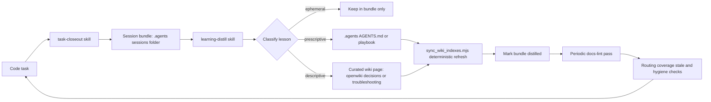

# AKSK Architecture Overview

The Agent Knowledge Starter Kit (AKSK) is a shareable, tool-agnostic starter kit for maintaining a compiled repository knowledge layer for coding agents (`package.json` name `agent-knowledge-starter`, version `2.0.0`). It ships markdown conventions and agent skills — not an application. There is no runtime service, no database, and no required test suite; `dependencies` is empty and `npm test` intentionally prints `Error: no test specified`. Value is behavioral: structuring what agents read before work, what they capture when work ends, and how durable lessons get promoted.

## Peer dependencies

AKSK is glue over two globally installed tools it never installs:

- **OpenSpec** (`@fission-ai/openspec`) — owns the intent and process layer under `openspec/`.
- **OpenWiki** (`openwiki`, plus one-time `openwiki --init` per repo) — owns the descriptive knowledge layer under `openwiki/`.

Skills verify these prerequisites before acting via `node .agents/skills/aksk-bootstrap/scripts/check_peer_tools.mjs openspec openwiki` and fail fast printing exact install commands on exit code 2. Automated installation is out of scope until the open change `aksk-bootstrap-system` lands; adoption is manual. Node >= 22 is the single kit runtime for all four `.mjs` scripts (`node-single-runtime-for-kit-scripts`).

## Runtime domains and zone stack

Organize the repo by authority, not by tree listing. Each zone has one owner, one write path, and one validation path.

*Caption: authority stack from entrypoint routing to portable rules to curated knowledge to process.*

### Zone 1 — Root router

`AGENTS.md` at the repo root is the entrypoint agents actually load. AKSK does not replace it; it appends marker-delimited managed sections:

- `<!-- AKSK:ROUTING:BEGIN -->` / `<!-- AKSK:ROUTING:END -->` — thin discovery pointers into `.agents/` and `openwiki/` (template `routing-note-template.md`).
- `<!-- AKSK:LIFECYCLE:BEGIN -->` / `<!-- AKSK:LIFECYCLE:END -->` — the self-improvement loop mandate: closeout, distill, prune (template `lifecycle-template.md`).
- `<!-- OPENWIKI:START -->` / `<!-- OPENWIKI:END -->` — OpenWiki-owned block that agents treat as generated.

All three are owned by `attach_section.mjs` (routing and lifecycle) and by OpenWiki (the `OPENWIKI` block). `.agents/AGENTS.md` remains the portable source of truth; `AGENTS.md` only routes to it. `CLAUDE.md` is a thin pointer maintained since the migration.

### Zone 2 — Portable prescriptive layer (`.agents/`)

Owns behavior rules that travel with the repo when tools change. Contents that matter:

- `.agents/AGENTS.md` — compact, portable routing directives and project learnings. Must stay small per design principle 2; no session history, long rationale, or one-off debugging details.
- `.agents/playbooks/` — five durable multi-step procedures (for example `generate-example`, `pre-publish`, `major-version-release`). Prescriptive lessons that require ordered steps land here, not in `AGENTS.md`.
- `.agents/sessions/` — gitignored temporary evidence. Only `.agents/sessions/README.md` is tracked, enforced by `.agents/.gitignore` (`sessions/*` plus `!sessions/README.md`) and verified by `check-agents-structure.sh`. Each session folder holds one task-closeout bundle.
- `.agents/skills/` — four portable skills plus one maintainer-internal skill. Portable skills ship a `CONTRACT.md` so an agent that receives only that folder still knows entrypoints, flags, and file shapes:
  - `aksk-bootstrap` — precondition provider; no durable knowledge writes.
  - `task-closeout` — capture-only; writes only under `.agents/sessions/`.
  - `learning-distill` — classification and promotion; writes to `.agents/` and `openwiki/` curated trees.
  - `docs-lint` — read-mostly coherence pass; writes only minimal fixes to AKSK-owned files.
  - `generate-example` — maintainer-only (`metadata.internal: true`), excluded from distribution, regenerates `example/` via `run.sh`.

Tool switching does not invalidate accumulated knowledge because the on-disk layout is stable; consumers re-register `SKILL.md` files however their stack expects.

### Zone 3 — Curated descriptive layer (`openwiki/`)

The durable descriptive knowledge layer. Curated trees are authored directly by the distilling agent in OKF frontmatter (`type`, `title`, `description`, `tags`) plus AKSK extensions:

- `openwiki/decisions/` — one page per durable decision with `aksk_status` (`accepted`, `superseded`, `provisional`), optional `aksk_superseded_by`, optional `aksk_depends_on` qualified refs (`decisions/<slug>`, `troubleshooting/<slug>`).
- `openwiki/troubleshooting/` — recurring failure patterns and fixes.
- `openwiki/overview.md` — curated entry point; `openwiki/maintenance-format.md` — schema reference.
- `openwiki/INSTRUCTIONS.md` — carries the AKSK curation contract between `<!-- AKSK:WIKI-CONTRACT:BEGIN -->` / `<!-- AKSK:WIKI-CONTRACT:END -->` markers. Owned by `attach_wiki_contract.mjs`, never created if missing, and preserved across `openwiki --update` runs via preserve-and-link semantics.

Generated artifacts live alongside curated trees but are not hand-edited: `openwiki/index.md` (catalog refreshed deterministically), `.last-update.json`, `.run.json`.

### Zone 4 — Process and intent layer (`openspec/`)

`openspec/config.yaml` declares `schema: spec-driven` plus proposal, design, and task rules. `openspec/changes/` holds active proposals; `openspec/specs/` holds graduated SHALL requirements. The three-layer division of labor is itself a recorded decision (`openspec-openwiki-aksk-division-of-labor`): OpenSpec owns requirements, OpenWiki owns descriptive facts and rationale, AKSK owns experiential capture and curation. Distillation must not duplicate a SHALL requirement already codified in `openspec/specs/` as a wiki page.

Dedicated governance and lifecycle detail lives on the linked pages; this overview only maps the zones.

## Tooling layer

### Four Node scripts (`.agents/skills/aksk-bootstrap/scripts/`)

All are plain ESM `.mjs` on Node, idempotent, and non-installing.

**`check_peer_tools.mjs`** — PATH-only verifier. Exports `INSTALL_COMMANDS` (`openspec` maps to `npm i -g @fission-ai/openspec@latest`, `openwiki` to `npm i -g openwiki@latest`), `onPath(cmd)`, `missing(tools)`, `requireBinaries(tools)`. Standalone usage checks names via `process.argv`; unknown tool names exit 2 naming the unknown tool. On missing binaries prints one error per tool plus install commands and exits 2. Importable from sibling skills: `import { requireBinaries } from "./check_peer_tools.mjs"`.

**`attach_wiki_contract.mjs [repo-root]`** — appends the section from `references/wiki-contract-template.md` between `AKSK:WIKI-CONTRACT` markers to an existing `openwiki/INSTRUCTIONS.md`. Never creates the file or removes OpenWiki-owned content. If the file is missing, exits 2 naming the missing precondition and printing `openwiki --init` with no writes. Self-updating: re-running is a no-op when the marked section matches the template; if the template changed, only that marked section is refreshed. Detects the default stub (`A code wiki for this repository.`) and reports stub-aware attachment.

**`attach_section.mjs [repo-root] [target-file-name] [template-name]`** — single mechanism for N marker-delimited root sections. Markers are read from the template, not hard-coded. Known templates: `routing-note-template.md` (`AKSK:ROUTING`) and `lifecycle-template.md` (`AKSK:LIFECYCLE`). Existing content outside markers is never replaced. Idempotent and self-updating with the same no-op-or-refresh semantics. If the target file is missing, creates it containing only the attached section — root router files have no upstream initializer. Unknown template name exits 2.

**`sync_wiki_indexes.mjs [repo-root]`** — deterministic index refresh without invoking `openwiki --update` or an LLM. Requires `openwiki/` to exist and the `openwiki` package to be installed globally (`npm root -g` plus `openwiki/dist`). Dynamically imports `agent/docs-only-backend.js` and `okf/index-sync.js`, constructs `OpenWikiLocalShellBackend` with `docsOnly: true` and `virtualMode: true`, then calls `synchronizeWikiIndexes(backend, "repository")`. Exits 2 with remediation hints when the wiki is uninitialized or the package is missing. This is the write path distillation uses after authoring curated pages.

### Two bash validators (`scripts/`)

**`check-agents-structure.sh [target]`** (default `.agents`) — portable `.agents/` validator using `bash`, `sed`, `grep`, `find`, plus `git` for session tracking and optional `jq` for JSON. Checks: target directory exists; required files present (`AGENTS.md`, `.gitignore`, `playbooks/README.md`, `sessions/README.md`, the four `SKILL.md` files and the task-closeout example bundle); session tracking — only `sessions/README.md` is tracked (`git ls-files`) and bundles are ignored (`git status --ignored`); each `SKILL.md` starts with YAML frontmatter containing `name:` and `description:`; JSON files under the target validate when `jq` is available (ignores `sessions/[0-9]*`).

**`check-publish.sh`** — release hygiene wrapper that `cd`s to the git root. Delegates to `check-agents-structure.sh` for the portable structure, then: Markdown formatting via `remark` (or `npx remark --frail` with 60s timeout) when available; Markdown link checking via `markdown-link-check --alive 200,0` per file (excluding `example/*`, 30s timeout per file); leakage scans via `rg` (when installed) for secret or local-path patterns across `README.md`, `INSTALL.md`, `docs`, `.agents`; knowledge path hygiene for doubled `.agents/.agents` segments; plus listing of published files under `.agents`. Each stage degrades to a warning when its optional tool is absent. `package.json` exposes it as `npm run check`.

## Maintenance loop

Three agent roles plus deterministic sync form the loop. No zone is written by more than one role.

*Caption: closeout captures evidence, distill routes by kind, sync refreshes indexes, lint guards coherence.*

**1. Closeout** (`task-closeout`) — coding agent finishes work and emits a structured handoff packet. Initialization ensures `.agents/sessions/` and `.agents/.gitignore` exist. Each bundle is one folder named `YYYYMMDD-HHMMSS-short-topic` (sortable label, not canonical identity) containing exactly five files: `summary.json`, `active-task.md`, `learning-candidate.md`, `changed-files.txt`, `validation.txt`. `task_id` inside `summary.json` is the canonical identifier; `repo_id` is the stable repo context; `openspec_change` records the associated `openspec/changes/<name>` when applicable. `agent` and `agent_session_id` are recorded when the tool exposes them. Closeout never edits `.agents/AGENTS.md`, `openwiki/`, playbooks, `openspec/`, or skill sources — proposed durable changes are captured as prose for distillation.

**2. Distill** (`learning-distill`) — separate learning agent converts raw evidence into durable knowledge. Prerequisites fail closed: peer tools on PATH and `openwiki/INSTRUCTIONS.md` carrying the `AKSK:WIKI-CONTRACT` markers, otherwise no writes. Classification is one of `ephemeral`, `AGENTS guidance`, `playbook`, `decision record`, `troubleshooting record`, or `descriptive lesson`. Descriptive lessons become OKF pages under `openwiki/{decisions,troubleshooting}/` or topical pages, validated at runtime via `openwiki/dist/okf/frontmatter.js` (`validateOkfFrontmatter`); authoring guidance is loaded at runtime from `openwiki/dist/agent/prompt.js` (`createSystemPrompt`). Prescriptive lessons become minimal edits to `.agents/AGENTS.md` or playbooks. After writing, indexes are refreshed via `sync_wiki_indexes.mjs` — distillation never invokes `openwiki --update`. The session bundle is then marked `distilled`.

**3. Sync** (`sync_wiki_indexes.mjs`) — deterministic, no-LLM refresh of `openwiki/index.md` and directory indexes after distill-authored pages. Keeps curated page bodies intact while updating indexes.

**4. Lint** (`docs-lint`) — periodic coherence pass. Wiring checks that fail the pass: routing-block integrity (exactly one `AKSK:ROUTING` and one `AKSK:LIFECYCLE` per root instruction file present, targets exist, stale blocks refreshed via `attach_section.mjs`; `OPENWIKI:START/END` presence only), wiki contract presence, archived-change or wiki coverage pairing (every `openspec/changes/archive/` entry must have descriptive outcomes in `openwiki/` or a recorded deferral), stale curated pages (retired-skill references, `aksk_status: accepted` with `aksk_superseded_by` set, dead `aksk_depends_on` targets). Content checks report duplication, contradictions, oversized AGENTS sections, broken relative links, frontmatter contract violations (validated against `learning-distill/references/*.schema.json`), mis-placed troubleshooting or decision content, and doubled `.agents/.agents` path hygiene. Lint never writes OpenWiki-owned files; index drift is fixed by rerunning `sync_wiki_indexes.mjs`.

## Entry points, identifiers, and lifecycle

- **Agent startup** — read `openwiki/index.md` and `.agents/AGENTS.md` first (`Routing Directives` in `.agents/AGENTS.md`). When exploring knowledge, start from `openwiki/index.md` and directory indexes. When debugging, grep `openwiki/` and `.agents/` for the symptom before blind debugging. Before architectural changes, search `openwiki/decisions/`.
- **Task identity** — canonical `task_id` lives in `summary.json`; folder name is only a sortable label. Pass both bundle path and `task_id` between agents. `prior_session` pointer is optional for chaining related closeouts without merging folders.
- **Bundle discovery** — bundles are gitignored; ignore-aware grep may report no bundles when they exist. Locate them via filesystem listing (`ls`, `find`) or `rg --no-ignore-vcs`, then filter by `summary.json` distillation flags.
- **Starter versus consumer** — this GitHub repository is the starter kit rooted in its own `.agents/` tree as source of truth for generic templates. After adoption, the consumer's `.agents/` is the contract. `example/` is a generated illustration of a bootstrapped install, not a second source; it must be regenerated when portable templates or bootstrap behavior change (`regenerate-example-when-portable-kit-changes`). Single-tree rule recorded as `single-tree-architecture-agents`, whose location aspect is superseded by `knowledge-consolidation-into-openwiki`.

## Invariants and failure semantics

- **Durable descriptive knowledge lives only as curated OKF pages under `openwiki/`**; `.agents/` holds only prescriptive guidance. Violations are surfaced by lint as stale or mis-placed content.
- **OpenSpec and OpenWiki are peer dependencies**: skills verify binaries before use and never install anything. Missing tools exit 2 with exact `npm i -g` commands.
- **Raw evidence is not durable knowledge.** Bundles under `.agents/sessions/` are per-task evidence; durable layers hold only stable, reusable lessons.
- **`.agents/AGENTS.md` stays small.** Distillation rejects low-confidence or one-off lessons and prefers small edits.
- **Distillation is a separate role.** The implementing agent is rarely the best judge of what should become permanent.
- **No duplication with OpenSpec.** If a candidate decision overlaps a SHALL requirement in `openspec/specs/`, cite the spec instead of creating a wiki page.
- **Marker ownership is strict.** Content between `AKSK:*` markers is owned by the attachment scripts; hand-editing is corrected by rerunning them. `OPENWIKI:START/END` blocks are never hand-edited.
- **Preserve-and-link contract.** Curated pages under `decisions/` and `troubleshooting/` survive `openwiki --update`; update runs keep AKSK-authored content including `aksk_*` frontmatter and link generated material to it.

## Extension and configuration

- **Adding guidance** — prescriptive, broadly useful, high-confidence behavior rules go in `.agents/AGENTS.md`; ordered procedures go in `.agents/playbooks/`; descriptive rationale and fixes go in curated wiki pages. Use `learning-distill` classification criteria; do not copy task history into `AGENTS.md`.
- **Adding integrations** — product-specific wiring guides belong in `docs/integrations/`, not `.agents/` (`integration-guides-belong-in-docs-integrations-not-agents`). Shared cross-vendor patterns belong in `docs/integrations/patterns.md`. Thin vendor config points at `.agents/AGENTS.md` and `openwiki/index.md` so switching tools does not invalidate knowledge.
- **New skills** — portable skills need `SKILL.md` frontmatter with `name` and `description`, plus a `CONTRACT.md` for machine-oriented entrypoints. Maintainer-only automation must set `metadata.internal: true` so `npx skills add` skips it.
- **Configuration surface** — package `name`, `version`, `homepage`, and the `scripts.check` / `scripts.format` definitions in `package.json`; `openspec.yaml` read-and-reference rules for `.agents/**` and `docs/**`; `.remarkrc.json` for Markdown formatting; `.agents/.gitignore` session ignore contract. There is no runtime config file or environment-variable contract for the kit itself.
- **Verification** — `bash scripts/check-agents-structure.sh` for structural truth, `bash scripts/check-publish.sh` (or `npm run check`) for full publish hygiene. Both degrade gracefully when optional tools (`jq`, `remark`, `markdown-link-check`, `rg`) are absent.

## Related pages

- [Agents.md zoning](../concepts/agents-md-zoning.md) — where each lesson may land.
- [Knowledge curation contract](../concepts/knowledge-curation-contract.md) — curation rules consumed at distill time.
- [Quickstart](../quickstart.md) — installing and initializing the kit.
- [Task lifecycle and distill](../workflows/task-lifecycle-and-distill.md) — bundle shape and state transitions.
