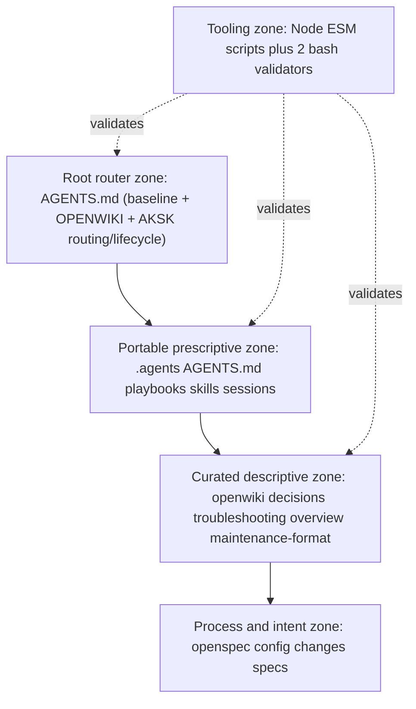
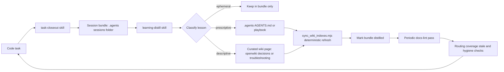

# AKSK Architecture Overview

The Agent Knowledge Starter Kit (AKSK) is a shareable, tool-agnostic starter kit for maintaining a compiled repository knowledge layer for coding agents (`package.json` name `agent-knowledge-starter`, version `2.0.0`). It ships markdown conventions and agent skills — not an application. There is no runtime service or database, `dependencies` is empty, `devDependencies` holds local tooling (`@fission-ai/openspec`, `openwiki`, `remark-cli`), and `npm test` intentionally prints `Error: no test specified`.

## Peer dependencies

AKSK is glue over two globally installed tools it never installs implicitly:

- **OpenSpec** (`@fission-ai/openspec`) — owns the intent and process layer under `openspec/`.
- **OpenWiki** (`openwiki`, plus one-time `openwiki --init` per repo) — owns the descriptive knowledge layer under `openwiki/`.

Skills verify these prerequisites before acting via `node .agents/skills/aksk-bootstrap/scripts/check_peer_tools.mjs openspec openwiki` and fail fast on exit code 2 printing exact `npm i -g` install commands (`@latest` fallback in that verifier; caret-pinned commands come from the global orchestrator). Caret ranges (`@fission-ai/openspec@^1.11.0`, `openwiki@^0.4.3`) are resolved from `references/versions.json` (consumer `package.json` override checked first, then bundled file) via `versionsFromPackageJson()` in the global orchestrator. Only the deterministic global lane (`bootstrap-global.mjs` under `aksk-bootstrap`) performs per-user `npm i -g`; all other skills and the per-repo lane (`aksk-init`) only verify. Per `openspec/specs/aksk-bootstrap/spec.md` the global lane is restricted to per-user operations and host integrations are manual opt-in, and per `openspec/specs/aksk-init/spec.md` the repo lane fails fast directing to `aksk-bootstrap` when tools are missing and never attempts global installs.

Node >= 22 is the single kit runtime for all `.mjs` scripts under `.agents/skills/aksk-bootstrap/scripts/` and `.agents/skills/aksk-init/scripts/` — `bootstrap-global.mjs`, `bootstrap.mjs` (shim), `check_peer_tools.mjs`, `attach_wiki_contract.mjs`, `attach_section.mjs`, `sync_wiki_indexes.mjs`, `init_agents_md.mjs`, `refresh_agents_baseline.mjs`, and `bootstrap-repo.mjs`.

## Runtime domains and zone stack

Organize the repo by authority, not by tree listing. Each zone has one owner, one write path, and one validation path.

*Caption: authority stack from entrypoint routing to portable rules to curated knowledge to process.*

### Zone 1 — Root router

`AGENTS.md` at the repo root is the entrypoint agents actually load. AKSK does not replace it; it appends marker-delimited managed sections in upstream-first order:

- `<!-- AKSK:AGENTS-BASELINE:BEGIN -->` / `<!-- AKSK:AGENTS-BASELINE:END -->` — vendored FerroxLabs behavioral baseline with provenance header (source URL, capture date, MIT notice, refresh pointer). Owned by `init_agents_md.mjs` / `refresh_agents_baseline.mjs`. Seeded only when missing; existing files block seeding until the user chooses `--replace` or `--combine`.
- `<!-- OPENWIKI:START -->` / `<!-- OPENWIKI:END -->` — OpenWiki-owned block that agents treat as generated. Verified only, never hand-edited.
- `<!-- AKSK:ROUTING:BEGIN -->` / `<!-- AKSK:ROUTING:END -->` — thin discovery pointers into `.agents/` and `openwiki/` (template `routing-note-template.md`).
- `<!-- AKSK:LIFECYCLE:BEGIN -->` / `<!-- AKSK:LIFECYCLE:END -->` — the self-improvement loop mandate: closeout, distill, prune (template `lifecycle-template.md`).

The last two are owned by `attach_section.mjs` (shipped under both `aksk-bootstrap` and `aksk-init` for shim compatibility; canonical repo-lane owner is `aksk-init`). The baseline zone is owned by `init_agents_md.mjs`. `.agents/AGENTS.md` remains the portable source of truth; `AGENTS.md` only routes to it. Zoning and ordering guarantees are specified in `openspec/specs/agents-md-bootstrap/spec.md`.

### Zone 2 — Portable prescriptive layer (`.agents/`)

Owns behavior rules that travel with the repo when tools change. Contents that matter:

- `.agents/AGENTS.md` — compact, portable routing directives and project learnings. Must stay small per design principle 2; no session history, long rationale, or one-off debugging details.
- `.agents/playbooks/` — durable multi-step procedures (for example `pre-publish`, `major-version-release`). Prescriptive lessons that require ordered steps land here, not in `AGENTS.md`.
- `.agents/sessions/` — gitignored temporary evidence. Only `.agents/sessions/README.md` is tracked, enforced by `.agents/.gitignore` (`sessions/*` plus `!sessions/README.md`) and verified by `check-agents-structure.sh`. Each session folder holds one task-closeout bundle.
- `.agents/skills/` — portable skills plus maintainer-internal skills. Portable skills ship a `CONTRACT.md` so an agent that receives only that folder still knows entrypoints, flags, and file shapes:
  - `aksk-bootstrap` — per-user global lane: Node check, `npm i -g` for peer tools from `references/versions.json`, PATH verification, and global skill spread; never touches per-repo files except receipts verification per `openspec/specs/aksk-bootstrap/spec.md`.
  - `aksk-init` — per-repo lane: `.agents/` scaffold and baseline seeding first, `openspec init`, `openwiki --init`, and contract/routing attachment per `openspec/specs/aksk-init/spec.md`.
  - `task-closeout` — capture-only; writes only under `.agents/sessions/`.
  - `learning-distill` — classification and promotion; writes to `.agents/` and `openwiki/` curated trees.
  - `docs-lint` — read-mostly coherence pass; writes only minimal fixes to AKSK-owned files.
  - `verify-install` — internal validation of the installed skill layout.

Tool switching does not invalidate accumulated knowledge because the on-disk layout is stable; consumers re-register `SKILL.md` files however their stack expects.

### Zone 3 — Curated descriptive layer (`openwiki/`)

The durable descriptive knowledge layer. Curated trees are authored directly by the distilling agent in OKF frontmatter (`type`, `title`, `description`, `tags`) plus AKSK extensions:

- `openwiki/decisions/` — one page per durable decision with `aksk_status` (`accepted`, `superseded`, `provisional`), optional `aksk_superseded_by`, optional `aksk_depends_on` qualified refs (`decisions/<slug>`, `troubleshooting/<slug>`).
- `openwiki/troubleshooting/` — recurring failure patterns and fixes.
- `openwiki/overview.md` — curated entry point; `openwiki/maintenance-format.md` — schema reference.
- `openwiki/INSTRUCTIONS.md` — carries the AKSK curation contract between `<!-- AKSK:WIKI-CONTRACT:BEGIN -->` / `<!-- AKSK:WIKI-CONTRACT:END -->` markers. Owned by `attach_wiki_contract.mjs`, never created if missing, and preserved across `openwiki --update` runs via preserve-and-link semantics per `openspec/specs/wiki-contract/spec.md` and `openspec/specs/distill-routing/spec.md`.

Generated artifacts live alongside curated trees but are not hand-edited: `openwiki/index.md` (catalog refreshed deterministically), `.last-update.json`, `.run.json`.

### Zone 4 — Process and intent layer (`openspec/`)

`openspec/config.yaml` declares `schema: spec-driven` plus proposal, design, and task rules. `openspec/changes/` holds active proposals; `openspec/specs/` holds graduated SHALL requirements. The three-layer division of labor is recorded as a decision: OpenSpec owns requirements, OpenWiki owns descriptive facts and rationale, AKSK owns experiential capture and curation. Distillation must not duplicate a SHALL requirement already codified in `openspec/specs/` as a wiki page.

Dedicated governance and lifecycle detail lives on the linked pages; this overview only maps the zones.

## Tooling layer

### Node ESM scripts

All are plain ESM `.mjs` on Node >= 22, idempotent, and non-installing except the global lane.

**`bootstrap.mjs [repo-root] [--force] [--json]` (shim)** — runs `bootstrap-global.mjs` then, if present, `aksk-init/scripts/bootstrap-repo.mjs` sequentially via `spawnSync`. Exits with the first non-zero status; if `aksk-init` is absent it reports global lane complete and directs the user to run `aksk-init` separately.

**`bootstrap-global.mjs [repo-root] [--force] [--json]`** — deterministic global orchestrator per `openspec/specs/aksk-bootstrap/spec.md` with preflight detection (Node major, tools on PATH, `.agents/`/`openspec/`/`openwiki/` presence, `openwiki integrations list --project` receipts best-effort) and a state report before acting. It verifies CLIs — `npm i -g @fission-ai/openspec@^1.11.0 openwiki@^0.4.3` in user scope per caret from `references/versions.json` via `versionsFromPackageJson()` (consumer `package.json` checked first for local override, then bundled file; `@latest` only when unpinned) — skipping any tool already present at a compatible version and reporting detected versions via `--version`. Skill spread (`npx skills add <source> -g -a <agent>` into `~/.agents/skills` plus self-reported host) is orchestrated by the `aksk-bootstrap` skill agent per `openspec/specs/canonical-user-skills-scope/spec.md` (`npx` required, no clone fallback); host integrations (`openwiki integrations install <host>`) are manual opt-in and not auto-installed by the script. **Never half-installs**: a failed step prints exact remaining commands (INSTRUCT lane) and exits clean without partial state from that step. Non-interactive; the `aksk-bootstrap` skill prompts `[Y/n/skip]` before invoking.

**`bootstrap-repo.mjs [repo-root] [--yes] [--local-skills]`** — per-repo orchestrator per `openspec/specs/aksk-init/spec.md`. Preflight verifies Node >= 22 and `openspec`/`openwiki` on PATH, failing fast with `npm i -g` remediation directing to `aksk-bootstrap` and never attempting global installs. Idempotent sequence: (1) scaffold `.agents/` + baseline via `init_agents_md.mjs` first, (2) `openspec init --tools none` when `openspec/` missing, (3) `openwiki --init` when `openwiki/` missing (documents harness path needs no extra key, CLI needs `OPENAI_API_KEY`), (4) attach routing + lifecycle via `attach_section.mjs`, (5) attach wiki contract via `attach_wiki_contract.mjs`. Version diagnostics read from `aksk-bootstrap/references/versions.json` as single source. Supports `--local-skills` to install repo-local via `npx skills add` without `-g`; partitioned INSTRUCT prints only repo-scoped commands on failure.

**`check_peer_tools.mjs`** — PATH-only verifier. Exports `INSTALL_COMMANDS` (`openspec` maps to `npm i -g @fission-ai/openspec@latest`, `openwiki` to `npm i -g openwiki@latest`), `onPath(cmd)`, `missing(tools)`, `requireBinaries(tools)`. Standalone usage checks names via `process.argv`; unknown tool names exit 2 naming the unknown tool. On missing binaries prints one error per tool plus install commands and exits 2. Importable from sibling skills.

**`attach_wiki_contract.mjs [repo-root]`** — appends the section from `references/wiki-contract-template.md` between `AKSK:WIKI-CONTRACT` markers to an existing `openwiki/INSTRUCTIONS.md`. Never creates the file or removes OpenWiki-owned content. If the file is missing, exits 2 naming the missing precondition and printing `openwiki --init` with no writes. Self-updating: re-running is a no-op when the marked section matches the template; if the template changed, only that marked section is refreshed. Detects the default stub (`A code wiki for this repository.`) and reports stub-aware attachment. Specified in `openspec/specs/wiki-contract/spec.md`.

**`attach_section.mjs [repo-root] [target-file-name] [template-name]`** — single mechanism for N marker-delimited root sections. Markers are read from the template, not hard-coded. Known templates: `routing-note-template.md` (`AKSK:ROUTING`) and `lifecycle-template.md` (`AKSK:LIFECYCLE`). Existing content outside markers is never replaced. Idempotent and self-updating with the same no-op-or-refresh semantics. If the target file is missing, creates it containing only the attached section — root router files have no upstream initializer. Unknown template name exits 2.

**`init_agents_md.mjs [repo-root] [--replace] [--combine]`** — deterministic seeder for the `AKSK:AGENTS-BASELINE` zone per `openspec/specs/agents-md-bootstrap/spec.md`. Missing `AGENTS.md` → creates file containing vendored baseline wrapped in markers with provenance header (no network). Existing matching baseline → no-op. Existing non-matching file with no flag → exits 2 with no writes, printing replace-vs-combine options. `--replace` overwrites with baseline; `--combine` stages `existing.md`, `baseline.md`, and `COMBINE.md` under `.agents/sessions/agents-md-combine/<timestamp>/` for LLM merge, leaving original untouched. Markers read from template; comparison is trailing-whitespace/newline-at-EOF normalized.

**`refresh_agents_baseline.mjs [--check]`** — fetches `https://raw.githubusercontent.com/FerroxLabs/agents-md/main/AGENTS.md` to temp, validates anchors (`Non-negotiables`, `Before writing code`, `Surgical changes`, `Goal-driven execution`), then swaps only content between `AKSK:AGENTS-BASELINE` markers in the vendored template, updating capture date. Offline/failure exits non-zero with no corruption of the vendored baseline.

**`sync_wiki_indexes.mjs [repo-root]`** — deterministic index refresh without invoking `openwiki --update` or an LLM. Requires `openwiki/` to exist and the `openwiki` package to be installed globally (`npm root -g` plus `openwiki/dist`). Dynamically imports `agent/docs-only-backend.js` and `okf/index-sync.js`, constructs `OpenWikiLocalShellBackend` with `docsOnly: true` and `virtualMode: true`, then calls `synchronizeWikiIndexes(backend, "repository")`. Exits 2 with remediation hints when the wiki is uninitialized or the package is missing. This is the write path distillation uses after authoring curated pages.

### Two bash validators (`scripts/`)

**`check-agents-structure.sh [target]`** (default `.agents`) — portable `.agents/` validator using `bash`, `sed`, `grep`, `find`, plus `git` for session tracking and optional `jq` for JSON. Checks: target directory exists; required files present (`AGENTS.md`, `.gitignore`, `playbooks/README.md`, `sessions/README.md`, the four `SKILL.md` files and the task-closeout example bundle); session tracking — only `sessions/README.md` is tracked (`git ls-files`) and bundles are ignored (`git status --ignored`); each `SKILL.md` starts with YAML frontmatter containing `name:` and `description:`; JSON files under the target validate when `jq` is available (ignores `sessions/[0-9]*`).

**`check-publish.sh`** — release hygiene wrapper that `cd`s to the git root. Delegates to `check-agents-structure.sh` for the portable structure, then: Markdown formatting via `remark` (or `npx remark --frail` with 60s timeout) when available; Markdown link checking via `markdown-link-check --alive 200,0` per file (30s timeout per file); leakage scans via `rg` (when installed) for secret or local-path patterns across `README.md`, `INSTALL.md`, `docs`, `.agents`; knowledge path hygiene for doubled `.agents/.agents` segments; plus listing of published files under `.agents`. Each stage degrades to a warning when its optional tool is absent. `package.json` exposes it as `npm run check`.

## Installation lanes (shipped)

Preferred lanes are agent-assisted via `npx skills add Hypercubed/Agent-Knowledge-Starter-Kit` into the canonical user store (`~/.agents/skills` universal plus self-reported host via `-g -a <self-reported>`, `npx` required, no clone fallback per `openspec/specs/canonical-user-skills-scope/spec.md`) and deterministic `node .agents/skills/aksk-bootstrap/scripts/bootstrap.mjs [repo-root]` (EXECUTE/INSTRUCT) which delegates to `bootstrap-global.mjs` then `bootstrap-repo.mjs`. Fallback/manual lane is `npx skills add` with per-skill initialization per `openspec/specs/install-lanes/spec.md`. Documentation, playbooks, and shell scripts do not reference `example/` as an install path or validation target — `example/` is not a supported distribution artifact.

> **Proposal-only (not shipped):** `openspec/changes/add-task-start` proposes a `task-start` skill that seeds the session folder and `summary.json` (`task_id`, `created_at`, `status=in_progress`, `openspec_change`) before work begins, with `task-closeout` finalizing the same bundle. Shipped behavior remains `task-closeout` creating the bundle and `summary.json` from scratch.

## Maintenance loop

Three agent roles plus deterministic sync form the loop. No zone is written by more than one role.

*Caption: closeout captures evidence, distill routes by kind, sync refreshes indexes, lint guards coherence.*

**1. Closeout** (`task-closeout`) — coding agent finishes work and emits a structured handoff packet. Initialization ensures `.agents/sessions/` and `.agents/.gitignore` exist. Each bundle is one folder named `YYYYMMDD-HHMMSS-short-topic` (sortable label, not canonical identity) containing exactly five files: `summary.json`, `active-task.md`, `learning-candidate.md`, `changed-files.txt`, `validation.txt`. `task_id` inside `summary.json` is the canonical identifier; `repo_id` is the stable repo context; `openspec_change` records the associated `openspec/changes/<name>` when applicable. `agent` and `agent_session_id` are recorded when the tool exposes them. Closeout never edits `.agents/AGENTS.md`, `openwiki/`, playbooks, `openspec/`, or skill sources — proposed durable changes are captured as prose for distillation.

**2. Distill** (`learning-distill`) — separate learning agent converts raw evidence into durable knowledge. Prerequisites fail closed: peer tools on PATH and `openwiki/INSTRUCTIONS.md` carrying the `AKSK:WIKI-CONTRACT` markers, otherwise no writes. Classification is one of `ephemeral`, `AGENTS guidance`, `playbook`, `decision record`, `troubleshooting record`, or `descriptive lesson`. Descriptive lessons become OKF pages under `openwiki/{decisions,troubleshooting}/` or topical pages, validated at runtime via `openwiki/dist/okf/frontmatter.js` (`validateOkfFrontmatter`); authoring guidance is loaded at runtime from `openwiki/dist/agent/prompt.js` (`createSystemPrompt`). Prescriptive lessons become minimal edits to `.agents/AGENTS.md` or playbooks. After writing, indexes are refreshed via `sync_wiki_indexes.mjs` — distillation never invokes `openwiki --update`. The session bundle is then marked `distilled`.

**3. Sync** (`sync_wiki_indexes.mjs`) — deterministic, no-LLM refresh of `openwiki/index.md` and directory indexes after distill-authored pages. Keeps curated page bodies intact while updating indexes.

**4. Lint** (`docs-lint`) — periodic coherence pass. Wiring checks that fail the pass: routing-block integrity (managed `AKSK:*` blocks exactly one each per root instruction file present, baseline provenance header when seeded, targets exist, stale blocks refreshed via `attach_section.mjs`/`init_agents_md.mjs`; `OPENWIKI:START/END` presence only with baseline→OpenWiki→AKSK order), wiki contract presence, archived-change or wiki coverage pairing (every `openspec/changes/archive/` entry must have descriptive outcomes in `openwiki/` or a recorded deferral), stale curated pages (retired-skill references, `aksk_status: accepted` with `aksk_superseded_by` set, dead `aksk_depends_on` targets). Content checks report duplication, contradictions, oversized AGENTS sections, broken relative links, frontmatter contract violations (validated against `learning-distill/references/*.schema.json`), mis-placed troubleshooting or decision content, and doubled `.agents/.agents` path hygiene. Lint never writes OpenWiki-owned files; index drift is fixed by rerunning `sync_wiki_indexes.mjs`.

## Entry points, identifiers, and lifecycle

- **Agent startup** — read `openwiki/index.md` and `.agents/AGENTS.md` first (`Routing Directives` in `.agents/AGENTS.md`). When exploring knowledge, start from `openwiki/index.md` and directory indexes. When debugging, grep `openwiki/` and `.agents/` for the symptom before blind debugging. Before architectural changes, search `openwiki/decisions/`.
- **Task identity** — canonical `task_id` lives in `summary.json`; folder name is only a sortable label. Pass both bundle path and `task_id` between agents. `prior_session` pointer is optional for chaining related closeouts without merging folders.
- **Bundle discovery** — bundles are gitignored; ignore-aware grep may report no bundles when they exist. Locate them via filesystem listing (`ls`, `find`) or `rg --no-ignore-vcs`, then filter by `summary.json` distillation flags.
- **Starter versus consumer** — this GitHub repository is the starter kit rooted in its own `.agents/` tree as source of truth for generic templates. After adoption, the consumer's `.agents/` is the contract. There is no `example/` distribution path.

## Invariants and failure semantics

- **Durable descriptive knowledge lives only as curated OKF pages under `openwiki/`**; `.agents/` holds only prescriptive guidance. Violations are surfaced by lint as stale or mis-placed content.
- **OpenSpec and OpenWiki are peer dependencies**: skills verify binaries before use and never install anything except the global lane's per-user `npm i -g`. Missing tools exit 2 with exact `npm i -g` commands.
- **Raw evidence is not durable knowledge.** Bundles under `.agents/sessions/` are per-task evidence; durable layers hold only stable, reusable lessons.
- **`.agents/AGENTS.md` stays small.** Distillation rejects low-confidence or one-off lessons and prefers small edits.
- **Distillation is a separate role.** The implementing agent is rarely the best judge of what should become permanent.
- **No duplication with OpenSpec.** If a candidate decision overlaps a SHALL requirement in `openspec/specs/`, cite the spec instead of creating a wiki page.
- **Marker ownership is strict.** Content between `AKSK:*` markers is owned by the attachment scripts; hand-editing is corrected by rerunning them. `OPENWIKI:START/END` blocks are never hand-edited.
- **Preserve-and-link contract.** Curated pages under `decisions/` and `troubleshooting/` survive `openwiki --update`; update runs keep AKSK-authored content including `aksk_*` frontmatter and link generated material to it.
- **Global vs repo lane separation.** `aksk-bootstrap` never creates or modifies per-repo files (`.agents/`, `openspec/`, `AGENTS.md`, `openwiki/INSTRUCTIONS.md`) except receipts verification; `aksk-init` never installs global tools and always scaffolds `.agents/` and baseline first.

## Extension and configuration

- **Adding guidance** — prescriptive, broadly useful, high-confidence behavior rules go in `.agents/AGENTS.md`; ordered procedures go in `.agents/playbooks/`; descriptive rationale and fixes go in curated wiki pages. Use `learning-distill` classification criteria; do not copy task history into `AGENTS.md`.
- **Adding integrations** — product-specific wiring guides belong in `docs/integrations/`, not `.agents/` (`integration-guides-belong-in-docs-integrations-not-agents`). Shared cross-vendor patterns belong in `docs/integrations/patterns.md`. Thin vendor config points at `.agents/AGENTS.md` and `openwiki/index.md` so switching tools does not invalidate knowledge.
- **New skills** — portable skills need `SKILL.md` frontmatter with `name` and `description`, plus a `CONTRACT.md` for machine-oriented entrypoints. Maintainer-only automation must set `metadata.internal: true` so `npx skills add` skips it.
- **Configuration surface** — package `name`, `version`, `homepage`, and the `scripts.check` / `scripts.format` definitions in `package.json`; `openspec.yaml` read-and-reference rules for `.agents/**` and `docs/**`; `.remarkrc.json` for Markdown formatting; `.agents/.gitignore` session ignore contract; `references/versions.json` caret ranges for the global install lane (single source; `aksk-init` reads from `aksk-bootstrap/references/versions.json`). There is no runtime config file or environment-variable contract for the kit itself.
- **Verification** — `bash scripts/check-agents-structure.sh` for structural truth, `bash scripts/check-publish.sh` (or `npm run check`) for full publish hygiene. Both degrade gracefully when optional tools (`jq`, `remark`, `markdown-link-check`, `rg`) are absent.

## Related pages

- [Knowledge layer](../architecture/knowledge-layer.md) — durable knowledge locations and curation rules.
- [Task lifecycle](../architecture/task-lifecycle.md) — bundle shape and state transitions.
- [Distribution and tool wiring](../integrations/distribution-and-tool-wiring.md) — install lanes and peer-tool wiring.
- [Validation and release](../operations/validation-and-release.md) — structural checks and publish hygiene.
