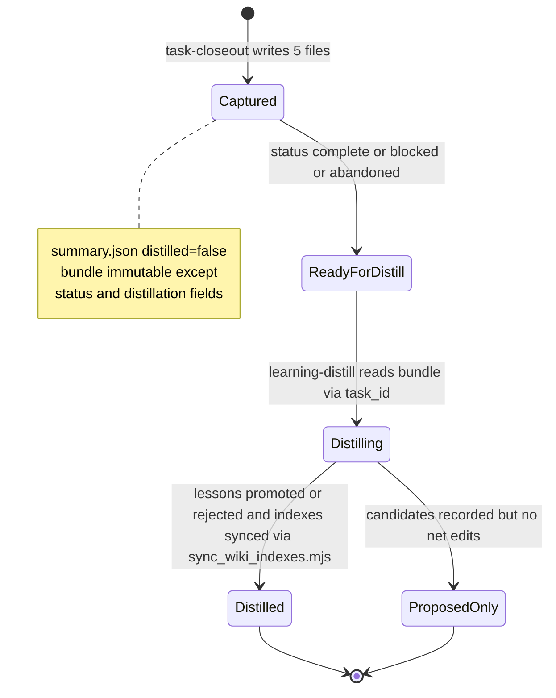
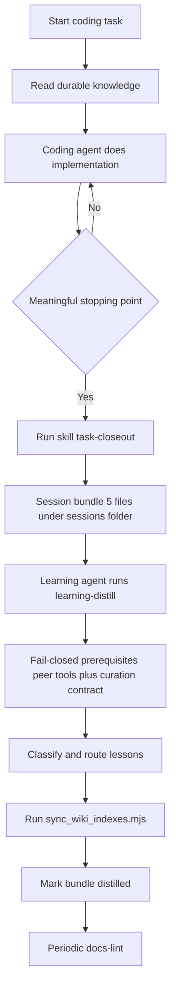

# Task Lifecycle and Session Bundles

Every meaningful unit of agent work moves through a defined lifecycle: capture at a stopping point, distill into durable knowledge, sync indexes deterministically, then lint. This page documents identity, bundle shape, state transitions, and the coding → closeout → distill → sync → lint flow. The skill procedures that implement each phase are [task-closeout](../skills/task-closeout.md) and [learning-distill](../skills/learning-distill.md). A proactive `task-start` phase is **Proposal-only** under `add-task-start` (see [Proposed task-start](#proposed-task-start-proposal-only)) and is not yet an active capability.

## Task and session identity

- The **canonical** task/session identifier is the `task_id` field inside `.agents/sessions/<session-folder>/summary.json`. Consumers, distillers, and cross-tool joins must read it from there.
- The session **folder name is only a sortable storage label** with pattern `YYYYMMDD-HHMMSS-short-topic` — lowercase slug tied to the task goal. Never infer canonical identity from it. One bundle per folder; reuse a folder only for the bundle it was created for.
- `repo_id` carries stable repository/project context.
- Optional chaining: decision `optional-prior-session-in-session-summary-json` allows an optional `prior_session` pointer in `summary.json` to link related closeouts without merging folders.
- When passing work between agents, provide both the bundle path and the `task_id`.

Example from the architecture doc:

```text
Bundle path: .agents/sessions/20260411-122921-auth-timeout-fix/
Task ID: t-20260411-122921-auth-timeout-fix   ← from summary.json task_id
Repo ID: agent-knowledge-starter
```

Real bundles show both styles: `20260503-130450-migrate-remaining-plans-to-openspec/summary.json` uses `task_id: "20260503-130450-migrate-remaining-plans-to-openspec"`; the reference example bundle uses `t-20260407-143210-monaco`.

Agent provenance is optional and independent: `agent` and `agent_session_id` are recorded in `summary.json` (and matching `Agent` / `Agent Session ID` sections in `active-task.md`) whenever the active tool supplies them. Omit only the field that is unavailable; never invent IDs.

## Bundle shape

Each bundle directory must contain exactly these five files. `task-closeout` is the sole writer of this tree today; under the proposal `task-start` would own creation and `task-closeout` would own finalization with no other writer mutating the bundle.

| File | Role |
| --- | --- |
| `summary.json` | status, timestamps, optional `repo_id`, **required `task_id`**, optional `agent`/`agent_session_id`, optional **`openspec_change`**, git metadata (`branch`, `head_commit`, `workspace_root`), distillation flags (`distilled`, `distillation_status`) |
| `active-task.md` | observable facts only; sections: Task ID, Agent (optional), Agent Session ID (optional), Goal, Outcome, Files Changed, Commands Run, Validation, Remaining Work, Notes |
| `learning-candidate.md` | candidate lessons only: Task, What failed, What worked, Reusable pattern, Candidate AGENTS update, Candidate troubleshooting note, Candidate repo decision, Candidate playbook, Spec updates deferred to archive time, Confidence |
| `changed-files.txt` | paths touched during the session |
| `validation.txt` | checks run and outcomes |

A filled-in reference lives at `.agents/skills/task-closeout/example/task-bundle/` (its `summary.json` carries `"openspec_change": "add-task-start"` and `"task_id": "t-20260407-143210-monaco"`). The two markdown files are scoped to the **whole maintainer conversation** — mistakes, reversals, and corrections — not just the final diff. Bundle prose stays concise and bullet-oriented.

### The `openspec_change` link and deferred spec updates

When the session worked on an OpenSpec change, record its name in `summary.json.openspec_change` (capability `closeout-change-linking`):

```json
{
  "repo_id": "example-repo",
  "task_id": "t-20260407-143210-monaco",
  "status": "completed",
  "distilled": false,
  "openspec_change": "add-task-start"
}
```

- If no change was involved, the field is absent or null and closeout succeeds normally.
- **Closeout never edits `openspec/`** for in-flight changes — spec updates are deferred to `/opsx:archive` time. `learning-candidate.md` notes pending spec updates ("Spec updates deferred to archive time") for archiving to fold in. This field also gives [docs-lint](../skills/docs-lint.md)'s archived-change ↔ wiki coverage pairing its natural join key.

## Proposed task-start (Proposal-only)

`add-task-start` is a **Proposal-only** change living under `openspec/changes/add-task-start/` (proposal + `specs/task-start/spec.md` + design). It has not been archived to `openspec/specs/task-start/` and must be labeled as proposal until that archive step completes.

If adopted, the intended ownership is exclusive:

- **`task-start` owns creation**: creates `.agents/sessions/YYYYMMDD-HHMMSS-short-topic/`, ensures `.agents/sessions/README.md` and `.agents/.gitignore` entries (`sessions/*`, `!sessions/README.md`) exist, and **seeds `summary.json`** with `task_id` (canonical), `created_at`, `status: in_progress`, and optional `openspec_change`/`repo_id`/`agent` fields. It does not yet contain `completed_at` or final validation/changed-files content.
- **`task-closeout` owns finalization**: detects the seeded `summary.json`, **preserves `task_id` (and `openspec_change` if seeded)**, appends `completed_at`, final `status` (`completed`/`blocked`/`abandoned`), git metadata, and distillation flags, then writes the remaining four bundle files. When invoked without a prior `task-start`, it retains its current generation fallback.
- **No other writer mutates the bundle**: only `task-start` (creation) → `task-closeout` (finalization) → `learning-distill` (consume + mark `distilled`/`distillation_status`) touch `summary.json`; durable updates remain owned by `learning-distill`. Strict sequencing is `start → work → closeout → distill`.

Until archived, the enforced lifecycle remains `coding → task-closeout → learning-distill`.

## State machine



*Caption: bundle states as enforced by the task-closeout contract ("immutable after closeout except status / distillation-related fields") and learning-distill's final step ("Mark the session bundle as distilled"). There is no activity log to append — accountability lives in bundle flags plus git history; the former `.agents/docs/log.md` was deleted in the consolidation. Proposal would prepend `Started (task-start seeds summary.json in_progress) --> Working --> Captured` before this diagram.*

## Lifecycle ordering and invariants



1. A coding task begins; the coding agent creates or adopts stable `repo_id` and task-specific `task_id`.
2. At completion, blockage, or abandonment, the coding agent runs `task-closeout` → bundle written to `.agents/sessions/<folder>/`.
3. The learning agent runs `learning-distill` on the bundle, reading `task_id` from `summary.json`; fail-closed prerequisites must pass before any wiki write (see below).
4. Durable lessons land in their routed homes: curated wiki trees (`openwiki/{decisions,troubleshooting}/` and topical pages) for descriptive lessons; `.agents/AGENTS.md` or `.agents/playbooks/` for prescriptive ones. Descriptive lessons never go to `.agents/`; prescriptive rules never go to the wiki. Duplication with an existing `openspec/specs/` SHALL requirement is rejected — cite the spec instead.
5. The learning agent runs `sync_wiki_indexes.mjs` for deterministic index refresh, then marks the bundle `distilled: true` / `distillation_status`. **There is no activity log to append.**
6. Periodically the lint agent runs `docs-lint` and deterministic validators.

*Proposal path (not yet enforced): `task-start` would seed `summary.json` with `status in_progress` at step 1, making the bundle discoverable from the moment work begins, before step 2 finalizes it.*

Invariants that hold across the loop:

- **Write-scope separation**: closeout writes only under `.agents/sessions/<folder>/` (never `openwiki/**`, `.agents/AGENTS.md`, `.agents/playbooks/**`, `.agents/skills/**`, or `openspec/` for in-flight changes); distillation owns all durable updates and the bundle's distillation flags. Under the proposal, `task-start` would also be limited to `.agents/sessions/<folder>/` plus idempotent `README.md`/`.gitignore` init, with exclusive ownership `task-start` owns creation, `task-closeout` owns finalization, nothing else mutates the bundle.
- **Immutability**: after closeout the bundle is immutable except status/distillation-related fields in `summary.json` that a later tool updates.
- **Gitignore boundary**: everything under `sessions/` except `README.md` stays untracked (`sessions/*` + `!sessions/README.md` in `.agents/.gitignore`). Because ignore-aware tools hide these paths, discovery during distillation must use an ignore-blind method — see next section.
- **No secrets upward**: neither bundles nor wiki pages may carry credentials, personal data, or long raw dumps. Low-confidence or one-off lessons are rejected.

## Finding bundles under gitignore

Per-task folders under `.agents/sessions/` are deliberately gitignored — only `README.md` is tracked. Many search tools skip ignored paths by default, so **never conclude no bundles exist based on an ignore-aware search or glob**.

Locate bundles with at least one ignore-blind method:

- filesystem listing (`ls`, `find`, shell APIs) rather than an IDE index;
- ripgrep with `--no-ignore-vcs` (or `--no-ignore` when scoped to the sessions subtree).

Then open each candidate's `summary.json`: treat `task_id` as canonical and filter/prioritize using state fields (`distilled`, `status`, `distillation_status`). Do not select a bundle from its folder name. This failure mode is also curated as `troubleshooting/session-discovery-fails-during-distillation-or-closeout`.

## Prerequisites (fail-closed)

Distillation fails closed before any wiki write. Two checks must pass; on failure the run stops without writing and prints remediation:

1. **Peer binaries on PATH** — `node .agents/skills/aksk-bootstrap/scripts/check_peer_tools.mjs openspec openwiki` verifies both binaries via directory scan (not shell lookup). On missing tool it prints one error per tool plus exact install commands (`npm i -g @fission-ai/openspec@latest`, `npm i -g openwiki@latest`) and exits `2`. Unknown tool names also exit `2`.
2. **Curation contract attached** — `openwiki/INSTRUCTIONS.md` must exist and carry the `AKSK:WIKI-CONTRACT` markers (`<!-- AKSK:WIKI-CONTRACT:BEGIN -->` … `<!-- AKSK:WIKI-CONTRACT:END -->`). Managed by `attach_wiki_contract.mjs` which appends or refreshes only between markers, is stub-aware, and never creates the wiki. If missing or stub-only, distillation stops and points to attachment.

Treating an absent contract as "nothing curated" could silently regenerate away hand-curated pages, so absence fails closed (design decision D3 of `adopt-openspec-openwiki`, now spec'd under `distill-routing`).

## Routing: descriptive → OpenWiki vs prescriptive → `.agents`

`learning-distill` classifies each candidate and routes by kind:

| Category | Destination | Bar to clear |
| --- | --- | --- |
| `ephemeral` | stays in bundle | one-off detail |
| `AGENTS guidance` | `.agents/AGENTS.md` | high confidence, broadly useful, likely to recur, concise, actionable |
| `playbook` | `.agents/playbooks/<name>.md` | durable multi-step procedure |
| `decision record` | `openwiki/decisions/<slug>.md` | rationale needing explanation later; `aksk_status` required |
| `troubleshooting record` | `openwiki/troubleshooting/<slug>.md` | recurring failure + fix |
| `descriptive lesson` | topical page under `openwiki/` | stable fact or pattern worth keeping |

Curated page frontmatter follows OpenWiki OKF base (`type`, `title`, `description`, `tags`, `timestamp`) plus AKSK extensions: `aksk_status` (`accepted`/`superseded`/`provisional`) on decisions, optional `aksk_superseded_by`, optional qualified `aksk_depends_on`. Filename stem is the entry identity, unique within its tree. For wiki-bound lessons, the agent loads authoring guidance at runtime from `openwiki/dist/agent/prompt.js` (`createSystemPrompt`) and validates with `openwiki/dist/okf/frontmatter.js` (`validateOkfFrontmatter`); fix every reported issue before continuing.

## Deterministic index sync

`node .agents/skills/aksk-bootstrap/scripts/sync_wiki_indexes.mjs [repo-root]` is the **only** supported way to rebuild wiki catalogs outside the scheduled `openwiki --update` run. It:

- resolves repo root and verifies `openwiki/` exists (else exits `2` with `openwiki --init` hint);
- locates the global package via `npm root -g` (else exits `2` with `npm i -g openwiki@latest`);
- dynamically imports `openwiki/dist/agent/docs-only-backend.js` and `openwiki/dist/okf/index-sync.js`;
- constructs `OpenWikiLocalShellBackend` with `{ docsOnly: true, virtualMode: true }` and calls `synchronizeWikiIndexes(backend, "repository")`, keeping curated page bodies byte-identical while rebuilding `openwiki/index.md` and directory `index.md` catalogs plus run metadata.

Never hand-edit OpenWiki-owned files (`index.md` catalogs, `.last-update.json`, `.run.json`); `docs-lint` reports index drift as guidance to rerun this script. Distillation never invokes `openwiki --update`; it authors pages directly and refreshes via this script.

## Worked end-to-end example

The kit's example bundle doubles as a teaching artifact: `active-task.md` records a Monaco JSON worker fix (goal, outcome, files changed, commands run), while `learning-candidate.md` proposes one AGENTS update, one troubleshooting note, and one repo decision from the same evidence with `Confidence: high`. Descriptive lessons become curated OKF pages under `openwiki/{decisions,troubleshooting}/` (validated with OpenWiki's frontmatter checker, indexes refreshed via `sync_wiki_indexes.mjs`), prescriptive lessons update `.agents/AGENTS.md` or playbooks, and there is no separate log file — the bundle flags plus git history are the audit trail.

## Failure handling

| Failure | When detected | Behavior |
| --- | --- | --- |
| `openwiki` binary missing | `check_peer_tools.mjs` before any wiki write | Exit `2`, per-tool error + `npm i -g openwiki@latest`, no pages written |
| `openspec` binary missing | Same check | Same semantics with `npm i -g @fission-ai/openspec@latest` |
| `openwiki/INSTRUCTIONS.md` missing | Prerequisite check | Exit `2`, prerequisite `openwiki --init`, no writes |
| `INSTRUCTIONS.md` lacks `AKSK:WIKI-CONTRACT` markers | Prerequisite check | Stop before any wiki write, point to `attach_wiki_contract.mjs` |
| Wiki uninitialized for index sync | `sync_wiki_indexes.mjs` | Exit `2`, `openwiki --init` hint |
| Global `openwiki` package missing | `sync_wiki_indexes.mjs` | Exit `2`, `npm i -g openwiki@latest` |
| Spec updates during closeout | `closeout-change-linking` contract | Closeout leaves `openspec/` untouched; deferral noted in `learning-candidate.md` for archive time |

All bootstrap scripts are offline-safe and never attempt installation.

## Validation and extension points

- **Portable shape** — `bash scripts/check-agents-structure.sh [target]` enforces required files, session tracking via `git ls-files`, SKILL.md frontmatter markers, and JSON validity.
- **Release hygiene** — `bash scripts/check-publish.sh` (wired to `npm run check`) adds `remark` formatting, `markdown-link-check`, leakage scans, and doubled-path hygiene.
- **`docs-lint` wiring pass** — verifies routing-block integrity, wiki-contract presence, archived-change ↔ wiki coverage pairing, and stale curated knowledge (superseded mismatches, dead `aksk_depends_on` targets).
- **Adding a curated tree** — extend `wiki-contract-template.md` and `INSTRUCTIONS.md` markers, then update `docs-lint`'s curated-tree table.
- **Adding a capability** — propose a change with `specs/<capability>/spec.md` delta SHALL requirements; archive with sync to graduate to `openspec/specs/<capability>/spec.md`.
- **Proposal-only `task-start` (`add-task-start`)** — until archived, do not treat `task-start` as an active skill; implementation must preserve `task_id`/`openspec_change`/`distillation flags` sequencing (creation → finalization → consume) and keep `summary.json` as the single source of truth, not a parallel `manifest.json`. Closeout retains fallback generation when no seed exists.

## Related

- Skill-level procedures: [task-closeout](../skills/task-closeout.md), [learning-distill](../skills/learning-distill.md), [docs-lint](../skills/docs-lint.md)
- Where promoted knowledge lands: [knowledge layer](knowledge-layer.md)
- Curation contract: `openwiki/INSTRUCTIONS.md` (`AKSK:WIKI-CONTRACT` markers) and [knowledge layer](knowledge-layer.md)
- OpenSpec capabilities: `closeout-change-linking` and `distill-routing` — plus **Proposal-only** `task-start` under `openspec/changes/add-task-start/`
