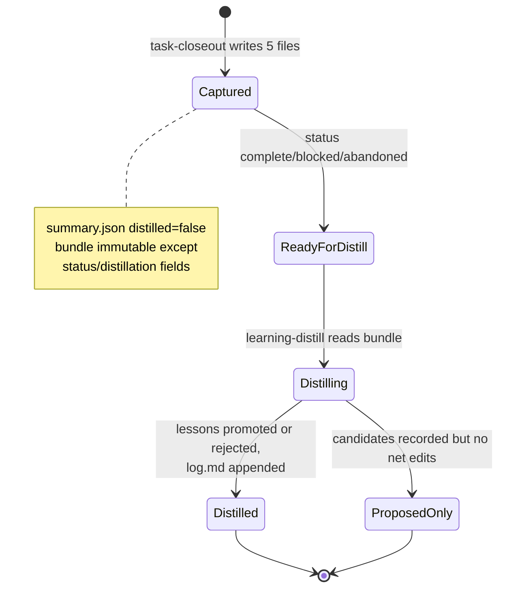

# Task Lifecycle and Session Bundles

Every meaningful unit of agent work moves through a defined lifecycle: capture at a stopping point, distill into durable knowledge, then mark processed. This page documents identity, bundle shape, and state transitions. The skill instructions that implement each phase are [task-closeout](../skills/task-closeout.md) and [learning-distill](../skills/learning-distill.md).

## Task and session identity

From `/docs/architecture.md`:

- The **canonical** task/session identifier is the `task_id` field inside `.agents/sessions/<session-folder>/summary.json`.
- The session **folder name is only a sortable storage label** (`YYYYMMDD-HHMMSS-short-topic`, lowercase slug tied to the task goal). Never infer canonical identity from it.
- `repo_id` carries the stable repository/project context.
- When passing work between agents, provide both the bundle path and the `task_id`.

Example from the architecture doc:

```text
Bundle path: .agents/sessions/20260411-122921-auth-timeout-fix/
Task ID: t-20260411-122921-auth-timeout-fix
Repo ID: agent-knowledge-starter
```

Real bundles show both styles: `20260503-130450-migrate-remaining-plans-to-openspec/summary.json` uses `task_id: "20260503-130450-migrate-remaining-plans-to-openspec"` with `"agent": "Raptor mini (Preview)"`; the reference example bundle uses `t-20260407-143210-monaco`. Optional chaining: decision entry `optional-prior-session-in-session-summary-json` allows a `prior_session` pointer in `summary.json` to link related closeouts without merging folders.

## Bundle shape

Each bundle directory must contain exactly these five files:

| File | Role |
| --- | --- |
| `summary.json` | status, timestamps, optional `repo_id`, **required `task_id`**, optional `agent`/`agent_session_id`, git metadata, `distilled` flag |
| `active-task.md` | observable facts only; sections: Task ID, Agent (optional), Agent Session ID (optional), Goal, Outcome, Files Changed, Commands Run, Validation, Remaining Work, Notes |
| `learning-candidate.md` | candidate lessons only: Task, What failed, What worked, Reusable pattern, Candidate AGENTS update, Candidate troubleshooting note, Candidate repo decision, Candidate playbook, Confidence |
| `changed-files.txt` | paths touched during the session |
| `validation.txt` | checks run and outcomes |

A filled-in reference lives at `.agents/skills/task-closeout/example/task-bundle/`. Note that "the whole maintainer conversation" is in scope for the two markdown files — mistakes, reversals, and corrections — not just the final diff.

## State machine



*Caption: bundle states as enforced by the task-closeout contract ("immutable after closeout except status / distillation-related fields") and learning-distill procedure step 9 ("Mark the session bundle as distilled").*

## Lifecycle ordering and invariants

1. A coding task begins; the coding agent creates or adopts stable `repo_id` and task-specific `task_id`.
2. At completion, blockage, or abandonment, the coding agent runs `task-closeout` → bundle written to `.agents/sessions/<folder>/`.
3. The learning agent runs `learning-distill` on the bundle, reading `task_id` from `summary.json`.
4. Durable lessons land in `.agents/AGENTS.md`, `.agents/docs/{decisions,troubleshooting}/`, or `.agents/playbooks/`; ephemeral material stays in the bundle.
5. The learning agent appends a concise row to `.agents/docs/log.md`.
6. Periodically the lint agent runs `docs-lint`.

Invariants that hold across the loop:

- **Write-scope separation**: closeout never touches durable files; distillation owns all durable updates ([MAINTENANCE.md task bundle boundary](../../.agents/docs/MAINTENANCE.md)).
- **Gitignore boundary**: everything under `sessions/` except `README.md` stays untracked. Because ignore-aware tools hide these paths, discovery during distillation has a dedicated invariant — see [learning-distill](../skills/learning-distill.md#finding-bundles-under-gitignore).
- **No secrets upward**: neither bundles nor `log.md` may carry credentials, personal data, or long raw dumps.

## Log row format

The bootstrap template defines the shape; real rows in this repo follow it:

```text
### [YYYY-MM-DD] learning-distill | <task-id>
Outcome: updated Source: .agents/sessions/<session-folder>/
Files: <semicolon-separated paths>
Classification: AGENTS n; troubleshooting n; decisions n; playbooks n; rejected n
Notes: brief summary
```

Actual examples appear in [`.agents/docs/log.md`](../../.agents/docs/log.md), e.g. the 2026-04-25 row for `t-20260425-140900-generate-example-verbose` recording two accepted lessons (a troubleshooting pattern plus an AGENTS feedback rule) and one rejection.

## Worked end-to-end example

The kit's example bundle doubles as a teaching artifact: `active-task.md` records a Monaco JSON worker fix (goal, outcome, files changed, commands run), while `learning-candidate.md` proposes one AGENTS update, one troubleshooting note, and one repo decision from the same evidence with `Confidence: high`. An OpenSpec change (`worked-lifecycle-example`) proposes expanding this into a compact narrative connecting closeout through classification to destinations and logging.

## Related

- Skill-level procedures: [task-closeout](../skills/task-closeout.md), [learning-distill](../skills/learning-distill.md)
- Where promoted knowledge lands: [knowledge layer](knowledge-layer.md)
- Proactive initialization of task state (proposed, not yet shipped): OpenSpec change `add-task-start` defines a `manifest.json`-based `task-start` capability (`task_id`, `start_time`, `origin_prompt`, session log) that `task-closeout` would update rather than regenerate.
- Forward-looking capture changes (unshipped): active change `adopt-openspec-openwiki` plans an `openspec_change` field in `summary.json` linking bundles to OpenSpec work, moving spec updates to `/opsx:archive` time; its reconciliation task coordinates this with `add-task-start`'s manifest consumption so the two proposals don't conflict — see [OpenSpec workflow](../governance/openspec-workflow.md).
