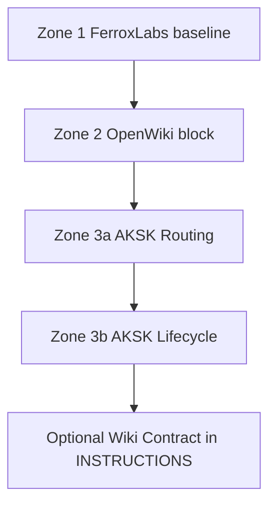

# AGENTS.md Zoning and Routing

Root `AGENTS.md` is a stacked, marker-delimited file with isolated ownership and deterministic upstream-first order. Three families, each owned by one writer and validated independently:

| Order | Zone | Markers | Owner | Content |
| --- | --- | --- | --- | --- |
| 1 | FerroxLabs baseline | `<!-- AKSK:AGENTS-BASELINE:BEGIN -->` / `<!-- AKSK:AGENTS-BASELINE:END -->` | `.agents/skills/aksk-init/scripts/init_agents_md.mjs` (seed) + `.agents/skills/aksk-bootstrap/scripts/refresh_agents_baseline.mjs` (update) | Vendored behavioral operating contract — non-negotiables, surgical changes, goal-driven execution — with provenance header inside the block (source URL, capture date, MIT license notice, refresh pointer) |
| 2 | OpenWiki | `<!-- OPENWIKI:START -->` / `<!-- OPENWIKI:END -->` | OpenWiki tooling (`openwiki --init` / `--update`, `sync_wiki_indexes.mjs`) | Knowledge-layer routing header — generated evidence index pointer. **Never hand-edit** this block. |
| 3a | AKSK routing | `<!-- AKSK:ROUTING:BEGIN -->` / `<!-- AKSK:ROUTING:END -->` | `.agents/skills/aksk-init/scripts/attach_section.mjs` + `routing-note-template.md` | Thin discovery pointers into `.agents/` and `openwiki/` |
| 3b | AKSK lifecycle | `<!-- AKSK:LIFECYCLE:BEGIN -->` / `<!-- AKSK:LIFECYCLE:END -->` | `attach_section.mjs` + `lifecycle-template.md` | Self-improvement loop mandate (closeout → distill → prune) |

A **fully bootstrapped** file per `openspec/specs/agents-md-bootstrap/spec.md` contains exactly one block per family ordered **baseline → OpenWiki → AKSK**. The vendored template at `.agents/skills/aksk-init/references/agents-md-baseline-template.md` (mirrored under `aksk-bootstrap/references/` for backwards compatibility) is the offline source of truth — its body is wrapped in `AKSK:AGENTS-BASELINE` markers. In this repo root `AGENTS.md` carries hand-authored behavioral content (sections 0–8) without `AKSK:AGENTS-BASELINE` markers, followed by `OPENWIKI:START/END` and the two `AKSK:*` blocks; this is the pre-seed state, so a no-flag `init_agents_md.mjs` run fails closed with the replace-vs-combine prompt instead of seeding.



*Caption: stacked zone order in root AGENTS.md plus the optional wiki-contract block in openwiki INSTRUCTIONS.*

## Root versus `.agents/AGENTS.md`

Root `AGENTS.md` is the checkout entrypoint agents load: behavioral operating contract on top, knowledge routing in the middle, self-improvement loop at the bottom. `.agents/AGENTS.md` is the portable repo-knowledge file with no marker zones: routing directives, project learnings, and the full self-improvement loop.

`.agents/AGENTS.md` carries startup routing (read `openwiki/index.md` and `.agents/AGENTS.md` before file modifications), knowledge exploration (start from `openwiki/index.md` and the `decisions/` and `troubleshooting/` indexes), debug-first search (`grep -ri "<symptom>"` across `.agents/` and `openwiki/`), and consult-recorded-decisions before architectural changes, plus the four-step loop (analyze, closeout, distill, prune). The root `AKSK:ROUTING` block points at it (`Read .agents/AGENTS.md for durable repo guidance`) and the root `AKSK:LIFECYCLE` summary points at it for the full loop, keeping one source of truth per instruction: how the agent works lives in the root baseline, what the agent should know about this repo lives in `.agents/AGENTS.md`.

## Vendored baseline template

The FerroxLabs baseline is vendored offline at `.agents/skills/aksk-init/references/agents-md-baseline-template.md`. Its body is wrapped in `AKSK:AGENTS-BASELINE` markers and the provenance header inside the block carries upstream source URL (`https://raw.githubusercontent.com/FerroxLabs/agents-md/main/AGENTS.md`), capture date (`YYYY-MM-DD`), MIT license notice, and refresh pointer (`node .agents/skills/aksk-bootstrap/scripts/refresh_agents_baseline.mjs` — canonical refresh lives under `aksk-bootstrap`, seed copy under `aksk-init` shares the same content). No network access is required to seed — the template is the offline-safe source of truth and the live `AGENTS.md` baseline zone is a verbatim copy when seeded.

Markers are read from the template at runtime via `markersOf()`, never hard-coded. The `AKSK:` prefix signals kit ownership; provenance inside the header identifies the actual upstream even if the vendor changes.

## `init_agents_md.mjs` — baseline zone owner

```bash
node .agents/skills/aksk-init/scripts/init_agents_md.mjs [repo-root]          # seed when missing
node .agents/skills/aksk-init/scripts/init_agents_md.mjs [repo-root] --replace # overwrite with baseline
node .agents/skills/aksk-init/scripts/init_agents_md.mjs [repo-root] --combine # stage for LLM merge
```

Mechanism and control flow:

- **Missing `AGENTS.md`** (no flag) → creates it containing the vendored baseline wrapped in `AKSK:AGENTS-BASELINE` markers including provenance header. Exits 0. With `--replace`/`--combine` on a missing file → exits 2 (flags require an existing file).
- **Existing file with matching baseline block** (trailing-whitespace and newline-at-EOF normalized compare via `normalize()`) → idempotent no-op, exits 0, no rewrite.
- **Existing non-matching file with no flag** → **fails closed**: exits 2, no writes, prints `Replace AGENTS.md with the FerroxLabs baseline, or combine both using the LLM?` plus the two flags. Never overwrites silently. Mirrors the fail-fast-with-remediation convention; the agent relays the question to the user rather than prompting via stdin.
- **`--replace`** → overwrites `AGENTS.md` with the marked baseline section (provenance header included). Caller must then re-attach OpenWiki and `AKSK:ROUTING`/`LIFECYCLE` below it to restore other zones.
- **`--combine`** → never modifies the original. Stages `existing.md` (current file), `baseline.md` (vendored baseline wrapped), and generated `COMBINE.md` brief under `.agents/sessions/agents-md-combine/<timestamp>/` and prints agent merge instructions. The brief constrains the LLM: preserve project-specific learnings and filled-in sections 10–11, prefer baseline structure for sections 0–9, keep every `AKSK:*` and `OPENWIKI` marker block verbatim, and produce final order baseline → OpenWiki → AKSK.

Markers are extracted from the template via `markersOf()` (`AKSK:[A-Z-]+:BEGIN/END` regex, BEGIN/END name must match). Invalid template or target-is-directory exits 2.

State and lifecycle: the script is the sole writer for the baseline zone. Seeding is the first per-repo step; later OpenWiki and `attach_section` append below it. Re-running after a template refresh only touches the baseline block when the normalized compare detects a difference.

## `refresh_agents_baseline.mjs` — opt-in vendored updater

```bash
node .agents/skills/aksk-bootstrap/scripts/refresh_agents_baseline.mjs        # fetch upstream + swap baseline zone in vendored template
node .agents/skills/aksk-bootstrap/scripts/refresh_agents_baseline.mjs --check # validate upstream without writing
```

Fetches `https://raw.githubusercontent.com/FerroxLabs/agents-md/main/AGENTS.md` (via `curl -fsSL`) to memory, validates, then swaps only content between `AKSK:AGENTS-BASELINE` markers in the **vendored template** (`.agents/skills/aksk-bootstrap/references/agents-md-baseline-template.md` — the `aksk-init` copy is the same file and is updated by propagating the refreshed template), updating the capture date. Other zones are byte-identical by construction — the template contains only the baseline block, and repo `AGENTS.md` files are never touched by this script (re-run `init_agents_md.mjs` to propagate).

Validation before any write: non-empty, >5 KB, starts with `# AGENTS.md`, contains anchors `Non-negotiables`, `Before writing code`, `Surgical changes`, `Goal-driven execution`. Offline or validation failure → exits non-zero with remediation and the previously vendored baseline remains byte-identical and usable. `--check` validates without writing. Normalized compare prevents churn when capture date is unchanged.

## `attach_section.mjs` — AKSK routing/lifecycle owner (N-template mechanism)

```bash
node .agents/skills/aksk-init/scripts/attach_section.mjs [repo-root] [target-file-name] [template-name]
# defaults: AGENTS.md + routing-note-template.md
```

Single mechanism for N marker-delimited AKSK sections. Each template under `references/` carries its own `<!-- AKSK:<NAME>:BEGIN/END -->` pair; `markersOf()` parses `BEGIN`/`END` at runtime (normalizing BEGIN whitespace) — no hard-coded marker list. Known templates:

| Template | Markers | Content |
| --- | --- | --- |
| `routing-note-template.md` (default) | `AKSK:ROUTING` | Thin discovery pointers into `.agents/` and `openwiki/` |
| `lifecycle-template.md` | `AKSK:LIFECYCLE` | Self-improvement loop mandate |
| `wiki-contract-template.md` | `AKSK:WIKI-CONTRACT` | Curation contract for `openwiki/INSTRUCTIONS.md` (via `attach_wiki_contract.mjs`, same marker protocol) |

Behavior contract (all templates, shared with `attach_wiki_contract.mjs` for the wiki contract):

- Existing content outside markers is never replaced or removed; new sections attach below it.
- Idempotent and self-updating: re-running is a no-op when the attached section equals the template (trimmed compare), or an in-place refresh of only that marked block (`refresh()` swaps between the marker pair via regex) when the template changed.
- Missing target file → creates it containing only the attached section (root router files have no upstream initializer, so this script is their owner of record). `attach_wiki_contract.mjs` is the exception: missing `openwiki/INSTRUCTIONS.md` fails fast with the `openwiki --init` prerequisite and no writes.
- Target is a directory or unknown template name → exits 2.

This is the sole writer for `AKSK:ROUTING` and `AKSK:LIFECYCLE` and is invoked by `bootstrap-repo.mjs` after baseline and OpenWiki.

## Bootstrap composition order

Deterministic order enforced by `bootstrap-repo.mjs` (per-repo lane; global lane lives in `aksk-bootstrap/scripts/bootstrap-global.mjs`):

1. **Global lane** `npm i -g` in user scope (caret from `references/versions.json` / `package.json`, skip when present) — handled by `aksk-bootstrap`.
2. `init_agents_md.mjs` seeds baseline first (under `aksk-init`).
3. OpenWiki attaches its `OPENWIKI:START/END` block below baseline (via `openwiki --init` / `openwiki --update` tooling).
4. `attach_section.mjs` appends `ROUTING` then `LIFECYCLE` below OpenWiki.
5. `attach_wiki_contract.mjs` appends `AKSK:WIKI-CONTRACT` to `openwiki/INSTRUCTIONS.md` (requires initialized wiki).

Each script is idempotent, so reruns after a template change only touch the zone whose template changed. The order guarantees the FerroxLabs contract is topmost, knowledge routing is central, and the AKSK self-improvement loop is appended last. If `AGENTS.md` already exists with a non-matching baseline, `bootstrap-repo.mjs` surfaces the replace-vs-combine question and exits clean without partial state from that step (never-half-install).

## Justification and thin-router exception

The behavioral baseline lives in root `AGENTS.md` as a **scoped exception** to the thin-router invariant (decision `use-the-routing-pattern-for-agentic-tool-bootstrap-files` and spec `agents-md-bootstrap`): the routing-pattern decision requires root files to stay thin and route repo knowledge to `.agents/` and `openwiki/`, but the FerroxLabs baseline is a behavioral operating contract (verification loops, surgical diffs, working-code discipline) not repo knowledge. Routing and lifecycle blocks still attach below it, preserving single source of truth. The baseline content itself predates the kit — this repo's own root `AGENTS.md` carried full behavioral content below OpenWiki/AKSK blocks before vending.

## Zone isolation, invariants, and lint

- **Exactly one block per family** in any root instruction file present (`AGENTS.md`, `CLAUDE.md`, `GEMINI.md`). Damage to one family's markers is reported for that family only.
- **Byte-identical guarantees**: `refresh_agents_baseline.mjs` and `init_agents_md.mjs --combine` leave zones other than `AKSK:AGENTS-BASELINE` untouched; `attach_section.mjs` `refresh()` swaps only between its marker pair.
- **Docs-lint wiring checks** (fail the pass): each `AKSK:*` block exactly one and byte-intact (content equals template after trimming) and targets named inside exist on disk; `AKSK:AGENTS-BASELINE` additionally requires provenance header (source URL, capture date, MIT notice, refresh pointer); `OPENWIKI:START/END` is presence-only (never hand-edited) with required order baseline → OpenWiki → AKSK; wiki contract `AKSK:WIKI-CONTRACT` presence in `openwiki/INSTRUCTIONS.md` is checked separately; stale vendored capture date (>6 months) surfaced as informational advice, not a blocking failure (validate via `refresh_agents_baseline.mjs --check`).
- **`--combine` preserves learnings**: merge keeps project-specific learnings and filled-in sections verbatim and keeps all marker blocks verbatim; only `sessions/README.md` is tracked, `sessions/[0-9]*` is gitignored.

Failure semantics: invalid template markers, target-is-directory, unknown template name, or `--replace`/`--combine` on a missing file all exit 2 with no writes. Offline refresh or validation failure exits non-zero with remediation and leaves the vendored baseline intact.

## Extension points and operations

- **New marker family**: add `references/<name>-template.md` with its `<!-- AKSK:NAME:BEGIN/END -->` pair — `attach_section.mjs` picks it up via `markersOf()` with no code change — then extend `docs-lint`'s routing-block table.
- **New baseline source**: keep the `AKSK:` prefix; only the provenance header inside the block and `refresh_agents_baseline.mjs` validation anchors need updating.
- **Tool wiring beyond `AGENTS.md`**: product overlays (`CLAUDE.md`, `GEMINI.md`, `.cursor/rules/`, `.github/copilot-instructions.md`) reuse the same `attach_section.mjs` mechanism with a different target filename.
- **Wiki contract**: `openwiki/INSTRUCTIONS.md` uses the same marker protocol via `attach_wiki_contract.mjs`; it never creates the file and never touches OpenWiki-owned content outside `AKSK:WIKI-CONTRACT` markers.

Focused validation:

```bash
node .agents/skills/aksk-init/scripts/init_agents_md.mjs          # seed + idempotency
node .agents/skills/aksk-bootstrap/scripts/refresh_agents_baseline.mjs --check # upstream valid?
node .agents/skills/aksk-init/scripts/attach_section.mjs . AGENTS.md routing-note-template.md  # idempotent attach
node .agents/skills/aksk-init/scripts/attach_section.mjs . AGENTS.md lifecycle-template.md
node .agents/skills/aksk-init/scripts/attach_wiki_contract.mjs .   # wiki contract idempotency
bash scripts/check-agents-structure.sh .agents && node .agents/skills/aksk-bootstrap/scripts/sync_wiki_indexes.mjs
# docs-lint wiring: baseline provenance, routing/lifecycle exactly-one, OPENWIKI presence, order baseline→OpenWiki→AKSK
```

## Related

- Baseline template: `.agents/skills/aksk-init/references/agents-md-baseline-template.md` — routing templates: `routing-note-template.md`, `lifecycle-template.md`, `wiki-contract-template.md`
- Scripts: `init_agents_md.mjs`, `refresh_agents_baseline.mjs`, `attach_section.mjs`, `attach_wiki_contract.mjs`, `bootstrap-repo.mjs` / `bootstrap-global.mjs` (`SKILL.md` orchestrators)
- Spec: `openspec/specs/agents-md-bootstrap/spec.md` — archived proposal: `openspec/changes/archive/2026-08-29-add-agents-md-bootstrap/`
- Decisions: `use-the-routing-pattern-for-agentic-tool-bootstrap-files` — workflows: [Bootstrap and Attachment](../workflows/bootstrap-and-attachment.md), [Validation and Lint](../operations/validation-and-lint.md) — layers: [Knowledge Layer](../architecture/knowledge-layer.md)
