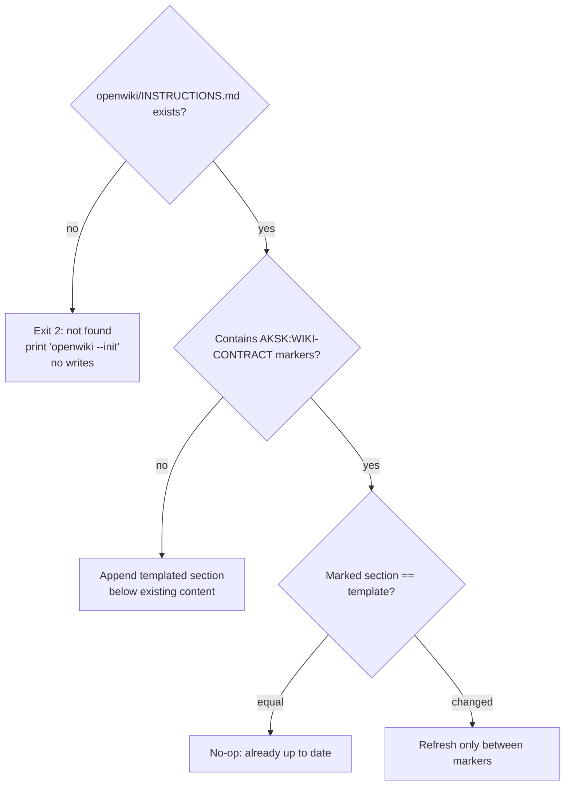
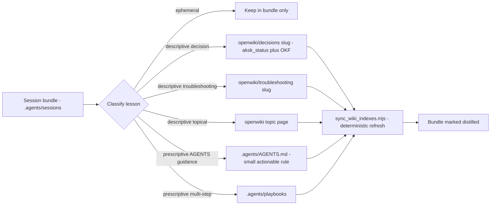

# Knowledge Curation Contract

The knowledge curation contract is the boundary agreement between AKSK and OpenWiki. It declares which wiki trees AKSK authors directly, how those pages survive scheduled reconciliation, what lifecycle metadata they carry, and which alternative write path keeps agent-behavior rules out of the wiki. The contract is enforced at three moments: attachment time, distill time, and lint time.

## Curated trees

The contract names four curated locations inside `openwiki/`. All pages under them are authored by the distilling agent or a maintainer in OpenWiki OKF format (frontmatter `type`, `title`, `description`, `tags`, `timestamp`), never by the `openwiki --update` generator:

| Tree | Content | Lifecycle field |
| --- | --- | --- |
| `decisions/` | Durable decision records with rationale and consequences | `aksk_status` required |
| `troubleshooting/` | Recurring failure patterns and fixes | no lifecycle field |
| `overview.md` | Curated entry point that indexes both trees | none |
| `maintenance-format.md` | Schema and graph-edge reference | none |

Decision and troubleshooting entries each occupy one file whose **filename stem is the entry identity** — lowercase `[a-z0-9_-]`, unique **within its tree**. Filenames carry no type prefix; disambiguation lives in qualified references (`decisions/<slug>` or `troubleshooting/<slug>`) and in relative Markdown links. Generated artifacts that coexist in the same directory tree — `index.md` catalogs, `.last-update.json`, `.run.json` — are OpenWiki-owned and never hand-edited.

This set is the direct realization of the `distill-routing` requirement that durable decision and troubleshooting records live as OKF pages under the curated trees with lifecycle in `aksk_status` and identity in the filename stem, and of the `wiki-contract` requirement that the attachment appends exactly this curated-trees section.

## The INSTRUCTIONS.md contract attachment

The contract itself lives inside `openwiki/INSTRUCTIONS.md`, bounded by marker pair:

```
<!-- AKSK:WIKI-CONTRACT:BEGIN -->
... curated page trees, curation rules ...
<!-- AKSK:WIKI-CONTRACT:END -->
```

### Attach mechanism

`node .agents/skills/aksk-bootstrap/scripts/attach_wiki_contract.mjs [repo-root]` owns this section:

* Reads the desired section verbatim from `references/wiki-contract-template.md` — markers are part of the template, not hard-coded separately.
* If `openwiki/INSTRUCTIONS.md` does not exist, exits `2` with the verbatim prerequisite `` openwiki --init `` and performs **no writes**. This enforces that AKSK never creates a wiki; it only attaches to an already-initialized one.
* If the file exists but lacks the marker pair, appends the templated section below existing content (all OpenWiki-owned content above is preserved). When the existing file is the default OpenWiki stub (`A code wiki for this repository.`), the message is stub-aware.
* If the marker pair already exists, the operation is **idempotent and self-updating**: when the marked section already equals the template (after trimming), it reports a no-op; when the template changed (kit upgrade), only the content between markers is refreshed in place — nothing outside the markers is touched.
* Re-running the attachment is therefore safe and reports `already up to date` on the second run.



*Caption: attachment control flow — fail fast when uninitialized, otherwise append or refresh the marked block.*

Do not edit between the markers by hand. On kit upgrade, rerun the attachment script; hand edits will be overwritten by the next refresh and are flagged by lint. OpenWiki-owned content outside the markers takes precedence on conflict.

## Preserve-and-link semantics

The second half of the contract declares the update invariant:

1. **Preserve-and-link** — when a scheduled `openwiki --update` run would regenerate a page under a curated tree, the AKSK-authored page is **kept** and generated material **links to it** instead of replacing it.
2. **Frontmatter extensions survive round-trips** — every `aksk_*` field on curated pages is meaningful and must be preserved by the update reconciler.
3. **Distill-authored pages bypass the CLI** — descriptive lessons distilled from session bundles are written by the host agent with deterministic index refresh; `openwiki --update` remains the scheduled reconciliation path but is never the distill write path.

In practice this means a wiki update run is read-mostly with respect to curated trees: it may rebuild global catalogs and non-curated content, but it treats AKSK-authored pages as the source of truth for their own bodies. The safety consequence is that a missing contract must not be treated as "nothing curated" — distillation fails closed before any wiki write when the contract markers are absent, because otherwise the next update could silently regenerate away curated pages.

## Frontmatter extensions and identity

Curated pages extend OKF's base frontmatter with a small AKSK namespace. JSON Schemas at `.agents/skills/learning-distill/references/decision-frontmatter.schema.json` and `troubleshooting-frontmatter.schema.json` codify the contract; the same contract is validated at runtime via the installed OpenWiki package's `dist/okf/frontmatter.js` (`validateOkfFrontmatter`).

| Field | Applies to | Contract |
| --- | --- | --- |
| `type`, `title`, `description`, `tags`, `timestamp` | all pages | OKF base; `tags` is a non-empty list of lowercase `[a-z0-9_-]` slugs |
| `aksk_status` | `decisions/` pages (**required**) | `accepted`, `superseded`, or `provisional` |
| `aksk_superseded_by` | superseded pages | successor slug `[a-z0-9_-]`; pair with a relative link to the successor (the frontmatter lock is authoritative; listings add bold `[SUPERSEDED]` and strikethrough as secondary locks) |
| `aksk_depends_on` | any page | YAML list of qualified references `decisions/<slug>` or `troubleshooting/<slug>`, where the slug equals the target's filename stem |

Additional `aksk_*` properties are allowed (`additionalProperties: true`) so forward-compatible extensions round-trip without schema break. The filename stem remains the join key for `aksk_depends_on` and `aksk_superseded_by` — changing a filename is a breaking rename that must update all inbound qualified references.

Body shape is conventional rather than schema-enforced: decision entries use `### Decision`, `### Status` (mirrors `aksk_status`), `### Context`, `### Rationale`, `### Consequences`; troubleshooting entries use `#### Symptom`, `#### Likely causes`, `#### Fix`, `#### Validation`. Cross-references in body prose use relative Markdown links (`other-id.md` for siblings, `../overview.md` for root pages).

## Descriptive versus prescriptive split (distill-routing)

`learning-distill` is the enforcement point of the curation contract. Its routing is specified by the `distill-routing` capability: **descriptive lessons about the repository become curated wiki pages; prescriptive lessons about agent behavior stay inside `.agents/`**.



*Caption: distill-routing — descriptive lessons become curated OKF pages, prescriptive lessons stay in .agents, indexes refresh deterministically.*

### Classification bar

| Category | Destination | Bar to clear |
| --- | --- | --- |
| `ephemeral` | stays in bundle | one-off detail not worth promoting |
| `AGENTS guidance` | `.agents/AGENTS.md` | high confidence, broadly useful, likely to recur, concise, actionable |
| `playbook` | `.agents/playbooks/<name>.md` | durable multi-step procedure |
| `decision record` | `openwiki/decisions/<slug>.md` | rationale that needs explaining later |
| `troubleshooting record` | `openwiki/troubleshooting/<slug>.md` | recurring failure plus fix |
| `descriptive lesson` | topical `openwiki/<topic>.md` | stable fact or pattern worth keeping |

Two hard boundaries cut across the table:

* **No duplication with OpenSpec.** If a candidate decision restates a SHALL requirement already codified in `openspec/specs/`, distillation must not create or extend a wiki page for it — cite the spec instead. Requirements live only in OpenSpec; wiki pages record facts and rationale. This division of labor is itself a curated decision (`openspec-openwiki-aksk-division-of-labor`).
* **Never cross the zone boundary.** Descriptive lessons never land in `.agents/`; prescriptive rules never land in `openwiki/`. Violations are surfaced by `docs-lint` as mis-placed content.

## Entrypoints, control flow, and deterministic index sync

Distillation never invokes `openwiki --update`. Its write path is:

1. **Fail closed before any write.** Verify `openwiki` and `openspec` binaries on PATH via `check_peer_tools.mjs` and that `openwiki/INSTRUCTIONS.md` carries the `AKSK:WIKI-CONTRACT` markers. If the binary is absent, the check prints one error per missing tool plus the exact install commands (`npm i -g @fission-ai/openspec@latest`, `npm i -g openwiki@latest`) and exits `2`; if the contract is absent, it points to `attach_wiki_contract.mjs`. No wiki page is written on failure.
2. **Author the page directly.** Load authoring guidance at runtime from the globally installed package (`openwiki/dist/agent/prompt.js`, `createSystemPrompt("init" | "update")`) and validate with `openwiki/dist/okf/frontmatter.js` (`validateOkfFrontmatter`). Fix every reported frontmatter issue before continuing.
3. **Refresh indexes deterministically.** Run `node .agents/skills/aksk-bootstrap/scripts/sync_wiki_indexes.mjs`. The script locates the global package via `npm root -g`, dynamically imports `agent/docs-only-backend.js` and `okf/index-sync.js`, constructs `OpenWikiLocalShellBackend` with `docsOnly: true` and `virtualMode: true`, and calls `synchronizeWikiIndexes(backend, "repository")`. This keeps curated page bodies byte-identical while rebuilding `openwiki/index.md` and directory indexes. The script exits `2` with remediation hints when the wiki is uninitialized or the package is missing.
4. **Mark distilled.** Set `distilled: true` and `distillation_status` on the bundle's `summary.json`; accountability lives in bundle flags plus git history — there is no separate log file.

Bundle discovery itself has an invariant: per-task folders under `.agents/sessions/` are gitignored (only `README.md` is tracked), so ignore-aware searches may report no bundles when they exist. Distillation must use filesystem listing (`ls`, `find`) or `rg --no-ignore-vcs` and read `task_id` from `summary.json` as the canonical identifier.

## Lifecycle, invariants, and failure semantics

* **Curated pages are durable.** Once accepted, a decision's `aksk_status` rides in frontmatter; supersession adds `aksk_superseded_by` pointing at the successor slug with a link — the frontmatter value is the authoritative lock, the additional markdown locks in listings are derived.
* **Marker ownership is strict.** Content between any `AKSK:*` markers (including `AKSK:WIKI-CONTRACT` and the `AKSK:ROUTING` / `AKSK:LIFECYCLE` blocks in root router files) is owned by its writer; hand edits are corrected by rerunning the owning script. `OPENWIKI:START/END` blocks are OpenWiki-owned and never hand-edited.
* **Missing prerequisites fail with remediation, not silent fallback.** A missing `openwiki --init` or missing peer binary is a blocking error with the exact command to run. Verification never attempts installation — that is out of scope until the `aksk-bootstrap-system` change lands.
* **Staleness is reported, not hidden.** `docs-lint` wiring checks that fail the pass include: `AKSK:WIKI-CONTRACT` presence, `aksk_status: accepted` on a page whose `aksk_superseded_by` is already set, dead `aksk_depends_on` targets, and retired-skill references in curated pages. Content checks (duplication, contradiction, oversized AGENTS sections, broken relative links, frontmatter contract violations) suggest reclassification or compression.
* **Single writer per zone.** Closeout writes only under `.agents/sessions/`; distillation alone writes curated wiki trees, `.agents/AGENTS.md`, and playbooks; lint never writes OpenWiki-owned files — index drift is fixed by rerunning `sync_wiki_indexes.mjs`.

## Operations and extension

* **Verify the wiki contract:** `node .agents/skills/aksk-bootstrap/scripts/attach_wiki_contract.mjs` — safe to run repeatedly; re-run after kit upgrades that change the template.
* **Verify peer tools:** `node .agents/skills/aksk-bootstrap/scripts/check_peer_tools.mjs openspec openwiki` — every skill that invokes `openspec` or `openwiki` should call this (or import `requireBinaries`) before use.
* **Refresh indexes after curated edits:** `node .agents/skills/aksk-bootstrap/scripts/sync_wiki_indexes.mjs` — the only supported way to rebuild indexes outside `openwiki --update`.
* **Validate frontmatter:** `validateOkfFrontmatter` against `decision-frontmatter.schema.json` / `troubleshooting-frontmatter.schema.json`; `bash scripts/check-agents-structure.sh` for structural invariants.
* **Adding curated knowledge:** prescriptive, behavior-changing rules go to `.agents/AGENTS.md` or `playbooks/`; descriptive rationale and failure patterns go to the curated wiki trees via `learning-distill`. Hand-authored curated pages must still pass the OKF validator and carry the correct `aksk_*` fields.
* **Adding skills:** portable skills need `SKILL.md` frontmatter with `name` and `description` plus a `CONTRACT.md`; maintainer-only automation must set `metadata.internal: true` so `npx skills add` skips it.

## Related pages

* [AKSK Architecture Overview](../architecture/overview.md) — peer-dependency design, four-zone stack, four Node scripts and two bash validators, and the closeout-distill-lint loop that this contract gates.
* [The Knowledge Layer](../architecture/knowledge-layer.md) — tree shape, frontmatter table, and supersession convention that implement the contract's data rules.
* [Task Lifecycle and Session Bundles](../architecture/task-lifecycle.md) — bundle shape, `task_id` identity, `openspec_change` link, and the state machine that ends in deterministic index sync.
* [learning-distill Skill](../skills/learning-distill.md) — the routing procedure that consumes the contract at distill time.
* [aksk-bootstrap Skill](../skills/aksk-bootstrap.md) — peer-tool verification and contract-attachment entrypoints.
* [docs-lint Skill](../skills/docs-lint.md) — wiring versus content checks that keep the contract coherent.
