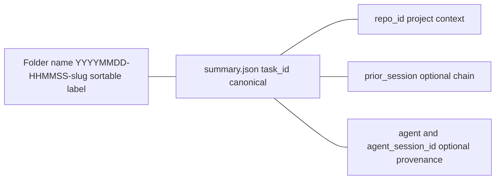
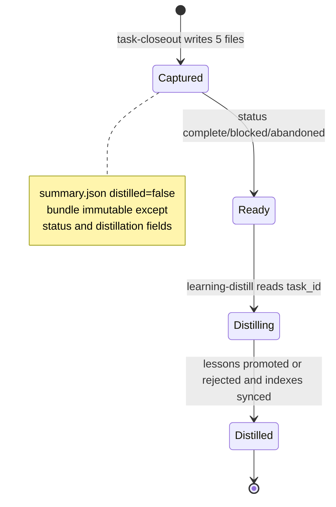

# Session Identity and Storage

Session bundles are **temporary working memory**. They capture raw evidence for one task at a stopping point and stay local under `.agents/sessions/` until a separate `learning-distill` pass promotes only stable, reusable lessons to durable homes under `.agents/` (prescriptive rules) or `openwiki/` (descriptive knowledge). Bundles never become durable themselves, never land in commits, and are excluded from OpenWiki evidence by `.openwikiignore`.

## Canonical identity vs storage label

A session has two identifiers with different roles:

| Signal | Location | Role |
| --- | --- | --- |
| `task_id` | `.agents/sessions/<folder>/summary.json` field `task_id` | **Canonical** task/session identifier. Required string. All consumers, distillers, and cross-tool joins must read it from here. |
| Folder name | `.agents/sessions/YYYYMMDD-HHMMSS-short-topic/` | **Sortable storage label** only. Human-readable, deterministic, but never authoritative. |
| `repo_id` | `summary.json` field `repo_id` | Stable repository/project context. Optional but recommended. |

When passing work between agents, provide **both** the bundle path and the `task_id` value:

```text
Bundle path: .agents/sessions/20260411-122921-auth-timeout-fix/
Task ID: t-20260411-122921-auth-timeout-fix   ← from summary.json task_id
Repo ID: agent-knowledge-starter
```

Optional provenance fields `agent` and `agent_session_id` are independent — record either when the active tool supplies it, omit only the unavailable one, and mirror them as `Agent` / `Agent Session ID` sections in `active-task.md`. Never invent IDs or require manual lookup outside the tool's session history.

The folder slug is lowercase, short, and tied to the task goal. If two bundles start in the same second, extend the slug rather than changing the timestamp format. One bundle per folder; reuse a folder only for the bundle it was created for.



*Caption: canonical identity lives in `summary.json`; the folder name is only a label.*

## Storage location and bundle shape

**Repo-local is the default.** All temporary outputs go under:

```text
.agents/sessions/YYYYMMDD-HHMMSS-short-topic/
```

Each folder holds exactly one five-file closeout packet. `task-closeout` is the sole writer of this tree today and never touches `openwiki/**`, `.agents/AGENTS.md`, `.agents/playbooks/**`, `.agents/skills/**`, or `openspec/` for in-flight changes. A **Proposal-only** `task-start` change would split ownership (creation vs finalization) — see below.

| File | Role |
| --- | --- |
| `summary.json` | Status, timestamps, `repo_id`, **required `task_id`**, optional `agent`/`agent_session_id`, optional `openspec_change`, git metadata (`branch`, `head_commit`, `workspace_root`), distillation flags (`distilled`, `distillation_status`), optional `prior_session` |
| `active-task.md` | Observable facts only; sections: Task ID, Agent (optional), Agent Session ID (optional), Goal, Outcome, Files Changed, Commands Run, Validation, Remaining Work, Notes. Scoped to the whole conversation, not just the final diff. |
| `learning-candidate.md` | Candidate lessons only: Task, What failed, What worked, Reusable pattern, Candidate AGENTS update, Candidate troubleshooting note, Candidate repo decision, Candidate playbook, Spec updates deferred to archive time, Confidence |
| `changed-files.txt` | Paths touched during the session |
| `validation.txt` | Checks run and outcomes |

A filled reference lives at `.agents/skills/task-closeout/example/task-bundle/`:

```json
{
  "repo_id": "example-repo",
  "task_id": "t-20260407-143210-monaco",
  "agent": "example-agent",
  "agent_session_id": "example-session-id",
  "status": "completed",
  "distilled": false,
  "created_at": "2026-04-07T14:32:10Z",
  "completed_at": "2026-04-07T15:11:54Z",
  "branch": "fix/monaco-json-worker",
  "head_commit": "abc1234",
  "workspace_root": "/path/to/repo",
  "openspec_change": "add-task-start"
}
```

`openspec_change` records the associated `openspec/changes/<name>/` when applicable; closeout never edits `openspec/` itself — spec updates are deferred to `/opsx:archive` time per `closeout-change-linking`.

### Why repo-local and temporary

- Evidence stays **near the code and durable docs** it describes, easy to inspect, reuse, and distill across editor sessions.
- Bundles are **working memory**, not curated knowledge. `.agents/AGENTS.md` must stay small; rationale belongs in `openwiki/decisions/`, troubleshooting in `openwiki/troubleshooting/`, procedures in `.agents/playbooks/`. Only promoted lessons survive.
- After closeout the bundle is **immutable except `status` / distillation-related fields** in `summary.json` that a later tool updates (`distilled`, `distillation_status`). All other files remain frozen.
- In cloud, ephemeral, or multi-machine environments, adapt the backup or storage location so bundles survive long enough to distill, but keep the same bundle shape and keep per-task artifacts out of commits.



*Caption: temporary bundle lifecycle; distillation marks `distilled` and routes durable lessons out of the bundle.*

## Gitignore contract and OpenWiki ignore

Two layers keep bundles local and out of evidence.

**Git layer — `.agents/.gitignore`** (paths relative to `.agents/`) carries:

```gitignore
sessions/*
!sessions/README.md
```

Effect:

- Every per-task subfolder under `.agents/sessions/` is ignored.
- Only `.agents/sessions/README.md` is tracked — it explains that bundles are gitignored working memory and names the canonical `task_id`.
- Skill initialization (`task-closeout` and `learning-distill` idempotent setup) ensures the directory, the README, and these two ignore lines exist, merging without removing unrelated rules. If `.agents/.gitignore` is not tracked and the repo relies on root `.gitignore`, equivalent patterns must exist there as `.agents/sessions/*` and `!.agents/sessions/README.md`.

Violating the contract shows up as `Unexpected files under .agents/sessions in git status` or a missing tracked README (`git ls-files` check in `check-agents-structure.sh`).

**OpenWiki layer — `.openwikiignore`** (defense in depth beyond git) carries:

```gitignore
# Temporary session evidence — not source truth (keep README)
.agents/sessions/
!.agents/sessions/README.md

# Anchored to repo root; nested example/ folders are not ignored
/example/
```

Effect:

- `.agents/sessions/` bundles are excluded from `openwiki --update` fingerprinting and from Claim evidence resolution. Citing a path under `.agents/sessions/` (except `README.md`) as `repo://.agents/sessions/.../summary.json` fails with `Evidence path is excluded by .openwikiignore`.
- The `!` re-include keeps `.agents/sessions/README.md` citable — it is the only tracked file there. Last-match-wins negation mirrors the git pairing.
- `/example/` is slash-anchored so only the root demo tree is ignored; nested `foo/example/bar.md` remains visible.
- When a path is added to `.openwikiignore`, existing `openwiki/.claims/**/*.json` and page frontmatter `repo://` sources under that prefix are retargeted to the generator or canonical file.

Do not cite files under `.agents/sessions/` (except `README.md`) as source truth; treat them as ephemeral working memory referenced only by prose, with `task_id` joins done at runtime via filesystem.

## Optional `prior_session` chaining

Decision `optional-prior-session-in-session-summary-json` allows an optional string field:

```json
{
  "task_id": "t-20260419-230724-v2-kit-closeout",
  "prior_session": ".agents/sessions/20260419-190500-knowledge-layer-layout/"
}
```

`prior_session` is a path pointer to an earlier bundle directory. It records linkage and ordering for multi-step maintainer work (e.g., adoption plus orchestrator meta-closeout) **without reopening or merging** earlier packets, which stay append-only after closeout.

Consequences:

- Distillation across linked bundles relies on `task_id`, timestamps, and `prior_session` together.
- Agents reconstructing history may follow `prior_session` when present; if multiple bundles overlap, merge lessons mentally (or in durable docs) rather than editing closed session trees.
- See `overlapping-session-bundles-for-one-initiative` for overlap symptoms and the preference to add a new bundle referencing the prior path over mutating a closed packet.

## Finding bundles under gitignore

Because bundles are ignored by both git and OpenWiki, ignore-aware searches may report no bundles when they exist:

- Use at least one **ignore-blind** method: filesystem listing (`ls`, `find`, shell APIs) or ripgrep with `--no-ignore-vcs` (or `--no-ignore` scoped to the sessions subtree).
- Then open each candidate's `summary.json`, treat `task_id` as canonical, and filter/prioritize by state fields (`distilled`, `status`, `distillation_status`). Never select a bundle from its folder name.
- `learning-distill` discovery follows this invariant; curated troubleshooting `session-discovery-fails-during-distillation-or-closeout` documents the failure mode.

## Invariants and failure semantics

| Invariant | Consequence if violated |
| --- | --- |
| `task_id` in `summary.json` is canonical; folder name is label only | Cross-tool joins break, distillation picks wrong bundle |
| Write scope: closeout writes only under `.agents/sessions/<folder>/` | Durable knowledge or `openspec/` corrupted mid-task |
| Immutability after closeout except `summary.json` distillation flags | Audit trail lost; promotion becomes untraceable |
| Gitignore pairing `sessions/*` + `!sessions/README.md` and openwikiignore `.agents/sessions/` + `!.agents/sessions/README.md` | Bundles leak into commits or become citable evidence, or README becomes untracked |
| Bundles are temporary; only distilled lessons become durable | Repo accumulates stale evidence; `.agents/AGENTS.md` bloat |
| Never cite `.agents/sessions/<bundle>/*` as Claim evidence | `openwiki --update` aborts with excluded evidence path |

All bootstrap and peer-tool scripts are offline-safe and fail closed with remediation rather than silent fallback — missing `openwiki --init` or missing global `openwiki`/`openspec` binaries block distillation before any wiki write.

## Proposal-only task-start sequencing

`add-task-start` is a **Proposal-only** change under `openspec/changes/add-task-start/` (proposal + `specs/task-start/spec.md` + design). It has **not** been archived to `openspec/specs/task-start/` and must be labeled as proposal until archive completes. Today the enforced lifecycle remains `work → task-closeout → learning-distill`.

If adopted, the intended ownership is exclusive and `summary.json` remains the single source of truth:

- `task-start` **owns creation**: creates `.agents/sessions/YYYYMMDD-HHMMSS-short-topic/`, ensures `.agents/sessions/README.md` and `.agents/.gitignore` entries exist, and **seeds `summary.json`** with `task_id` (canonical), `created_at`, `status: in_progress`, and optional `openspec_change`/`repo_id`/`agent`/`agent_session_id`. It does not yet contain `completed_at` or final validation/changed-files content.
- `task-closeout` **owns finalization**: detects the seeded `summary.json`, **preserves `task_id` (and `openspec_change` if seeded)**, appends `completed_at`, final `status` (`completed`/`blocked`/`abandoned`), git metadata and distillation flags, then writes the remaining four bundle files. When invoked without a prior `task-start`, it retains its current generation fallback.
- **No other writer mutates the bundle** and **no durable writes happen at start or closeout**: only `task-start` (creation) → `task-closeout` (finalization) → `learning-distill` (consume + mark `distilled`/`distillation_status`) touch `summary.json`; proposed durable changes stay as prose inside the bundle. Strict sequencing is `start → work → closeout → distill`.

## Configuration and operations

| Probe | Command | What it proves |
| --- | --- | --- |
| Sessions dir present | `ls -la .agents/sessions/` | README tracked, bundles exist locally but untracked |
| Gitignore correct | `cat .agents/.gitignore` | Contains `sessions/*` and `!sessions/README.md` |
| OpenWiki ignore correct | `cat .openwikiignore` | Contains `.agents/sessions/` + `!.agents/sessions/README.md` and anchored `/example/` |
| Tracked file check | `git ls-files .agents/sessions/README.md` | Exactly one file tracked there |
| Portable shape | `bash scripts/check-agents-structure.sh .agents` | Required bundle scaffold, JSON validity, frontmatter markers |
| Bundle discovery | `rg --no-ignore-vcs summary.json .agents/sessions/` or `find .agents/sessions -name summary.json` | Ignore-blind enumeration works |

Skill initialization is idempotent — safe to repeat when copying only `task-closeout` or after a package install drops it under `.agents/skills/task-closeout/`.

## Extension points

- **New bundle metadata**: add optional fields to `summary.json` alongside `prior_session` without changing the `task_id` contract; preserve `openspec_change` and distillation flags through any `task-start` sequencing (proposal `add-task-start`: creation → finalization → consume).
- **Cloud persistence**: mirror `.agents/sessions/` to durable storage for ephemeral runners; restore same path shape before distillation so `task_id`-based joins still work.
- **Adding a curated tree** or marker family affects distillation destinations, not bundle storage — no bundle-layout change required.

## Related

- Procedures: [task-closeout](../skills/task-closeout.md), [learning-distill](../skills/learning-distill.md)
- Lifecycle: [Task Lifecycle and Session Bundles](../architecture/task-lifecycle.md), [Task Lifecycle and Distillation](../workflows/task-lifecycle-and-distill.md)
- Decisions: [Optional prior_session in session summary.json](../decisions/optional-prior-session-in-session-summary-json.md), [Sessions directory: tracked README with ignored bundles](../decisions/sessions-directory-tracked-readme-with-ignored-bundles.md), [Root-anchored .openwikiignore for generated trees](../decisions/root-anchored-openwikiignore-for-generated-trees.md)
- Troubleshooting: [Overlapping session bundles for one initiative](../troubleshooting/overlapping-session-bundles-for-one-initiative.md), [Session discovery fails during distillation or closeout](../troubleshooting/session-discovery-fails-during-distillation-or-closeout.md)
