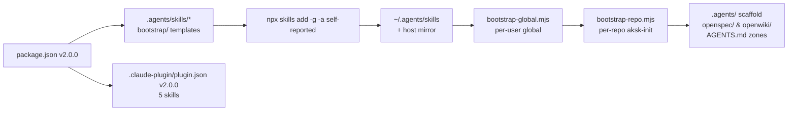
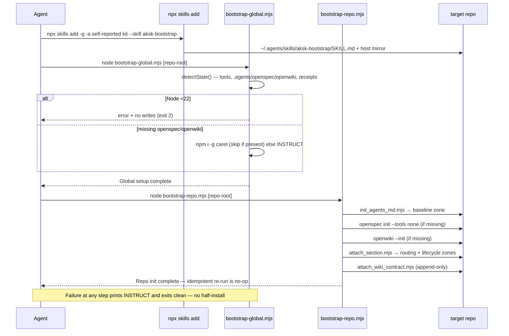

# Packaging and Install Lanes

The kit ships content (markdown layout and conventions) rather than a runtime library. After `reorder-install-lanes-drop-example` the only supported adoption paths are two `aksk-bootstrap`/`aksk-init`-owned lanes that both end in the same per-repo scaffold. `example/.agents` and the maintainer-only `generate-example` skill are removed, `git clone --depth 1 && cp -r` fallback is removed, and skill initialization copies **from** `bootstrap/` without deleting or renaming it.

> Proposal-only: `openspec/changes/canonical-universal-install/**` (canonical `~/.agents/skills` scope, `npx` required, caret-version skill installs, verification scope, and `agent-integration-spread` ladder) is a proposal. This page labels those deltas as proposed and does not present them as shipped. Shipped lanes are defined by `openspec/specs/install-lanes/spec.md` and `openspec/specs/aksk-bootstrap/spec.md`.

## What the package is

Root `package.json` declares `agent-knowledge-starter` v2.0.0 — "A shareable, tool-agnostic starter kit for maintaining a compiled repo knowledge layer for coding agents."

- `devDependencies`: `skills` (Skills CLI), `remark-cli` + `remark-frontmatter`/`remark-gfm`, `markdown-link-check`, plus pinned peer-tool dev deps `@fission-ai/openspec@^1.11.0` and `openwiki@^0.4.3` — version source for the global lane via `references/versions.json`.
- `scripts`: `test` (intentionally errors — no test suite), `format` (`remark` over `.agents/**/*.md`), `check` (`bash scripts/check-publish.sh` which delegates to `scripts/check-agents-structure.sh`).
- `dependencies`: empty — peer tools are never declared as runtime deps or installed via `node_modules`; they are per-user globals verified before use.

Distributable surface is `.agents/` — five portable skills (`aksk-bootstrap`, `aksk-init`, `task-closeout`, `learning-distill`, `docs-lint`) plus shared `bootstrap/` templates, `assets/`, playbooks, and scripts. Curated wiki trees under `openwiki/` are this repository's own knowledge base (initialized with `openwiki --init`), not a distributable template. Maintainer-only material (session history) must never be copied into published artifacts.



## Peer-dependency prerequisites (fail-fast, never install silently)

The kit is glue over two peer tools it never installs implicitly except through the deterministic global lane of `aksk-bootstrap`:

- **Node >= 22** (`MIN_NODE_MAJOR = 22`)
- `npm i -g @fission-ai/openspec@^1.11.0 openwiki@^0.4.3` — caret ranges read from `references/versions.json` via `versionsFromPackageJson()` (repo `package.json` override checked first, then bundled fallback at `.agents/skills/aksk-bootstrap/references/versions.json`), `@latest` only when unpinned; per-user global (`npm i -g`), not repo-local `npx` or `node_modules`.

`aksk-bootstrap` owns verification (`check_peer_tools.mjs`): `requireBinaries(["openspec","openwiki"])` checks PATH resolution only, prints one error per missing tool plus the exact `npm i -g` commands, and exits 2. Unknown tool names also exit 2 naming the unknown tool. Other skills import rather than reimplement. `bootstrap-global.mjs` re-verifies before any host spread and `bootstrap-repo.mjs` fails fast with `Missing tools — run aksk-bootstrap first` if `openspec`/`openwiki` are not on PATH.

## Registration surfaces

| Surface | File / command | Content |
| --- | --- | --- |
| Skills CLI (canonical) | `npx skills add -g -a <self-reported> Hypercubed/Agent-Knowledge-Starter-Kit` | installs to `~/.agents/skills/<name>/SKILL.md` plus current host's dir (`~/.<host>/skills`); `--full-depth` when source is `langchain-ai/openwiki` |
| Skills CLI override A (repo-local) | `npx skills add Hypercubed/Agent-Knowledge-Starter-Kit` (without `-g`) | writes `./.agents/skills/` — documented override, not default |
| Claude Code plugin | `.claude-plugin/plugin.json` v2.0.0 | registers exactly five paths: `aksk-bootstrap`, `aksk-init`, `task-closeout`, `learning-distill`, `docs-lint`; remote without ref fetches `main`, use `@develop` until merged |
| Local receipts (gitignored) | `.openwiki-install.json` and `openwiki integrations list` | ownership partition for `openwiki integrations install`; `list` without `--project` is user scope, `--project` is repo override |

The Skills CLI flag `--all` fans out to every known agent directory; use it only when the user explicitly asked at install time.

## Canonical user store (Proposal — canonical-universal-install)

> This section describes `openspec/changes/canonical-universal-install/specs/canonical-user-skills-scope/spec.md` as proposed. Shipped documentation still presents the two lanes via `aksk-bootstrap` without mandating the universal-plus-self-reported pair as the only default.

Proposed canonical store: `~/.agents/skills` (universal, Codex default) plus the self-reported host mirror via `npx skills add -g -a <self-reported> <source>`; extra hosts or `--all` only on explicit user request at install time; verification would treat `~/.agents/skills/<name>/SKILL.md` as canonical.

Proposed invariants:

```
npx skills add -g -a <self-reported> <source>
```

- `universal` = `~/.agents/skills` (Codex reads it natively).
- `<self-reported>` = calling agent's own host id. Self-report wins over env sniffing.
- Applies to both the kit and `langchain-ai/openwiki` (`--full-depth` yields three skills: `openwiki`, `mermaid-diagrams`, `write-connector`; lifecycle skill + MCP must both be made available).
- Extra hosts (`-a <other>` or `--all`) only when the user explicitly asked at install time; no persistent consent artifact.
- `npx` is required — the `git clone --depth 1 && cp -r .agents/skills` lane was removed. When `npx` is missing, bootstrap reports it as prerequisite and prints the INSTRUCT commands without fallback copy.

Proposed versioning: skill installs would also read `references/versions.json` via `versionsFromPackageJson()` (same path the global `npm i -g` lane uses), keeping `~/.agents/skills` and `./.agents/skills` in sync without hardcoding `@latest`. `verify-install` would assert `~/.agents/skills/<name>/SKILL.md` plus the self-reported host mirror as canonical; repo-local `./.agents/skills` would be treated as an override case.

## Two supported lanes (shipped)

### Lane 1 — Agent-assisted via aksk-bootstrap + aksk-init (preferred)

Give your agent this prompt (or local checkout variant):

```text
Install the Agent Knowledge Starter Kit into this repo:

1. npx skills add -g -a <self-reported> Hypercubed/Agent-Knowledge-Starter-Kit --skill aksk-bootstrap
   (or npx skills add -g -a <self-reported> <path-to-kit> --skill aksk-bootstrap)
2. Run the aksk-bootstrap skill (global lane).
3. Then run the aksk-init skill (per-repo lane).
```

`aksk-bootstrap` is now strictly per-user global; per-repo scaffolding lives in `aksk-init`. The shim `.agents/skills/aksk-bootstrap/scripts/bootstrap.mjs` preserves the old entrypoint by running `bootstrap-global.mjs` then `bootstrap-repo.mjs` if `aksk-init` is present:

```bash
node .agents/skills/aksk-bootstrap/scripts/bootstrap.mjs [repo-root] [--force] [--json]
# shim → node bootstrap-global.mjs [repo-root] [--force] [--json]
#      → node .agents/skills/aksk-init/scripts/bootstrap-repo.mjs [repo-root]
```

**EXECUTE lane — run locally**

1. **Verify CLIs (global, `bootstrap-global.mjs`)** — Node >=22, `openspec`/`openwiki` on PATH. If missing and `npm` is on PATH, `npm i -g` with caret from `references/versions.json` (single combined install when both missing, else per-tool); skip when present. If `npm` missing, print INSTRUCT and exit clean. Never half-installs; failed step leaves no partial state from that step.
2. **Verify skills (global)** — ensure `~/.agents/skills/<name>/SKILL.md` plus host dir; if missing `npx skills add -g -a <self-reported> <source>` for the kit and for `langchain-ai/openwiki` when needed (`@latest` only when unpinned). Host integrations via `openwiki integrations install <host>` are manual opt-in, not part of the global lane auto-spread.
3. **Per-repo lane (`aksk-init/scripts/bootstrap-repo.mjs`)** — fails fast if global tools missing; then scaffold `.agents/` + seed `AGENTS.md` baseline first, `openspec init --tools none` when `openspec/` missing, `openwiki --init` (harness path needs no extra key, CLI path needs `OPENAI_API_KEY`), then `attach_section.mjs` for `routing-note-template.md` + `lifecycle-template.md`, then `attach_wiki_contract.mjs`.

**INSTRUCT lane — no local execution bridge (no `npm`, no write, sandboxed worker):**

The script prints the exact remaining commands and exits clean; the skill surfaces them verbatim:

```
INSTRUCT lane — run these commands manually (versions from references/versions.json, caret-pinned):
  npm i -g @fission-ai/openspec@^1.11.0 openwiki@^0.4.3
  openwiki integrations install codex
```

Completed steps remain; only the failed step's partial state is withheld. `bootstrap-global.mjs` is non-interactive — the `aksk-bootstrap` skill agent prompts `[Y/n/skip]` before invoking it; `--yes`/`AKSK_YES=1` is passthrough.



Re-running on a fully bootstrapped fixture changes nothing; on a partially bootstrapped fixture it completes only missing steps (detection-driven). Host integrations are opt-in manual after global setup.

### Lane 2 — Manual fallback via npx skills add

For humans without an agent (or when the agent hit INSTRUCT):

```bash
npx skills add -g -a <self-reported> Hypercubed/Agent-Knowledge-Starter-Kit
# or: npx skills add -g -a <self-reported> <path-to-kit> --skill aksk-bootstrap
# override A (repo-local): omit -g
# extra hosts only with explicit consent: -a <other> / --all
```

Then run the `aksk-bootstrap` skill for global setup and `aksk-init` for per-repo setup (or directly `node .agents/skills/aksk-bootstrap/scripts/bootstrap-global.mjs` and `node .agents/skills/aksk-init/scripts/bootstrap-repo.mjs`). Skill **definitions** may live in user/global locations, but initialization output and ongoing artifacts (`sessions/`, durable docs, `AGENTS.md` updates) belong under the target repo's `.agents/`. Register `SKILL.md` paths in the editor/product if it ignores the repo working directory.

There is no `cp example/.agents` path — `example/` and its `generate-example` skill/playbook were removed. Bootstrap templates are the source of truth.

## Skill initialization contract (bootstrap templates as source of truth)

Every shipped skill that has a `bootstrap/` subdirectory treats it as the template source:

- **Copy-missing-only** — agents use `cp` to copy missing directories and template files from `bootstrap/` rather than generating them from scratch. Existing repo-specific content is never overwritten.
- **Preserve the directory** — do **not** delete or rename `bootstrap/` after initialization or ever. Idempotent re-runs, peer skills, and scripts expect paths under the original `bootstrap/` name. Some skills also ship runtime templates under `assets/`.
- **Idempotent and self-updating** — re-running initialization is a no-op when current; when the template changed, only the marked section is refreshed.

Suggested order when installing multiple skills: `task-closeout` init creates `.agents/sessions/` only; `learning-distill` init additionally scaffolds `playbooks/`, template `.agents/AGENTS.md` when missing, session ignore rules, and wiki prerequisites (peer-tool check plus contract attachment); `docs-lint` owns no bootstrap templates and needs no separate init. When in doubt, run `learning-distill` init once, then proceed — other inits remain safe no-ops or small merges.

## Per-repo wiring (what aksk-init guarantees)

Executed in this zoned order after the global lane (global lane installs per-user globals; repo lane mutates the repo):

```
1. Global lane (user scope): npm i -g @fission-ai/openspec@^1.11.0 openwiki@^0.4.3 via versionsFromPackageJson()
2. init_agents_md.mjs → AGENTS.md baseline zone (AKSK:AGENTS-BASELINE) — FIRST
3. openspec init --tools none / openwiki --init (when missing)
4. attach_section.mjs → AKSK:ROUTING + AKSK:LIFECYCLE below
5. attach_wiki_contract.mjs → AKSK:WIKI-CONTRACT
```

| Zone | Markers | Owner |
| --- | --- | --- |
| FerroxLabs behavioral baseline | `<!-- AKSK:AGENTS-BASELINE:BEGIN/END -->` | `init_agents_md.mjs` / `refresh_agents_baseline.mjs` (`aksk-init`) |
| OpenWiki block | `<!-- OPENWIKI:START/END -->` | OpenWiki tooling |
| AKSK routing | `<!-- AKSK:ROUTING:BEGIN/END -->` | `attach_section.mjs` (`aksk-init`, `routing-note-template.md`) |
| AKSK lifecycle | `<!-- AKSK:LIFECYCLE:BEGIN/END -->` | `attach_section.mjs` (`aksk-init`, `lifecycle-template.md`) |

### Wiki contract

```bash
node .agents/skills/aksk-init/scripts/attach_wiki_contract.mjs [repo-root]
# also vendored at .agents/skills/aksk-bootstrap/scripts/attach_wiki_contract.mjs for backwards compat
```

Appends the section from `references/wiki-contract-template.md` between `<!-- AKSK:WIKI-CONTRACT:BEGIN/END -->` to an **existing** `openwiki/INSTRUCTIONS.md`. Never creates the file, replaces content, or removes OpenWiki-owned sections. Idempotent/self-updating; fail-fast with `openwiki --init` when the file is missing (exit 2, no writes). Attaching below OpenWiki's default stub (`A code wiki for this repository.`) is reported as such; downstream skills treat a file without AKSK markers as no-contract.

### Managed-section attachment

```bash
node .agents/skills/aksk-init/scripts/attach_section.mjs [repo-root] [target-file] [template-name]
```

One mechanism for N marker-delimited sections — markers are read from the template, not hard-coded. Missing target file is created containing only the attached section (root router files have no upstream initializer, so this script is their owner of record). Existing content outside markers is never replaced or removed; re-running refreshes only the marked section when outdated. Unknown template name exits 2. The `.agents/AGENTS.md` template is owned by the scaffold, not this script; this script owns only the root `AGENTS.md` zones.

### AGENTS.md baseline

```bash
node .agents/skills/aksk-init/scripts/init_agents_md.mjs [repo-root]          # seed when missing → exit 0
node .agents/skills/aksk-init/scripts/init_agents_md.mjs [repo-root] --replace # overwrite with baseline
node .agents/skills/aksk-init/scripts/init_agents_md.mjs [repo-root] --combine # stage for LLM merge
```

- Missing `AGENTS.md` → creates it with vendored baseline wrapped in `AKSK:AGENTS-BASELINE` markers including provenance header (source `https://raw.githubusercontent.com/FerroxLabs/agents-md/main/AGENTS.md`, capture date, MIT notice, refresh pointer). No network access; comparison is trailing-whitespace/newline-at-EOF normalized.
- Existing matching block → no-op.
- Existing non-matching with no flag → exit 2, no writes, prints `Replace ... or combine ...?` plus the two flags (mirrors fail-fast-with-remediation convention).
- `--replace` → overwrites with marked baseline; follow with OpenWiki attach + `attach_section.mjs` to restore other zones.
- `--combine` → never modifies original; stages `existing.md`, `baseline.md`, `COMBINE.md` brief under `.agents/sessions/agents-md-combine/<timestamp>/` for LLM merge.

Refresh is explicit and networked:

```bash
node .agents/skills/aksk-init/scripts/refresh_agents_baseline.mjs        # fetch upstream + swap baseline zone
node .agents/skills/aksk-init/scripts/refresh_agents_baseline.mjs --check # validate upstream without writing
```

Validates fetch is non-empty and contains anchors (`Non-negotiables`, `Before writing code`, `Surgical changes`, `Goal-driven execution`), then swaps only content between `AKSK:AGENTS-BASELINE` markers in the vendored template, updating capture date. Offline/failure exits non-zero; previously vendored baseline stays byte-identical.

### Peer-tool verification (standalone)

```bash
node .agents/skills/aksk-bootstrap/scripts/check_peer_tools.mjs openspec openwiki
```

Or `import { requireBinaries } from "./check_peer_tools.mjs"`. Only `openspec`/`openwiki` are accepted.

## Integration spread (lane ladder — Proposal)

> Proposed via `openspec/changes/canonical-universal-install/specs/agent-integration-spread/spec.md`. Not shipped as default in `aksk-bootstrap` global lane; `bootstrap-global.mjs` explicitly does not auto-install host integrations. Until merged, run integrations manually.

Proposed selection per host, verified via `openwiki integrations list` (user scope) vs `list --project` (repo override):

- **Supported host** (`codex|claude|opencode` in v0.4.3 registry) → `openwiki integrations install <host>` — skill + `openwiki mcp --host <target>` installed atomically with `.openwiki-install.json` receipt. Receipt partitions ownership; already-installed is skipped, modified requires `--force` (backup created).
- **Unsupported host** → `npx skills add -g -a <self-reported> langchain-ai/openwiki --full-depth` for the lifecycle skill plus `npx --yes add-mcp -g -a <self-reported> openwiki` (neon-solutions/add-mcp) or `openwiki mcp --host <target>` for the MCP.
- Default would be universal + current; extra hosts only on explicit install-time request.
- Headless lane (no supported integration) remains `openwiki --init -p` / `openwiki --update -p`.

## Before editing / new install checklist

1. Inspect target `.agents/`, root `AGENTS.md` if present, `.gitignore` and `.agents/.gitignore` if present, and `git status --short` — preserve unrelated user changes.
2. Install via preferred lane; preserve each skill folder layout including any `bootstrap/` subtree.
3. Open each installed `SKILL.md` and run its **Skill initialization** once (copy-missing-only).
4. Keep `.agents/.gitignore` tracked (`sessions/*`, `!sessions/README.md`) or replicate at repo root; add equivalent ignore only if the repo intentionally does not track `.agents/.gitignore`.
5. Edit `.agents/AGENTS.md` with real build/test conventions; record durable rationale as curated pages under `openwiki/decisions/` then run `node .agents/skills/aksk-init/scripts/sync_wiki_indexes.mjs` so they are discoverable.
6. Attach the AKSK routing note to the root instruction file with `attach_section.mjs` so agents discover the knowledge layer.
7. Register `SKILL.md` paths in the editor/product as needed.

## Existing .agents/ merge checklist

Never replace wholesale unless confirmed disposable. Preserve repo-specific `rules/`, `playbooks/`, `skills/` first; add missing kit skills with `npx skills add -g -a <self-reported>` and run initializations; hand-merge `.agents/AGENTS.md` keeping it concise; prefer kit-default ignore patterns; update `openwiki/index.md` discovery via index sync so preserved assets stay discoverable.

## Root vs portable AGENTS relationship

When both exist: root `AGENTS.md` = agent entrypoint for that checkout (zoned: baseline → OpenWiki → AKSK); `.agents/AGENTS.md` = portable knowledge-layer file for durable repo conventions, commands, constraints, and recurring pitfalls. One source of truth per instruction; root points into `.agents/`.

## Validation before finishing

1. `bash scripts/check-agents-structure.sh .agents` — validates required files and that only `sessions/README.md` is tracked under `sessions/`.
2. `bash scripts/check-publish.sh` — structure plus remark/markdown-link checks plus leakage/doubled-path scans; no `example/`-specific bypass required.
3. Confirm existing repo-specific files were preserved and `sessions/` bundles are ignored.
4. Run `node .agents/skills/aksk-init/scripts/sync_wiki_indexes.mjs` (or bootstrap's `sync_wiki_indexes.mjs`) so preserved assets are indexed.
5. Summarize changed files plus any manual product-specific registration steps still required.

## What was removed

| Removed | Replacement |
| --- | --- |
| `example/.agents/` copy path and `cp example/.agents` instructions | Two lanes above; bootstrap templates are source of truth — no `example/` directory as install method |
| `git clone --depth 1 && cp -r .agents/skills` fallback | `npx skills add -g -a <self-reported>` required; INSTRUCT prints commands when `npx`/`npm` missing |
| Per-repo scaffolding inside `aksk-bootstrap/bootstrap.mjs` | `aksk-init/scripts/bootstrap-repo.mjs` owns per-repo steps; `bootstrap.mjs` is now a shim |
