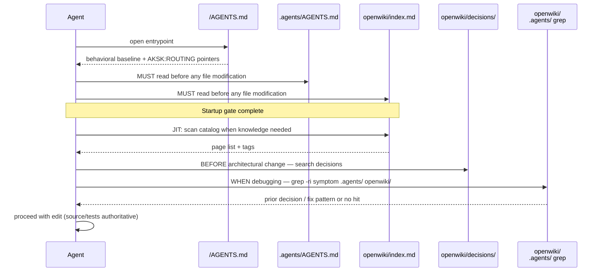

# Agent Entrypoints and Routing

Coding agents entering this repository have one primary entrypoint and two JIT knowledge indexes. Root `AGENTS.md` is the **router**; `.agents/AGENTS.md` is the **portable prescriptive layer**; `openwiki/index.md` (plus `openwiki/overview.md` for curated trees) is the **descriptive evidence index**. Every durable instruction has exactly one home — root holds bootstrap behavior, `.agents/` holds repo conventions, `openwiki/` holds facts and decisions.

## Entrypoint Map

| File | Role | Audience | Writer / Owner |
| --- | --- | --- | --- |
| `/AGENTS.md` | Checkout entrypoint — behavioral operating contract (non-negotiables, simplicity, surgical diffs, goal-driven execution) plus managed routing blocks | Every agent starting in this checkout | Hand-authored baseline (sections 0–8) + `openwiki --init/--update` for `OPENWIKI` block + `attach_section.mjs` for `AKSK:*` blocks |
| `/.agents/AGENTS.md` | Portable knowledge-layer file — routing directives, project learnings, self-improvement loop summary | Any agent or consumer install that copies `.agents/` | Maintainer / `learning-distill` (only for high-confidence actionable rules) |
| `/openwiki/index.md` | Generated catalog of all wiki pages — JIT lookup entry | Agents after startup, when they need repo knowledge | OpenWiki-owned, never hand-edited |
| `/openwiki/overview.md` | Curated entry point for decisions and troubleshooting trees | Agents and humans browsing durable knowledge | AKSK-authored, preserved across updates |
| `/CLAUDE.md` | Tool-specific bootstrap pointer | Claude Code | OpenWiki-managed block linking to `AGENTS.md` |
| `docs/integrations/*.md` | Per-tool wiring guides (Codex, Claude, Cursor, Copilot, etc.) | Humans wiring a new tool | Manual fallback; preferred path is `aksk-bootstrap` |

Relationship prose: root `AGENTS.md` points **into** `.agents/AGENTS.md` and `openwiki/index.md`; `.agents/AGENTS.md` points **outward** to `openwiki/index.md` + `openwiki/decisions/` + `.agents/playbooks/`; `openwiki/index.md` is rebuilt deterministically and indexes everything else. See [The Knowledge Layer](../architecture/knowledge-layer.md).

<!-- openwiki: mermaid parse failed and this diagram was converted to a text fence so it does not break rendering. Fix the diagram source and restore the mermaid fence. Parser error: Heuristic: an unescaped angle bracket inside a label breaks rendering; rephrase the label. -->
```text
flowchart LR
  Root["/AGENTS.md<br>router + baseline"] --> Portable[".agents/AGENTS.md<br>portable directives"]
  Root --> Index["openwiki/index.md<br>generated catalog"]
  Portable --> Decisions["openwiki/decisions/<br>troubleshooting/"]
  Portable --> Playbooks[".agents/playbooks/"]
  Index --> Decisions
  CLAUDE["/CLAUDE.md<br>thin pointer"] -.-> Root
```

*Caption: entrypoint routing — root delegates to portable and generated indexes; tool pointers delegate to root.*

## Root `AGENTS.md` — the Router

Raw on disk this file is ~155 lines (55–155 behavior, then three managed blocks):

- **§0 Non-negotiables** — override rules: no flattery/filler, disagree on false premises, never fabricate paths/hashes/APIs/results, stop when confused, touch only what you must.
- **§1–8 Working discipline** — plan before editing; simplicity first; surgical diffs; verifiable goals; tool verification (prefer running code to guessing); session hygiene (context budget, fresh sessions after two failed corrections); direct communication; when to ask vs proceed.
- **`<!-- OPENWIKI:START/END -->` block** — OpenWiki-owned routing header: `openwiki/` is an optional JIT evidence index, source/tests remain authoritative, brief unknowns are verification gaps not auto-requirements, narrow quiet validation is preferred, and the scheduled workflow refreshes the wiki so generated pages should not be hand-edited.
- **`<!-- AKSK:ROUTING:BEGIN/END -->` block** — attached by `attach_section.mjs` from `routing-note-template.md`. Thin discovery pointers: read `.agents/AGENTS.md` for durable guidance; use `openwiki/index.md` for repo knowledge and `.agents/playbooks/` for procedures; consult `openwiki/decisions/` before architectural changes; when debugging grep durable knowledge first; follow `task-closeout` at closeout; keep temporary evidence in `.agents/sessions/`.
- **`<!-- AKSK:LIFECYCLE:BEGIN/END -->` block** — attached by `attach_section.mjs` from `lifecycle-template.md`. Self-improvement loop mandate: closeout → distill → prune, with pointers to the full loop in `.agents/AGENTS.md` and curated outcomes in `openwiki/decisions/` / `openwiki/troubleshooting/`.

Doctrine from `/INSTALL.md`: root holds only bootstrap guidance; every durable instruction has exactly one home. The portable file repeats only routing directives plus distilled learnings so it works standalone in consumer installs.

### Zoning and Marker Ownership

Root `AGENTS.md` is a stacked, marker-delimited file defined in [AGENTS.md Zoning](../concepts/agents-md-zoning.md). Intended fully-bootstrapped order is **baseline → OpenWiki → AKSK**:

| Order | Zone | Markers | Owner |
| --- | --- | --- | --- |
| 1 | FerroxLabs baseline | `AKSK:AGENTS-BASELINE:BEGIN/END` | `init_agents_md.mjs` (seed) + `refresh_agents_baseline.mjs` (update) |
| 2 | OpenWiki | `OPENWIKI:START/END` | OpenWiki tooling |
| 3a | AKSK routing | `AKSK:ROUTING:BEGIN/END` | `attach_section.mjs` + `routing-note-template.md` |
| 3b | AKSK lifecycle | `AKSK:LIFECYCLE:BEGIN/END` | `attach_section.mjs` + `lifecycle-template.md` |

**Current state in this repo:** the behavioral baseline (sections 0–8) is hand-authored inline without `AKSK:AGENTS-BASELINE` markers. The OpenWiki and both AKSK blocks are present and ordered correctly. This is the pre-seed state described in [The Knowledge Layer](../architecture/knowledge-layer.md) — `init_agents_md.mjs` has not yet been run to vendor the baseline zone. Until it runs, baseline refresh leaves this file untouched.

`attach_section.mjs` is the sole writer for `AKSK:ROUTING`/`AKSK:LIFECYCLE`: idempotent, self-updating (trimmed compare, then regex swap between markers), creates the target file if missing, never touches content outside its marker pair, and reads markers from the template at runtime via `markersOf()`. See [Packaging and Install Lanes](../distribution/packaging-and-install.md) for the deterministic bootstrap composition order (global `npm i -g` → `init_agents_md.mjs` → OpenWiki block → `attach_section.mjs`).

## `.agents/AGENTS.md` — Portable Prescriptive Layer

The portable file is 22 lines and must stay small. It carries three sections:

- **Routing directives** — behavioral triggers that apply in every session:
  - *Upon startup:* read `openwiki/index.md` and `.agents/AGENTS.md` before executing any file modifications.
  - *When exploring knowledge:* start from `openwiki/index.md` and the directory indexes under `openwiki/decisions/` and `openwiki/troubleshooting/`.
  - *When debugging:* first action on a failing test/build/runtime exception is `grep -ri "<error or symptom>" openwiki/ .agents/` before debugging blind.
  - *Before architectural changes:* search `openwiki/decisions/` for recorded decisions.
- **Project learnings** — short distilled rules kept only when high-confidence, broadly useful, likely to recur, concise, and actionable:
  - Skill renaming workflow (shell-search + SKILL.md frontmatter update, note under recurring pitfalls).
  - Maintenance script feedback (initial `Starting...` message plus `--verbose` flag for npx-based scripts).
  - OpenWiki concurrency guard: check `test -f openwiki/.run.json && echo ...` before editing; editing mid-run leaves `openwiki/.last-update.json: status: "interrupted"` and forces replanning.
- **Self-improvement loop** — summary of analyze → closeout → distill → prune with bundle immutability defined in [Task Lifecycle](../architecture/knowledge-layer.md). Playbooks hold multi-step procedures; session bundles stay ephemeral under `.agents/sessions/`.

Placement discipline: rationale → `openwiki/decisions/`; recurring failures → `openwiki/troubleshooting/`; procedures → `.agents/playbooks/`; temporary artifacts → `.agents/sessions/` (tracked `README.md`, ignored bundles per `.agents/.gitignore`).

## `openwiki/index.md` and `openwiki/overview.md` — JIT Discovery

Neither file is startup-required reading verbatim — `openwiki/` is optional JIT context, not a mandatory preload. Agents read them **on demand** when the task needs repo knowledge:

- **`openwiki/index.md`** — OpenWiki-owned generated catalog (rebuilds deterministically via `sync_wiki_indexes.mjs` with `docsOnly: true, virtualMode: true`). Never hand-edit. Entry point for any knowledge search: grep the catalog, then open the relevant page.
- **`openwiki/overview.md`** — Curated entry point that indexes the two durable trees (`decisions/`, `troubleshooting/`) plus reference pages (`maintenance-format.md`). Preserved across update runs (curated tree; see `openwiki/INSTRUCTIONS.md` `AKSK:WIKI-CONTRACT`).

`openwiki/INSTRUCTIONS.md` carries the curation contract (`AKSK:WIKI-CONTRACT:BEGIN/END`): preserve-and-link semantics for curated trees, `aksk_*` frontmatter survives round-trips, and distill-authored pages bypass the CLI via direct write + deterministic index sync.

## Control Flow: Startup, JIT Lookup, and Mandated Searches



### Startup Read Order (Mandatory)

1. Read `/.agents/AGENTS.md` — portable directives and learnings.
2. Read `/openwiki/index.md` — generated catalog; use directory indexes under `openwiki/decisions/` and `openwiki/troubleshooting/` to locate relevant pages.

Both reads must happen **before executing any file modifications**. This is enforced by the routing directives in both root `AGENTS.md` and `.agents/AGENTS.md`; it ensures the agent knows the layout, available playbooks, and where to search before it writes.

### JIT OpenWiki Lookup via Grep

`openwiki/` is not preloaded into context. The pattern is:

```bash
grep -ri "<symptom or keyword>" openwiki/ .agents/
```

Start from `openwiki/index.md` for broad orientation, then narrow to the relevant tree (`decisions/`, `troubleshooting/`, `architecture/`). Indexes contain descriptions and tags that disambiguate. Source code and tests remain authoritative — wiki pages are evidence, not spec.

### Search-Before-Debug Mandate

> When debugging — failing test, build error, or runtime exception — the **first** action MUST be to search durable knowledge for it before debugging blind.

This applies to both the routing block in root `AGENTS.md` and the routing directives in `.agents/AGENTS.md`. The rationale: recurring failures already have curated troubleshooting entries and decision context; blind debugging duplicates work and risks reintroducing rejected approaches.

### Search-Before-Architectural-Change Mandate

> Before architectural changes, consult the recorded decisions in `openwiki/decisions/`.

Prevents violating established design patterns (e.g., upstream-tool adoption, single-tree layout, routing-pattern for bootstrap files, session-bundle immutability). Distillation also checks `openspec/specs/` so wiki pages never duplicate SHALL requirements.

## Tool Integration Entrypoints (Consumers)

For adopters, the equivalent entrypoint set per tool is catalogued under `docs/integrations/` (see [Integration Guides](../../docs/integrations/README.md)). The shared principle is identical: keep native files thin, point them at `.agents/`:

- **Root `AGENTS.md` native or compatible:** Codex, OpenCode, Kilo Code, Warp, OpenClaw
- **Tool-specific bootstrap file:** Claude Code (`CLAUDE.md`), Gemini CLI (`GEMINI.md`)
- **Rules-based IDE wiring:** Cursor (`.cursor/rules/`), GitHub Copilot (`.github/copilot-instructions.md`)
- **Persistent memory / runtime boundary:** Hermes, Antigravity, Agentic Sandbox

Preferred path is **EXECUTE lane** via `node .agents/skills/aksk-bootstrap/scripts/bootstrap.mjs [repo-root]` — it handles routing-block attachment, curation-contract attachment, and per-agent spread (`openwiki integrations install <codex|claude|opencode>` vs headless `openwiki --init -p` / `--update -p`). Per-tool guides are the INSTRUCT-lane/manual fallback. Do not hardcode skill paths like `~/.agents/skills/` — derive targets from `openwiki integrations install` and `openwiki integrations list`.

**Thin-bootstrap invariant:** tool-specific entry files route rather than duplicate. `/CLAUDE.md` in this repo demonstrates it — entire body is an `OPENWIKI:START/END` block linking to `AGENTS.md` (decision `use-the-routing-pattern-for-agentic-tool-bootstrap-files`). Ten integration guides were converted to the `attach_section.mjs` instruction during dogfood task 5.4.

## Invariants and Failure Semantics

- **Single source of truth per instruction.** Root = behavioral operating contract; `.agents/AGENTS.md` = portable repo knowledge; `openwiki/` = descriptive knowledge. Distillation routes to exactly one durable home.
- **One block per marker family, ordered baseline → OpenWiki → AKSK.** `docs-lint` wiring checks enforce this (each `AKSK:*` block exactly one and byte-intact, `OPENWIKI` presence-only, order validation, stale capture-date advice). Damage to one family's markers is reported per-family; refreshing one zone never rewrites another.
- **`OPENWIKI:START/END` never hand-edited.** Lint verifies presence only; OpenWiki tooling owns the content.
- **AKSK managed blocks refreshed only via `attach_section.mjs`.** Hand edits are corrected by rerunning the owning script.
- **Concurrency guard.** Before editing when `openwiki` may be active, check `test -f openwiki/.run.json && echo "openwiki running: $(jq -r .phase openwiki/.run.json)"`; if running, wait or notify — editing mid-run leaves `openwiki/.last-update.json: status: "interrupted"` and forces the next run to re-plan.
- **Missing prerequisites fail closed with remediation.** Missing `openwiki --init` or missing `openspec`/`openwiki` binary exits 2 with the exact install command (`npm i -g @fission-ai/openspec@... openwiki@...`); verification never attempts silent installation beyond the deterministic global lane of `bootstrap.mjs`.

## Operations and Focused Validation

| Check | Command |
| --- | --- |
| Portable structure + session tracking | `bash scripts/check-agents-structure.sh .agents` |
| Peer tools present | `node .agents/skills/aksk-bootstrap/scripts/check_peer_tools.mjs openspec openwiki` |
| Contract attached | `grep -c "AKSK:WIKI-CONTRACT" openwiki/INSTRUCTIONS.md` / `node .agents/skills/aksk-bootstrap/scripts/attach_wiki_contract.mjs` |
| Baseline upstream valid | `node .agents/skills/aksk-bootstrap/scripts/refresh_agents_baseline.mjs --check` |
| Routing blocks idempotent | `node .agents/skills/aksk-bootstrap/scripts/attach_section.mjs . AGENTS.md routing-note-template.md` |
| Index freshness after curated-page writes | `node .agents/skills/aksk-bootstrap/scripts/sync_wiki_indexes.mjs` |
| Full pre-publish hygiene | `bash scripts/check-publish.sh` (format, links, leakage, doubled-path `rg '\.agents/\.agents/'`) |
| Knowledge search (debug/architecture) | `grep -ri "<symptom>" openwiki/ .agents/` and `grep -ri "<decision>" openwiki/decisions/` |

`.github` is currently listed in `.gitignore` (bare `.github` line) and `.github/workflows/` is absent on disk — the scheduled `openwiki code --update` workflow described in earlier revisions is not tracked and does not run on fresh clones. Wiki updates happen via local `openwiki --update` / `sync_wiki_indexes.mjs` runs; those runs abort when launched from agent shells with command timeouts (see `openwiki --update aborts when run from agent shells`).

## Extension Points

- **New integration:** add a guide under `docs/integrations/` following the pattern in `docs/integrations/patterns.md`; keep repo-consumable durable knowledge in `.agents/`.
- **New marker family:** add `references/<name>-template.md` with its `AKSK:NAME:BEGIN/END` pair — `attach_section.mjs` picks it up via `markersOf()` with no code change, then extend `docs-lint`'s routing-block table.
- **New baseline source:** keep the `AKSK:` prefix; update only the provenance header inside the block and `refresh_agents_baseline.mjs` anchors.

## Related

- [The Knowledge Layer](../architecture/knowledge-layer.md) — durable vs ephemeral layers, tree shape, and distillation routing.
- [AGENTS.md Zoning](../concepts/agents-md-zoning.md) — marker-delimited zones, `init_agents_md.mjs` / `attach_section.mjs` control flow.
- [Packaging and Install Lanes](../distribution/packaging-and-install.md) — bootstrap composition order and per-repo wiring guarantees.
- [Integration Guides](../../docs/integrations/README.md) — per-tool wiring patterns and lane ladder.
