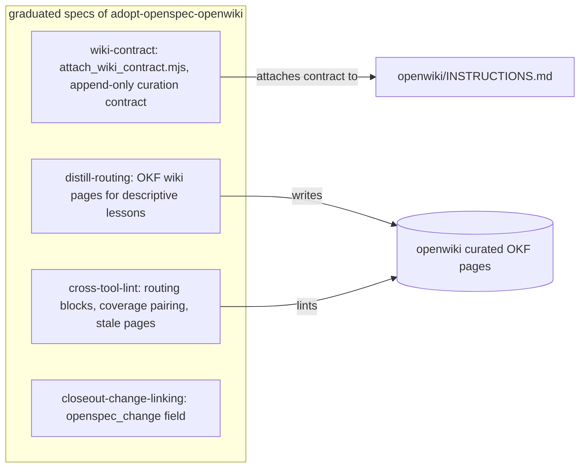

# OpenSpec Workflow

Since May 2026 this repository manages substantive work through [OpenSpec](https://github.com/fission-ai/openspec) instead of ad-hoc maintainer plans. The `openspec/` tree is the intent/process layer of the kit's tool stack ([division of labor](../overview.md)).

## Configuration

`openspec/config.yaml` selects the **spec-driven** schema and embeds project context plus artifact rules that make knowledge-capture non-negotiable:

- *proposal rules* — focus on impact to the durable knowledge layer; identify required decisions/troubleshooting entries;
- *design rules* — use Mermaid diagrams for workflow/architecture changes; follow `.agents/` structure; address cross-tool compatibility;
- *tasks rules* — always end with a task-closeout step; include learning-distill when reusable patterns emerged; verify via docs-lint or validation scripts.

The context block still summarizes AKSK principles in their pre-consolidation wording (`.agents/docs/decisions/`, `log.md`) — a known staleness inside OpenSpec-owned text that lint's stale-decision check is meant to catch eventually. Root `openspec.yaml` complements this with read-and-reference patterns over `.agents/**` and `docs/**`.

## Active changes (13)

One of them is the new `add-agents-md-bootstrap` proposal; the 2.0 step 1 change has been archived as fully applied (see below); step 2 (`aksk-bootstrap-system`) remains active and unstarted:

| Change | Theme |
| --- | --- |
| `aksk-bootstrap-system` | **2.0 step 2** — bootstrap automation; depends on archived step 1 |
| `add-agents-md-bootstrap` | seed consumer root `AGENTS.md` from a vendored FerroxLabs behavioral baseline before AKSK sections attach; see below |
| `add-task-start` | proactive `task-start` skill + `manifest.json`; closeout consumes existing manifests |
| `implement-operating-contract-and-triggers` | `OPERATING_CONTRACT.md` (<50 lines) + `.agents/triggers.yaml` event system, with spec updates bound to `/opsx:archive`, not closeout |
| `adopt-workflows-taxonomy` | merge `playbooks/` into `workflows/` under unified terminology |
| `add-integrations`, `add-script-tests`, `consumer-upgrade-path`, `formalize-superseded-obsolete`, `out-of-repo-trees`, `rules-in-scaffold`, `ship-structure-check-script`, `worked-lifecycle-example` | docs coverage, pytest suite for scripts, upgrade guidance, deprecation convention (reconciled to `aksk_status` + lint), overlay trees, `.agents/rules/` taxonomy, structure-script distribution, worked loop example |

Each folder carries `.openspec.yaml` plus `proposal.md` (+ `design.md`/`tasks.md` for larger ones) and optional `specs/<capability>/spec.md` requirement files. Graduated specs live under `openspec/specs/`: the two pre-2.0 capabilities (`openspec-integration`, `remove-write-plan`) plus the four step-1 capabilities (`wiki-contract`, `distill-routing`, `cross-tool-lint`, `closeout-change-linking`) that moved there when `adopt-openspec-openwiki` was archived as applied. Six older maintainer plans were also relocated into `archive/` as plain markdown during the migration.

## Archived changes — the supersession lineage

`openspec/changes/archive/` is dated and tells three waves:

1. **2026-05-16 · `add-openspec-integration`** — adopted OpenSpec itself; produced spec `openspec-integration`.
2. **2026-07-18/19 batch** — five wiki-related proposals (`add-docs-capture-skill`, `introduce-docs-manifest`, `living-architecture-intent-capture`, `repo-centric-wiki-tooling`, `wiki-system`) were marked Overcome-By-Events by `integrate-openwiki-skills`, which proposed extracting OpenWiki's internal prompts into native AKSK skills and standardizing on OKF v0.1. Also here: `remove-write-plan` (deleted the write-plan skill while keeping a plans directory; its merged spec lives in `openspec/specs/`).
3. **2026-08-23 batch** — six proposals archived as superseded or applied: `integrate-openwiki-skills` (would have extracted OpenWiki's internal prompts into native AKSK skills on OKF v0.1), `aksk-install-tools` (embedded installer/scaffolding scope), and `aksk-openspec-bridge` (OpenSpec schemas binding AKSK skills as a capability library) closed superseded — their scope was re-cut into the two active 2.0 changes: upstream skill bundles replace prompt extraction, native `openspec init` skills replace forks, and installation automation moved to `aksk-bootstrap-system`. `escalate-quick-reference` closed without implementation: it was built entirely on the retired `docs-compile` index generator and hand-curated `## Quick Reference` blurbs, which have no equivalent under OpenWiki's deterministic index sync; the hand-curated entry-point role moved to [`overview.md`](../overview.md) (recorded decision `knowledge-consolidation-into-openwiki`). Finally, `adopt-openspec-openwiki` itself was archived here **as fully applied** — its four capability specs graduated to `openspec/specs/`.

Reading order for anyone tracing why current tooling exists: wave 2 explains the ripgrep-era design of the now-deleted docs-search/docs-compile tools; wave 3 explains why they were retired in favor of upstream tooling rather than re-implemented, why auto-pinned Quick References never shipped, and where each step-1 requirement is now codified.

## Step 1: `adopt-openspec-openwiki` — applied and archived

The defining constraint: **OpenSpec and OpenWiki are peer dependencies** (globally installed, assumed present). AKSK verifies before use and never installs anything; every invocation path checks for the binary first and fails fast printing the exact remediation (`npm i -g @fission-ai/openspec openwiki`, then `openwiki --init` in the repo). Every task in its `tasks.md` is checked, including dogfood validation (5.1–5.4) and phase-6 reconciliation of five affected proposals. Its four capabilities are now codified requirements under `openspec/specs/`:

*Caption: where the four graduated requirements land in shipped files.*

- **[`openspec/specs/distill-routing/`](../../openspec/specs/distill-routing/spec.md)** — descriptive lessons become OKF wiki pages authored directly by the distilling agent, loading authoring guidance at runtime from OpenWiki's exported prompts (`createSystemPrompt`) and validating with deterministic OKF helpers (`okf/frontmatter`); prescriptive lessons stay in `.agents/`. Shipped as the rewritten [learning-distill](../skills/learning-distill.md). Per design decision D6, the headless CLI stays reserved for scheduled whole-wiki reconciliation because a CLI-run LLM re-discovers evidence from the repo and cannot see what the session learned.
- **[`openspec/specs/wiki-contract/`](../../openspec/specs/wiki-contract/spec.md)** — appends the AKSK curation contract to an existing `openwiki/INSTRUCTIONS.md`; append-only, idempotent by marker detection, stub-aware, never replacing OpenWiki-owned content; plus peer-dependency preconditions for every skill invocation of `openspec`/`openwiki`. Shipped as [aksk-bootstrap](../skills/aksk-bootstrap.md)'s `attach_wiki_contract.mjs` + `check_peer_tools.mjs`; this repo's own `INSTRUCTIONS.md` carries the attached contract.
- **[`openspec/specs/cross-tool-lint/`](../../openspec/specs/cross-tool-lint/spec.md)** — docs-lint repurposed into checks spanning both artifacts: routing-block integrity, archived-change↔wiki coverage pairing (with recorded-deferral exemption), stale-curated-page detection. Index-coverage checking moved out of scope because the wiki tooling owns indexes. Shipped as [docs-lint](../skills/docs-lint.md).
- **[`openspec/specs/closeout-change-linking/`](../../openspec/specs/closeout-change-linking/spec.md)** — an `openspec_change` field in `summary.json` linking bundles to OpenSpec changes; spec updates move to `/opsx:archive` time so closeout never modifies `openspec/` for in-flight changes. Shipped in the slimmed [task-closeout](../skills/task-closeout.md).

Phase-6 reconciliation completed in commit history: the five affected active proposals were revised to match shipped reality — `formalize-superseded-obsolete` now expresses the triple-lock convention against curated-page frontmatter (`aksk_status`) with verification folded into lint's stale-decision check, `add-task-start` documents manifest sequencing with the added `openspec_change` field, `implement-operating-contract-and-triggers` binds spec-sync triggers to archive time, `worked-lifecycle-example` includes the wiki leg, and `escalate-quick-reference` was archived superseded instead.

The knowledge-base consolidation itself (design decision D8 of the change, recorded as curated decision `knowledge-consolidation-into-openwiki`) went beyond the original proposal: every decision and troubleshooting entry moved under `openwiki/` as OKF pages with `aksk_status` lifecycle fields, six pre-OpenSpec maintainer plans were relocated into `archive/` as plain markdown, `MAINTENANCE.md` became the curated [`maintenance-format.md`](../maintenance-format.md) reference, and `.agents/docs/` — including hand-built indexes and `log.md` — was deleted. Consequences are documented on [knowledge layer](../architecture/knowledge-layer.md).

**BREAKING retirements landed:** `docs-search` and `docs-compile` deleted (superseded by OpenWiki's index/query tooling); the forked `openspec-*` skills deleted; `.agents/workflows/opsx-*` copies remain tracked but are slated for deletion in favor of files regenerated by native `openspec init` (task 4.2 partially applied — the workflow copies are still present on disk). Supersessions are recorded as curated decision pages so stale pointers redirect.

## Step 2: `aksk-bootstrap-system` — automate what step 1 required by hand (unstarted)

Adopting step 1 manually means global installs, repo initialization, scaffolding, contract attachment, and per-agent wiring — right for dogfooding, wrong for consumers. This follow-on depends on step 1 being fully applied and copies its finalized skill set as templates:

- Preflight detection (Node >= 22, tools on PATH, existing receipts `.agents/`, `openspec/`, `openwiki/`, `.openwiki-install.json`) with state report; once-per-user global npm lane; per-repo lane running `openspec init`, minimal `.agents/` scaffold, curation-contract attachment, idempotent routing-block merge into root `AGENTS.md`.
- A **never-half-install guard**: failed steps print exact remaining commands and exit clean without partial state; idempotency by detection, not journal.
- **Agent-integration spread** across detected agents via a lane ladder: official claude/codex lanes → `add-mcp` + tag-pinned `npx skills add …/integrations/openwiki` → headless CLI fallback for MCP-less agents; **ownership partition** rule: any target skill dir holding an `.openwiki-install.json` receipt is owned by the official lane and skipped.
- Regenerates `example/` to include the bootstrap skill and names bootstrap the primary wiring path in integration guides. Its tasks also plan open-question experiments (bare `openwiki mcp` stdio mode, tag-pinned `npx skills add` behavior) before implementation.

Release sequencing between step 2 and `add-agents-md-bootstrap` is deliberately undecided; each stands alone documentation-wise (step 1 archived states peer-dependency prerequisites as manual steps).

## Proposal: `add-agents-md-bootstrap` — seed consumer AGENTS.md (new, unstarted)

The newest active change extends the [aksk-bootstrap](../skills/aksk-bootstrap.md) script family with a behavioral initializer. Today `attach_section.mjs` creates a missing root `AGENTS.md` containing only AKSK marker sections; this proposal would instead seed a fresh file from a vendored copy of the [FerroxLabs/agents-md](https://github.com/FerroxLabs/agents-md) behavioral baseline (~200 lines: anti-sycophancy, verification loops, surgical diffs), wrapped in its own `AKSK:AGENTS-BASELINE` marker block with a provenance header, plus an opt-in `refresh_agents_baseline.mjs`. Key contracts, per `design.md`:

- A new `init_agents_md.mjs` composes *before* `attach_section.mjs` rather than overloading it — the existing append-only invariant of `attach_section.mjs` stays intact.
- An existing non-matching `AGENTS.md` is never touched silently: the script exits 2 printing a replace-vs-combine question; `--replace` overwrites explicitly, `--combine` stages the current file, baseline, and a merge brief under `.agents/sessions/agents-md-combine/<timestamp>/` for the agent (never an LLM call from kit scripts).
- The result is a fully zoned file ordered upstream-first: FerroxLabs baseline (`AKSK:AGENTS-BASELINE`) → OpenWiki block (`OPENWIKI:START/END`) → AKSK sections (`AKSK:ROUTING`, `AKSK:LIFECYCLE`), each zone an independent integrity unit for [docs-lint](../skills/docs-lint.md).
- It amends decision `use-the-routing-pattern-for-agentic-tool-bootstrap-files` with a scoped exception: the routing-pattern rule targets *repo knowledge*; the baseline is a behavioral operating contract, not forked repo knowledge.

All tasks are unchecked; nothing on disk implements it yet. See the [agent entrypoints page](agent-entrypoints.md) for how this would reshape root-file zones.

**Truthfulness horizon for wiki readers:** the pages describing [docs-lint](../skills/docs-lint.md), [learning-distill](../skills/learning-distill.md), [task-closeout](../skills/task-closeout.md), and [aksk-bootstrap](../skills/aksk-bootstrap.md) document shipped behavior; the `.agents/workflows/opsx-*` command definitions below describe content whose retirement is pending; everything under steps 2 and `add-agents-md-bootstrap` is proposal-only.

## Workflows and forked slash-commands (retirement pending)

`.agents/workflows/` still holds four markdown command definitions — `opsx-propose`, `opsx-explore`, `opsx-apply`, `opsx-archive` — mirroring the forked `openspec-*` skills: propose creates a change and generates artifacts in dependency order via `openspec new/status/instructions --json`; explore is a thinking-partner stance that never implements; apply loops through pending tasks checking `- [ ]`→`- [x]`; archive verifies completion before moving a change to `archive/`. These are local copies of OpenSpec's own agent integration; step 1 deletes them in favor of files regenerated by `openspec init`. Unlike the forked skills, these files were not yet removed — treat them as pending retirement, not current doctrine.

Step 1 also re-timed the archive workflow relative to capture: under `closeout-change-linking`, spec updates happen at `/opsx:archive` time rather than at task-closeout time, so a session bundle can reference an in-flight change without touching it.
