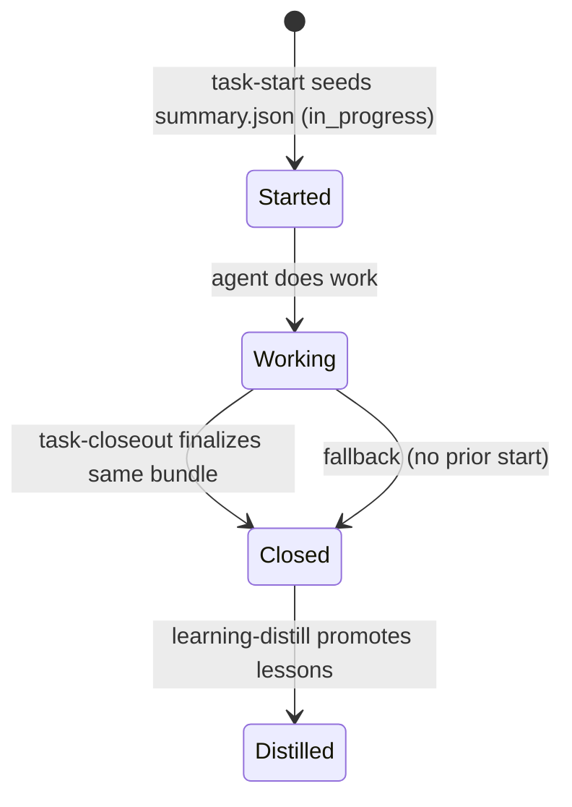
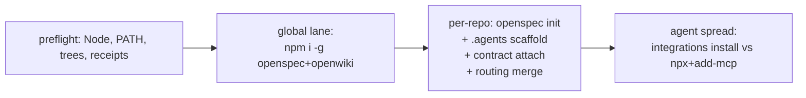
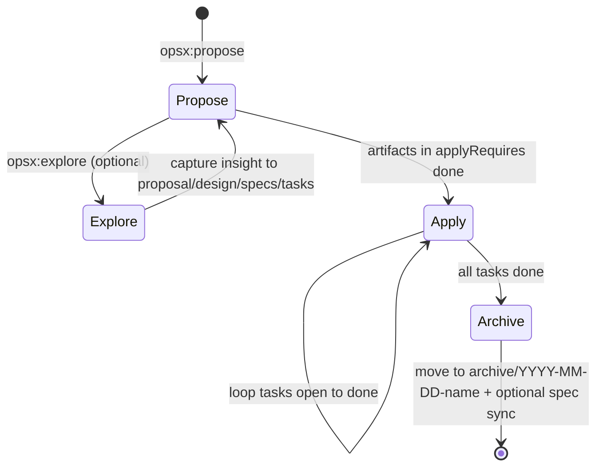

# OpenSpec Workflow

Since May 2026 this repository manages substantive work through [OpenSpec](https://github.com/fission-ai/openspec) as the **intent and process layer**. OpenWiki owns descriptive knowledge and `.agents/` owns prescriptive behavior; `openspec/` owns *what* should be built and *in what order*. The invariant enforced throughout the documentation is:

> **Only `openspec/specs/**` is the current contract. `openspec/changes/<name>/` are proposals. `openspec/changes/archive/**` is frozen history until its delta requirements graduate.**

## Configuration — two YAML entrypoints

### Root guardrail: `openspec.yaml`

A minimal rule file at the repository root tells OpenSpec-aware agents where durable knowledge lives:

```yaml
rules:
  - name: AKSK Knowledge Persistence
    patterns: [.agents/**/*.md, docs/**/*.md]
    action: read-and-reference
```

It encodes no behavior — it enforces that agents read and reference the knowledge layer before proposing changes.

### Schema and rules: `openspec/config.yaml`

The authoritative configuration fixes the artifact graph and binds every change to the maintenance loop:

```yaml
schema: spec-driven
context: |
  The Agent Knowledge Starter Kit (AKSK) is a tool-agnostic system ...
rules:
  proposal: [focus on durable knowledge layer impact, ...]
  design:   [Mermaid diagrams, .agents/ structure, cross-tool compatibility]
  tasks:    [always end with task-closeout, include learning-distill, verify via docs-lint]
```

- `schema: spec-driven` fixes the artifact graph: `proposal.md` → `design.md` → `tasks.md` plus optional `specs/<capability>/spec.md` delta files.
- `context` is an LLM-facing briefing — constraints for the proposing agent, never copied verbatim into artifacts. It still references pre-consolidation paths (`.agents/docs/decisions/`, `log.md`); that staleness is intentional documentation debt surfaced by lint's stale-page check.
- `rules` are per-artifact constraints. Proposal rules keep changes knowledge-aware; design rules enforce Mermaid and `.agents/` layout; tasks rules bind every change to `task-start` → `task-closeout` → `learning-distill` → `docs-lint`.

Root `openspec.yaml` complements this with `read-and-reference` patterns over `.agents/**` and `docs/**`.

## Change and spec anatomy

### Active change layout

Every active change is a directory under `openspec/changes/`:

```
openspec/changes/<kebab-name>/
├── .openspec.yaml          # { schema: spec-driven, created: YYYY-MM-DD }
├── proposal.md             # what & why, impact on knowledge layer
├── design.md               # how, decisions D1…Dn, Mermaid, migration plan
├── tasks.md                # checklist: - [ ] / - [x], always ends with closeout
└── specs/<capability>/     # optional delta specs
    └── spec.md             # ADDED / MODIFIED / REMOVED requirements
```

- `.openspec.yaml` is the change-local schema receipt — two keys only (`schema`, `created`).
- `proposal.md` is mandatory. `design.md` and `tasks.md` are generated in dependency order via `openspec new/status/instructions --json`.
- Delta specs are capability-scoped and use delta semantics against the corresponding `openspec/specs/<capability>/spec.md` — the graduated spec is never edited while the change is active.

### Graduated versus delta specs

| Location | Lifecycle | Meaning | Written by |
| --- | --- | --- | --- |
| `openspec/changes/<name>/specs/<cap>/spec.md` | in-flight | delta requirements for this change | `opsx:propose` / author |
| `openspec/specs/<cap>/spec.md` | graduated | durable SHALL requirements | `opsx:archive` sync |
| `openspec/changes/archive/YYYY-MM-DD-<name>/` | archived | frozen record of what shipped | `opsx:archive` move |

Legacy hand-authored proposals predating the structured format survive as flat files under `openspec/changes/archive/*.md` without delta semantics.

### Graduated specs (10)

Six pre-2.0 plus four 2.0 capabilities, now including the 2026-08-29 batch:

| Capability | Purpose |
| --- | --- |
| `openspec-integration` | Adoption of OpenSpec itself (first wave) |
| `remove-write-plan` | Deletion of write-plan skill while retaining plans directory |
| `wiki-contract` | Append-only AKSK curation contract in `openwiki/INSTRUCTIONS.md`, peer-tool preconditions |
| `distill-routing` | Descriptive → OpenWiki OKF pages; prescriptive → `.agents/` |
| `cross-tool-lint` | Routing-block integrity, archived-change ↔ wiki coverage pairing, stale-page detection |
| `closeout-change-linking` | `openspec_change` in `summary.json`; spec updates at archive time, never at closeout |
| `aksk-bootstrap` | Preflight detection, once-per-user global install lane, per-repo scaffolding, never-half-install guard |
| `agents-md-bootstrap` | Seed consumer root `AGENTS.md` from vendored FerroxLabs baseline with zoned markers |
| `install-lanes` | Preferred agent-assisted vs `npx skills add` fallback; forbids `example/` demo path |
| `agent-integration-spread` | Per-host lane selection (`openwiki integrations install` vs `npx`+`add-mcp`) with receipt-based ownership partition |

Requirements live only here — distillation cites the capability instead of duplicating a SHALL as a wiki page (see [Knowledge Curation Contract](../concepts/knowledge-curation-contract.md)).

## Active changes (12)

Each folder carries `.openspec.yaml` plus `proposal.md` (+ `design.md`/`tasks.md` for larger ones) and optional delta specs.

| Change | Theme |
| --- | --- |
| `canonical-universal-install` | **BREAKING** canonical user store `~/.agents/skills` (universal Codex default) + self-reported host; `npx` required, clone fallback dropped |
| `add-task-start` | Proactive `task-start` skill seeding `summary.json` (`task_id`, `created_at`, `status: in_progress`); closeout finalizes existing bundle |
| `adopt-workflows-taxonomy` | Merge `playbooks/` into `workflows/` under unified terminology |
| `implement-operating-contract-and-triggers` | `OPERATING_CONTRACT.md` (<50 lines) + `.agents/triggers.yaml` event system; spec updates bound to `/opsx:archive`, not closeout |
| `add-integrations`, `add-script-tests`, `consumer-upgrade-path`, `formalize-superseded-obsolete`, `out-of-repo-trees`, `rules-in-scaffold`, `ship-structure-check-script`, `worked-lifecycle-example` | Docs coverage, pytest suite for scripts, upgrade guidance, deprecation triple-lock (`aksk_status` + lint), overlay trees, `.agents/rules/` taxonomy, structure-script distribution, worked loop example |

The two 2.0 bootstrap changes (`aksk-bootstrap-system`, `add-agents-md-bootstrap`) and `reorder-install-lanes-drop-example` are now archived as fully applied; their specs graduated (see below).

### `add-task-start` — proactive task initialization

Today `task-closeout` captures history retroactively, which risks data loss on interruption and misses early context. `add-task-start` formalizes the state machine `start` → `work` → `closeout` → `distill`:

- **Creates** `.agents/sessions/YYYYMMDD-HHMMSS-short-topic/` and seeds `summary.json` per `.agents/skills/task-closeout/CONTRACT.md` (`task_id` canonical, `created_at`, `status: in_progress`, optional `openspec_change`, `repo_id`, `agent`).
- **Finalizes** the same file at closeout — `task-closeout` detects the seeded bundle, preserves `task_id` and `openspec_change`, appends `completed_at`, final `status`, `changed_files`, `validation`, and distillation flags. If no seed exists, it falls back to current generation.
- **Guards scope**: neither start nor closeout edits durable knowledge (`openwiki/`, `.agents/AGENTS.md`, `.agents/workflows/`, skills) — proposed durable changes are captured as prose inside the bundle for `learning-distill` to apply.
- **Idempotent init** also ensures `.agents/sessions/README.md` and `.agents/.gitignore` entries (`sessions/*`, `!sessions/README.md`) exist.



Ownership is exclusive: task-start owns creation, task-closeout owns finalization, nothing else mutates the bundle.

### `canonical-universal-install` — canonical user skills scope

Exploration proved the package manager's source of truth is `~/.agents/skills` for Codex (it reads it natively; `~/.codex/skills/openwiki` does not exist while `~/.agents/skills/openwiki` does, and `integrations list` without `--project` shows global scope). Wide `--all` spraying to 56 mirrors and four duplicate lanes were the status quo.

This change collapses install to one canonical store:

- **Canonical store**: `~/.agents/skills` (universal, Codex default) plus the self-reported current host's dir, via `npx skills add -g -a <self-reported> <source>` for both the AKSK kit (`Hypercubed/Agent-Knowledge-Starter-Kit`) and `langchain-ai/openwiki` (`--full-depth`). Extra `-a <other>` or `--all` only when the user explicitly asked at install time — no persistent consent artifact.
- **BREAKING**: `npx` is now required. The `git clone --depth 1 && cp -r .agents/skills` fallback is removed; the INSTRUCT lane prints prerequisites instead.
- **Bootstrap tightens to two verbs**: (1) verify CLIs (`openspec`/`openwiki` on PATH, `npm i -g` if missing, user scope, caret from `references/versions.json` via `versionsFromPackageJson()`), then (2) verify skills (`~/.agents/skills/<name>/SKILL.md` presence; `npx skills add -g -a <self-reported>` if missing).
- **OpenWiki two-track**: `openwiki integrations install <self-reported>` (skill + MCP atomically, `.openwiki-install.json` receipt) when the host is in the `codex|claude|opencode` registry, otherwise `npx skills add -g` + `npx add-mcp` (neon-solutions/add-mcp) or `openwiki mcp --host` as backup. The choice is made by the bootstrapping agent based on registry availability.
- **Verification retargeted**: `verify-install` now asserts `~/.agents/skills/<name>` plus host mirror as canonical; repo-local `./.agents/skills` is treated as override A.

## Bootstrap invariants and entrypoints

The `aksk-bootstrap` spec (graduated) defines four hard invariants used by both the agent-assisted lane (`node .agents/skills/aksk-bootstrap/scripts/bootstrap.mjs [repo-root]`) and the human `npx skills add --full-depth` fallback:

1. **Preflight detection** — before any write: Node major version, `openspec`/`openwiki` on PATH, `openspec/`/`.agents/`/`openwiki/` existence, and `.openwiki-install.json` receipts. State is reported before acting. Node <22 fails fast.
2. **Once-per-user global lane** — `npm i -g @fission-ai/openspec@latest` / `openwiki@latest` in user scope, skipped if already present at compatible version.
3. **Per-repo scaffolding** — `openspec init` when `openspec/` missing; minimal `.agents/` scaffold from templates; append-only contract attachment to `openwiki/INSTRUCTIONS.md`; thin routing-block merge into root `AGENTS.md` leaving any existing OpenWiki block intact. All lanes delegate to `check_peer_tools.mjs`, `attach_wiki_contract.mjs`, `attach_section.mjs` (and `init_agents_md.mjs`).
4. **Never half-install** — if a step cannot execute locally, print exact remaining copy-paste commands and exit clean without partial state from the failed step. Re-running against a fully bootstrapped repo is an idempotent no-op.



The `agents-md-bootstrap` extension gives root `AGENTS.md` a zoned layout ordered upstream-first — `AKSK:AGENTS-BASELINE` (vendored FerroxLabs behavioral baseline with provenance header, wrapped in `references/`) → `OPENWIKI:START/END` → `AKSK:ROUTING`/`AKSK:LIFECYCLE` — each zone an independent integrity unit for [Validation and Cross-Tool Lint](../operations/validation-and-lint.md). When `AGENTS.md` already exists, seeding exits 2 and forces an explicit `--replace` or `--combine` decision; `--combine` stages the existing file, baseline, and merge brief under `.agents/sessions/agents-md-combine/<timestamp>/` for the agent, never an LLM call from kit scripts. Refresh is opt-in (`refresh_agents_baseline.mjs`) and touches only the baseline zone.

Ownership partition during spread: any target skill dir already holding `.openwiki-install.json` is owned by the official lane and skipped — the report lists lane, outcome (`installed`/`unchanged`/`modified`), and installer details per agent.

## Archived changes — the supersession lineage

`openspec/changes/archive/` is dated and tells four waves:

1. **2026-05-16 · `add-openspec-integration`** — adopted OpenSpec itself; produced spec `openspec-integration`.
2. **2026-07-18/19 batch** — five wiki-related proposals (`add-docs-capture-skill`, `introduce-docs-manifest`, `living-architecture-intent-capture`, `repo-centric-wiki-tooling`, `wiki-system`) were marked Overcome-By-Events by `integrate-openwiki-skills`, which proposed extracting OpenWiki's internal prompts into native AKSK skills. Also here: `remove-write-plan` (deleted write-plan skill; merged spec graduated).
3. **2026-08-23 batch** — six proposals archived as superseded or applied: `integrate-openwiki-skills`, `aksk-install-tools`, and `aksk-openspec-bridge` closed superseded — their scope was re-cut into graduated specs (upstream skill bundles replace prompt extraction, native `openspec init` replaces forks, installation moved into `aksk-bootstrap`). `escalate-quick-reference` closed without implementation (retired `docs-compile` index and hand-curated `## Quick Reference` had no OpenWiki equivalent; entry-point role moved to `overview.md`). `adopt-openspec-openwiki` itself was archived here **as fully applied** — its four capability specs graduated to `openspec/specs/`.
4. **2026-08-29 batch** — `add-agents-md-bootstrap`, `aksk-bootstrap-system`, and `reorder-install-lanes-drop-example` were each archived as applied. Their deltas became graduated specs `agents-md-bootstrap`, `aksk-bootstrap (+ agent-integration-spread)`, and `install-lanes` respectively. `canonical-universal-install` then superseded the install-lane shape now as the active proposal.

Reading order for anyone tracing why current tooling exists: wave 2 explains the ripgrep-era design of the now-deleted `docs-search`/`docs-compile`; wave 3 explains why they were retired in favor of upstream tooling and where each step-1 requirement is now codified; wave 4 explains why consumer `AGENTS.md` is seeded from a vendored baseline and why skill installs default to `~/.agents/skills`.

## The four opsx workflows

Content previously shipped as local copies under `.agents/workflows/opsx-*.md` is now provided natively by `openspec init`; the local copies are slated for deletion and treated as pending retirement.



| Workflow | Responsibility | Gate |
| --- | --- | --- |
| `opsx:propose` | Create `<kebab-name>/` and generate `proposal.md` → `design.md` → `tasks.md` → delta specs in dependency order via `openspec instructions --json` | `proposal.md` complete |
| `opsx:explore` | Thinking-partner stance that never implements; captures insight back into proposal/design/specs | — |
| `opsx:apply` | Loop through `tasks.md` checking `- [ ]` → `- [x]` | `applyRequires` artifacts done |
| `opsx:archive` | Verify all tasks done, then move change to `archive/YYYY-MM-DD-<name>/` and optionally sync delta specs into `openspec/specs/` | all tasks checked |

Per `closeout-change-linking`, spec sync happens at `/opsx:archive` time, not at `task-closeout` time — a session bundle can reference an in-flight change via `openspec_change` without touching `openspec/`.

## Relationships and control flow

- **Governance → bootstrap**: `openspec/config.yaml` selects `schema: spec-driven` and demands `task-closeout` + `learning-distill` + `docs-lint` at the end of every meaningful change. Bootstrap enforces peer dependencies (`openspec`/`openwiki` on PATH) before any `openspec` operation and fails fast printing the exact `npm i -g` remediation rather than installing silently.
- **Changes → specs → wiki**: graduated SHALLs live only in `openspec/specs/`; descriptive lessons distilled from bundles become OKF wiki pages under `openwiki/decisions|troubleshooting/` (see [Knowledge Curation Contract](../concepts/knowledge-curation-contract.md)); prescriptive lessons land in `.agents/AGENTS.md` or `.agents/workflows/`.
- **Sessions → specs**: `task-start` seeds identity; `task-closeout` links the bundle to a change via `openspec_change`; `learning-distill` promotes durable lessons; `docs-lint` pairs every archived change with wiki coverage (flagging uncovered changes unless explicitly deferred).
- **Lint owns wiring, validators own shape**: `docs-lint` (procedure-and-checklist skill) checks routing-block integrity across all three AGENTS.md zones (baseline, OpenWiki, AKSK) and stale-page detection; `scripts/check-agents-structure.sh` (portable, `jq`-optional) and `scripts/check-publish.sh` (release wrapper: structure + remark + `markdown-link-check --alive 200,0` + leakage scans) enforce file shape and publish readiness (see [Validation and Cross-Tool Lint](../operations/validation-and-lint.md) and `.agents/playbooks/pre-publish.md`).

## Lifecycle, invariants, and failure semantics

- **Source-of-truth ordering**: graduated `openspec/specs/` > in-flight delta > archived history. Editing `openspec/specs/` directly while a change is active is a process violation — edits belong in `specs/<cap>/spec.md` under the change.
- **Idempotency**: `attach_wiki_contract.mjs` and `attach_section.mjs` are append-only and marker-idempotent (second run reports `already up to date` or refreshes only between markers). `bootstrap.mjs` re-run is a no-op. `init_agents_md.mjs` is idempotent when the marked baseline already matches the vendored template.
- **Never half-install**: failed bootstrap steps leave no partial files from that step and print the exact remaining commands.
- **No silent overwrite**: seeding `AGENTS.md` when one exists exits non-zero; repair proceeds only via explicit `--replace` or `--combine`.
- **Peer tools verified before use**: every skill/script that invokes `openspec` or `openwiki` verifies the binary resolves first and fails with the exact install command when it does not.
- **No durable writes at task boundaries**: `task-start` and `task-closeout` only write under `.agents/sessions/<bundle>/` (plus idempotent `README.md`/`.gitignore`); spec and wiki mutations are deferred to `opsx:archive` and `learning-distill` respectively.
- **Coverage invariant**: each archived change should have wiki coverage (directly or via recorded deferral); lint fails otherwise.

## Extension points and operations

- **Adding a capability**: create `specs/<new-cap>/spec.md` under the change with `ADDED Requirements`; graduate at archive time into `openspec/specs/<new-cap>/spec.md`.
- **Amending a capability**: use `MODIFIED Requirements` against the existing graduated spec; the delta is reconciled at archive time without touching `openspec/specs/` beforehand.
- **Private notes**: `.agents/sessions/<bundle>/` is gitignored except `README.md` (validated by `check-agents-structure.sh` via `git ls-files` vs `git status --ignored`); unverified bundles are local evidence only.
- **Validation before publish**: run `node .agents/skills/aksk-bootstrap/scripts/sync_wiki_indexes.mjs` after curated wiki edits, then `docs-lint`, then `bash scripts/check-publish.sh` (which delegates to `check-agents-structure.sh` plus Markdown, link, leakage, and hygiene checks). `openspec validate <change> --strict` gates archival. See `.agents/playbooks/pre-publish.md` for the full readiness sequence.
- **Install-scope override**: default is `-g -a <self-reported>` (universal `~/.agents/skills` + caller host). Repo-local `./.agents/skills` is override A; extra `-a <other>`/`--all` with explicit user consent is override B.

**Truthfulness horizon for wiki readers:** pages describing `docs-lint`, `learning-distill`, `task-closeout`, and `aksk-bootstrap` document shipped behavior; the `.agents/workflows/opsx-*` copy definitions describe content whose retirement is pending; everything under `canonical-universal-install` and `add-task-start` is proposal-only until archived.
