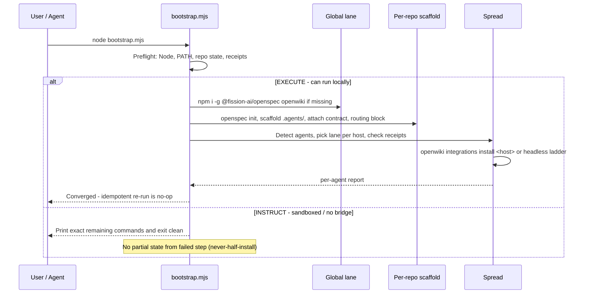

# Distribution and Agent Spread

OpenWiki reaches agents through two complementary distribution mechanisms that share one invariant: **derive paths from the registry, never hardcode them, and respect receipt ownership**. The `openwiki integrations install` registry lane (v0.4.3+) atomically delivers skill + MCP for the three supported hosts; every other agent uses the headless `openwiki --init -p` / `--update -p` ladder directly. The per-repo bootstrap orchestrates both lanes idempotently and reports per-agent outcomes.

## The Two-Lane Spread

`aksk-bootstrap-system` (D4) defines exactly one lane per detected agent — no intermediate `add-mcp` + `npx skills add` lane exists.

| Lane | When | Command | What it does |
|------|------|---------|--------------|
| **Registry lane** | Host is `codex`, `claude`, or `opencode` | `openwiki integrations install <codex\|claude\|opencode>` | Atomically copies skill bundle to host skill directory **and** edits host MCP config; writes `.openwiki-install.json` receipt; verifiable via `openwiki integrations list` |
| **Headless ladder** | Any other detected agent | Agent drives `openwiki --init -p` / `openwiki --update -p` directly | No MCP registration; the agent invokes the CLI and renders wiki pages without sequence tools |

MCP sequence tools (`openwiki_begin` / `openwiki_submit_plan` / `openwiki_next_page` / `openwiki_submit_page` / `openwiki_finish`) are only available after the registry lane's MCP registration succeeds. A skill install without MCP is inert. The headless ladder has no `openwiki mcp --host` stdio service; agents without a registry host do not use a generic bare `openwiki mcp`.

<!-- openwiki: mermaid parse failed and this diagram was converted to a text fence so it does not break rendering. Fix the diagram source and restore the mermaid fence. Parser error: Heuristic: an unescaped angle bracket inside a label breaks rendering; rephrase the label. -->
```text
flowchart TD
    D["Detect agents on machine"] --> C{"Host in registry?\ncodex | claude | opencode"}
    C -- Yes --> R["openwiki integrations install <host>\natomic: skill + MCP config\n+ receipt"]
    C -- No --> H["Headless ladder\nagent runs openwiki --init -p\n/ --update -p directly"]
    R --> V["Verify via openwiki integrations list\ninstalled / unchanged / modified"]
    H --> P["Agent reads openwiki/ pages\nno MCP sequence tools"]
    V --> REP["Per-agent report\nlane + outcome + installer output"]
    P --> REP
```

Ordering matters: globally install `openwiki@latest` first so the `openwiki` command registered in host configs (`openwiki mcp --host <target>`) resolves, then run `integrations install`, then verify via `openwiki integrations list`.

## Registry Lane: Atomic Install

The v0.4.3 registry (`HOST_TARGETS` with user/project scopes) owns all install formats. Each `openwiki integrations install <host>` does one atomic transaction:

* **Sources the bundle** from the locally installed npm package at `<npm-root>/openwiki/integrations/openwiki` — not a tag-pinned `langchain-ai/openwiki/tree/<tag>/integrations/openwiki` URL. The receipt records the `openwiki` version; update is `npm i -g openwiki@latest` then re-run `integrations install` (idempotent when version/hashes/command already match).
* **Copies the skill** to the host's skill directory via staging then commit; rejects symlinked skill directories or any symlinked parent component and rejects non-directory parents.
* **Edits the host MCP config** in the same transaction:
  * `codex` → `~/.agents/skills/openwiki` + `~/.codex/config.toml` (TOML `installCodexMcpBlock` with `replaceableEntry` detection)
  * `claude` → `~/.claude/skills/openwiki` + `~/.claude.json` or `.mcp.json` (JSON)
  * `opencode` → `~/.config/opencode/skills/openwiki` + `~/.config/opencode/opencode.jsonc` (JSONC)
* **Writes the receipt** `.openwiki-install.json` in the skill directory recording `package`, `version` (openwiki version), `target`, SHA-256 file hashes for every bundle file, and the exact `mcpServerCommand` (`openwiki` + `mcp --host <target>`).
* **Snapshots config** and rolls back on commit failure; partial installs are cleaned up via staging-directory removal. Config and skill are never left half-installed.

Registry installers oriented at remote MCP servers (`Smithery`, `mcp-get`) and the superseded `npx skills add` / `add-mcp` shapes are excluded — they fight receipt/hash verification, transactional rollback, and symlink checks.

Known ecosystem drift: openwiki puts codex user-scope skills at `~/.agents/skills/` while `vercel-labs/skills` documents `~/.codex/skills/`. Neither path is hard-coded by bootstrap; the registry is the source of truth.

## Receipt, Hash Verification, and Install States

`.openwiki-install.json` is the ownership record. `openwiki integrations list` (backed by `inspectInstallation`) reads the target directory, hash-verifies every file against the recorded SHA-256, checks `mcpServerCommand`, and reports one of:

| Status | Meaning |
|--------|---------|
| `installed` / `unchanged` | Receipt present, `target` matches, hashes intact, MCP command matches. Re-run is a no-op (codex TOML uses `replaceableEntry` detection). |
| `modified` | Hash drift or hand-edits to skill or config. Installer refuses to overwrite without explicit `--force`; on `--force` it creates a backup and reports the backup path. |
| `not-installed` | No receipt in the target skill directory — lane is free to integrate. |

Hash drift is the signal for `modified`: any file change invalidates the receipt until the user either reverts or re-installs with `--force`. The backup produced on `--force` preserves the previous state for rollback.

## Ownership Partition Rule

Before touching any agent's skill directory, spread inspects via `openwiki integrations list` / `inspectInstallation`:

* Receipt present with matching `target` and intact hashes → the official lane owns that destination. **Skip entirely** and list it as owned by the official lane; do not merge or overlay.
* `modified` → report `modified` and skip unless `--force` is explicit. `--force` overwrites after backup; without it, bootstrap preserves uninstall integrity.
* No receipt (`not-installed`) → the lane is unowned; integrate through the selected lane.

Installing two managers into one destination is prevented by this check plus the symlink/non-directory-parent rejections. The rule is installer-owned — bootstrap never guesses supported-host formats.

## Never Hardcode Agent Skill Paths

Agent skill paths diverge and keep drifting. Bootstrap and spread derive every target from the registry at runtime via `openwiki integrations list`. No path matrix is maintained in kit code. The related instruction is page-specific and normative: derive from `openwiki integrations list` and respect receipt ownership; skip or require `--force` for modified installs.

## Bundle Source and Update Lifecycle

The canonical bundle is always `<npm-root>/openwiki/integrations/openwiki` from the installed package. The receipt's `version` field pins the installed bundle to a known `openwiki` version (visible via `npm ls openwiki`). Updating:

```bash
npm i -g openwiki@latest
openwiki integrations install <target>   # idempotent when already installed
# or: re-run the bootstrap script which does the same check
```

There is no tag-pinned `npx skills add .../tree/<tag>/integrations/openwiki` and no `skills update` tracking. `uninstall` is transactional with config rollback and removes the receipt, returning the host to `not-installed`.

## Global Ordering and Preflight

The bootstrap flow detects before acting: Node.js major version (>=22 required), whether `openspec` and `openwiki` resolve on `PATH`, whether `openspec/`, `.agents/`, and `openwiki/` exist in the target repo, and whether install receipts exist in known skill directories. It reports this state before any writes.

Global lane: `npm i -g @fission-ai/openspec@latest openwiki@latest` once per user, skipping any tool already at a compatible version. Ordering is verified: `openwiki` must resolve before registering `openwiki mcp --host <target>` in host configs.

Per-repo lane (after global lane): `openspec init` when missing, minimal `.agents/` scaffold from kit templates, curation-contract attachment to `openwiki/INSTRUCTIONS.md` via append-only `AKSK:WIKI-CONTRACT` markers, and routing-block merge into root `AGENTS.md` preserving any existing `OPENWIKI:START/END` block.

## Bootstrap Orchestration and Idempotency



Two-lane execution model (D1): the script detects whether it can execute locally (direct run or local MCP bridge). In `EXECUTE` it runs the steps; in `INSTRUCT` it prints the exact remaining copy-paste commands and exits clean without partial state from the failed step and without continuing past a failed prerequisite.

Idempotency is by detection (D2), not a journal: every step derives "done?" from observable state — tools on PATH, `openspec/` present, routing-block markers in `AGENTS.md`, contract section in `INSTRUCTIONS.md`, receipts in skill directories. Re-runs converge without replaying history; a separate bootstrap journal would drift when users edit manually.

Reuse boundary (D6): the contract template, skill set, and attach semantics are owned by `adopt-openspec-openwiki`. Bootstrap copies them; variations belong in the source change.

## Shared Wiring Patterns

`docs/integrations/patterns.md` is the single source for shared decisions; product pages under `docs/integrations/` provide exact filenames, snippets, and caveats. The core pattern: **tool-native files are wiring; `.agents/` files are durable knowledge.** Never copy long-lived repo policy into every tool's native config — point the tool at `.agents/AGENTS.md`, `openwiki/index.md`, `.agents/playbooks/`, and `.agents/skills/`.

Four pattern groups:

| Group | Tools | Mechanism |
|-------|-------|-----------|
| Root `AGENTS.md` native or compatible | Codex, OpenCode, Kilo Code, Warp, OpenClaw | Short root `AGENTS.md` routes into `.agents/` via attached `AKSK:ROUTING` block (`attach_section.mjs . AGENTS.md`) — refreshes in place, idempotent |
| Tool-specific bootstrap file | Claude Code (`CLAUDE.md`), Gemini CLI (`GEMINI.md`) | Thin router file; native memory (Claude auto-memory, Gemini `save_memory`) stays user-local and never replaces curated wiki |
| Rules-based IDE wiring | Cursor (`.cursor/rules/`), GitHub Copilot (`.github/copilot-instructions.md`) | Short rule/instruction bodies referencing `.agents/` paths; glob-scoped rules only for extra constraints |
| Persistent memory & runtime boundary | Hermes, Antigravity, OpenClaw, Agentic Sandbox | Private memory for local continuity only; at task boundaries export durable evidence to `.agents/sessions/<folder>/` and distill into `.agents/AGENTS.md`, curated wiki trees, or playbooks |

Product-specific config (`opencode.json`, `kilo.json`, `~/.codex/config.toml`, `.claude/settings.json`, Warp Drive rules, OpenClaw startup/memory files) stays as wiring or runtime behavior that points back to canonical repo files.

Session export rule: `.agents/sessions/` is the shared task boundary. A closeout bundle (`summary.json` with canonical `task_id`, `active-task.md`, `learning-candidate.md`, `changed-files.txt`, `validation.txt`) captures what matters so any later tool can distill.

## Failure Semantics and Recovery

| Failure | Detection | Recovery |
|---------|-----------|----------|
| Node <22 | Preflight `node --version` | Stop before installing; print required version and upgrade instructions |
| Missing `openwiki` before MCP registration | `onPath('openwiki')` / `openwiki integrations list` | Global install first; `requireBinaries` exits 2 with exact `npm i -g openwiki@latest` and no writes |
| `modified` skill or config | `openwiki integrations list` → `modified` (hash drift / hand-edits) | Report and skip; re-run with `--force` to overwrite with backup (backup path in installer output) |
| Symlinked skill dir or parent, non-directory parent | Installer preflight | Reject; user fixes filesystem, then re-run — bootstrap derives the error from the registry |
| Concurrent hand-edits to host config (TOML/JSON/JSONC) | Config snapshot comparison at commit | Roll back snapshot; remove staging directory; no partial install |
| Path matrix drift | Registry vs hard-coded table | Never hard-code; `openwiki integrations list` is the source — installer owns the mapping |
| Partial step in sandboxed worker | No execution bridge (`INSTRUCT`) | Print exact remaining commands, exit clean, no partial state from the failed step |

## Extension Points

* **New supported host:** add it to the upstream `HOST_TARGETS` registry; spread picks it up via `openwiki integrations list` with no kit path matrix change. Keep durable knowledge out of vendor config; map the product's native structures against `docs/integrations/patterns.md`.
* **New managed `AKSK:*` section:** add a template under `.agents/skills/aksk-bootstrap/references/` carrying unique `<!-- AKSK:<NAME>:BEGIN -->`/`END` markers; attach via `attach_section.mjs <root> <target> <template>`; extend `docs-lint` wiring checks; validate with two runs (second is no-op).
* **New tool integration guide:** place under `docs/integrations/`, not under `.agents/`; include a two-tool workflow and verify claims by reproduction.
* **Kody thin-adapter:** the two-lane design preserves the option without building it now.

## Operations and Validation

Focused probes mirror the openspec verification matrix:

| Probe | Command | What it proves |
|-------|---------|----------------|
| Preflight reports state | Bootstrap script re-run on fully bootstrapped fixture | Reports Node, tools, repo state, receipts; changes nothing |
| Partial fixture convergence | Re-run on partially bootstrapped fixture | Completes only missing steps |
| Supported host install idempotency | `openwiki integrations install <host>` twice | Second run `unchanged` / no-op; codex TOML `replaceableEntry` detection holds |
| Modified detection | Hand-edit a file in skill dir, then `openwiki integrations list` | Reports `modified`; install refuses without `--force` |
| Force with backup | `openwiki integrations install <host> --force` | Overwrites, creates backup, reports backup path |
| Headless ladder | Agent without registry host drives `openwiki --init -p` / `--update -p` | Pages initialize/update without MCP registration |
| Receipt ownership | Presence of `.openwiki-install.json` with matching `target` and hashes | Spread skips and reports owned — no double ownership |

## Related Pages

* [Distribution and Tool Wiring](distribution-and-tool-wiring.md) — peer dependencies, Skills CLI distribution, and the single `.agents` tree.
* [aksk-bootstrap Skill](../skills/aksk-bootstrap.md) — precondition provider and marker-delimited attachment scripts.
* [Bootstrap and Block Attachment](../workflows/bootstrap-and-attachment.md) — deterministic `AGENTS.md` zoning and the seed → OpenWiki → AKSK attachment order.
* [Validation and Release](../operations/validation-and-release.md) — deterministic validators and release checks.
* [Integration Patterns](../../docs/integrations/patterns.md) — shared core pattern and per-product guide matrix (canonical source for the four pattern groups).
