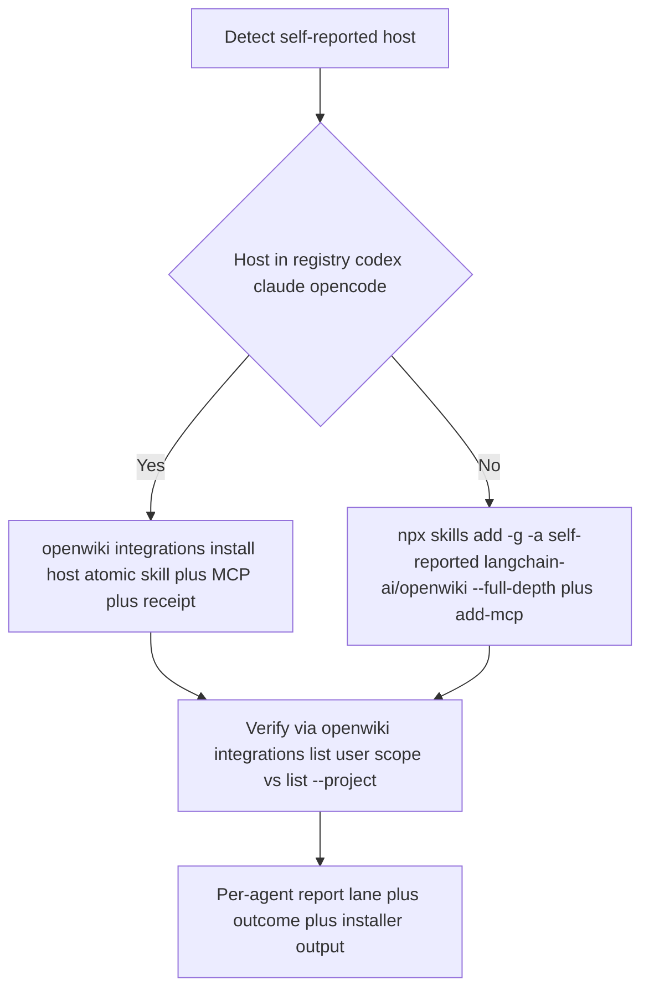
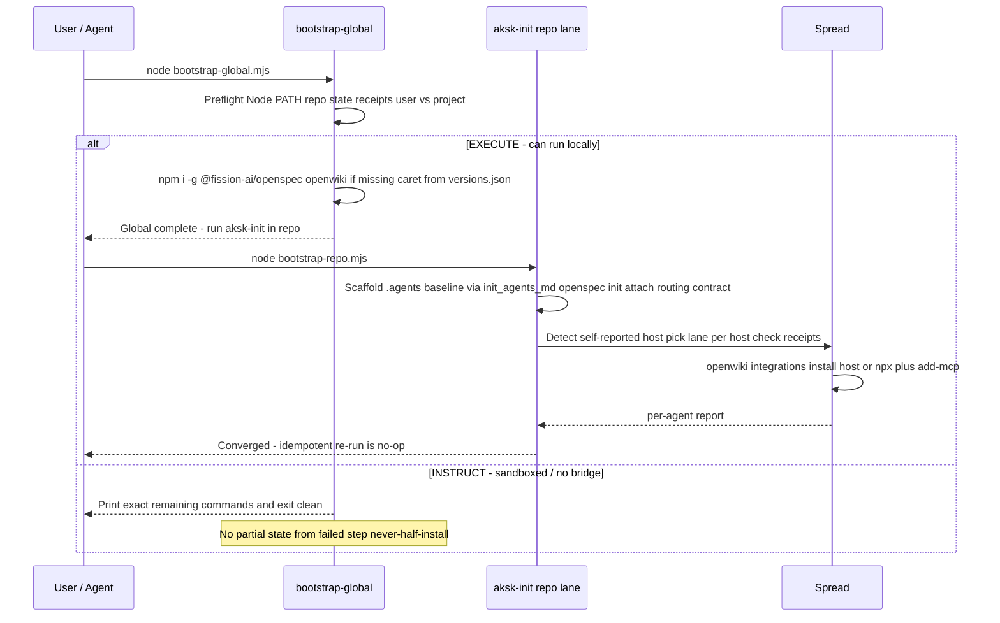

# Distribution and Agent Spread

OpenWiki reaches agents through one canonical invariant: **derive paths from the registry, never hardcode them, and respect receipt ownership**. The canonical user store is `~/.agents/skills` (universal, Codex default) plus the self-reported host's directory, installed via `npx skills add -g -a <self-reported>`. For OpenWiki itself the spread chooses one lane per host: `openwiki integrations install <codex|claude|opencode>` when the host is in the v0.4.3 registry (skill + MCP + receipt atomically), otherwise `npx skills add -g -a <self-reported> langchain-ai/openwiki --full-depth` plus `npx add-mcp` or `openwiki mcp --host <target>`. Wide spread (`--all`) and extra `-a <other>` occur only on explicit user ask at install time. Packaging, version pinning, and ignore generation are the guardrails that keep that spread deterministic.

> **Shipped vs Proposal:** `openspec/specs/**` is the shipped contract (cited as shipped below). `openspec/changes/canonical-universal-install/**` is Proposal-only (not yet in specs) — its files under `openspec/changes/archive/2026-08-29-canonical-universal-install/` are kept for historical context only.

## Packaging and Publish Validation

The kit ships content (markdown layout and conventions) rather than a runtime library. It is distributed as the npm package `agent-knowledge-starter`:

* `package.json` defines the distributable surface (`directories.doc: docs`), `scripts.check: bash scripts/check-publish.sh`, `scripts.test` placeholder, and `devDependencies` pinning `openwiki: ^0.4.3` and `@fission-ai/openspec: ^1.11.0` with `skills: ^1.5.1` plus remark tooling.
* `.claude-plugin/plugin.json` lists the 5 user skills (`aksk-bootstrap`, `aksk-init`, `task-closeout`, `learning-distill`, `docs-lint`) and is loaded by default. Maintainer-only skills marked `metadata.internal: true` are excluded (e.g. `verify-install`).
* `npm run check` delegates to `scripts/check-publish.sh` as the publish guard. The script is the single release gate — no separate `example/` validation target exists.

`scripts/check-publish.sh` composes:

1. **Portable shape** via `bash scripts/check-agents-structure.sh .agents` — root `.agents` only. Checks required files (`AGENTS.md`, `.gitignore`, `playbooks/README.md`, `sessions/README.md`, the SKILL.md files plus reference files), session tracking (`git ls-files` equals exactly `sessions/README.md`, bundles ignored via `git status --ignored`), frontmatter `name:`/`description:`, and JSON validity via `jq` when present.
2. **Markdown formatting** via `remark --frail` with `remark-frontmatter` + `remark-gfm` (local `remark` or `npx --no-install`, 60s timeout).
3. **Markdown links** via `markdown-link-check --alive 200,0` per tracked `*.md` (30s timeout).
4. **Leakage scans** via `rg` for secret/local-path patterns across `README.md`, `INSTALL.md`, `docs`, `.agents` (warnings).
5. **Path hygiene** — doubled `.agents/.agents/` detection (hard fail, trailing segment required).

There is no `example/*) continue` link-check bypass and no `example/.agents` structure check. After `reorder-install-lanes-drop-example` and `canonical-universal-install`, `bootstrap/` templates are the source of truth; any residual `example/` on disk is not validated but is excluded from wiki evidence via `.openwikiignore`.

## Install Lanes and the Retired `example/` Path

`install-lanes` defines exactly two supported lanes, both converging on `aksk-bootstrap`/`aksk-init` scripts:

| Lane | Entry | What it does |
|------|-------|--------------|
| **Preferred: agent-assisted via `aksk-bootstrap` + `aksk-init`** | Agent runs `npx skills add -g -a <self-reported> Hypercubed/Agent-Knowledge-Starter-Kit` (or with a local checkout path) then runs those skills; or deterministic `node .agents/skills/aksk-bootstrap/scripts/bootstrap-global.mjs [repo-root]` followed by `node .agents/skills/aksk-init/scripts/bootstrap-repo.mjs [repo-root]` with EXECUTE/INSTRUCT fallback | Preflights Node >=22, installs peer tools once per user (`npm i -g`), verifies skills in canonical store, scaffolds per-repo `.agents/` / `openspec` / `openwiki` contract / routing blocks, spreads integrations per lane ladder |
| **Fallback: manual `npx skills add`** | Human runs `npx skills add -g -a <self-reported> Hypercubed/Agent-Knowledge-Starter-Kit` (or without `-g` for repo-local `./.agents/skills` override) then runs each installed `SKILL.md` initialization | Same scaffold via copied `scripts/*.mjs` + `references/` for each discovered skill; copy is from `bootstrap/` without deleting or renaming it |

Scoping is `universal + self-reported` by default; extra `-a <other>` or `--all` only when the user explicitly asked at the `npx` invocation. `npx` is required — the `git clone --depth 1 && cp -r .agents/skills` lane is removed and `INSTRUCT` reports the missing prerequisite instead of silently copying.

The repository **must not** contain an `example/` directory as an install method and must not ship maintainer-only skills marked internal. Documentation, playbooks, and shell scripts must not reference `example/` as an install path or validation target. Any residual `example/` is a generated illustration of a consumer install, not source truth.

## Canonical Universal Store

Every skill an agent installs targets the user-scoped universal store plus the caller's own host (shipped in `canonical-user-skills-scope`):

```bash
npx skills add -g -a <self-reported> Hypercubed/Agent-Knowledge-Starter-Kit
npx skills add -g -a <self-reported> langchain-ai/openwiki --full-depth
# self-reported is the calling agent's own host id (codex, claude, etc.)
# universal is ~/.agents/skills; host mirror is e.g. ~/.codex/skills or ~/.claude/skills
```

* **Default is `universal + current`.** Without an explicit `-a <other>` or `--all` at install time, only `~/.agents/skills/<name>/SKILL.md` and the self-reported host's mirror are written. The agent self-report is the second target, not an override; spoofing it is the agent's own failure. If the calling agent does not support universal, it prompts before writing elsewhere.
* **Consent-gated wide spread.** Extra hosts or `--all` are written only when the user explicitly asked at the `npx skills add` invocation. No persistent consent artifact is required; the choice is recorded at install time. Repo-local `./.agents/skills` is an override (bare `npx skills add` without `-g`), not the default.
* **`npx` is required, clone fallback removed.** There is no `git clone --depth 1 && cp -r .agents/skills` lane. When `npx` is unavailable the bootstrap reports the missing prerequisite in the INSTRUCT lane and exits clean.
* **Versions from the install version list.** Pins are read from `references/versions.json` via `versionsFromPackageJson()` in `bootstrap-global.mjs` (caret range, e.g. `^0.4.3` for `openwiki`, `^1.11.0` for `@fission-ai/openspec`), falling back to `@latest` only when unpinned. The consumer repo's `package.json` is checked first to allow a local override, then the bundled file. This is the same source the global `npm i -g` lane uses. `@ferroxlabs/agents-md` is pinned by SHA (`90c7198cfa97ff1868f0600952098fee7fc86ef9`) in the same file because it has no `package.json`; the vendored baseline is updated together via `refresh_agents_baseline.mjs`.
* **Verification treats the user store as canonical.** `verify-install` asserts `~/.agents/skills/<name>/SKILL.md` plus the self-reported host's mirror for the default lane; repo-local `./.agents/skills` is asserted only when the scenario explicitly tests an override. `openwiki integrations list` without `--project` is user/global scope; `list --project` is the repo override.

The previous wide default (`-g` fanning to many mirrors) and the repo-local default are retired. Human-direct and prompt-agent lanes both use the same `-g -a <self-reported>` shape.

## The Two-Lane Spread

`agent-integration-spread` (shipped) defines exactly one lane per host that should receive an integration. The choice is made by whether the self-reported host is in the registry.

| Lane | When | Command | What it does |
|------|------|---------|--------------|
| **Registry lane** | Host is `codex`, `claude`, or `opencode` | `openwiki integrations install <codex\|claude\|opencode>` | Atomically copies skill bundle to host skill directory **and** edits host MCP config; writes `.openwiki-install.json` receipt; verifiable via `openwiki integrations list` |
| **Unified npx lane** | Any other host (no supported `openwiki integrations install` entry) | `npx skills add -g -a <self-reported> langchain-ai/openwiki --full-depth` plus `npx --yes add-mcp -g -a <host> openwiki` (neon-solutions/add-mcp) or `openwiki mcp --host <target>` | Installs lifecycle skill to universal + host via the Skills CLI, then registers the MCP via `add-mcp` chooser or the `openwiki mcp` command |

The former headless ladder (`openwiki --init -p` / `--update -p` driven directly by the agent with no MCP registration) is retired for the lifecycle skill; the unified `npx` + `add-mcp` ladder replaces it. `npx skills add -g -a <self-reported> langchain-ai/openwiki` yields three skills (`openwiki`, `mermaid-diagrams`, `write-connector`); the lifecycle `openwiki` skill requires `--full-depth`.

MCP sequence tools (`openwiki_begin` / `openwiki_submit_plan` / `openwiki_next_page` / `openwiki_submit_page` / `openwiki_finish`) are only available after the registry lane's MCP registration or the `add-mcp` registration succeeds. A skill install without MCP is inert.



Ordering matters: globally install `openwiki@latest` first so the `openwiki` command registered in host configs (`openwiki mcp --host <target>`) resolves, then run the per-host install, then verify via `openwiki integrations list`.

## Registry Lane: Atomic Install

The v0.4.3 registry owns install formats for its three hosts. Each `openwiki integrations install <host>` does one atomic transaction (skill + MCP config `openwiki mcp --host <target>` with `.openwiki-install.json` receipt):

* **Sources the bundle** from the locally installed npm package — the receipt records the `openwiki` version; update is `npm i -g openwiki@latest` then re-run `integrations install` (idempotent when already installed as `installed`/`unchanged`).
* **Copies the skill** to the host's skill directory and **edits the host MCP config** in the same transaction (codex, claude, opencode each have registry-owned formats).
* **Writes the receipt** `.openwiki-install.json` in the skill directory recording the install; `openwiki integrations list` reports `installed`/`unchanged` vs `modified` vs `not-installed`.

Registry installers oriented at remote MCP servers and the superseded bare `npx skills add` without `-a` are excluded.

Known ecosystem drift: openwiki puts the codex user-scope skill at `~/.agents/skills/` while `vercel-labs/skills` documents `~/.codex/skills/`. Neither path is hard-coded by bootstrap; the registry is the source of truth. Codex reads `~/.agents/skills` natively, so universal and codex coincide.

## Unified npx Lane

When the self-reported host is outside `codex|claude|opencode`, the spread does not fall back to a headless CLI. It uses the decoupled equivalent:

```bash
npx skills add -g -a <self-reported> langchain-ai/openwiki --full-depth
npx --yes add-mcp -g -a <self-reported> openwiki
# or when the host supports it: openwiki mcp --host <self-reported>
```

The first command writes to both `~/.agents/skills` and the host dir with the version from `references/versions.json`; the second registers the MCP in the host's config via the 18-host `add-mcp` registry. The choice `integrations install` vs `npx` + `add-mcp` is made by registry availability, not by a separate heuristic — prefer `integrations install` when available for its receipt partition.

## Receipt, Hash Verification, and Install States

`.openwiki-install.json` is the ownership record. `openwiki integrations list` (backed by `inspectInstallation` in the openwiki implementation) reads the target directory and reports one of:

| Status | Meaning |
|--------|---------|
| `installed` / `unchanged` | Receipt present and intact, MCP command matches. Re-run is a no-op. |
| `modified` | Hand-edits to skill or config detected. Installer reports `modified`; overwrite requires explicit `--force` with backup path in output. |
| `not-installed` | No receipt in the target skill directory — lane is free to integrate. |

## Ownership Partition Rule

Before touching any agent's skill directory, spread inspects via `openwiki integrations list` / `inspectInstallation`:

* Receipt present -> the official lane owns that destination. **Skip entirely** and list it as owned by the official lane; do not merge or overlay.
* `modified` -> report `modified` and skip unless `--force` is explicit.
* No receipt (`not-installed`) -> the lane is unowned; integrate through the selected lane.

For the npx lane, ownership is checked via `~/.agents/skills/<name>/SKILL.md` and the host mirror presence; the same skip-or-force discipline applies to the openwiki lifecycle skill. The rule is installer-owned — bootstrap never guesses supported-host formats.

## Never Hardcode Agent Skill Paths

Agent skill paths diverge and keep drifting. Bootstrap and spread derive every target from the registry at runtime via `openwiki integrations list`. No path matrix is maintained in kit code. Skill installs always use `npx skills add -g -a <self-reported>` so the Skills CLI itself resolves the universal plus host directories. Host integrations (`openwiki integrations install <host>`) are manual opt-in outside the global lane.

## Bundle Source and Update Lifecycle

Two bundle sources, one version source:

* **Registry lane** — canonical bundle is from the installed `openwiki` package. The receipt pins the installed bundle to a known `openwiki` version (visible via `openwiki --version` / `npm ls openwiki`).
* **npx lane** — lifecycle skill is sourced as `langchain-ai/openwiki` via `npx skills add -g -a <self-reported> --full-depth` at the caret from `references/versions.json`.

Updating:

```bash
npm i -g openwiki@latest
openwiki integrations install <target>   # idempotent when already installed
# npx lane: re-run npx skills add -g -a <self-reported> langchain-ai/openwiki --full-depth at the new caret
# or: re-run the bootstrap script which does the same check
```

There is no tag-pinned `npx skills add .../tree/<tag>/integrations/openwiki` and no persistent `skills update` tracking. `uninstall` removes the receipt, returning the host to `not-installed`.

## Global Ordering and Preflight

The bootstrap flow detects before acting: Node.js major version (>=22 required), whether `openspec` and `openwiki` resolve on `PATH`, whether `openspec/`, `.agents/`, and `openwiki/` exist in the target repo, and whether install receipts exist in known skill directories (via `openwiki integrations list --project` for repo scope and without the flag for user scope). It reports this state before any writes.

Global lane (`aksk-bootstrap`): `npm i -g @fission-ai/openspec@latest openwiki@latest` once per user, skipping any tool already at a compatible version. Versions are read via `versionsFromPackageJson()` from `references/versions.json`. Ordering is verified: `openwiki` must resolve before registering `openwiki mcp --host <target>` in host configs. The global lane is non-interactive; the skill prompts before invoking it. Host integrations are not auto-installed by the global lane.

Per-repo lane (`aksk-init`, after global lane): verify skills in the canonical store (`~/.agents/skills/<name>/SKILL.md` plus host mirror, installing via `npx skills add -g -a <self-reported>` if missing), then `openspec init` when missing, minimal `.agents/` scaffold from kit templates, curation-contract attachment to `openwiki/INSTRUCTIONS.md` via append-only `AKSK:WIKI-CONTRACT` markers, and routing-block merge into root `AGENTS.md` preserving any existing `OPENWIKI:START/END` block. The per-repo lane (scaffold + baseline via `init_agents_md.mjs`, then openspec/openwiki init) now lives in `aksk-init`; `aksk-bootstrap` is global-only.

## Bootstrap Orchestration and Idempotency



Two-lane execution model: the script detects whether it can execute locally (direct run or local MCP bridge). In `EXECUTE` it runs the steps; in `INSTRUCT` it prints the exact remaining copy-paste commands and exits clean without partial state from the failed step and without continuing past a failed prerequisite. `npx` missing is an `INSTRUCT` prerequisite, not a silent clone fallback.

Idempotency is by detection, not a journal: every step derives "done?" from observable state — tools on PATH, `openspec/` present, routing-block markers in `AGENTS.md`, contract section in `INSTRUCTIONS.md`, receipts in skill directories and `~/.agents/skills/<name>/SKILL.md` plus host mirror. Re-runs converge without replaying history; a separate bootstrap journal would drift when users edit manually.

## Generated Trees and `.openwikiignore`

Two trees are generated, not source truth, and are excluded from wiki evidence at two layers:

* **Git layer** — `.agents/.gitignore` carries `sessions/*` + `!sessions/README.md` (only `sessions/README.md` is tracked) and Skills CLI ignores `example/` in consumer repos.
* **OpenWiki layer** — `.openwikiignore` is defense in depth beyond git. It contains the anchored `/example/` (slash-anchored, root only) and `.agents/sessions/` with `!.agents/sessions/README.md` re-include. The anchor is load-bearing: `example/.agents/.gitignore` is ignored (`true`), `foo/example/bar.md` and `examples/foo.md` are not (`false`), and nested `example/` folders remain visible.

Treat root `example/` as a generated consumer-install illustration — do not cite files under `example/` as evidence for shipped behavior and do not present its contents as canonical implementation. Treat `.agents/sessions/` (except `README.md`) as temporary closeout bundles — not source truth. Citing `repo://example/.agents/.gitignore` or `repo://.agents/sessions/.../summary.json` fails with `Evidence path is excluded by .openwikiignore`. Prose mentions in body are allowed; only `repo://` evidence resources are blocked.

## Shared Wiring Patterns

`docs/integrations/patterns.md` is the single source for shared decisions; product pages under `docs/integrations/` provide exact filenames, snippets, and caveats. The core pattern: **tool-native files are wiring; `.agents/` files are durable knowledge.** Never copy long-lived repo policy into every tool's native config — point the tool at `.agents/AGENTS.md`, `openwiki/index.md`, `.agents/playbooks/`, and `.agents/skills/`.

Four pattern groups:

| Group | Tools | Mechanism |
|-------|-------|-----------|
| Root `AGENTS.md` native or compatible | Codex, OpenCode, Kilo Code, Warp, OpenClaw | Short root `AGENTS.md` routes into `.agents/` via attached `AKSK:ROUTING` block (`attach_section.mjs . AGENTS.md`) — refreshes in place, idempotent |
| Tool-specific bootstrap file | Claude Code (`CLAUDE.md`), Gemini CLI (`GEMINI.md`) | Thin router file; native memory (Claude auto-memory, Gemini `save_memory`) stays user-local and never replaces curated wiki |
| Rules-based IDE wiring | Cursor (`.cursor/rules/`), GitHub Copilot (`.github/copilot-instructions.md`) | Short rule/instruction bodies referencing `.agents/` paths; glob-scoped rules only for extra constraints |
| Persistent memory & runtime boundary | Hermes, Antigravity, OpenClaw, Agentic Sandbox | Private memory for local continuity only; at task boundaries export durable evidence to `.agents/sessions/<folder>/` and distill into `.agents/AGENTS.md`, curated wiki trees, or playbooks |

Product-specific config (`opencode.json`, `kilo.json`, `~/.codex/config.toml`, `.claude/settings.json`, Warp Drive rules, OpenClaw startup/memory files) stays as wiring or runtime behavior that points back to canonical repo files.

Session export rule: `.agents/sessions/` is the shared task boundary. A closeout bundle (`summary.json` with canonical `task_id`, `active-task.md`, `learning-candidate.md`, `changed-files.txt`, `validation.txt`) captures what matters so any later tool can distill.

## Failure Semantics and Recovery

| Failure | Detection | Recovery |
|---------|-----------|----------|
| Node <22 | Preflight `node --version` | Stop before installing; print required version and upgrade instructions |
| `npx` missing | `onPath('npx')` check | INSTRUCT lane prints `npx` required; no clone-and-copy fallback |
| Missing `openwiki` before MCP registration | `onPath('openwiki')` / `openwiki integrations list` | Global install first; `requireBinaries` exits 2 with exact `npm i -g openwiki@latest` and no writes |
| `modified` skill or config | `openwiki integrations list` -> `modified` (hash drift / hand-edits) | Report and skip; re-run with `--force` to overwrite with backup (backup path in installer output) |
| Symlinked skill dir or parent, non-directory parent | Installer preflight | Reject; user fixes filesystem, then re-run — bootstrap derives the error from the registry |
| Concurrent hand-edits to host config | Config snapshot comparison at commit | Roll back snapshot; remove staging directory; no partial install |
| Path matrix drift | Registry vs hard-coded table | Never hard-code; `openwiki integrations list` is the source — installer owns the mapping |
| Partial step in sandboxed worker | No execution bridge (`INSTRUCT`) | Print exact remaining commands, exit clean, no partial state from the failed step |
| Citing `example/` or `.agents/sessions/` as evidence | `OpenWikiIgnore.load` walk | Retarget to generator or canonical `.agents/.gitignore`; body prose may mention but frontmatter/Claims `repo://` must not use ignored prefix |

## Extension Points

* **New supported host:** add it to the upstream `HOST_TARGETS` registry; spread picks it up via `openwiki integrations list` with no kit path matrix change. Keep durable knowledge out of vendor config; map the product's native structures against `docs/integrations/patterns.md`.
* **New managed `AKSK:*` section:** add a template under `.agents/skills/aksk-bootstrap/references/` or `aksk-init/references/` carrying unique `<!-- AKSK:<NAME>:BEGIN -->`/`END` markers; attach via `attach_section.mjs <root> <target> <template>`; extend `docs-lint` wiring checks; validate with two runs (second is no-op).
* **New tool integration guide:** place under `docs/integrations/`, not under `.agents/`; include a two-tool workflow and verify claims by reproduction.
* **Kody thin-adapter:** the two-lane design preserves the option without building it now.

## Operations and Validation

Focused probes mirror the openspec verification matrix:

| Probe | Command | What it proves |
|-------|---------|----------------|
| Preflight reports state | Bootstrap script re-run on fully bootstrapped fixture | Reports Node, tools, repo state, receipts user vs project; changes nothing |
| Partial fixture convergence | Re-run on partially bootstrapped fixture | Completes only missing steps |
| Canonical store idempotency | `npx skills add -g -a <self-reported> <source>` twice | Second run is no-op; both `~/.agents/skills/<name>` and host mirror intact |
| Supported host install idempotency | `openwiki integrations install <host>` twice | Second run `unchanged` / no-op; codex TOML `replaceableEntry` detection holds |
| Unsupported host fallback | `npx skills add -g -a <other> langchain-ai/openwiki --full-depth` plus `npx add-mcp -g -a <other> openwiki` | Lifecycle skill and MCP land in universal + host without registry lane |
| Modified detection | Hand-edit a file in skill dir, then `openwiki integrations list` | Reports `modified`; install refuses without `--force` |
| Force with backup | `openwiki integrations install <host> --force` | Overwrites, creates backup, reports backup path |
| Consent gating | `npx skills add -g <source>` vs `npx skills add -g -a <other>` vs `npx skills add -g --all` | Bare `-g` writes only universal; explicit `-a` / `--all` writes extra hosts |
| Receipt ownership | Presence of `.openwiki-install.json` with matching `target` | Spread skips and reports owned — no double ownership |
| Publish guard | `bash scripts/check-publish.sh` or `npm run check` | Root `.agents` only; no `example/` bypass; leakage/hygiene as warnings/fails |
| Ignore anchoring | `node` with `OpenWikiIgnore.load` walk + `rg` over `repo://` sources | `example/.agents/.gitignore` ignored, nested `foo/example/` not; sessions except README ignored |

## Related Pages

* [Distribution and Tool Wiring](distribution-and-tool-wiring.md) — peer dependencies, Skills CLI distribution, and the single `.agents` tree.
* [aksk-bootstrap Skill](../skills/aksk-bootstrap.md) — precondition provider and marker-delimited attachment scripts.
* [Bootstrap and Block Attachment](../workflows/bootstrap-and-attachment.md) — deterministic `AGENTS.md` zoning and the seed -> OpenWiki -> AKSK attachment order.
* [Validation and Release](../operations/validation-and-release.md) — deterministic validators and release checks.
* [Validation and Lint](../operations/validation-and-lint.md) — portable structure validator details and publish wrapper composition.
* [Architecture Overview](../architecture/overview.md) — repository layout and skill inventory.
* [Integration Patterns](../../docs/integrations/patterns.md) — shared core pattern and per-product guide matrix (canonical source for the four pattern groups).
