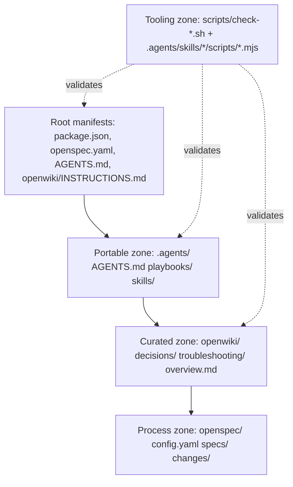

# Repository Inventory

`agent-knowledge-starter` (`package.json` name `agent-knowledge-starter`, `2.0.0`) is a distributable knowledge kit, not a runtime app. Inventory is organized by authority zone: root glue, portable prescriptive layer (`.agents/`), curated descriptive layer (`openwiki/`), process layer (`openspec/`), and tooling (`scripts/` + Node ESM helpers). Run `git ls-files | sort` for exact tracked counts; session bundles and `node_modules/` are gitignored by design and never canonical.

*Authority flows from root entrypoints to portable rules to curated knowledge to process intent; tooling validates all three.*

## Root manifests and entrypoints

| Path | Role | Consumed by | Notes |
| --- | --- | --- | --- |
| `package.json` | Kit manifest: `name`/`version`/`description`, `directories.doc`, `scripts.test`/`format`/`check`, `devDependencies` | npm, agents, CI, `aksk-bootstrap` version pinning | `dependencies` is empty; no runtime service. `test` intentionally fails (`echo "Error: no test specified" && exit 1`). `format` is `remark ".agents/**/*.md" --output` via `.remarkrc.json`. `check` is `bash scripts/check-publish.sh`. See [Validation and Release](../operations/validation-and-release.md). |
| `package-lock.json` | Lockfile for the seven `devDependencies` | npm | `markdown-link-check@^3.14.1`, `remark-cli@^12.0.1`, `remark-frontmatter@^5.0.0`, `remark-gfm@^4.0.1`, `skills@^1.5.1`, `@fission-ai/openspec@^1.11.0`, `openwiki@^0.4.3` |
| `openspec.yaml` | Minimal rule declaration: `AKSK Knowledge Persistence` rule | OpenSpec CLI, OpenWiki | `patterns: .agents/**/*.md, docs/**/*.md` with `action: read-and-reference`; `schema: spec-driven` lives in `openspec/config.yaml` |
| `AGENTS.md` | Root router entrypoint agents actually load | All coding agents | Marker-delimited managed blocks owned by scripts: `AKSK:AGENTS-BASELINE` (vendored FerroxLabs baseline, `aksk-init/scripts/init_agents_md.mjs` + `aksk-bootstrap/scripts/refresh_agents_baseline.mjs`), `OPENWIKI:START/END` (OpenWiki), `AKSK:ROUTING` + `AKSK:LIFECYCLE` (`aksk-init/scripts/attach_section.mjs` and `aksk-bootstrap/scripts/attach_section.mjs` from `routing-note-template.md`/`lifecycle-template.md`). In this checkout the baseline zone is not yet seeded — existing hand-authored content precedes the OpenWiki/AKSK blocks. `.agents/AGENTS.md` is portable source of truth; root only routes. See [AKSK Architecture Overview](../architecture/overview.md) and [AGENTS.md Zoning](../concepts/agents-md-zoning.md). |
| `openwiki/INSTRUCTIONS.md` | Wiki curation contract carrier | OpenWiki CLI, `learning-distill`, `aksk-bootstrap`/`aksk-init` | Contains `<!-- AKSK:WIKI-CONTRACT:BEGIN/END -->` section appended from `references/wiki-contract-template.md` by `attach_wiki_contract.mjs` (canonical in `aksk-init`, mirrored in `aksk-bootstrap` for backwards compatibility). Never hand-edited inside markers; OpenWiki-owned content outside markers takes precedence. |
| `.openwikiignore` | Repo-root ignore for generated evidence | OpenWiki | `.agents/sessions/` (`!.agents/sessions/README.md` exception) — do not cite session bundles as canonical |
| `.gitignore` | Local tooling ignores | git, agents | `.kilo`, `.codex`, `.claude`, `node_modules`, `skills-lock.json`, `.agents/skills/docs-search/docs-search-index.json`, `__pycache__` |
| `.remarkrc.json` | Markdown style config | `remark-cli` | `bullet: "-"`, `rule: "-"`, `emphasis: "*"`, plugins `remark-frontmatter` + `remark-gfm` |
| `.claude-plugin/plugin.json` | Marketplace plugin manifest | Claude Code, Skills CLI | Lists 5 portable user skills: `aksk-bootstrap`, `aksk-init`, `task-closeout`, `learning-distill`, `docs-lint` |
| `INSTALL.md`, `README.md`, `docs/architecture.md`, `docs/integrations/` | Human-facing adoption docs | Humans, agents during bootstrap | `INSTALL.md` defines skill-first flow (`npx skills add -g -a <host> Hypercubed/Agent-Knowledge-Starter-Kit --skill aksk-bootstrap` + per-skill `bootstrap/` copy). `docs/integrations/` documents wiring; see [Quickstart](../quickstart.md). |

### Peer binaries (never installed by the kit)

Node `>=22` plus two globally installed CLIs owned per-user (`npm i -g`, not repo-local `npx` or `node_modules`):

- `@fission-ai/openspec@^1.11.0` — process/intent layer under `openspec/`
- `openwiki@^0.4.3` — descriptive layer under `openwiki/` (one-time `openwiki --init` per repo)

Caret ranges resolve from `.agents/skills/aksk-bootstrap/references/versions.json` (fallback `@latest` when unpinned) via `versionsFromPackageJson()` in `aksk-bootstrap/scripts/bootstrap-global.mjs` (also mirrored in `aksk-init` flow). Verification is `node .agents/skills/aksk-bootstrap/scripts/check_peer_tools.mjs openspec openwiki` — fail-fast exit 2 with exact `npm i -g` commands, rejecting unknown tool names. The deterministic orchestrator `bootstrap-global.mjs` (global lane) and `aksk-init/scripts/bootstrap-repo.mjs` (per-repo lane) own automated install; other skills only verify. The legacy `aksk-bootstrap/scripts/bootstrap.mjs` is now a shim that runs global then repo lane sequentially.

## Portable prescriptive zone: `.agents/`

Ships as the distributable artifact. Layout is validated by `scripts/check-agents-structure.sh [target]` (defaults to `.agents`, also used for isolated consumer copies).

| Path | Contents | Invariant |
| --- | --- | --- |
| `.agents/AGENTS.md` | Compact routing directives and project learnings; must stay small (no session history, long rationale, or one-off debugging) | Prescriptive rules that travel with the repo when tools change |
| `.agents/.gitignore` | `sessions/*` + `!sessions/README.md` | Only `sessions/README.md` is tracked; every `sessions/<bundle>/` is local evidence, verified by git-aware section in `check-agents-structure.sh` |
| `.agents/playbooks/` | `README.md`, `pre-publish.md`, `major-version-release.md`, `writing-integration-guides.md` | Multi-step procedures; `pre-publish.md` sequences `check-publish.sh` + `sync_wiki_indexes.mjs` + `docs-lint` |
| `.agents/skills/aksk-bootstrap/` | `SKILL.md` + `references/` (templates `agents-md-baseline-template.md`, `routing-note-template.md`, `lifecycle-template.md`, `wiki-contract-template.md`, `versions.json`) + `scripts/` (`bootstrap.mjs` shim, `bootstrap-global.mjs`, `check_peer_tools.mjs`, `attach_wiki_contract.mjs`, `attach_section.mjs`, `init_agents_md.mjs`, `refresh_agents_baseline.mjs`, `sync_wiki_indexes.mjs`) | Global precondition provider + deterministic global orchestrator; no per-repo writes except managed-section attachment. `bootstrap-global.mjs` has EXECUTE lane (run locally, auto `npm i -g` for missing tools) and INSTRUCT lane (print remaining commands, exit clean with no partial state) |
| `.agents/skills/aksk-init/` | `SKILL.md` + `references/` (`agents-md-baseline-template.md`, `routing-note-template.md`, `lifecycle-template.md`, `wiki-contract-template.md`) + `scripts/` (`bootstrap-repo.mjs`, `attach_wiki_contract.mjs`, `attach_section.mjs`, `init_agents_md.mjs`) | Per-repo initializer; scaffolds `.agents/` and seeds `AGENTS.md` baseline first, then `openspec init`, `openwiki --init`, routing/lifecycle and wiki contract. Verifies `aksk-bootstrap` preconditions before acting |
| `.agents/skills/task-closeout/` | `SKILL.md`, `CONTRACT.md`, `bootstrap/sessions/README.md`, `example/task-bundle/` (`summary.json`, `active-task.md`, `learning-candidate.md`, `changed-files.txt`, `validation.txt`) | Capture-only; writes only under `.agents/sessions/` |
| `.agents/skills/learning-distill/` | `SKILL.md`, `bootstrap/` (AGENTS.md template, playbooks, sessions README), `references/` (`CONTRACT.md`, `decision-frontmatter.schema.json`, `troubleshooting-frontmatter.schema.json`) | Classification + promotion; writes to `.agents/` and `openwiki/` curated trees |
| `.agents/skills/docs-lint/` | `SKILL.md`, `CONTRACT.md`, `bootstrap/README.md` | Read-mostly coherence pass; writes only minimal fixes to AKSK-owned files |
| `.agents/skills/verify-install/` | `SKILL.md`, `scripts/run.sh` | Internal maintainer validation; not listed in `plugin.json`, marked `internal` in frontmatter |

Required-file manifest checked by `check-agents-structure.sh` (regular-file `-f` asserts): `AGENTS.md`, `.gitignore`, `playbooks/README.md`, `sessions/README.md`, the four portable `SKILL.md` paths (`aksk-bootstrap`, `docs-lint`, `learning-distill`, `task-closeout`), and the five `task-closeout/example/task-bundle/` files. Skill header check requires `---` on line 1 and `^name: ` + `^description: ` within first 12 lines. JSON check enumerates `*.json` via `git ls-files` (or `find ... -path target/sessions/[0-9]* -prune` outside git) and validates with `jq empty` when `jq` is present; missing `jq` is `WARN` not `FAIL`.

## Curated descriptive zone: `openwiki/`

| Path | Contents | Lifecycle |
| --- | --- | --- |
| `openwiki/index.md`, `openwiki/overview.md`, `openwiki/maintenance-format.md` | Indexes and OKF schema reference | Generated + curated; `overview.md`/`maintenance-format.md` are AKSK-curated under `AKSK:WIKI-CONTRACT` |
| `openwiki/decisions/`, `openwiki/troubleshooting/` | Durable OKF pages with frontmatter `type`/`title`/`description`/`tags` plus `aksk_*` extensions (`aksk_status`, `aksk_depends_on`) | Authored by `learning-distill`; preserved across `openwiki --update` via preserve-and-link (generated material links rather than replaces). Indexes refreshed by `sync_wiki_indexes.mjs` |
| `openwiki/architecture/`, `openwiki/concepts/`, `openwiki/distribution/`, `openwiki/governance/`, `openwiki/integrations/`, `openwiki/inventory/`, `openwiki/operations/`, `openwiki/skills/`, `openwiki/workflows/` | Generated reference trees | Owned by OpenWiki; `openwiki/.last-update.json` records last documented commit, `openwiki/.run.json` is the concurrency guard |
| `openwiki/.last-update.json`, `openwiki/.run.json` | Run metadata | `status: "interrupted"` after mid-run edits; check `test -f openwiki/.run.json && jq -r .phase openwiki/.run.json` before editing |

Source of truth rule: `openspec/specs/**` is shipped contract; `openspec/changes/**` are proposals (label **Proposal-only** when citing deltas); `openspec/changes/archive/**` is historical until `openspec archive` graduates specs.

## Process and intent zone: `openspec/`

| Path | Contents |
| --- | --- |
| `openspec/config.yaml` | `schema: spec-driven`, AKSK context block, `rules` for `proposal`/`design`/`tasks` (Mermaid, `.agents/` structure, cross-tool compat, mandatory closeout/distill/verify steps) |
| `openspec/specs/` | 12 graduated capabilities: `agent-integration-spread`, `agents-md-bootstrap`, `aksk-bootstrap`, `aksk-init`, `canonical-user-skills-scope`, `closeout-change-linking`, `cross-tool-lint`, `distill-routing`, `install-lanes`, `openspec-integration`, `remove-write-plan`, `wiki-contract` — each `spec.md` is authoritative requirement set |
| `openspec/changes/` | Active proposals (e.g., `consumer-upgrade-path`, `formalize-superseded-obsolete`) plus `archive/` of graduated changes (e.g., `2026-08-29-add-agents-md-bootstrap`). Each proposal carries `proposal.md`/`design.md`/`tasks.md` and optional `specs/<capability>/spec.md` deltas |

## Tooling zone

| Entrypoint | Scope | Key behavior |
| --- | --- | --- |
| `scripts/check-agents-structure.sh [target]` | Portable validator for any `.agents` tree (`target` normalized via `${target%/}`) | Sections: Structure → Required Files → Session Tracking (git-aware exact match against `target/sessions/README.md`) → Skill Frontmatter → JSON (`jq` optional). Exit 0 iff `failures==0`; `warnings` never block. Tool reqs: `bash`/`sed`/`grep`/`find` always, `git` for session tracking. |
| `scripts/check-publish.sh` | Starter-repo publish wrapper (`npm run check`) | Calls `check-agents-structure.sh .agents`, then `remark --frail` (via `command -v remark` or `npx --no-install remark`, 60s timeout), `markdown-link-check --alive 200,0` per `*.md` (30s timeout, `npx --no-install`), printed `.agents` file list (`find .agents -maxdepth 4`), `rg` leakage scan (secret/key + local path patterns, `WARN` only), doubled-path check (`\.agents/\.agents/` → `FAIL`). Optional tools `npx`/`rg`/`timeout` degrade to `WARN`/skip. See [Validation and Release](../operations/validation-and-release.md). |
| `.agents/skills/aksk-bootstrap/scripts/*.mjs` and `.agents/skills/aksk-init/scripts/*.mjs` | Node ESM helpers (single runtime `node >=22`) | `check_peer_tools.mjs` (peer verification, unknown tools exit 2), `attach_wiki_contract.mjs` (idempotent contract attach, fail-fast exit 2 if `openwiki/INSTRUCTIONS.md` missing), `attach_section.mjs` (routing/lifecycle), `init_agents_md.mjs`/`refresh_agents_baseline.mjs` (baseline provenance), `sync_wiki_indexes.mjs` (index refresh), `bootstrap-global.mjs` (global orchestrator) + `bootstrap-repo.mjs` (per-repo scaffolder), `bootstrap.mjs` (shim sequencing both) |

## Untracked / generated areas (not canonical)

- `.agents/sessions/<bundle>/` — per-task closeout evidence; deliberately gitignored except `README.md`. Do not cite bundle files as shipped behavior.
- `openwiki/.last-update.json`, `openwiki/.run.json` — OpenWiki run metadata.
- `skills-lock.json` — local install receipt, gitignored.
- `.kilo/`, `.vscode/`, `node_modules/` — local tooling, ignored.
- `.github/` — present on disk but excluded by bare `.github` ignore rule (see [Agent entrypoints](../governance/agent-entrypoints.md)).

## How to scope a change safely

1. **Portable shape** — `bash scripts/check-agents-structure.sh .agents` answers "does this tree still distribute?" Fix `FAIL` before publishing; treat `WARN` (missing `jq`) as manual review.
2. **Release hygiene** — `bash scripts/check-publish.sh` or `npm run check` adds Markdown, link, and leakage checks. Non-zero exit is blocking; leakage `WARN` requires manual hit review (scan is narrow by design).
3. **Peer preconditions** — before invoking any skill script, `node .agents/skills/aksk-bootstrap/scripts/check_peer_tools.mjs openspec openwiki` must pass; otherwise the skill prints exact `npm i -g` commands and exits clean.
4. **Idempotent bootstrap** — re-running `node .agents/skills/aksk-bootstrap/scripts/bootstrap-global.mjs` (and `aksk-init/scripts/bootstrap-repo.mjs` per-repo) completes only missing steps; completed steps are no-ops. Never half-install — failed step leaves no partial state; INSTRUCT lane prints exact remaining commands and exits clean.
5. **Knowledge placement** — concise repo-wide rules → `.agents/AGENTS.md`; ordered procedures → `.agents/playbooks/`; durable rationale/tradeoffs → `openwiki/decisions/`; recurring failure patterns → `openwiki/troubleshooting/`; temporary evidence → `.agents/sessions/`.
