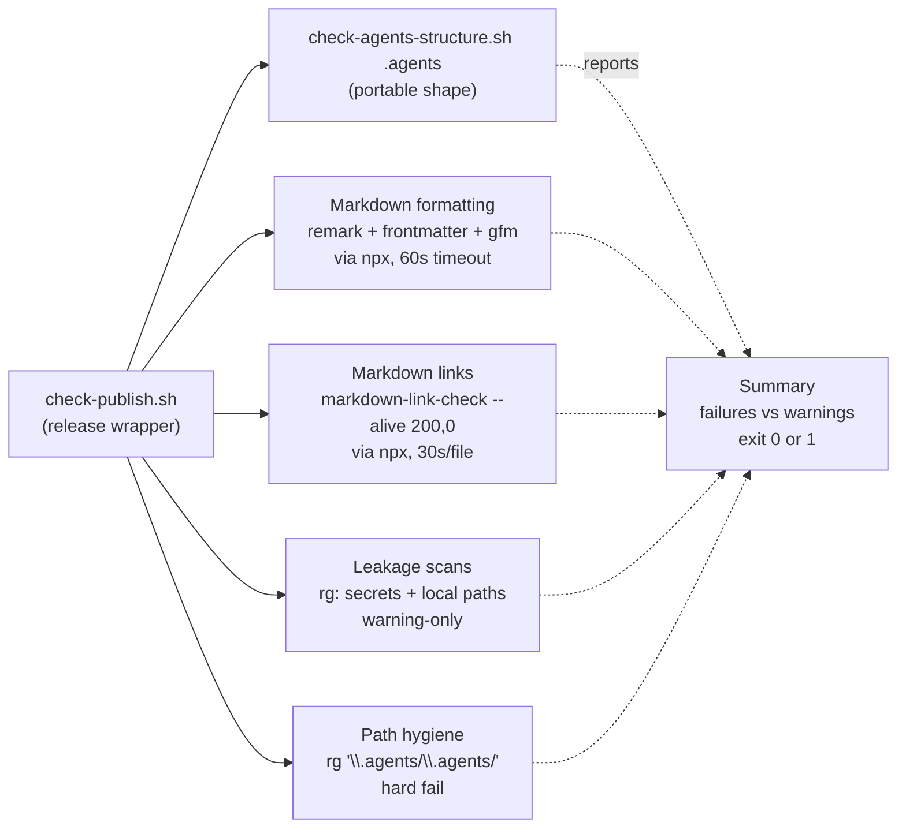
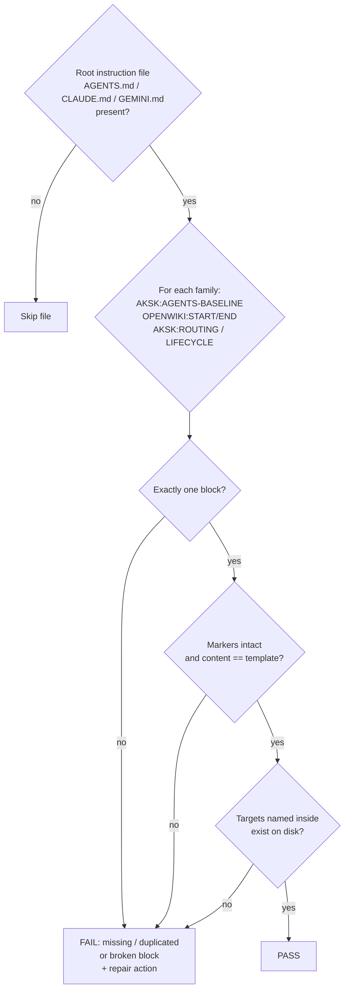

# Validation and Cross-Tool Lint

Two complementary layers guard this repository's knowledge wiring: **deterministic bash validators** that enforce file shape without network access, and a **procedure-and-checklist lint skill** (`docs-lint`) that verifies cross-artifact coherence. The validators own structure; the lint pass owns wiring. Neither owns index regeneration.

## Two validators, two scopes

### Portable validator: `check-agents-structure.sh`

```bash
bash scripts/check-agents-structure.sh [target]
# target defaults to .agents; also used as example/.agents
```

The portable validator answers one question: *does the distributable knowledge tree have the right shape?* It is the contract a consumer repo can run in isolation.

**Entrypoint and parameters.** Single positional argument `target` (default `.agents`), normalized with `${target%/}`. All checks are scoped to that tree; nothing outside `.agents` is inspected. This is what lets it validate a copied `example/.agents` snapshot.

**Control flow and sections:**

1. **Agent Knowledge Structure** — verifies `target` directory exists.
2. **Required Files** — asserts a fixed manifest is present as regular files (checked with `-f`):
   `AGENTS.md`, `.gitignore`, `playbooks/README.md`, `sessions/README.md`, `skills/aksk-bootstrap/SKILL.md`, `skills/docs-lint/SKILL.md`, `skills/learning-distill/SKILL.md`, `skills/task-closeout/SKILL.md` plus the three task-closeout example bundle files. Missing entries increment `failures`.
3. **Session Tracking** — git-aware. Inside a git worktree it compares `git ls-files -- target/sessions` against the single expected tracked file `target/sessions/README.md`. Bundles under `sessions/[0-9]*` must be ignored (`git status --short --ignored`). Outside git it warns and skips. This enforces the invariant that only `README.md` is tracked while local evidence stays ignored.
4. **Skill Frontmatter** — finds every `target/skills/**/SKILL.md`, checks line 1 is `---` and that the first 12 lines contain `^name: ` and `^description: `. No YAML parse; a lightweight marker check.
5. **JSON** — enumerates `*.json` under `target` via `git ls-files` (tracked) or `find` with a prune on `sessions/[0-9]*`. If `jq` is on PATH, validates each with `jq empty`; if `jq` is absent, warns and skips. Exit 0 when `failures == 0`, else 1.

The `jq`-optional design is intentional: hard failure on invalid JSON when the tool is present, soft skip when absent, so the check remains portable to minimal containers.

### Release wrapper: `check-publish.sh`

```bash
bash scripts/check-publish.sh
# npm run check  -> bash scripts/check-publish.sh
```

The wrapper answers: *is this starter repo releasable right now?* It delegates structure to the portable validator, then adds starter-repo-only release hygiene. It always `cd`s to `git rev-parse --show-toplevel` and runs the portable check on **root `.agents` only**.



*Caption: release wrapper delegation to portable shape check plus starter-repo hygiene gates.*

**Additional sections beyond delegation:**

| Section | Tooling | Failure semantics |
| --- | --- | --- |
| **Markdown Formatting** | `remark` (or `npx --no-install remark`) with `.remarkrc.json` (`remark-frontmatter` + `remark-gfm`), bounded by `timeout 60s` when available | `fail` if remark reports violations; `warn` + skip if `npx`/`remark` unavailable |
| **Markdown Links** | `npx --no-install markdown-link-check --alive 200,0` per tracked `*.md` (excluding `example/*`), bounded by `timeout 30s` | `fail` if any file fails; `warn` + skip if unavailable; `--alive 200,0` keeps offline/CSP `0` from failing every external URL |
| **Published Files List** | `find .agents -maxdepth 4 -type f` | informational — reviewer checks the distributable surface |
| **Publish Leakage Scans** | `rg --hidden --glob '!*sessions/[0-9]*'` for high-signal secrets (`Bearer …`, `sk-…`, `ghp_…`, `github_pat_…`, `AWS_*`, `-----BEGIN .*PRIVATE KEY-----`, `/home/…/`, `C:\Users\`) | `warn` on hits, never hard `fail` — narrow scan is a backstop, not a secret manager |
| **Knowledge path hygiene** | `rg -n --hidden --glob '!*sessions/[0-9]*' '\.agents/\.agents/' README.md INSTALL.md docs .agents` | **`fail`** if any hit — symptom of a bad global replace that doubled the prefix |

All `npx` probes use `npx --no-install` plus an optional `timeout` wrapper: if the package is not already locally available the check is skipped rather than installing on the fly. The summary prints `Failures` and `Warnings`; any `failures > 0` exits 1 and blocks publishing. `warnings` never block but require manual review.

**Operational note.** `package.json#scripts.check` is wired to `bash scripts/check-publish.sh`; `package.json#scripts.format` runs `remark` over `.agents/**/*.md`. Pre-publish playbook step 9 explicitly sequences: refresh wiki indexes first (`sync_wiki_indexes.mjs`), then run `docs-lint`, then run `check-publish.sh`.

## docs-lint: cross-tool wiring pass

`docs-lint` is **not a script**. It is a procedure-and-checklist skill (`.agents/skills/docs-lint/SKILL.md` + `CONTRACT.md`) whose inputs are declared read-only and whose writes are constrained to reports plus minimal edits to AKSK-owned files only. An agent or maintainer executes the checks by inspection; two narrow mechanical pieces can be run directly (doubled-path grep and frontmatter schema validation).

### Ownership and inputs

- **Reads:** root instruction files and their marker blocks (`AGENTS.md`, `CLAUDE.md`, `GEMINI.md` when present); `.agents/AGENTS.md` and `.agents/playbooks/`; `openwiki/INSTRUCTIONS.md` and the curated trees under `openwiki/`; `openspec/changes/archive/` (for coverage pairing).
- **Writes:** reports and minimal edits to AKSK-owned files only (`.agents/AGENTS.md`, playbooks, curated page content). Never writes OpenWiki-owned files (directory indexes, `.last-update.json`, `.run.json`) or content inside marker blocks except by rerunning the owning `aksk-bootstrap` script.
- **Out of scope by design:** hand-maintained section indexes and activity logs. `openwiki/{decisions,troubleshooting}/index.md` is owned by deterministic `sync_wiki_indexes.mjs`; `.agents/docs/` (including `log.md`) was deleted during knowledge consolidation. Index drift is reported as *informational guidance to rerun sync*, not as a wiring failure — lint must not replace OpenWiki-owned content.

### Wiring checks (fail the pass)

#### 1. Routing-block integrity — all three AGENTS.md zones

Every root instruction file present is checked independently. Each managed block must appear **exactly once**, be byte-intact, and any link targets named inside must exist on disk. Zoned order for a fully bootstrapped `AGENTS.md` is baseline → OpenWiki → AKSK (routing → lifecycle).

| Zone | Markers | Owner script | Repair action |
| --- | --- | --- | --- |
| FerroxLabs behavioral baseline | `<!-- AKSK:AGENTS-BASELINE:BEGIN/END -->` | `init_agents_md.mjs` (seed) / `refresh_agents_baseline.mjs` (opt-in update) | `node .agents/skills/aksk-bootstrap/scripts/init_agents_md.mjs` — file creation is offline from a vendored template; `--replace`/`--combine` resolve conflicts; `--combine` stages `.agents/sessions/agents-md-combine/<timestamp>/` |
| OpenWiki | `<!-- OPENWIKI:START/END -->` | OpenWiki tooling | Presence only — never hand-edit; rerun `openwiki --update` or `sync_wiki_indexes.mjs` |
| AKSK Routing | `<!-- AKSK:ROUTING:BEGIN/END -->` | `attach_section.mjs` + `routing-note-template.md` | `node .agents/skills/aksk-bootstrap/scripts/attach_section.mjs <root> <target> <template>` |
| AKSK Lifecycle | `<!-- AKSK:LIFECYCLE:BEGIN/END -->` | `attach_section.mjs` + `lifecycle-template.md` | same as routing |



*Caption: routing-block integrity decision flow per instruction file and per zone family.*

Marker parsing is template-driven: `markersOf()` extracts `<!-- AKSK:*:BEGIN -->` from the template itself, not from a hard-coded list. Zone isolation is strict — damage to one family's markers is reported for that family only and fixing it never rewrites another zone.

The baseline is vendored at `.agents/skills/aksk-bootstrap/references/agents-md-baseline-template.md` with a provenance header (upstream URL, capture date, MIT notice, refresh pointer). Seeding never touches the network; offline refresh validates the fetched response before swapping only the content between baseline markers. Staleness is not a hard failure: the agent compares `Captured: YYYY-MM-DD` in the provenance header — older than six months surfaces as informational advice. Validate without writing via:

```bash
node .agents/skills/aksk-bootstrap/scripts/refresh_agents_baseline.mjs --check
```

On network or validation failure the vendored copy stays byte-identical.

Stale AKSK routing/lifecycle blocks (marker present but content differs from the current `references/*-template.md`) are refreshed in place via:

```bash
node .agents/skills/aksk-bootstrap/scripts/attach_section.mjs [repo-root] [target-file] [template-name]
```

The script is idempotent — no-op when the marked section already matches the template — and never touches content outside the markers.

#### 2. Wiki contract present

`openwiki/INSTRUCTIONS.md` must carry the `<!-- AKSK:WIKI-CONTRACT:BEGIN/END -->` markers. The section is attached via `attach_wiki_contract.mjs` from `references/wiki-contract-template.md`: append-only, idempotent by marker detection, stub-aware, never replacing OpenWiki-owned content. If the file is missing the script exits 2 printing the verbatim prerequisite `openwiki --init` with no writes. On kit upgrade where the template changed, only the content between markers is refreshed — contract drift is repaired by rerunning the same attachment command:

```bash
node .agents/skills/aksk-bootstrap/scripts/attach_wiki_contract.mjs [repo-root]
```

#### 3. Archived-change ↔ wiki coverage pairing

For each change under `openspec/changes/archive/`, descriptive outcomes must appear in `openwiki/` or be covered by a recorded deferral. Lint reports uncovered changes.

- The check iterates `openspec/changes/archive/*/`. Each directory is expected to have a summary page; deferral is recorded **on that page** (not as a separate manifest). Three worked deferrals exist in this repo: `2026-08-23-aksk-openspec-bridge/wiki-coverage.md` (scope recorded on the governance page) and the two `2026-07-18` OBE deferrals that redirect to `integrate-openwiki-skills`.
- An uncovered change is not automatically a wiki debt — pure process retirements (e.g., `escalate-quick-reference` built on the deleted `docs-compile` generator) correctly defer. The governance page documents the supersession lineage that justifies each deferral.

#### 4. Stale curated knowledge — superseded and contradictory pages

Pages under `openwiki/{decisions,troubleshooting}/` are checked against repository reality:

- **Retired-skill references** — a decision that still directs agents to a retired skill (e.g., `docs-search`, `docs-compile`, forked `openspec-*` skills) is flagged with the superseding source.
- **`aksk_status: accepted` with a successor** — `aksk_superseded_by` set while `aksk_status` remains `accepted` is a wiring failure. The reconciled triple-lock convention verified here: superseded pages carry `aksk_status: superseded`; listings that surface them add the bold `[SUPERSEDED]`/`[OBSOLETE]` prefix and strikethrough as secondary locks. Frontmatter is authoritative; markdown locks are derived.
- **Dead `aksk_depends_on` targets** — qualified references (`decisions/<slug>` or `troubleshooting/<slug>`) whose slug does not match any filename stem in the target tree fail the check.
- Each flag names the superseding source so the fix is a frontmatter update plus link repair, not silent deletion.

### Content checks (report, suggest — do not fail the pass)

- Duplication and contradictions between `.agents/AGENTS.md`, playbooks, and knowledge pages; oversized AGENTS sections.
- Broken relative links within `.agents/` and `openwiki/`.
- Frontmatter contract of curated pages: filename stem unique per tree; decision pages carry `aksk_status`; validate against JSON Schemas under `learning-distill/references/*.schema.json` at runtime via `openwiki/dist/okf/frontmatter.js` (`validateOkfFrontmatter`). The filename stem is the identity for `aksk_depends_on`/`aksk_superseded_by` — renames must update all inbound references.
- Troubleshooting entries that should be playbooks; decision pages that should compress into AGENTS guidance.
- **Path hygiene** — same `rg '\.agents/\.agents/'` scan as in `check-publish.sh`, but as a lint report rather than a hard gate when run via docs-lint. `check-publish.sh` is the enforcement point that hard-fails on this pattern.

### Output, constraints, and index ownership

- Produces a **lint report** plus optional minimal edits to AKSK-owned files only. Proposes rerunning `node .agents/skills/aksk-bootstrap/scripts/sync_wiki_indexes.mjs` for index drift instead of failing — indexes are rebuilt deterministically via `OpenWikiLocalShellBackend` (`docsOnly: true`, `virtualMode: true`) without invoking the LLM. Lint never writes OpenWiki-owned files.
- **Never writes OpenWiki-owned files** (directory indexes, run metadata) and never appends to a log — none exists. Accountability after lint lives in git history and session bundle flags.
- **Prefers reclassification and compression** over adding text; does not modify source code; does not delete curated knowledge without explicit justification and a recorded successor or deferral.

## Offline-safe and fail-fast invariants

- **No installation.** Every `aksk-bootstrap` script (`attach_section.mjs`, `attach_wiki_contract.mjs`, `check_peer_tools.mjs`, `sync_wiki_indexes.mjs`) and both bash validators verify prerequisites and exit 2 with remediation instead of installing. `check_peer_tools.mjs` checks `openspec`/`openwiki` on PATH via directory scan (not shell lookup), prints per-tool errors plus `npm i -g …` commands, and rejects unknown tool names explicitly.
- **Vendored baseline.** The FerroxLabs baseline is never fetched at bootstrap; the vendored `agents-md-baseline-template.md` including its provenance header is the source of truth. `refresh_agents_baseline.mjs` is opt-in and on network or validation failure leaves the vendored copy intact and usable.
- **Bounded probes.** `check-publish.sh` gates every `npx --no-install` probe with `timeout 15s` (package availability), `60s` (remark), `30s` per file (link check). Missing `jq`, `npx`, or `rg` degrades to a `WARN` skip, not a false pass or false fail. `check-agents-structure.sh` requires only `bash`, `sed`, `grep`, `find` (plus `git` for session tracking, optional for tree discovery).
- **Fail-fast with remediation.** Unknown template names, `AGENTS.md` being a directory, missing `openwiki/INSTRUCTIONS.md`, or an existing `AGENTS.md` conflict all exit 2 naming the conflict and printing the exact next command. The contract-attachment and section-attachment paths are idempotent and normalize trailing whitespace / newline-at-EOF so formatting-only diffs do not churn.

## Relationships

- **aksk-bootstrap** owns attachment and peer-tool verification; docs-lint owns verification that attachment succeeded and that markers survived hand edits.
- **learning-distill** owns scaffold templates (single copy under `learning-distill/bootstrap/`); docs-lint's own `bootstrap/` is a README pointer. Initialization defers to learning-distill; no `.agents/docs/` scaffold exists.
- **OpenWiki tooling** owns index generation (`synchronizeWikiIndexes`); docs-lint only advises rerunning it. `openwiki/INSTRUCTIONS.md` is the rendezvous point where the `AKSK:WIKI-CONTRACT` and the generated `OPENWIKI:START/END` block coexist in distinct marker pairs.
- **OpenSpec** supplies the archived-change directories that coverage pairing walks; the `closeout-change-linking` capability links session bundles to in-flight changes via `summary.json:openspec_change`, but coverage pairing only inspects `openspec/changes/archive/` — in-flight changes are out of scope.

## Focused tests and when to run

| Probe | Command | What it proves |
| --- | --- | --- |
| Portable shape (isolated tree) | `bash scripts/check-agents-structure.sh .agents` | Required files, session tracking, frontmatter headers, JSON validity |
| Copied example snapshot | `bash scripts/check-agents-structure.sh example/.agents` | Example packaging did not leak maintainer-only files |
| Release hygiene | `bash scripts/check-publish.sh` | Full format + links + leakage + doubled-path gates |
| Doubled-path hygiene (quick) | `rg -n '\.agents/\.agents/' README.md INSTALL.md docs .agents` | Same pattern lint and publish share; publish hard-fails |
| Baseline staleness (>6 months) | `node .agents/skills/aksk-bootstrap/scripts/refresh_agents_baseline.mjs --check` | Upstream validity without writing; reports capture age |
| Stale AKSK block refresh | `node .agents/skills/aksk-bootstrap/scripts/attach_section.mjs` | Idempotent refresh of routing/lifecycle markers from template |
| Wiki contract drift | `node .agents/skills/aksk-bootstrap/scripts/attach_wiki_contract.mjs` | Idempotent refresh of AKSK:WIKI-CONTRACT from template |
| Frontmatter schema | `validateOkfFrontmatter` against `learning-distill/references/*.schema.json` | Curated page contract before merge |
| Index resync (deterministic) | `node .agents/skills/aksk-bootstrap/scripts/sync_wiki_indexes.mjs` | Directory indexes reflect newly distilled pages |

Run a full docs-lint pass after several agent-assisted edits and before publishing (step 9 of the pre-publish playbook). The deterministic validators are cheap enough for CI on every push; docs-lint is the periodic maintenance pass.

## Extension points

- Adding a curated tree — extend `wiki-contract-template.md` and the `INSTRUCTIONS.md` markers, then update docs-lint's curated-tree table. No validator change needed unless the tree ships as a required file.
- Adding a marker family — add a new `references/<name>-template.md` with its `<!-- AKSK:NAME:BEGIN/END -->` pair; `attach_section.mjs` picks it up via `markersOf()` with no code change. Extend docs-lint's routing-block table to list the new family's integrity check and repair command.
- Adding a debuggable lifecycle check — gate on tool presence (`command -v`) and route to `warn`, not `fail`, unless the artifact is load-bearing. Follow the `jq`/`rg` optional-tool pattern.
