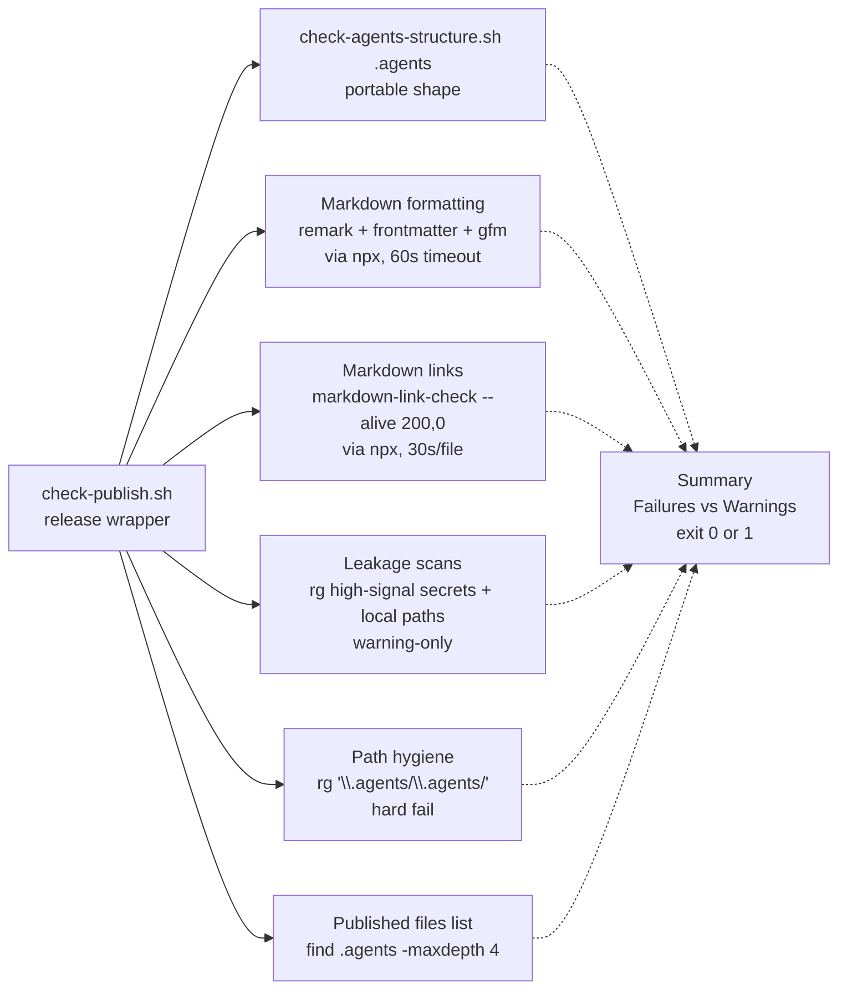

# Validation and Release

Deterministic validators and procedural playbooks guard every publish of this starter kit. `check-agents-structure.sh` owns portable shape, `check-publish.sh` wraps it with release hygiene, and the `pre-publish` and `major-version-release` playbooks sequence those checks before tagging. After `reorder-install-lanes-drop-example`, `example/` and the `generate-example` skill are removed — `bootstrap/` templates are the source of truth and `example/` is not a validation target.

> `check-publish.sh` validates root `.agents` only; `example/` is excluded from validation per the install-lanes spec. Leakage hits are warnings, doubled `.agents/.agents` is a hard failure.

## Two validators, two scopes

### Portable validator: `check-agents-structure.sh`

```bash
bash scripts/check-agents-structure.sh [target]
# target defaults to .agents; also usable for any copied knowledge layer
```

Answers one question: *does this knowledge tree have the distributable shape?* All checks are scoped to the single `target` directory (normalized via `${target%/}`); nothing outside it is inspected. That lets the same script validate an isolated consumer install or any copied layer.

**Control flow and sections:**

1. **Agent Knowledge Structure** — verifies `target` exists or `FAIL`.
2. **Required Files** — asserts a fixed manifest with `-f` (regular file). Missing entries increment `failures`:
   ```
   AGENTS.md
   .gitignore
   playbooks/README.md
   sessions/README.md
   skills/aksk-bootstrap/SKILL.md
   skills/docs-lint/SKILL.md
   skills/learning-distill/SKILL.md
   skills/task-closeout/SKILL.md
   skills/task-closeout/example/task-bundle/summary.json
   skills/task-closeout/example/task-bundle/active-task.md
   skills/task-closeout/example/task-bundle/learning-candidate.md
   skills/task-closeout/example/task-bundle/changed-files.txt
   skills/task-closeout/example/task-bundle/validation.txt
   ```
3. **Session Tracking** — git-aware. Inside a git worktree (`git rev-parse --is-inside-work-tree`) it compares `git ls-files -- target/sessions` against the single expected tracked file `target/sessions/README.md` (exact string equality after `sort`). Bundles under `sessions/[0-9]*` must appear only as ignored (`git status --short --ignored`). Outside git it `WARN`s and skips tracked/ignored checks. This enforces the invariant that only `README.md` is tracked while per-task bundles stay local evidence.
4. **Skill Frontmatter** — `find target/skills -name SKILL.md` sorted; each must start with `---` and contain `^name: ` and `^description: ` within the first 12 lines. No YAML parse — a lightweight marker check that fails fast on malformed skill headers.
5. **JSON** — enumerates `*.json` via `git ls-files` (when in git) or `find ... -path target/sessions/[0-9]* -prune -o -name '*.json'` otherwise. If `jq` is on PATH, validates each with `jq empty`; missing `jq` produces `WARN` and skips validation. Exit 0 when `failures == 0`, else 1; `warnings` never block but are counted in the summary.

Tool requirements are minimal: `bash`, `sed`, `grep`, `find` always; `git` for session tracking; `jq` optional.

### Release wrapper: `check-publish.sh`

```bash
bash scripts/check-publish.sh
# npm run check  -> bash scripts/check-publish.sh (from any subdirectory)
```

Answers: *is this starter repo releasable right now?* It `cd`s to `git rev-parse --show-toplevel` (or `pwd` outside git) and runs the portable validator on **root `.agents` only**, then adds starter-repo-only hygiene that the portable script deliberately omits. It never validates `example/.agents` — `example/` is not a validation target after the install-lanes reorder (any residual `example/` on disk is ignored, `bootstrap/` is the source of truth).



| Section | Tooling | Failure semantics |
| --- | --- | --- |
| **Portable knowledge structure** | delegates to `check-agents-structure.sh .agents` | `fail` if structure check fails |
| **Markdown Formatting** | `remark` or `npx --no-install remark --frail` with `.remarkrc.json` (`remark-frontmatter` + `remark-gfm`), bounded by `timeout 60s` when available | `fail` on violations; `warn` + skip if `npx`/`remark` unavailable |
| **Markdown Links** | `npx --no-install markdown-link-check --alive 200,0` per tracked `*.md` bounded by `timeout 30s` per file | `fail` if any file fails; `warn` + skip if unavailable; `--alive 200,0` keeps offline/CSP `0` from failing every external URL |
| **Published Files List** | `find .agents -maxdepth 4 -type f \| sort` | informational — reviewer checks the distributable surface (portable `skills/` + shared `playbooks/` + task-closeout example bundle) |
| **Publish Leakage Scans** | `rg -n --hidden --glob '!*sessions/[0-9]*' 'Bearer …|sk-…|ghp_…|github_pat_…|AWS_*|-----BEGIN .*PRIVATE KEY-----|/home/…/|C:\\Users\\'` over `README.md INSTALL.md docs .agents` | `warn` on hits, never `fail` — intentionally narrow backstop for obvious starter-repo leakage, credentials, or local machine paths |
| **Knowledge path hygiene** | `rg -n --hidden --glob '!*sessions/[0-9]*' '\.agents/\.agents/' README.md INSTALL.md docs .agents` | **`fail`** if any hit — symptom of a bad global replace that doubled the prefix (regex requires a segment after the doubled root to avoid false positives from prose citing the anti-pattern) |

All `npx` probes use `npx --no-install` plus an optional `timeout` wrapper: if the package is not locally available the check is skipped rather than installing on the fly. The script also provides `npx_package_available()` gated by `timeout 15s`. Missing `jq`, `npx`, or `rg` degrades to `WARN` skip, not a false pass or fail.

The summary prints `Failures` and `Warnings`; any `failures > 0` exits 1 and blocks publishing. Warnings require manual review but do not block.

## Pre-publish readiness playbook

`.agents/playbooks/pre-publish.md` is the checklist to run before publishing, tagging, or handing the kit to another repo. It is procedural — the agent runs the wrapper and interprets results — not a second implementation of the checks.

**Steps (condensed):**

1. Run `bash scripts/check-publish.sh` from anywhere; treat non-zero as blocking.
2. Fix invalid structure, broken links, tracked session artifacts, or Markdown formatting before proceeding.
3. Review warnings manually. Leakage hits are intentionally narrow and never auto-fail.
4. When only validating a copied knowledge layer, run `bash scripts/check-agents-structure.sh .agents` directly against the target copy.
5. For each validated tree, the only tracked file under `sessions/` should be `sessions/README.md`; ignored bundles under `sessions/` remain local evidence.
6. Review the printed `.agents/` file list — it should contain only the distributable kit for this layout: portable `skills/` plus the task-closeout example bundle files (and shared docs/playbooks as shipped).
7. If root `.agents/` changed, decide whether the change belongs in the portable kit contract versus maintainer-only dogfood (consumer-generic behavior goes in shared skills/docs; maintainer plan or session notes stay maintainer-facing unless intentionally promoted).
8. When curated wiki pages changed, run `node .agents/skills/aksk-bootstrap/scripts/sync_wiki_indexes.mjs` so OpenWiki directory indexes cover them before lint or publish.
9. Run `docs-lint` periodically, and before publishing after several agent-assisted edits, to find duplicated, stale, contradictory, oversized, or misplaced durable knowledge.
10. Inspect `git status --short` and `git diff` before tagging.

**Expected output on a healthy publish:**

- Structure checks pass for root `.agents` (what `check-publish.sh` runs automatically).
- Session tracking reports only `sessions/README.md` inside the validated tree; ignored bundles may appear but remain ignored.
- JSON, Remark, and Markdown link checks pass when their tools are installed.
- Leakage scans either produce no hits or only intentional high-signal hits after manual review.

**Review guidance from the playbook:**

- Portable skills and shared docs under `.agents/` should read as if installed in a consumer's `.agents/` — remove starter-repo-only helper workflows or session history unless they stay strictly outside published surfaces. Root `.agents/` may mix portable and maintainer-only material; do not copy maintainer-only content into published artifacts.
- `check-agents-structure.sh` is the portable validator (any target directory, no README/root `docs/` or leakage checks). `check-publish.sh` is the starter-repo wrapper (root `.agents` only plus release hygiene).
- Leakage scans intentionally avoid broad terms (`secret`, `token`, `maintainer`, `localhost`, example session paths) because this repo documents those concepts. They are not a substitute for reviewing the diff.

**Optional-tool handling:** `jq` and `rg` are system CLIs (via OS package manager), not npm tools in this workflow. Equivalent JSON fallback is `node -e "JSON.parse(...)"` but publish scripts key off `jq`; `grep -R` is a partial fallback for leakage scans. `jq`/`rg` skipped checks should be re-run with tools installed before a release-quality publish pass.

## Retired example lane

`example/` and the `generate-example` skill/playbook (`.agents/skills/generate-example/`, `.agents/playbooks/generate-example.md`) were removed in `reorder-install-lanes-drop-example` / `canonical-universal-install`. The two supported install lanes are now agent-assisted via `aksk-bootstrap` (`npx skills add -g -a <self-reported>` then `bootstrap.mjs` EXECUTE/INSTRUCT) and manual fallback via `npx skills add` — both copy missing artifacts **from** `bootstrap/` without deleting or renaming it. There is no `cp example/.agents` path and no generator to run.

Consequences for validation and release:

- `check-publish.sh` never inspects `example/`; `check-agents-structure.sh` is scoped to the single `target` passed on the command line (default `.agents`). Any residual `example/` directory on disk is excluded from validation per the packaging spec.
- `bootstrap/` templates are the source of truth. After a change to `skills/`, `AGENTS.md` zoning, or bootstrap templates, verify with `bash scripts/check-agents-structure.sh .agents` and `bash scripts/check-publish.sh` plus `docs-lint` — do not regenerate an example fixture.
- Documentation, playbooks, and shell scripts no longer reference `example/` as an install path or validation target.

## Major-version release playbook

`.agents/playbooks/major-version-release.md` is the three-check guardrail for preparing a major version of the starter kit:

1. **Search for deprecated artifacts** — aggressively `grep` the entire repository (docs, skills, playbooks) for old file names or legacy artifact terms (e.g., `docs-search-index.json`). This catches lingering references after a tool removal.
2. **Review platform portability** — ensure newly added Python or bash scripts handle cross-platform paths correctly (e.g., Windows separators vs Linux, `find`/`sed`/`grep` portability).
3. **Run tests** — ensure the kit layout is healthy via `bash scripts/check-agents-structure.sh .agents` and `bash scripts/check-publish.sh`.

This playbook is intentionally lightweight; pre-publish provides the full publish gate, while major-version-release adds the deprecation and portability sweeps that only matter when the public surface changes.

## Configuration, tooling, and package wiring

`package.json` wires the validators into npm scripts:

```json
"scripts": {
  "check": "bash scripts/check-publish.sh",
  "format": "remark \".agents/**/*.md\" --output"
}
```

`devDependencies` supply the optional tools that `check-publish.sh` probes via `npx --no-install`:

| Package | Purpose |
| --- | --- |
| `remark-cli` + `remark-frontmatter` + `remark-gfm` | Markdown formatting/style checks (`--frail`); `.remarkrc.json` configures frontmatter/GFM and style (`bullet: -`, `rule: -`, `emphasis: *`) |
| `markdown-link-check` | Link validation with `--alive 200,0` for offline tolerance |
| `skills` | `npx skills add` used by `aksk-bootstrap` bootstrap lanes |
| `@fission-ai/openspec`, `openwiki` | Peer-tool globals versioned via `references/versions.json`; not invoked by the validators |

`jq` and `rg` are **not** npm dependencies — they are system CLIs (`apt`/`brew`/`choco`/`winget`).

Additional operations wiring from the pre-publish playbook:

- **Wiki index sync** — after curated pages change, `node .agents/skills/aksk-bootstrap/scripts/sync_wiki_indexes.mjs` refreshes OpenWiki directory indexes deterministically (no LLM) before lint/publish. Distillation and lint both depend on this; the pre-publish playbook sequences it explicitly.
- **Root `.gitignore` / `.agents/.gitignore`** — `sessions/*` + `!sessions/README.md` is the merge target that both validators enforce; maintainers relying on root `.gitignore` ensure equivalent patterns exist there.

## Invariants and failure semantics

- **Portable vs wrapper scopes are strict.** `check-agents-structure.sh` never inspects outside `target`; `check-publish.sh` validates root `.agents` only and never validates `example/.agents` — `example/` is retired and excluded from release hygiene.
- **Session tracking is git-truth.** `git ls-files` is authoritative; `find`-based enumeration is the fallback outside git or for JSON discovery. Ignored bundles under `sessions/[0-9]*` are local evidence only — tracking anything else is a blocking `FAIL`.
- **Failures block, warnings advise.** Both scripts exit 0 only when `failures == 0`; `warnings` are counted but never block. Leakage scans and optional-tool skips are warnings by design; doubled-path hygiene is a failure.
- **Bounded and non-installing.** Every `npx` probe is bounded by `timeout` and uses `--no-install`. No validator installs tools; missing tools degrade to `WARN` rather than a false pass.
- **No example fixture.** After the install-lanes reorder there is no `example/` fixture to regenerate; `bootstrap/` is the distributable source of truth and the packaging page is authoritative.
- **Pre-publish is idempotent-safe.** Structure checks and `sync_wiki_indexes.mjs` can be re-run without side effects on tracked files.
- **Wiring blocks survive publish.** Post-change verification must confirm `AKSK:ROUTING`/`AKSK:LIFECYCLE` and `OPENWIKI:START/END` blocks are intact; see [AGENTS.md Zoning](../concepts/agents-md-zoning.md) and the [aksk-bootstrap skill](../skills/aksk-bootstrap.md). The pre-publish file-list review and `docs-lint` wiring checks are the enforcement points.
- **Offline-safe.** Core structure and session tracking require only `bash`/`find`/`grep`/`sed`/`git`; release hygiene degrades gracefully offline (link checks with `--alive 200,0`, `WARN` when `npx`/`rg` absent).

## Relationships

- **aksk-bootstrap** — owns the `AKSK:*` marker attachment (`attach_section.mjs`, `attach_wiki_contract.mjs`) and `sync_wiki_indexes.mjs` that pre-publish invokes after wiki edits. See [aksk-bootstrap skill](../skills/aksk-bootstrap.md).
- **AGENTS.md zoning** — defines the marker-delimited zones (`AKSK:ROUTING`, `AKSK:LIFECYCLE`, `OPENWIKI:START/END`, proposal-only `AKSK:AGENTS-BASELINE`) whose integrity is verified before publish. See [AGENTS.md Zoning](../concepts/agents-md-zoning.md).
- **Distribution** — the published-kit file list that `check-publish.sh` prints is exactly the surface that the distribution lanes consume; `example/` is not part of that surface. See [Packaging and Install Lanes](../distribution/packaging-and-install.md).
- **docs-lint / learning-distill** — `docs-lint` is the periodic wiring pass (routing-block integrity, wiki coverage pairing, stale-page detection) sequenced in pre-publish step 9; `learning-distill` owns the bootstrap templates that replaced the example fixture. See [Validation and Cross-Tool Lint](validation-and-lint.md).
- **task-closeout** — produces the `example/task-bundle/` reference files that the portable validator includes in its required-files manifest.

## Focused tests and when to run

| Probe | Command | What it proves |
| --- | --- | --- |
| Portable shape (root kit) | `bash scripts/check-agents-structure.sh .agents` | Required files, session tracking, skill frontmatter, JSON validity |
| Copied knowledge layer | `bash scripts/check-agents-structure.sh <target>` | Any copied `.agents` tree has the distributable shape and session tracking holds |
| Release hygiene (full gate) | `bash scripts/check-publish.sh` or `npm run check` | Full format + links + leakage + doubled-path gates on top of structure (root `.agents` only) |
| Doubled-path hygiene (quick) | `rg -n '\.agents/\.agents/' README.md INSTALL.md docs .agents` | Same pattern lint and publish share; publish hard-fails |
| Wiring blocks intact | `docs-lint` skill — routing-block integrity checks | `AKSK:*` and `OPENWIKI` markers survived hand edits; targets exist |
| Wiki index freshness | `node .agents/skills/aksk-bootstrap/scripts/sync_wiki_indexes.mjs` | Directory indexes reflect newly distilled pages before publish |
| Deprecation sweep (major) | `grep -R "docs-search-index.json\|<old-skill-name>" .agents docs` | No lingering references to removed tools |

Run the portable validator and wrapper on every push/CI; run the full pre-publish sequence (including `sync_wiki_indexes.mjs` and `docs-lint`) before tagging or publishing; run the major-version sweep only when preparing a major release.

## Extension points

- **New required file** — add it to the `required_files` heredoc in `check-agents-structure.sh`; `check-publish.sh` inherits it automatically.
- **New optional check** — gate on `command -v <tool>` and route to `warn` not `fail` unless the artifact is load-bearing (follow the `jq`/`rg` pattern); bound any `npx` probe with `timeout_cmd` and `--no-install`.
- **New curated wiki tree** — extend `wiki-contract-template.md` and `sync_wiki_indexes.mjs` expectations; no validator change unless the tree ships as a required file.
- **New marker family** — add a `references/<name>-template.md` with `<!-- AKSK:NAME:BEGIN/END -->` and attach via `attach_section.mjs`; extend `docs-lint` wiring checks and verify with two idempotent bootstrap runs (second is no-op).
