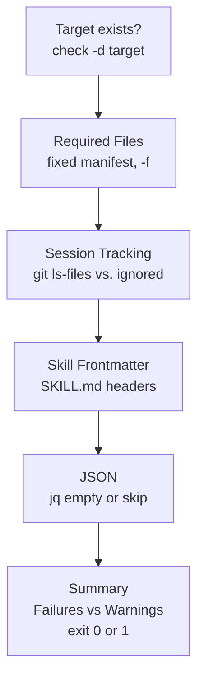
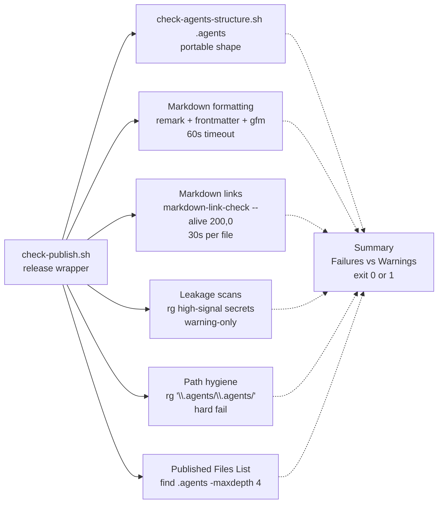

# Validation Scripts Reference

Two bash scripts provide all deterministic validation in this repository. `scripts/check-agents-structure.sh` is the portable shape check that can run against any knowledge tree. `scripts/check-publish.sh` is the starter-repo release wrapper that delegates to it for root `.agents` and adds release hygiene. Neither installs tools, neither requires network, and neither validates a second tree — `example/` and the `generate-example` skill are retired per the install-lanes spec.

## Portable validator: `check-agents-structure.sh`

Answers: *does this knowledge tree have the right shape?*

```bash
bash scripts/check-agents-structure.sh [target]
# target defaults to .agents
```

**Entrypoint and scoping.** Single positional argument `target` defaulting to `.agents`, normalized with `${target%/}`. Every check is scoped to that directory; nothing outside `target` is inspected. The same script validates the root kit or any copied layer by changing the argument.

**Tool requirements.** Always: `bash`, `sed`, `grep`, `find`. Git-aware session tracking requires `git` (degrades to `WARN` outside a worktree). `jq` is optional — JSON validation runs only when it is on `PATH`.

**Control flow — five sections in order:**



### 1. Agent Knowledge Structure

Verifies `target` is a directory. Failure increments `failures`.

### 2. Required Files

Asserts a fixed manifest of regular files (`-f`), one `PASS` or `FAIL` per entry:

```
AGENTS.md
.gitignore
playbooks/README.md
sessions/README.md
skills/aksk-bootstrap/SKILL.md
skills/docs-lint/SKILL.md
skills/learning-distill/SKILL.md
skills/task-closeout/SKILL.md
skills/task-closeout/example/task-bundle/summary.json
skills/task-closeout/example/task-bundle/active-task.md
skills/task-closeout/example/task-bundle/learning-candidate.md
skills/task-closeout/example/task-bundle/changed-files.txt
skills/task-closeout/example/task-bundle/validation.txt
```

Note: the `skills/task-closeout/example/task-bundle/` entries are the *task-closeout reference bundle*, not an install fixture. Missing entries increment `failures`.

### 3. Session Tracking

Git-aware and strict:

- Inside a git worktree (`git rev-parse --is-inside-work-tree`), compares `git ls-files -- target/sessions | sort` against the single expected string `target/sessions/README.md` (exact equality). Any additional tracked file under `sessions/` is a blocking `FAIL`.
- Reports ignored bundles via `git status --short --ignored -- target/sessions | sed -n 's/^!! //p'` as informational — bundles under `sessions/[0-9]*` must appear only as ignored, never tracked. `No ignored session bundles reported` when none exist.
- Outside git, warns `Not inside a git work tree; skipping tracked/ignored session checks` and skips both comparisons.
- When `target/sessions` does not exist at all, passes with `No sessions directory present; skipping`.

This enforces the `.gitignore` contract `sessions/*` + `!sessions/README.md`.

### 4. Skill Frontmatter

Discovers `find target/skills -type f -name SKILL.md | sort`. If none found, `FAIL`. For each file:

1. Line 1 must be exactly `---`.
2. First 12 lines must contain `^name: `.
3. First 12 lines must contain `^description: `.

No YAML parse — a lightweight marker check. Each compliant file prints `PASS`.

### 5. JSON

Enumerates `*.json` under `target`:

- In git: `git ls-files -- target | sed -n '/\.json$/p'` (tracked files only).
- Outside git: `find target -path target/sessions/[0-9]* -prune -o -type f -name '*.json' -print` (prunes numeric session bundles).

If `jq` is absent, warns and skips. If present, validates each file with `jq empty`; any invalid file sets `json_failed=1` and ultimately increments `failures`. When no JSON files exist, passes.

**Summary.** Prints `Failures:` and `Warnings:`. Exits `0` only when `failures == 0`; warnings never block. Counters are maintained by `fail()` / `warn()` / `pass()` helpers.

## Release wrapper: `check-publish.sh`

Answers: *is this starter repo releasable right now?*

```bash
bash scripts/check-publish.sh
# npm run check -> bash scripts/check-publish.sh (from any subdirectory)
```



**Composition.** Determines the repository root with `git rev-parse --show-toplevel` (falls back to `pwd` outside git) and `cd`s there. Delegates structure to `bash scripts/check-agents-structure.sh .agents` via `run_structure_check` — **root `.agents` only**. There is no second validation target; the install-lanes reorder removed `example/` as a validation surface and the wrapper never inspects outside root.

**Bounded, non-installing probes.** All `npx` usage goes through `npx --no-install` gated by `timeout_cmd`:

- `timeout_cmd` wraps with `timeout <seconds> "$@"` when `timeout` is on `PATH`, otherwise runs directly.
- `npx_package_available` probes with `timeout 15s npx --no-install <package> --help` — if the package is not locally available the check is skipped rather than installing.
- Markdown formatting is bounded by `60s`, each link check by `30s` per file. Missing tools degrade to `WARN` skips, never false passes.

### Sections beyond delegation

| Section | Tooling | Failure semantics |
| --- | --- | --- |
| **Portable knowledge structure** | `check-agents-structure.sh .agents` | `fail` if structure fails |
| **Markdown Formatting** | `remark` (or `npx --no-install remark --frail`) with `.remarkrc.json` (`remark-frontmatter` + `remark-gfm`), `timeout 60s` | `fail` on violations; `warn` + skip if `npx`/`remark` unavailable |
| **Markdown Links** | `npx --no-install markdown-link-check --alive 200,0` per tracked `*.md` (`git ls-files '*.md'`), `timeout 30s` per file | `fail` if any file fails; `warn` + skip if unavailable; `--alive 200,0` tolerates offline/CSP `0` so external URLs do not fail every run |
| **Published Files List** | `find .agents -maxdepth 4 -type f \| sort` | informational — reviewer verifies the distributable surface (portable `skills/` + shared `playbooks/` + task-closeout bundle) |
| **Publish Leakage Scans** | `rg -n --hidden --glob '!*sessions/[0-9]*' 'Bearer …\|sk-…\|ghp_…\|github_pat_…\|AWS_*\|-----BEGIN .*PRIVATE KEY-----\|/home/…/\|C:\\Users\\' -- README.md INSTALL.md docs .agents` | `warn` on hits, never `fail` — intentionally narrow backstop; avoid broad terms (`secret`, `token`, `localhost`) that would fire on documentation |
| **Knowledge path hygiene** | `rg -n --hidden --glob '!*sessions/[0-9]*' '\.agents/\.agents/' -- README.md INSTALL.md docs .agents` | **`fail`** if any hit — doubled prefix from a bad global replace; regex requires a segment after `\.agents/\.agents/` to avoid false positives from prose citing the anti-pattern |

Both `rg` scans exclude `*sessions/[0-9]*` so ignored local bundles do not pollute results.

**Summary.** Prints `Failures:` and `Warnings:`. Exits `0` only when `failures == 0`. Warnings require manual review — the pre-publish playbook explicitly directs reviewers to inspect leakage hits rather than treating them as auto-failures.

## Failure semantics and lifecycle

- **Blocking vs advisory.** `failures` block publishing (`exit 1`); `warnings` do not. Leakage scans and optional-tool skips are always warnings; doubled-path hygiene and any structure, formatting, or link failure is blocking.
- **Idempotent and side-effect free.** Both scripts are read-only checks (plus `cd` to root in the wrapper). Re-running without changes produces identical output. No validator writes files or installs packages.
- **Git truth.** `git ls-files` is authoritative for tracked-file enumeration and session tracking. `find`-based enumeration is the outside-git fallback (and the JSON fallback path that prunes `sessions/[0-9]*`).
- **Offline-safe.** Core structure and session tracking need only `bash`/`find`/`grep`/`sed`/`git`. Release hygiene degrades gracefully offline: link checks pass external URLs via `--alive 200,0`, and missing `npx`/`rg`/`jq` become `WARN` skips.

## Configuration and operations

**Package wiring.** `package.json#scripts.check` is `bash scripts/check-publish.sh`; `package.json#scripts.format` is `remark ".agents/**/*.md" --output`. `devDependencies` supply the `npx`-probed tools (`remark-cli` + `remark-frontmatter` + `remark-gfm`, `markdown-link-check`); `.remarkrc.json` configures `bullet: -`, `rule: -`, `emphasis: *` plus the two remark plugins. `jq` and `rg` are system CLIs (installed via OS package manager), not npm dependencies.

**Pre-publish sequencing** (`.agents/playbooks/pre-publish.md`):

1. `bash scripts/check-publish.sh` from anywhere — non-zero is blocking.
2. Fix structure, formatting, links, or tracked session artifacts.
3. Review warnings manually (leakage hits are narrow by design).
4. To validate an isolated copy, run `bash scripts/check-agents-structure.sh <target>` directly against that tree — the portable check is the contract a consumer can run in isolation.
5. Confirm only `sessions/README.md` is tracked; ignored bundles stay local.
6. Review the printed `.agents` file list for the distributable surface.
7. After wiki pages change, run `node .agents/skills/aksk-bootstrap/scripts/sync_wiki_indexes.mjs` before lint/publish so OpenWiki indexes are fresh.
8. Inspect `git status --short` and `git diff` before tagging.

**Retired lane.** The repository must not contain an `example/` directory or the maintainer-only `generate-example` skill/playbook. Documentation, playbooks, and shell scripts must not reference `example` as an install path or validation target. `bootstrap/` templates are the source of truth; after changes to `skills/`, `AGENTS.md` zoning, or bootstrap templates, verify with the two validators and `docs-lint` — do not regenerate a fixture. Any residual `example/` on disk is ignored and not validated.

## Invariants

- Portable vs wrapper scopes are strict: `check-agents-structure.sh` never inspects outside its single `target`; `check-publish.sh` always validates root `.agents` only.
- Session bundles are local evidence only — tracking anything beyond `sessions/README.md` is a blocking failure in every validated tree.
- `jq`, `npx`, `rg`, and `remark` absence never produces a false pass or false fail — the check is skipped with `WARN` and the summary distinguishes it from a successful pass.
- Every `npx` probe uses `--no-install` and an optional `timeout` bound; no validator installs tools.
- `skills/task-closeout/example/task-bundle/` is part of the required-files manifest, while no `example/` install surface exists.

## Relationships

- **Packaging and install lanes** — the file list the wrapper prints is exactly the surface the two install lanes (`npx skills add` via `aksk-bootstrap` and manual fallback) consume. See [Packaging and Install Lanes](../distribution/packaging-and-install.md).
- **Cross-tool lint** — `check-agents-structure.sh` owns shape, `check-publish.sh` owns release hygiene, `docs-lint` owns wiring (routing-block integrity, wiki coverage pairing, stale-page detection). Pre-publish step 9 sequences indexes → `docs-lint` → `check-publish.sh`. See [Validation and Cross-Tool Lint](validation-and-lint.md) and [Validation and Release](validation-and-release.md).
- **aksk-bootstrap** — owns `sync_wiki_indexes.mjs` and the `AKSK:*` marker attachment that the wrapper's hygiene and the file-list review indirectly protect. See `aksk-bootstrap` skill.
- **task-closeout** — produces the `example/task-bundle/` reference files that the portable manifest requires.

## Extension points

- **New required file** — add it to the `required_files` heredoc in `check-agents-structure.sh`; `check-publish.sh` inherits it automatically via delegation.
- **New optional check** — gate on `command -v <tool>` and route to `warn` not `fail` unless the artifact is load-bearing (follow the `jq`/`rg` pattern). Bound any `npx` probe with `timeout_cmd` and `--no-install`.
- **New hygiene pattern** — add a `run_warning_scan` (warning-only) or an inline `rg` + `fail` (blocking) block mirroring the existing leakage / doubled-path scans, respecting the `!*sessions/[0-9]*` glob.

## Focused tests

| Probe | Command | What it proves |
| --- | --- | --- |
| Portable shape (root kit) | `bash scripts/check-agents-structure.sh .agents` | Required files, session tracking, frontmatter, JSON |
| Any copied knowledge layer | `bash scripts/check-agents-structure.sh <target>` | Any isolated tree has the distributable shape |
| Release hygiene (full gate) | `bash scripts/check-publish.sh` or `npm run check` | Full format + links + leakage + doubled-path on root `.agents` only |
| Doubled-path quick probe | `rg -n '\.agents/\.agents/' README.md INSTALL.md docs .agents` | Same pattern publish hard-fails on |
| Formatting fix | `npm run format` (`remark ".agents/**/*.md" --output`) | Autofix style before re-running publish check |
