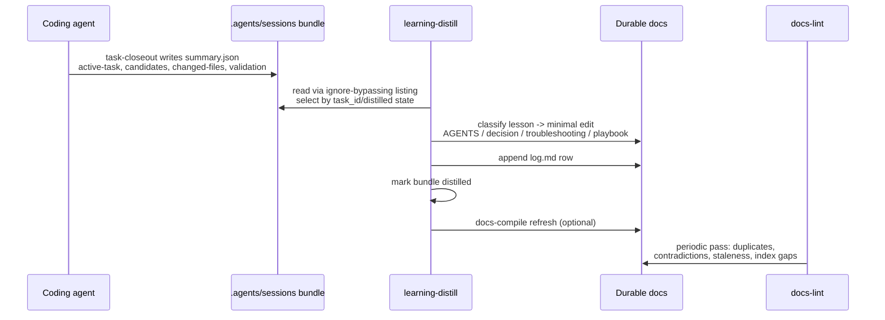

# Agent Knowledge Starter Kit — Wiki Quickstart

This is the code wiki for **agent-knowledge-starter (AKSK)** v2.0.0, a shareable, tool-agnostic starter kit for maintaining a compiled repo knowledge layer for coding agents. There is no application to run: the "runtime" is agent behavior driven by markdown skills, contracts, and two bash validation scripts. The repository is also its own best consumer — the maintainer `.agents/` tree dogfoods every convention the kit ships.

## What this repo produces

1. A **portable `.agents/` knowledge layer** — AGENTS.md guidance, decisions/, troubleshooting/, playbooks/, workflows/, and six installable skills ([architecture overview](architecture/overview.md)).
2. **Three executable tools** — the docs-search Python script, the docs-compile index generator, and generate-example's run.sh ([skills system](skills/index.md), [scripts](skills/generate-example-and-scripts.md)).
3. **Two validators** — `check-agents-structure.sh` (portable) and `check-publish.sh` (release wrapper) ([scripts](skills/generate-example-and-scripts.md)).
4. **Adoption content** — INSTALL.md flow, 15 tool-integration guides ([packaging](distribution/packaging-and-install.md), [integrations](distribution/tool-integrations.md)).
5. **Change governance** — OpenSpec-managed proposals/specs/tasks including the two-change AKSK 2.0 pipeline (`adopt-openspec-openwiki` → `aksk-bootstrap-system`) ([OpenSpec workflow](governance/openspec-workflow.md)).

## High-level map

<!-- openwiki: mermaid parse failed and this diagram was converted to a text fence so it does not break rendering. Fix the diagram source and restore the mermaid fence. Parser error: Heuristic: an unescaped angle bracket inside a label breaks rendering; rephrase the label. -->
```text
flowchart TD
    subgraph Entry["Agent entrypoints"]
        RA["root AGENTS.md"]
        CL["CLAUDE.md"]
        OY["openspec.yaml"]
    end
    subgraph KL["Portable knowledge layer (.agents/)"]
        AG[".agents/AGENTS.md"]
        DX["docs/: decisions + troubleshooting + indexes"]
        PB["playbooks/"]
        WF["workflows/ opsx-*"]
    end
    subgraph SK["Skills (.agents/skills/)"]
        TC["task-closeout"]
        LD["learning-distill"]
        DL["docs-lint"]
        DS["docs-search"]
        DC["docs-compile"]
        GE["generate-example internal"]
    end
    SE[("sessions/<br/>gitignored bundles")]
    OS["openspec/ changes+specs"]
    VAL["scripts/ check-*"]

    RA --> AG
    TC -->|"writes bundle"| SE
    SE -->|"distill"| LD
    LD -->|"writes durable"| DX
    LD --> AG
    DS -->|"queries"| DX
    DC -->|"regenerates indexes"| DX
    DL -->|"lints"| DX
    OS -.->|"governs change work"| SK
    GE -->|"rebuilds"| EX["example/.agents"]
    VAL -->|"validates"| KL
```

*Caption: the maintenance loop at a glance; solid arrows are dataflow, dashed is governance.*

## Core concepts

| Concept | One-liner | Canonical page |
| --- | --- | --- |
| Single-tree architecture | root `.agents/` is the only canonical kit tree; `example/` is generated illustration | [Architecture overview](architecture/overview.md) |
| Evidence vs durable knowledge | session bundles are raw evidence; only distilled lessons enter tracked files | [Knowledge layer](architecture/knowledge-layer.md) |
| Task identity | `task_id` in `summary.json` is canonical; folder names are sortable labels | [Task lifecycle](architecture/task-lifecycle.md) |
| Routing pattern | tool bootstrap files stay thin and point into `.agents/` | [Agent entrypoints](governance/agent-entrypoints.md) |
| Frontmatter contract | id/title/last_updated/description/list-tags (+status on decisions); qualified depends_on | [Knowledge layer](architecture/knowledge-layer.md) |
| Portable skill contracts | machine-oriented CONTRACT.md beside each SKILL.md; MAINTENANCE.md wins overlaps | [Skills system](skills/index.md) |

## Maintenance loop (the kit's core workflow)



*Caption: closeout → distill → compile → lint; details in [task lifecycle](architecture/task-lifecycle.md).*

## Task routing table

| If you want to… | Read | Source anchors | Validate with |
| --- | --- | --- | --- |
| Understand why `.agents/` looks this way | [Architecture overview](architecture/overview.md) + [knowledge layer](architecture/knowledge-layer.md) | `docs/architecture.md`, `.agents/docs/MAINTENANCE.md` | `bash scripts/check-agents-structure.sh .agents` |
| Capture finished work | [task-closeout](skills/task-closeout.md) | `.agents/skills/task-closeout/{SKILL,CONTRACT}.md`, `example/task-bundle/` | bundle contains all five required files |
| Turn bundles into durable docs | [learning-distill](skills/learning-distill.md) | `.agents/skills/learning-distill/SKILL.md`, `references/*` | `python3 …/search-docs.py "<topic>"`; log.md row |
| Find knowledge fast | [docs-search](skills/docs-search.md) | `.agents/skills/docs-search/scripts/search-docs.py` | `npm run search -- "<query>"` or direct python call |
| Refresh section indexes | [docs-compile](skills/docs-compile.md) | `.agents/skills/docs-compile/scripts/generate-durable-indexes.py` | `--dry-run` exit codes 0/2 |
| Keep knowledge coherent | [docs-lint](skills/docs-lint.md) | `.agents/skills/docs-lint/SKILL.md` checklist | lint report; doubled-path grep |
| Rebuild `example/` | [generate-example & scripts](skills/generate-example-and-scripts.md) | `run.sh`, playbook `generate-example.md` | structure check on `example/.agents` |
| Publish/release the kit | [packaging](distribution/packaging-and-install.md) | `scripts/check-publish.sh`, pre-publish playbook | `npm run check` clean exit |
| Wire a new agent tool | [tool integrations](distribution/tool-integrations.md) | `docs/integrations/patterns.md`, writing-integration-guides playbook | link check; dogfood pass |
| Propose a change properly | [OpenSpec workflow](governance/openspec-workflow.md) | `openspec/config.yaml`, `opsx-propose.md` | `npx openspec status` |
| Know what's changing in 2.0 | [OpenSpec workflow §2.0](governance/openspec-workflow.md) | `openspec/changes/{adopt-openspec-openwiki,aksk-bootstrap-system}/` | tasks.md checkboxes |

## Focused validation commands

```bash
bash scripts/check-agents-structure.sh .agents        # portable structure validator (jq optional)
bash scripts/check-agents-structure.sh example/.agents # post-regeneration check
bash scripts/check-publish.sh                          # full release hygiene (remark, links, leakage scans)
npm run check                                          # same via package.json
npm run format                                         # remark over .agents/**/*.md
python3 .agents/skills/docs-search/scripts/search-docs.py "query"   # knowledge lookup
python3 .agents/skills/docs-compile/scripts/docs-compile.py --dry-run 2>/dev/null; echo $?  # 0=fresh, 2=stale
```

There is no unit test suite (`npm test` intentionally fails); validation is script-driven plus agent-executed skill procedures. A pytest suite for scripts exists only as an active proposal.

## Backlog / known deferrals

| Item | Anchor | Reason |
| --- | --- | --- |
| Per-tool integration guide deep dives (15 pages) | `docs/integrations/*.md` | summarized collectively in [Tool integrations](distribution/tool-integrations.md); each follows one shared template so per-page prose would be redundant |
| Individual decision/troubleshooting entries (17 + 24 files) | `.agents/docs/{decisions,troubleshooting}/` | indexed exhaustively by their own generated `index.md` files; wiki links representative entries instead of duplicating them |
| Session bundle contents | `.agents/sessions/<bundle>/` | gitignored temporary evidence; format documented once in [task lifecycle](architecture/task-lifecycle.md) |
| OpenSpec change-by-change summaries for all 14 active proposals | `openspec/changes/` | grouped thematically in [OpenSpec workflow](governance/openspec-workflow.md); read each folder for full artifacts |
| Historical plan documents | `.agents/docs/plan-archive/` | superseded by OpenSpec migration; retained as generic-index section |
