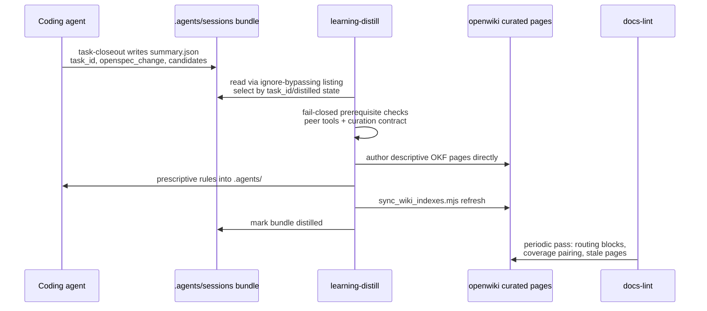

# Agent Knowledge Starter Kit — Wiki Quickstart

This is the code wiki for **agent-knowledge-starter (AKSK)** v2.0.0, a shareable, tool-agnostic starter kit for maintaining a compiled repo knowledge layer for coding agents. There is no application to run: the kit is glue over two globally installed peer tools — **OpenSpec** (process/intent) and **OpenWiki** (descriptive knowledge, which generates this wiki). The "runtime" is agent behavior driven by markdown skills, marker-delimited contracts, four Node ESM helper scripts, and two bash validation scripts. The repository is also its own best consumer — the maintainer `.agents/` tree dogfoods every convention the kit ships.

## What this repo produces

1. A **portable `.agents/` layer** — AGENTS.md guidance, playbooks/, workflows/, and four installable skills ([architecture overview](architecture/overview.md)).
2. **A curated knowledge base in this wiki** — 23 decision pages and 24 troubleshooting pages under `openwiki/{decisions,troubleshooting}/`, indexed from the [knowledge overview](overview.md), authored by distillation and preserved across update runs ([schema](maintenance-format.md)).
3. **The `aksk-bootstrap` skill** — Node scripts owning peer-tool verification, wiki-contract attachment, managed-block attachment, and deterministic index sync ([skills system](skills/index.md), [aksk-bootstrap](skills/aksk-bootstrap.md)).
4. **Two validators** — `check-agents-structure.sh` (portable) and `check-publish.sh` (release wrapper) ([scripts](skills/generate-example-and-scripts.md)).
5. **Adoption content** — INSTALL.md flow, peer-dependency prerequisites, 15 tool-integration guides ([packaging](distribution/packaging-and-install.md), [integrations](distribution/tool-integrations.md)).
6. **Change governance** — OpenSpec-managed proposals/specs/tasks including the AKSK 2.0 pipeline (`adopt-openspec-openwiki`, largely implemented → `aksk-bootstrap-system`, unstarted) ([OpenSpec workflow](governance/openspec-workflow.md)).

## High-level map

<!-- openwiki: mermaid parse failed and this diagram was converted to a text fence so it does not break rendering. Fix the diagram source and restore the mermaid fence. Parser error: Heuristic: an unescaped angle bracket inside a label breaks rendering; rephrase the label. -->
```text
flowchart TD
    subgraph Entry["Agent entrypoints"]
        RA["root AGENTS.md<br/>OPENWIKI + AKSK blocks"]
        CL["CLAUDE.md"]
        OY["openspec.yaml"]
    end
    subgraph KL["Knowledge surfaces"]
        AG[".agents/ AGENTS.md + playbooks"]
        DX["openwiki/ curated decisions<br/>+ troubleshooting"]
    end
    subgraph SK["Skills (.agents/skills/)"]
        TC["task-closeout"]
        LD["learning-distill"]
        DL["docs-lint cross-tool"]
        AB["aksk-bootstrap"]
    end
    SE[("sessions/<br/>gitignored bundles")]
    OS["openspec/ changes+specs"]
    VAL["scripts/ check-*"]

    RA --> AG
    RA --> DX
    TC -->|"writes bundle"| SE
    SE -->|"distill"| LD
    LD -->|"prescriptive"| AG
    LD -->|"descriptive OKF pages"| DX
    AB -->|"verifies peers, attaches contract,<br/>syncs indexes"| DX
    DL -->|"lints wiring of both"| KL
    OS -.->|"governs change work"| SK
    VAL -->|"validates"| AG
```

*Caption: the maintenance loop at a glance; solid arrows are dataflow, dashed is governance.*

## Core concepts

| Concept | One-liner | Canonical page |
| --- | --- | --- |
| Peer dependencies | OpenSpec + OpenWiki are global tools AKSK verifies and never installs; missing prerequisites fail fast with exact commands | [Packaging](distribution/packaging-and-install.md) |
| Descriptive vs prescriptive split | facts/rationale/troubleshooting → curated OKF pages under `openwiki/`; agent-behavior rules → `.agents/AGENTS.md` or playbooks | [learning-distill](skills/learning-distill.md) |
| Curated trees + curation contract | `decisions/` and `troubleshooting/` are AKSK-curated, preserve-and-link, with `aksk_status` frontmatter; contract lives in `INSTRUCTIONS.md` markers | [Knowledge layer](architecture/knowledge-layer.md) |
| Task identity | `task_id` in `summary.json` is canonical; folder names are sortable labels; optional `openspec_change` links bundles to changes | [Task lifecycle](architecture/task-lifecycle.md) |
| Routing pattern + managed blocks | tool bootstrap files stay thin; `AKSK:ROUTING` / `AKSK:LIFECYCLE` blocks attach via script, never by hand | [Agent entrypoints](governance/agent-entrypoints.md) |
| Cross-tool lint | docs-lint guards wiring: intact marker blocks, archived-change↔wiki coverage pairing, stale curated pages | [docs-lint](skills/docs-lint.md) |

## Maintenance loop (the kit's core workflow)



*Caption: closeout → distill → index sync → lint; details in [task lifecycle](architecture/task-lifecycle.md).*

## Task routing table

| If you want to… | Read | Source anchors | Validate with |
| --- | --- | --- | --- |
| Understand why `.agents/` looks this way | [Architecture overview](architecture/overview.md) + [knowledge layer](architecture/knowledge-layer.md) | `docs/architecture.md`, `.agents/skills/learning-distill/SKILL.md` | `bash scripts/check-agents-structure.sh .agents` |
| Capture finished work | [task-closeout](skills/task-closeout.md) | `.agents/skills/task-closeout/{SKILL,CONTRACT}.md`, `example/task-bundle/` | bundle contains all five required files |
| Turn bundles into durable knowledge | [learning-distill](skills/learning-distill.md) | `.agents/skills/learning-distill/{SKILL.md,references/}`, `references/CONTRACT.md` | OKF validation one-liner from SKILL.md step 5 |
| Verify peer tools / attach contract or blocks | [aksk-bootstrap](skills/aksk-bootstrap.md) | `.agents/skills/aksk-bootstrap/scripts/*.mjs` | rerun attachment: idempotent no-op expected |
<!-- openwiki: broken internal link [skills/aksk-bootstrap.md#index-sync] heading anchor "index-sync" does not exist in "skills/aksk-bootstrap.md". Fix the href or restore the target, then delete this comment. -->
| Refresh wiki indexes after adding pages | [aksk-bootstrap §index sync](skills/aksk-bootstrap.md#index-sync) | `sync_wiki_indexes.mjs` | prints confirmation line; exits 2 when wiki missing |
| Keep knowledge wiring coherent | [docs-lint](skills/docs-lint.md) | `.agents/skills/docs-lint/{SKILL,CONTRACT}.md` | lint report; doubled-path grep |
| Rebuild `example/` | [generate-example & scripts](skills/generate-example-and-scripts.md) | `run.sh`, playbook `generate-example.md` | structure check on `example/.agents` |
| Publish/release the kit | [packaging](distribution/packaging-and-install.md) | `scripts/check-publish.sh`, pre-publish playbook | `npm run check` clean exit |
| Wire a new agent tool | [tool integrations](distribution/tool-integrations.md) | `docs/integrations/patterns.md`, writing-integration-guides playbook | link check; dogfood pass |
| Propose a change properly | [OpenSpec workflow](governance/openspec-workflow.md) | `openspec/config.yaml`, active change folders | `npx openspec status` |
| Know what shipped in 2.0 vs pending | [OpenSpec workflow §step 1](governance/openspec-workflow.md#step-1-adopt-openspec-openwiki--implemented-and-dogfooded) | `openspec/changes/adopt-openspec-openwiki/tasks.md` | unchecked checkboxes = remaining work |

## Focused validation commands

```bash
bash scripts/check-agents-structure.sh .agents         # portable structure validator (jq optional)
bash scripts/check-publish.sh                          # full release hygiene (remark, links, leakage scans)
npm run check                                          # same via package.json
npm run format                                         # remark over .agents/**/*.md
node .agents/skills/aksk-bootstrap/scripts/check_peer_tools.mjs openspec openwiki   # preconditions
node .agents/skills/aksk-bootstrap/scripts/sync_wiki_indexes.mjs                    # deterministic index refresh
rg -ri "<symptom>" .agents/ openwiki/                  # durable-knowledge lookup (plain grep; docs-search was retired)
```

There is no unit test suite (`npm test` intentionally fails); validation is script-driven plus agent-executed skill procedures. A pytest suite for scripts exists only as the active proposal `add-script-tests`.

## Backlog / known deferrals

| Item | Anchor | Reason |
| --- | --- | --- |
| Per-tool integration guide deep dives (15 pages) | `docs/integrations/*.md` | summarized collectively in [Tool integrations](distribution/tool-integrations.md); each follows one shared template so per-page prose would be redundant |
| Session bundle contents | `.agents/sessions/<bundle>/` | gitignored temporary evidence; format documented once in [task lifecycle](architecture/task-lifecycle.md) |
| Individual decision/troubleshooting entries (23 + 24 pages) | `openwiki/{decisions,troubleshooting}/` | indexed exhaustively by their own generated `index.md` files; wiki links representative entries instead of duplicating them |
| OpenSpec change-by-change summaries for all 14 active proposals | `openspec/changes/` | grouped thematically in [OpenSpec workflow](governance/openspec-workflow.md); read each folder for full artifacts |
| `example/` regeneration against the 2.0 skill set | `example/.agents/skills/` | tracked example still contains retired `docs-search`/`docs-compile` folders; regeneration is pending task 3.3 of `aksk-bootstrap-system` (see [packaging](distribution/packaging-and-install.md)) |
| `.agents/workflows/opsx-*` retirement | `.agents/workflows/` | forked slash-command copies remain on disk pending deletion in favor of native `openspec init` output (task 4.2 remainder) |
