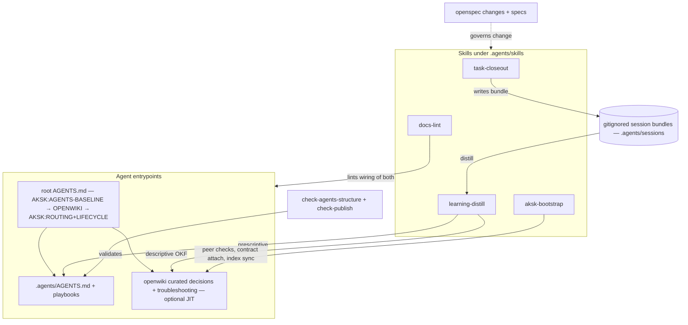
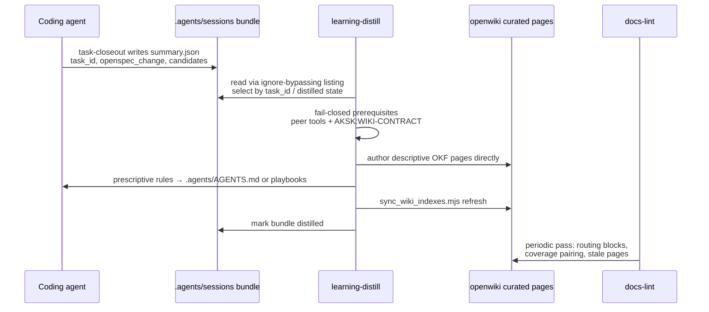

# AKSK Quickstart

The **Agent Knowledge Starter Kit (AKSK) v2.0.0** is not an application to run — it is glue over two globally installed peer tools and a portable knowledge layer. `openwiki/` is optional just-in-time context, not required startup reading; source code and `.agents/skills/**/SKILL.md` contracts are authoritative.

- **Peer tools (installed per-user, not by the kit's validators):** Node >= 22, `openwiki` (descriptive knowledge under `openwiki/`, initialized once with `openwiki --init`), `@fission-ai/openspec` (intent/process under `openspec/` — `openspec/specs/**` is the shipped contract; `openspec/changes/**` are Proposal-only and `openspec/changes/archive/**` is historical until graduated to specs). `check_peer_tools.mjs` verifies and fails fast with exact `npm i -g …` commands (exit 2, never installs); `bootstrap.mjs` adds a global lane that attempts `npm i -g` with caret versions from `references/versions.json` and falls back to printed `INSTRUCT` commands when it cannot run.
- **Runtime:** agent behavior driven by markdown skills, marker-delimited contracts, Node ESM helpers under `.agents/skills/aksk-bootstrap/scripts/` and two bash validators under `scripts/`. `dependencies` is empty; `npm test` intentionally fails.

This repo is its own best consumer — the maintainer `.agents/` tree dogfoods every convention the kit ships.

## What the kit ships

1. **Portable `.agents/` layer** — compact `AGENTS.md`, `playbooks/`, `skills/` and gitignored `sessions/`. Durable prescriptive rules only; no session history or long rationale.
2. **Curated wiki under `openwiki/`** — `decisions/` and `troubleshooting/` trees plus `overview.md` / `maintenance-format.md`, authored as OKF pages by distillation and preserved across `openwiki --update` via preserve-and-link. Browse the index at [Knowledge overview](overview.md), not duplicated here.
3. **`aksk-bootstrap` skill and scripts** — idempotent orchestrator `bootstrap.mjs` (global `npm i -g` lane + per-repo `openspec init`/scaffold/attachment) plus helpers `check_peer_tools.mjs`, `attach_wiki_contract.mjs`, `attach_section.mjs`, `init_agents_md.mjs`/`refresh_agents_baseline.mjs`, and deterministic index sync `sync_wiki_indexes.mjs`.
4. **Two validators** — `check-agents-structure.sh` (portable, runs on any `.agents` tree) and `check-publish.sh` (release wrapper, `npm run check`).
5. **Adoption content** — `INSTALL.md` skill-first flow (`npx skills add -g -a <self-reported> Hypercubed/Agent-Knowledge-Starter-Kit`), guides under `docs/integrations/` and the shared patterns.
6. **Change governance** — OpenSpec proposals/specs/tasks under `openspec/`; `openspec.yaml` declares `schema: spec-driven`. Cite `openspec/specs/**` for shipped behavior.

Details live under [System Overview](architecture/overview.md).

## High-level map



*Solid arrows are dataflow, dashed is governance.*

## Maintenance loop



1. **Closeout** — `task-closeout` captures raw evidence. Canonical `task_id` lives in `summary.json`; folder name `YYYYMMDD-HHMMSS-slug` is only a sortable label.
2. **Distill** — `learning-distill` classifies by kind (descriptive → `openwiki/`, prescriptive → `.agents/`) and never invokes `openwiki --update`.
3. **Sync** — `sync_wiki_indexes.mjs` rebuilds `openwiki/index.md` and directory indexes deterministically via `OpenWikiLocalShellBackend` (`docsOnly`/`virtualMode`) without invoking `openwiki --update`.
4. **Lint** — `docs-lint` guards wiring. Validators prove file shape in CI.

Full sequencing, bundle shape, and routing rules: [Task Lifecycle and Distill](workflows/task-lifecycle-and-distill.md).

## Where to go next — task routing

Do not duplicate the curated decision/troubleshooting catalogs — follow the links to their indexes.

| If you want to… | Read | Source anchors | Validate with |
| --- | --- | --- | --- |
| Understand zone authority | [System Overview](architecture/overview.md) · [AGENTS.md Zoning](concepts/agents-md-zoning.md) | `docs/architecture.md`, `.agents/AGENTS.md`, `AGENTS.md` markers (`AKSK:AGENTS-BASELINE`, `OPENWIKI:START/END`, `AKSK:ROUTING`/`AKSK:LIFECYCLE`) | `bash scripts/check-agents-structure.sh .agents` |
| Bootstrap a repo / attach blocks | [Bootstrap and Block Attachment](workflows/bootstrap-and-attachment.md) | `.agents/skills/aksk-bootstrap/scripts/bootstrap.mjs`, `attach_section.mjs`, `init_agents_md.mjs`, `references/*-template.md` | `node .agents/skills/aksk-bootstrap/scripts/check_peer_tools.mjs openspec openwiki` then `node .agents/skills/aksk-bootstrap/scripts/bootstrap.mjs` |
| Curate durable knowledge | [Knowledge Curation Contract](concepts/knowledge-curation-contract.md) | `openwiki/INSTRUCTIONS.md` (`AKSK:WIKI-CONTRACT`), `openwiki/overview.md`, `openwiki/maintenance-format.md` | `node .agents/skills/aksk-bootstrap/scripts/attach_wiki_contract.mjs` (idempotent no-op if attached; exits 2 with `openwiki --init` if missing) |
| Capture finished work | [Task Lifecycle and Distill](workflows/task-lifecycle-and-distill.md) · `.agents/skills/task-closeout/SKILL.md` | `.agents/skills/task-closeout/CONTRACT.md` | bundle contains `summary.json` + 4 companion files under `.agents/sessions/<timestamp-slug>/` |
| Promote bundles to durable docs | [Task Lifecycle and Distill](workflows/task-lifecycle-and-distill.md) · `.agents/skills/learning-distill/SKILL.md` | `learning-distill/references/*.schema.json` | `NPM_ROOT=$(npm root -g) node --input-type=module -e '...validateOkfFrontmatter...'` then `node .agents/skills/aksk-bootstrap/scripts/sync_wiki_indexes.mjs` |
| Refresh wiki indexes | [Bootstrap and Attachment](workflows/bootstrap-and-attachment.md) | `.agents/skills/aksk-bootstrap/scripts/sync_wiki_indexes.mjs` | prints `Wiki indexes synchronized under …`; exits 2 if `openwiki/` missing |
| Keep wiring coherent | [Validation and Release](operations/validation-and-release.md) | `.agents/skills/docs-lint/SKILL.md`, `scripts/check-publish.sh` | `bash scripts/check-publish.sh` / `npm run check` |
| Ship / distribute the kit | [Distribution and Agent Spread](integrations/distribution-and-agent-spread.md) | `package.json` (`name: agent-knowledge-starter`), `references/versions.json` | `bash scripts/check-agents-structure.sh .agents` |
| Govern changes with OpenSpec | [OpenSpec Governance](workflows/openspec-governance.md) | `openspec.yaml`, `openspec/changes/`, `openspec/specs/` | `npx openspec status` |
| Browse decisions / fixes | [Knowledge overview](overview.md) | `openwiki/decisions/` · `openwiki/troubleshooting/` | `rg -ri "<symptom>" openwiki/ .agents/` (openwiki is JIT, grep the sources) |

## Focused validation commands

```bash
bash scripts/check-agents-structure.sh .agents         # portable shape (jq optional)
bash scripts/check-publish.sh                          # full release hygiene (remark, links, leakage scans)
npm run check                                          # same via package.json
npm run format                                         # remark over .agents/**/*.md
node .agents/skills/aksk-bootstrap/scripts/check_peer_tools.mjs openspec openwiki
node .agents/skills/aksk-bootstrap/scripts/sync_wiki_indexes.mjs
rg -ri "<symptom>" .agents/ openwiki/                  # durable-knowledge lookup
```

There is no unit test suite (`npm test` exits 1 by design); validation is script-driven plus agent-executed skill procedures. Use the routing table above to pick the minimal probe for your intent.
