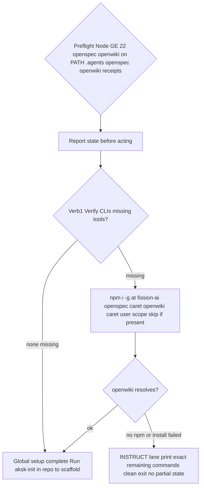

# aksk-bootstrap

**Folder:** `.agents/skills/aksk-bootstrap/` · **Scripts:** `scripts/*.mjs` (Node ESM) · **Templates:** `references/*-template.md` + `references/versions.json` · **Skill:** `SKILL.md` · **Spec:** `openspec/specs/aksk-bootstrap/spec.md`

Per-user **global lane only**. The skill is the orchestrator, `bootstrap-global.mjs` is the deterministic executor. It verifies the host can run the kit (Node, globally installed CLIs, PATH) and never touches per-repo files (`.agents/`, `openspec/`, `openwiki/`, `AGENTS.md`, `openwiki/INSTRUCTIONS.md`) except to read receipts for reporting. Per-repo scaffolding, routing, and curation-contract attachment have moved to `aksk-init`. Other skills (`learning-distill`, `docs-lint`, `task-closeout`) reuse its preconditions instead of reimplementing PATH checks or marker merges.

> **Canonical store:** default is the user-scoped universal store `~/.agents/skills` plus the current self-reported host's directory (e.g. `~/.codex/skills`), via `npx skills add -g -a <self-reported> <source>`. Extra `-a <other>` or `--all` only on explicit user request at install time. `npx` is required — the `git clone --depth 1 && cp -r .agents/skills` fallback is removed. Repo-local `./.agents/skills` is an override, not the default.

```
.agents/skills/aksk-bootstrap/
  SKILL.md
  scripts/
    bootstrap-global.mjs          # global-only orchestrator — Verify CLIs, report, INSTRUCT fallback
    bootstrap.mjs                 # backward-compat shim: global lane then aksk-init repo lane if present
    check_peer_tools.mjs          # peer-tool PATH verification (allowlist, never installs)
    attach_wiki_contract.mjs      # AKSK:WIKI-CONTRACT → openwiki/INSTRUCTIONS.md (owned, not invoked by global lane)
    attach_section.mjs            # generic AKSK:* → AGENTS.md (or any root file)
    init_agents_md.mjs            # AGENTS.md baseline seed (FerroxLabs)
    refresh_agents_baseline.mjs   # refresh vendored baseline from upstream
    sync_wiki_indexes.mjs         # deterministic index rebuild without LLM/CLI
  references/
    versions.json                 # caret pins for npm i -g (and skill installs when used)
    wiki-contract-template.md     # AKSK:WIKI-CONTRACT markers owned by template
    routing-note-template.md      # AKSK:ROUTING (default for attach_section)
    lifecycle-template.md         # AKSK:LIFECYCLE
    agents-md-baseline-template.md # AKSK:AGENTS-BASELINE (vendored FerroxLabs)
```

## Entrypoints

| Script | Invocation | Purpose |
| --- | --- | --- |
| `bootstrap-global.mjs` | `node .agents/skills/aksk-bootstrap/scripts/bootstrap-global.mjs [repo-root] [--force] [--json]` | **Primary.** Verify CLIs (Node >=22, openspec/openwiki on PATH, npm i -g if missing from caret ranges), report state, INSTRUCT fallback. No per-repo writes. |
| `bootstrap.mjs` | `node .agents/skills/aksk-bootstrap/scripts/bootstrap.mjs [repo-root] [--force] [--json]` | Shim for compatibility: runs `bootstrap-global.mjs` then `aksk-init/scripts/bootstrap-repo.mjs` if present; otherwise completes after global lane. |
| `check_peer_tools.mjs` | `node .../check_peer_tools.mjs openspec openwiki` · `import { requireBinaries } from "./check_peer_tools.mjs"` | Verify peer binaries on PATH; never installs. |
| `attach_wiki_contract.mjs` | `node .../attach_wiki_contract.mjs [repo-root]` | Append/refresh `AKSK:WIKI-CONTRACT` in existing `openwiki/INSTRUCTIONS.md` (still owned by this skill, invoked by `aksk-init` or sibling skills). |
| `attach_section.mjs` | `node .../attach_section.mjs [repo-root] [target-file] [template-name]` | Append/refresh one `AKSK:*` block in a root router file (defaults: `AGENTS.md`, `routing-note-template.md`). |
| `init_agents_md.mjs` | `node .../init_agents_md.mjs [repo-root] [--replace] [--combine]` | Seed `AGENTS.md` baseline zone `AKSK:AGENTS-BASELINE`. |
| `refresh_agents_baseline.mjs` | `node .../refresh_agents_baseline.mjs [--check]` | Fetch upstream FerroxLabs `AGENTS.md` and swap only the baseline zone in the vendored template. |
| `sync_wiki_indexes.mjs` | `node .../sync_wiki_indexes.mjs [repo-root]` | Rebuild wiki directory indexes via installed `openwiki` package helpers (no LLM, no `openwiki --update`). |

All scripts resolve `repo-root` as `path.resolve(process.argv[2] ?? process.cwd())`. Failures that block progress exit `2` with the exact remediation and without partial state from the failed step. The global lane itself is non-interactive; the skill (agent) describes each planned action and prompts `[Y/n/skip]` before invoking the script.

## Global lane — single verb



### Preflight detection

Before any mutation `bootstrap-global.mjs` detects and reports: Node major version, whether `openspec` and `openwiki` resolve on `PATH` (via `PATH` split + `PATHEXT` on win32), whether `.agents/`, `openspec/`, `openwiki/` and `openwiki/INSTRUCTIONS.md` exist, whether `AKSK:WIKI-CONTRACT` / `AKSK:ROUTING` are attached, and receipts via `openwiki integrations list --project` (best-effort, never throws). On `Node < 22` it stops before installing anything and prints the upgrade hint.

### EXECUTE vs INSTRUCT lanes

- **EXECUTE** — runs locally. Steps already satisfied are skipped (detection-driven idempotency).
- **INSTRUCT** — when any step cannot run locally (no `npm`, no write, sandboxed worker, `curl` failure), the script prints the exact remaining commands verbatim and exits clean (`process.exit(0)`) without partial state from the failed step. Completed steps remain. The skill then surfaces those commands as the answer.

```
INSTRUCT lane — run these commands manually (versions from references/versions.json, caret-pinned):
  npm i -g @fission-ai/openspec@^1.11.0 openwiki@^0.4.3
```

**Never half-installs:** failed step prints remaining commands and exits clean; no file is left half-written by that step.

### Verb — Verify CLIs (global lane, user scope)

- Reads caret ranges from `references/versions.json` via `versionsFromPackageJson(repoRoot)` — consumer repo's `package.json` is checked first for local override, then the bundled `references/versions.json`. Keys `@fission-ai/openspec` and `openwiki` (e.g. `^1.11.0`, `^0.4.3`) drive `npm i -g @fission-ai/openspec@^1.11.0 openwiki@^0.4.3`; `@latest` only when unpinned.
- `npm i -g` is per-user, not repo-local `npx` or `node_modules`. Both missing → one combined install; one missing → single package install; both present → skip and report `openspec --version` / `openwiki --version`.
- If `npm` not on PATH or install fails, INSTRUCT prints `npm i -g ...` and exits `0`. After install it re-detects and verifies `openwiki` resolves before any further step.
- **Scope invariant:** the global lane does not create or modify per-repo files; it only reads them to report state.

### Shim — `bootstrap.mjs`

For backward compatibility the thin shim logs `aksk-bootstrap shim: running global lane then repo lane`, spawns `bootstrap-global.mjs` with inherited stdio, and if `aksk-init/scripts/bootstrap-repo.mjs` exists spawns it as the repo lane. When `aksk-init` is absent it logs `aksk-init not found - global lane complete. Run aksk-init separately.` and exits `0`.

### What the global lane does not do

- **Per-repo scaffold** (`openspec init`, `.agents/` scaffold, `attach_wiki_contract`, `init_agents_md`, `attach_section` ROUTING/LIFECYCLE) — owned by `aksk-init`.
- **Host integrations spread** (`openwiki integrations install codex|claude|opencode`) — receipt-partitioned but manual opt-in per spec; the global lane never auto-installs integrations and never runs wide `--all` by default. Users run `openwiki integrations install <self-reported>` when needed.
- **Global skill installs** (`npx skills add -g -a <self-reported> Hypercubed/Agent-Knowledge-Starter-Kit`, `langchain-ai/openwiki --full-depth`) remain canonical in `~/.agents/skills` plus host mirror, with caret versions from `references/versions.json`; per spec they belong to the global lane by default and must not be performed by the repo lane.

## Contract attachment — `attach_wiki_contract.mjs`

Appends the section from `references/wiki-contract-template.md` — markers are part of the template — between `<!-- AKSK:WIKI-CONTRACT:BEGIN -->` / `<!-- AKSK:WIKI-CONTRACT:END -->`. Still owned by `aksk-bootstrap` but invoked from the repo lane or by sibling skills, not by `bootstrap-global.mjs`.

- Reads `openwiki/INSTRUCTIONS.md` with `readFileSync`. If missing, prints `error: <path> not found; this repository has no initialized OpenWiki wiki. Initialize it first with \`openwiki --init\`.` and exits `2` with no writes — AKSK never creates the wiki.
- If no `MARKER_BEGIN`, appends `\n<templated section>` below existing content with normalized newline boundary. When the file is exactly the default stub `A code wiki for this repository.` the log is stub-aware; downstream skills treat a file without markers as no-contract.
- If markers present, `refresh()` with dot-all regex `BEGIN.*?END` compares `match[0].trim() === section.trim()` → no-op (`already up to date`) else splices only the marked block in place. Content outside the pair is never touched; template upgrades refresh only the marked section.

## Managed-section attachment — `attach_section.mjs`

One mechanism for N sections — template owns its markers, script reads them at runtime.

| Template | Markers | Content |
| --- | --- | --- |
| `routing-note-template.md` (default) | `AKSK:ROUTING` | Thin discovery pointers into `.agents/` and `openwiki/` |
| `lifecycle-template.md` | `AKSK:LIFECYCLE` | Self-improvement loop mandate (closeout → distill → prune) |

- `markersOf(section)` extracts `BEGIN`/`END` via `/<!--\s*(AKSK:[A-Z-]+):BEGIN\s*-->/` and normalizes `BEGIN` whitespace; missing pair exits `2`.
- Unknown template name exits `2` with `unknown template '<name>'`.
- Target `statSync`-checked: directory at path → exit `2`; missing file (or non-file stat) → **create** containing only the templated section (root router files have no upstream initializer, so this script is their owner of record for empty files).
- File contains `markBegin` → `refresh()` with escaped dot-all `BEGIN.*?END`, trimmed equality for idempotency, mismatch refreshes only the marked block. Otherwise appends `\n<section>` with normalized newline.

## AGENTS.md baseline — `init_agents_md.mjs` / `refresh_agents_baseline.mjs`

### Zoned layout (ordered upstream-first, one writer per zone)

| Zone | Markers | Owner |
| --- | --- | --- |
| FerroxLabs behavioral baseline | `AKSK:AGENTS-BASELINE:BEGIN/END` | `init_agents_md.mjs` / `refresh_agents_baseline.mjs` |
| OpenWiki block | `OPENWIKI:START/END` | OpenWiki tooling |
| AKSK routing + lifecycle | `AKSK:ROUTING`, `AKSK:LIFECYCLE` | `attach_section.mjs` |

Idempotent per-repo order (now in `aksk-init`): `init_agents_md` (baseline) → OpenWiki block → `attach_section` (ROUTING/LIFECYCLE). `bootstrap-global.mjs` does not participate in this ordering.

### Seed initializer — `init_agents_md.mjs`

```bash
node .agents/skills/aksk-bootstrap/scripts/init_agents_md.mjs [repo-root]          # seed when missing → exit 0
node .agents/skills/aksk-bootstrap/scripts/init_agents_md.mjs [repo-root] --replace # overwrite with baseline
node .agents/skills/aksk-bootstrap/scripts/init_agents_md.mjs [repo-root] --combine # stage for LLM merge
```

- Missing `AGENTS.md` → creates it with vendored baseline wrapped in `AKSK:AGENTS-BASELINE` markers including provenance header (source URL `https://raw.githubusercontent.com/FerroxLabs/agents-md/main/AGENTS.md`, capture date, MIT notice, refresh pointer). No network access. `--replace`/`--combine` with no existing file → exit `2`.
- Existing file with matching baseline block (trailing-whitespace / newline-at-EOF normalized via `normalize()`) → no-op, exit `0`.
- Existing non-matching file with no flag → exits `2`, no writes, prints `Replace AGENTS.md with the FerroxLabs baseline, or combine both using the LLM?` plus the two flags to encode each answer (fail-fast with remediation, mirroring the kit convention). `--replace` and `--combine` are mutually exclusive.
- `--replace` → overwrites `AGENTS.md` with the marked baseline; follow with OpenWiki attach + `attach_section` to restore other zones.
- `--combine` → never modifies the original. Stages `existing.md`, `baseline.md`, and generated `COMBINE.md` brief under `.agents/sessions/agents-md-combine/<timestamp>/` with merge rules (preserve project-specific learnings, prefer baseline structure for sections 0–9, keep every marker block verbatim, final order baseline → OpenWiki → AKSK).

Markers are read from `references/agents-md-baseline-template.md`, never hard-coded; `--help` prints usage.

### Baseline refresh — `refresh_agents_baseline.mjs`

```bash
node .agents/skills/aksk-bootstrap/scripts/refresh_agents_baseline.mjs        # fetch upstream + swap baseline zone
node .agents/skills/aksk-bootstrap/scripts/refresh_agents_baseline.mjs --check # validate upstream without writing
```

- Fetches upstream to temp via `curl -fsSL https://raw.githubusercontent.com/FerroxLabs/agents-md/main/AGENTS.md`, validates: non-empty, `>5k` bytes, starts with `# AGENTS.md`, contains anchors `Non-negotiables`, `Before writing code`, `Surgical changes`, `Goal-driven execution`. Any failure exits non-zero with remediation and leaves the vendored baseline byte-identical.
- On success swaps only the content between `AKSK:AGENTS-BASELINE` markers in `references/agents-md-baseline-template.md`, updating capture date `YYYY-MM-DD` and provenance header. Other zones byte-identical by design (template contains only the baseline; repo `AGENTS.md` files untouched — re-run `init_agents_md.mjs` to propagate).
- `--check` validates upstream and exits `0` without writing; normalized compare makes re-run idempotent when already up to date.

## Peer-tool verification — `check_peer_tools.mjs`

```bash
node .agents/skills/aksk-bootstrap/scripts/check_peer_tools.mjs openspec openwiki
```

```js
import { requireBinaries } from "./check_peer_tools.mjs";
requireBinaries(["openspec", "openwiki"]); // exits 2 with install commands if absent
```

- **Allowlist only.** `INSTALL_COMMANDS` maps exactly two names: `openspec → npm i -g @fission-ai/openspec@latest` and `openwiki → npm i -g openwiki@latest`. `missing()` rejects any other name with `unknown peer tool(s): …` and exits `2`.
- **PATH only, never installs.** `onPath(cmd)` splits `PATH` by `path.delimiter`, checks each directory with `PATHEXT` extensions on win32, via `existsSync(path.join(d, cmd + e))`.
- **Fail-fast with remediation.** `requireBinaries(tools)` collects missing, prints one `error: required peer tool '…' is not installed or not on PATH.` per tool plus `Install the missing tools with:` plus each line, exits `2`. Zero missing → silent return; CLI entry prints `all peer tools present: …`. No args → exit `2` with usage.
- The global lane wraps this with caret versions from `references/versions.json` (`npm i -g @fission-ai/openspec@^1.11.0` etc.), falling back to `@latest` only if unpinned; standalone `check_peer_tools.mjs` keeps the `@latest` fallback as the informative install hint.

## Index sync — `sync_wiki_indexes.mjs`

Deterministic, offline rebuild with no LLM and no `openwiki --update`:

```bash
node .agents/skills/aksk-bootstrap/scripts/sync_wiki_indexes.mjs [repo-root]
```

- Asserts `openwiki/` exists else `error: … not found; initialize the wiki first with \`openwiki --init\`.` exit `2`.
- Locates global package via `spawnSync("npm", ["root", "-g"])`; failure exits `2` with `node and npm are required but were not found`; `<npm-root>/openwiki/dist` missing exits `2` with `npm i -g openwiki@latest`.
- Dynamically imports `agent/docs-only-backend.js` (`OpenWikiLocalShellBackend`) and `okf/index-sync.js` (`synchronizeWikiIndexes`) from global `dist` via `pathToFileURL`, constructs `new OpenWikiLocalShellBackend({ rootDir, docsOnly: true, virtualMode: true, maxOutputBytes: 100_000, timeout: 120 })` and calls `synchronizeWikiIndexes(backend, "repository")`. Curated page bodies stay byte-identical; only `openwiki/index.md` and directory indexes are rebuilt. This is the only sanctioned index-refresh path for distillation (step 7) and the remediation `docs-lint` prints for index drift.

## Relationships and state

- **Precondition provider + global orchestrator:** `learning-distill` and `docs-lint` delegate `PATH` and contract checks to these scripts rather than duplicating them. `aksk-bootstrap` owns the full global wiring; `aksk-init` owns the per-repo wiring.
- **Single writer per zone:** closeout writes only `.agents/sessions/`; distillation writes curated wiki trees, `.agents/AGENTS.md`, and playbooks via these helpers; OpenWiki owns `OPENWIKI:START/END` and `openwiki/index.md`; baseline zone owned by `init_agents_md.mjs`.
- **State is the markers.** Presence and trimmed/normalized equality of a marked block is the idempotency signal; second run after no template change is a no-op without rewriting the file.

## Invariants and failure semantics

- **Never installs silently.** Every failure prints the verbatim command (`npm i -g …`, `npx skills add -g -a …`, `openwiki --init`) and exits without side effects from the failing step. No script spawns an installer beyond the explicit global lane or mutates `PATH`.
- **Never half-installs.** `bootstrap-global.mjs` prints exact remaining INSTRUCT commands and exits clean (`0`) when a step cannot run; `attach_*` scripts either fully write or not at all.
- **Append-only and idempotent.** Content outside `AKSK:*` / `AKSK:WIKI-CONTRACT` markers is never replaced. `refresh()` swaps only between the pair; normalized compare prevents trailing-whitespace churn.
- **Zone isolation.** Refreshing one template (e.g. `lifecycle-template.md`) leaves every other zone byte-identical; damaging one zone's markers is reported for that family only.
- **Only known peer tools accepted.** Unknown names exit `2`; no lookup attempted.
- **Missing-target asymmetry:** `attach_wiki_contract.mjs` never creates `openwiki/INSTRUCTIONS.md` (fail-fast); `attach_section.mjs` and `init_agents_md.mjs` do create a missing root `AGENTS.md` (owners of record). All appends normalize trailing newline.
- **Universal+current is default; extra hosts require explicit user consent.** No persistent consent artifact — choice recorded only at install invocation.
- **Global lane is per-user, non-interactive, and per-repo-free.** Re-running on a fully bootstrapped machine is a no-op; host integrations are never wide-installed by default.

## Change recipe — adding a new managed section

1. Add a template under `.agents/skills/aksk-bootstrap/references/` carrying a unique `<!-- AKSK:<NAME>:BEGIN -->` / `<!-- AKSK:<NAME>:END -->` pair.
2. Attach with `node .agents/skills/aksk-bootstrap/scripts/attach_section.mjs <root> <target-file> <template-name>` — `markersOf()` picks it up with no code change.
3. Extend wiring checks in `.agents/skills/docs-lint/SKILL.md` so the new block is integrity-checked like `ROUTING`/`LIFECYCLE`.
4. Validate: run attachment twice (second must log no-op), damage the block and confirm lint reports that family, then `bash scripts/check-agents-structure.sh .agents`.

## Operations and focused validation

| Probe | Command | Proves |
| --- | --- | --- |
| Preflight report | `node .agents/skills/aksk-bootstrap/scripts/bootstrap-global.mjs --json` | Node, tools, trees, contract/routing, receipts before mutation |
| Global lane idempotency | Run `bootstrap-global.mjs` twice | Second run skips installs, reports versions |
| Peer tools | `node .agents/skills/aksk-bootstrap/scripts/check_peer_tools.mjs openspec openwiki` | PATH-only verification, exit 2 with install hint on miss |
| Contract idempotency | Run `attach_wiki_contract.mjs` twice | Second is `already up to date`, outside markers untouched |
| Section idempotency | Run `attach_section.mjs` twice per template | Second is `already up to date`, zone-isolated |
| Baseline seed | `node init_agents_md.mjs` on missing vs matching vs non-matching | Create, no-op (normalized), exit 2 with prompt |
| Baseline refresh check | `node refresh_agents_baseline.mjs --check` | Validates upstream without writing |
| Index sync | `node sync_wiki_indexes.mjs` | Rebuilds indexes only, bodies byte-identical |
