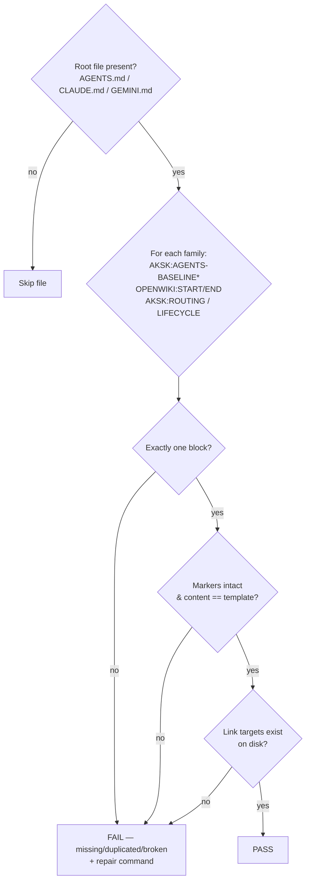
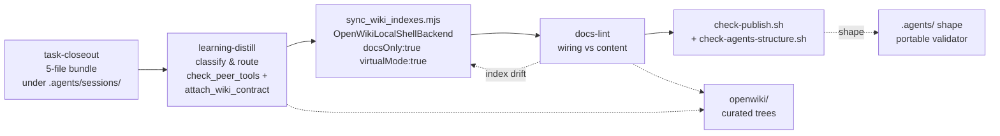

# docs-lint (cross-tool lint)

**Folder:** `.agents/skills/docs-lint/` · **Files:** `SKILL.md`, `CONTRACT.md`, `bootstrap/README.md`

## Goal

Keep the wiring between AKSK and its adopted tools coherent: routing blocks intact, wiki contract present, archived-change outcomes represented in the wiki or explicitly deferred, and curated pages truthful. `docs-lint` is a **procedure-and-checklist skill only — no bundled executable script**. An agent or maintainer runs the checks by inspection; two narrow mechanical probes can be run directly (doubled-path grep and frontmatter schema validation).

This is the periodic maintenance pass. Deterministic bash validators (`check-agents-structure.sh`, `check-publish.sh`) own file shape; OpenWiki tooling owns index regeneration; `docs-lint` owns cross-artifact wiring.

## Inputs (read-only) and writes

**Reads:** root instruction files and their marker blocks (`AGENTS.md`, `CLAUDE.md`, `GEMINI.md` when present); `.agents/AGENTS.md` and `.agents/playbooks/`; `openwiki/INSTRUCTIONS.md` and the curated trees under `openwiki/`; `openspec/changes/archive/` for coverage pairing. Declared in `CONTRACT.md` as the machine-oriented scope.

**Writes:** a lint report plus optional minimal edits to AKSK-owned files only (`.agents/AGENTS.md`, playbooks, curated page content). Never writes OpenWiki-owned files (directory `index.md` catalogs, `.last-update.json`, `.run.json`) or content inside marker blocks except by rerunning the owning `aksk-bootstrap` script (`attach_section.mjs`, `attach_wiki_contract.mjs`). On index drift it proposes rerunning `sync_wiki_indexes.mjs` rather than hand-editing indexes. No log is appended — `.agents/docs/` and its log were deleted during knowledge consolidation; accountability lives in git history and session bundle flags (`summary.json:distilled`, `distillation_status`).

**Ownership by design:** index/log ownership belongs to OpenWiki tooling. Lint reports stale coverage (e.g., a wiki directory index lagging newly added pages) as **informational guidance to rerun `sync_wiki_indexes.mjs`**, not as a wiring failure.

## Initialization — defers to learning-distill

This kit keeps exactly **one** copy of scaffold templates under `learning-distill/bootstrap/`; `docs-lint/bootstrap/` contains only a README pointing there. Initialization defers to [learning-distill](learning-distill.md). No `.agents/docs/` scaffold exists — durable knowledge lives in the wiki. No separate initialization is needed for lint-only runs.

## The checks

### Wiring checks (fail the pass)

#### 1. Routing-block integrity — shipped plus proposal-only zones

Every root instruction file present is checked independently. Each managed block must appear **exactly once**, be byte-intact (content equals its template after trimming), and any link targets named inside must exist on disk. Markers are template-driven — `markersOf()` extracts `<!-- AKSK:*:BEGIN/END -->` from the template itself, never from a hard-coded list — and zone isolation is strict: damage to one family's markers is reported for that family only and fixing it never rewrites another zone.

| Zone | Markers | Owner script | Status | Repair action |
| --- | --- | --- | --- | --- |
| FerroxLabs behavioral baseline | `<!-- AKSK:AGENTS-BASELINE:BEGIN/END -->` with provenance header (source URL, capture date) | `init_agents_md.mjs` (seed) / `refresh_agents_baseline.mjs` (opt-in update) | **Proposal-only** (`add-agents-md-bootstrap`, not yet in `openspec/specs/`) | `node .agents/skills/aksk-bootstrap/scripts/init_agents_md.mjs` (`--replace`/`--combine` for conflicts); stale capture >6 months is informational |
| OpenWiki | `<!-- OPENWIKI:START/END -->` | OpenWiki tooling (`openwiki --update` / `sync_wiki_indexes.mjs`) | Shipped | Verify presence only — never hand-edit |
| AKSK Routing | `<!-- AKSK:ROUTING:BEGIN/END -->` | `attach_section.mjs` + `routing-note-template.md` | Shipped | `node .agents/skills/aksk-bootstrap/scripts/attach_section.mjs <root> <target> <template>` |
| AKSK Lifecycle | `<!-- AKSK:LIFECYCLE:BEGIN/END -->` | `attach_section.mjs` + `lifecycle-template.md` | Shipped | Same as routing |

`* Proposal-only family — checked only when the baseline template is vendored.*

For a fully bootstrapped `AGENTS.md` the ordering is baseline → OpenWiki → Routing → Lifecycle. `AKSK:*` blocks own attachment semantics (append-only, idempotent, self-updating via `refresh()`); `OPENWIKI:START/END` is generated evidence and is never hand-edited.

#### 2. Wiki contract present

`openwiki/INSTRUCTIONS.md` must carry the `<!-- AKSK:WIKI-CONTRACT:BEGIN/END -->` markers attached via `attach_wiki_contract.mjs` from `wiki-contract-template.md`. The script is append-only, idempotent, stub-aware, and never replaces OpenWiki-owned content. If the file is missing it exits 2 printing the verbatim prerequisite `openwiki --init` with no writes. On kit upgrade where the template changed, only the content between markers is refreshed.

#### 3. Archived-change ↔ wiki coverage pairing

For each change under `openspec/changes/archive/` descriptive outcomes must appear in `openwiki/` or be covered by a **recorded deferral on that change's summary page** (not a separate manifest). Lint reports archived changes lacking coverage. Three worked deferrals exist in this repo — `2026-08-23-aksk-openspec-bridge/wiki-coverage.md` and the two `2026-07-18` OBE deferrals that redirect to `integrate-openwiki-skills`. Pure process retirements (e.g., `escalate-quick-reference` built on the deleted `docs-compile` generator) correctly defer. Stale pairing that is simply index lag is reported as informational guidance to rerun `sync_wiki_indexes.mjs`, not as a wiring failure.

#### 4. Stale curated knowledge — superseded and contradictory pages

Pages under `openwiki/{decisions,troubleshooting}/` are checked against repository reality:

- **Retired-skill references** — a page still directing agents to a retired skill (`docs-search`, `docs-compile`, forked `openspec-*` skills) is flagged with the superseding source.
- **`aksk_status: accepted` while `aksk_superseded_by` is set** — a wiring failure. Lint flags `aksk_status: superseded` mismatches and verifies the reconciled **triple-lock** convention from `formalize-superseded-obsolete`: frontmatter `aksk_status: superseded` plus `aksk_superseded_by` is authoritative; listings that surface the page add the bold `[SUPERSEDED]`/`[OBSOLETE]` prefix and strikethrough as secondary locks.
- **Dead `aksk_depends_on` targets** — qualified references (`decisions/<slug>` or `troubleshooting/<slug>`) whose slug has no matching filename stem in the target curated tree fail the check.
- Each flag names the superseding source so the fix is a frontmatter update plus link repair, not silent deletion.

### Content checks (report and suggest — do not fail the pass)

- Duplication and contradictions between `.agents/AGENTS.md`, playbooks, and knowledge pages; oversized AGENTS sections.
- Broken relative links within `.agents/` and `openwiki/`.
- Frontmatter contract of curated pages: filename stem unique per tree; decision pages carry `aksk_status`; validated against JSON Schemas under `learning-distill/references/*.schema.json` at runtime via `validateOkfFrontmatter` (`openwiki/dist/okf/frontmatter.js`). The filename stem is the identity for `aksk_depends_on`/`aksk_superseded_by` — renames must update all inbound references.
- Troubleshooting entries that should be playbooks; decision pages that should compress into AGENTS guidance.
- **Path hygiene:** `rg -n '\.agents/\.agents/' README.md INSTALL.md docs .agents` — symptom of a bad global replace. `docs-lint` reports it; `scripts/check-publish.sh` hard-fails on it.

## Outputs and constraints

Produces a **lint report** plus optional minimal edits to AKSK-owned files only. Never writes OpenWiki-owned files (indexes, run metadata), never appends to a log, never edits source code, and never deletes curated knowledge without explicit justification and a recorded successor or deferral. Prefers reclassification and compression over adding text. Accountability after lint lives in git history and session bundle flags (`summary.json:distilled`, `distillation_status`).

## Lifecycle, relationships, and invariants

- **aksk-bootstrap** owns attachment and peer-tool verification (`check_peer_tools.mjs` verifies `openspec`/`openwiki` on PATH via directory scan, exits 2 with `npm i -g …` on miss); `docs-lint` owns verification that attachment succeeded and markers survived hand edits.
- **learning-distill** owns scaffold templates (single copy); `docs-lint/bootstrap/` is a README pointer. No `.agents/docs/` scaffold.
- **OpenWiki tooling** owns `synchronizeWikiIndexes` (`agent/docs-only-backend.js` + `okf/index-sync.js`); `docs-lint` only advises rerunning it. `openwiki/INSTRUCTIONS.md` is the rendezvous where `AKSK:WIKI-CONTRACT` and `OPENWIKI:START/END` coexist in distinct marker pairs.
- **OpenSpec** supplies `openspec/changes/archive/` that coverage pairing walks; in-flight changes are out of scope.
- **Invariants:** offline-safe and fail-fast — scripts never install, exit 2 with remediation, bound probes via `timeout`, missing `jq`/`rg`/`npx` degrades to `WARN`; trailing-whitespace/Newline-at-EOF normalization prevents churn; provenance header makes baseline drift visible without network access.

## Focused validation and when to run

Run a full `docs-lint` pass after several agent-assisted edits and before publishing (step 9 of `.agents/playbooks/pre-publish.md`). The deterministic validators are cheap enough for CI on every push; `docs-lint` is the periodic maintenance pass. Pre-publish sequences: refresh wiki indexes (`sync_wiki_indexes.mjs`) → run `docs-lint` → run `check-publish.sh`.

| Probe | Command | What it proves |
| --- | --- | --- |
| Portable shape (any tree) | `bash scripts/check-agents-structure.sh [target]` | Required files, session tracking, `SKILL.md` frontmatter markers, JSON validity (optional `jq`) |
| Release hygiene | `bash scripts/check-publish.sh` / `npm run check` | Portable shape + `remark` formatting + link check + leakage + doubled-path hard fail |
| Doubled-path hygiene (quick) | `rg -n '\.agents/\.agents/' README.md INSTALL.md docs .agents` | Same pattern lint and publish share; publish hard-fails |
| Frontmatter schema | `validateOkfFrontmatter` against `learning-distill/references/*.schema.json` | Curated page contract before merge |
| Wiki contract (idempotent) | `node .agents/skills/aksk-bootstrap/scripts/attach_wiki_contract.mjs` | Marker presence without touching OpenWiki content |
| Index resync (deterministic) | `node .agents/skills/aksk-bootstrap/scripts/sync_wiki_indexes.mjs` | Directory indexes reflect newly distilled pages |

## Extension points

- **New curated tree** — extend `wiki-contract-template.md` and `openwiki/INSTRUCTIONS.md` markers, then update `docs-lint`'s curated-tree table. No validator change unless the tree ships as a required file.
- **New marker family** — add `references/<name>-template.md` with its `<!-- AKSK:NAME:BEGIN/END -->` pair; `attach_section.mjs` picks it up via `markersOf()` with no code change. Extend `docs-lint`'s routing-block table to list the new family's integrity check and repair command.
- **New debuggable lifecycle check** — gate on tool presence (`command -v`) and route to `warn`, not `fail`, unless the artifact is load-bearing (follow the `jq`/`rg` optional-tool pattern).

## Related

- [Validation and Cross-Tool Lint](../operations/validation-and-lint.md) — validators vs wiring pass, offline invariants, zone table
- [Validation and Release](../operations/validation-and-release.md) — pre-publish playbook and `generate-example` invariant
- [AGENTS.md Zoning](../concepts/agents-md-zoning.md) — marker-delimited zone stack and proposal-only baseline semantics
- [Task Lifecycle and Distillation](../workflows/task-lifecycle-and-distill.md) — closeout → distill → index sync → lint flow
- [aksk-bootstrap](aksk-bootstrap.md) — attachment scripts and peer-tool checks that lint verifies
