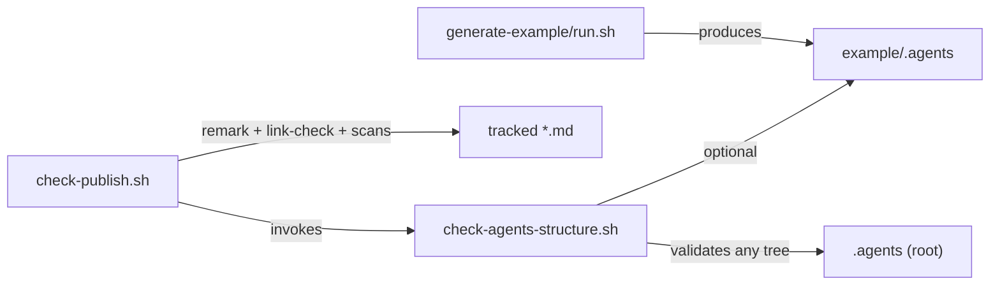

# generate-example and Validation Scripts

These are the repository's executable tooling: one generator (internal skill) and two bash validators (root `scripts/`). All are shell-first, dependency-light, and designed to degrade gracefully when optional tools are missing.

## generate-example skill (maintainer-only)

**Folder:** `.agents/skills/generate-example/` · **Files:** `SKILL.md` (frontmatter includes `metadata.internal: true`), `run.sh`

Rebuilds `/example/` as a clean illustration of a fully bootstrapped consumer install. The canonical procedure is playbook [`.agents/playbooks/generate-example.md`](../../.agents/playbooks/generate-example.md), whose cardinal rule is: **never populate `example/` by copying or merging root `.agents/docs/` or the dogfood tree — always use the script.** Hand-copied mirrors mislead consumers about what initialization actually produces (see troubleshooting entries `example-agents-looks-like-full-dogfood-copy` and `comparing-example-agents-to-root-agents`).

`run.sh` flow:

<!-- openwiki: mermaid parse failed and this diagram was converted to a text fence so it does not break rendering. Fix the diagram source and restore the mermaid fence. Parser error: Heuristic: an unescaped angle bracket inside a label breaks rendering; rephrase the label. -->
```text
flowchart TD
    A["rm -rf example/ && mkdir"] --> B["write example/README.md"]
    B --> C["npx skills add repo-root<br/>--copy --agent cursor"]
    C --> D["copy LD bootstrap templates:<br/>playbooks README, docs files,<br/>decisions+troubleshooting subtrees,<br/>sessions README, AGENTS.md"]
    D --> E["write .agents/.gitignore:<br/>sessions/* + !sessions/README.md"]
    E --> F["done"]
```

*Caption: `run.sh` rebuild sequence. `LD` = `.agents/skills/learning-distill`; `sync_docs_subtree()` copies bootstrap `decisions/`/`troubleshooting/` create-missing-only via a find/-print0 loop. Passing `-v`/`--verbose` enables `set -x`. Because it shells out to `npx skills`, the "stalled maintenance scripts" troubleshooting entry applies.*

Internal-skill exclusion happens upstream: `skills add` skips folders flagged `metadata.internal: true`, so only the five user-facing skills land in `example/.agents/skills/`. A decision entry obligates maintainers to regenerate `example/` whenever portable kit content changes.

## scripts/check-agents-structure.sh (portable validator)

Usage: `bash scripts/check-agents-structure.sh <target>` (default `.agents`). This is the validator consumers can run against their own installed tree. Checks:

1. **Required files** — AGENTS.md, .gitignore, docs/{MAINTENANCE,index,log}.md, decisions/index.md, troubleshooting/index.md, playbooks/README.md, sessions/README.md, the three core SKILL.md files, and all five task-closeout example-bundle files.
2. **Session tracking** (git repos) — `git ls-files` under `<target>/sessions` must equal exactly `sessions/README.md`; prints ignored bundles via `git status --short --ignored`.
3. **Skill frontmatter** — every SKILL.md starts with `---` and has `name:` / `description:` within the first 12 lines.
4. **JSON validity** — every tracked `.json` under target validated with `jq` (skipped with a warning when jq is absent).

Exit 0 only with zero failures. Known gap recorded in the pre-publish playbook: running it against `example/.agents` can mismatch session-tracking expectations after regeneration until script and layout agree.

## scripts/check-publish.sh (release wrapper)

Starter-repo-only; runs from anywhere (`git rev-parse --show-toplevel`). Sections:

1. **Structure** — runs the portable validator on root `.agents` only.
2. **Markdown formatting** — `remark $md_files --frail` over tracked `*.md` (local binary preferred, then `npx --no-install remark`); configured by `.remarkrc.json` (frontmatter + GFM plugins, dash bullets, asterisk emphasis). Skipped with warnings if unavailable.
3. **Markdown links** — per-file `markdown-link-check --alive 200,0`; deliberately excludes `learning-distill/bootstrap/docs/{index,MAINTENANCE}.md` (relative links resolve only post-init) and everything under `example/`.
4. **Published files list** — prints up-to-depth-4 file listing of `.agents` for manual review against distributable scope.
5. **Leakage scan** — narrow high-signal regexes (Bearer tokens, `sk-`/`ghp_`/GitHub PAT keys, AWS key env names, PEM headers, `/home/<user>/`, `C:\Users\`) over README.md, INSTALL.md, docs, .agents; hits are **warnings**, not failures.
6. **Knowledge path hygiene** — hard-fails on doubled `.agents/.agents/` path segments (with trailing segment required so prose citing the anti-pattern survives).

Summary prints failure/warning counts; non-zero exit blocks publishing. Optional tools degrade to skipped-with-warning so the script works on minimal machines, but release quality expects jq, rg, npx+remark, and markdown-link-check installed (see [pre-publish playbook](../../.agents/playbooks/pre-publish.md)).

## Relationship map



*Caption: the three executables and their targets. The publish wrapper composes the portable validator rather than duplicating its checks.*
