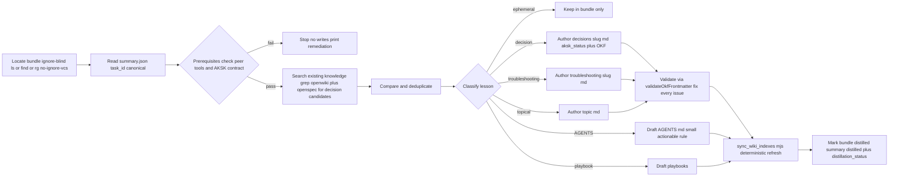

# learning-distill

**Folder:** `.agents/skills/learning-distill/` · **Files:** `SKILL.md`, `references/CONTRACT.md`, `references/decision-frontmatter.schema.json`, `references/troubleshooting-frontmatter.schema.json`, `references/wiki-contract-template.md` (owned by `aksk-bootstrap`), `bootstrap/AGENTS.md`, `bootstrap/playbooks/README.md`, `bootstrap/sessions/README.md`

## Goal and inputs

Convert raw task evidence into concise, durable repository knowledge **routed by kind**:

- **Descriptive** — facts, rationale, architecture, troubleshooting patterns, repo decisions → curated OKF concept pages under `openwiki/{decisions,troubleshooting}/` and topical pages under `openwiki/`.
- **Prescriptive** — agent behavior rules, procedures → `.agents/AGENTS.md` or `.agents/playbooks/<name>.md`.

Inputs are one session bundle under `.agents/sessions/<bundle>/` (five-file packet written by `task-closeout`), `.agents/AGENTS.md` and `.agents/playbooks/`, `openwiki/INSTRUCTIONS.md` (the curation contract), and existing curated pages under `openwiki/`. Canonical identity is the bundle's `summary.json:task_id` — never the folder name. The contract boundary (`openspec/specs/` vs `openwiki/`), fail-closed prerequisites, and deterministic index refresh are specified under `openspec/specs/distill-routing/spec.md` and realized by the three `aksk-bootstrap` scripts.

Descriptive lessons **never** go to `.agents/`; prescriptive rules **never** go to the wiki. Treating this split strictly is what `docs-lint` later verifies as misplaced-content wiring.

## Prerequisites — fail closed before any wiki write

Distillation verifies **before** writing any wiki output; on failure it stops without writing and prints remediation. These checks are shared ownership with `aksk-bootstrap`:

1. **Peer binaries on `PATH`** — `node .agents/skills/aksk-bootstrap/scripts/check_peer_tools.mjs openspec openwiki` scans `PATH` directories (not shell lookup) for both `openspec` and `openwiki`. On miss it prints one error per missing tool plus the exact install commands (`npm i -g @fission-ai/openspec@latest`, `npm i -g openwiki@latest`) and exits `2`. Unknown tool names also exit `2`. Scripts never attempt installation.

2. **`openwiki/INSTRUCTIONS.md` carries the `AKSK:WIKI-CONTRACT` markers** — `<!-- AKSK:WIKI-CONTRACT:BEGIN -->` / `<!-- AKSK:WIKI-CONTRACT:END -->`. If missing or stub-only (`A code wiki for this repository.`), run `node .agents/skills/aksk-bootstrap/scripts/attach_wiki_contract.mjs`. That script is append-only, idempotent and self-updating: it reads the desired section verbatim from `references/wiki-contract-template.md`, appends below existing content if absent (stub-aware), no-ops if already equal, or refreshes only between markers on kit upgrade. If `INSTRUCTIONS.md` does not exist it exits `2` with `openwiki --init` and performs no writes.

Treating an absent contract as "nothing curated" would let the next `openwiki --update` silently regenerate away hand-curated pages (design decision D3 of archived change `adopt-openspec-openwiki`, now SHALL under `distill-routing`), so absence fails closed. No page, no index rebuild, and no bundle flag mutation occurs on prerequisite failure.

## Skill initialization — before first distillation

Idempotent, once per repo after the skill folder is present under `.agents/skills/learning-distill/`. Creates only what a consumer needs; never overwrites existing durable content:

1. Resolve repo root (directory containing `.git/`).
2. Ensure `.agents/` exists.
3. Ensure `.agents/playbooks/` exists; if `.agents/playbooks/README.md` missing, copy `bootstrap/playbooks/README.md` into place.
4. Ensure `.agents/sessions/` exists; if `.agents/sessions/README.md` missing, copy `bootstrap/sessions/README.md` into place.
5. If `.agents/AGENTS.md` missing, copy `bootstrap/AGENTS.md` template into place (copy-missing-only).
6. Ensure `.agents/.gitignore` contains exactly these two lines (merge if absent, never remove unrelated rules):
   ```gitignore
   sessions/*
   !sessions/README.md
   ```
   Repos that intentionally do not track `.agents/.gitignore` replicate the equivalent patterns in the root `.gitignore` (`.agents/sessions/*` and `!.agents/sessions/README.md`).
7. Run the `aksk-bootstrap` peer-tool check and contract attachment so the wiki side is ready.

The kit's durable knowledge base lives in the wiki; this skill **no longer seeds any `.agents/docs/` scaffold** — `docs/architecture.md` retains the old layout only for historical schema reference.

## Finding bundles under gitignore

Per-task folders under `.agents/sessions/` are deliberately gitignored (only `README.md` tracked), so many search and listing tools skip them by default. **Never conclude that no bundles exist based on an ignore-aware search or glob.**

Locate bundles with at least one ignore-blind method:

- filesystem listing (`ls`, `find`, shell APIs) rather than an IDE index;
- ripgrep with `--no-ignore-vcs` (or `--no-ignore` when scoped to the sessions subtree).

Then open each candidate's `summary.json`: treat `task_id` as canonical and filter/prioritize using state fields (`distilled`, `status`, `distillation_status`) instead of folder names. Folder names (`YYYYMMDD-HHMMSS-short-topic`) are sortable storage labels only. This failure mode is also curated as `openwiki/troubleshooting/session-discovery-fails-during-distillation-or-closeout.md`.

## Classification and routing

Classify each candidate lesson and route by the bar in `SKILL.md` and `references/CONTRACT.md`:

| Category | Destination | Bar to clear |
| --- | --- | --- |
| `ephemeral` | stays in bundle | one-off detail not worth promoting |
| `AGENTS guidance` | `.agents/AGENTS.md` | high confidence, broadly useful, likely to recur, concise, actionable |
| `playbook` | `.agents/playbooks/<name>.md` | durable multi-step procedure |
| `decision record` | `openwiki/decisions/<slug>.md` | rationale needing explanation later; `aksk_status` required |
| `troubleshooting record` | `openwiki/troubleshooting/<slug>.md` | recurring failure + fix |
| `descriptive lesson` | topical page under `openwiki/` (e.g., `openwiki/architecture/foo.md`) | stable fact or pattern worth keeping |

Two hard boundaries cut across the table:

- **No duplication with OpenSpec** — if a candidate restates or overlaps a SHALL requirement already codified in `openspec/specs/`, distillation must **not** create or extend a wiki page; cite the spec capability instead. Wiki pages record facts and rationale; requirements live only in OpenSpec (`openspec-openwiki-aksk-division-of-labor`).
- **Never cross the zone boundary** — violations surface as `docs-lint` misplaced-content reports.

Preserve only stable, reusable knowledge; reject low-confidence or one-off lessons. Do not copy task history into `AGENTS.md`; do not expand `AGENTS.md` with rationale or narrative; do not invent repo rules unsupported by bundle evidence; do not copy secrets, personal data, or long raw dumps.

## Frontmatter, identity, and graph edges

Curated wiki pages follow OpenWiki's OKF base extended with the AKSK namespace. Validation runs two ways: JSON Schemas in `references/` and the installed package's `openwiki/dist/okf/frontmatter.js:validateOkfFrontmatter(file)`.

| Field | Applies to | Contract |
| --- | --- | --- |
| `type`, `title`, `description`, `tags`, `timestamp` | all curated pages | OKF base; `tags` is a non-empty list of lowercase `[a-z0-9_-]` slugs |
| `aksk_status` | `decisions/` pages (**required**) | `accepted`, `superseded`, or `provisional` |
| `aksk_superseded_by` | superseded pages | successor slug `[a-z0-9_-]`; pair with a relative Markdown link to the successor (frontmatter is the authoritative lock) |
| `aksk_depends_on` | any curated page | YAML list of **qualified references** `decisions/<slug>` or `troubleshooting/<slug>` where `<slug>` equals the target's filename stem |
| `aksk_*` (additional) | any page | allowed and preserved round-trip (`additionalProperties: true`) |

**Entry identity is the filename stem** (without `.md`), lowercase `[a-z0-9_-]`, unique **within its tree**. Filenames carry no type prefix; disambiguation lives in qualified references and in relative Markdown links (`other-id.md` for siblings, `../overview.md` for root pages). Renames are breaking — inbound `aksk_depends_on` / `aksk_superseded_by` references must be updated. Body shape is conventional: decisions use `### Decision / Status / Context / Rationale / Consequences` (Status mirrors `aksk_status`); troubleshooting entries use `#### Symptom / Likely causes / Fix / Validation`.

Cross-references between knowledge pages use relative Markdown links; superseded pages point at their successor via `aksk_superseded_by` plus a link.

## Procedure — control flow



*Caption: distillation control flow from bundle discovery through fail-closed prerequisites, search and deduplication, kind-based routing, OKF validation, deterministic index sync, and distilled flag.*

Steps in detail:

1. Locate and read the correct bundle per the gitignore invariant; read `task_id` from `summary.json`.
2. Search related existing knowledge with `grep` over `openwiki/` (bodies are plain Markdown) before comparing manually. For decision- or requirement-shaped candidates also search `openspec/specs/` — a rule already codified as SHALL must not be duplicated as a wiki page.
3. Compare candidates against existing knowledge; remove duplication.
4. Classify each lesson per the table above (prefer small edits over large rewrites).
5. For wiki-bound lessons, load authoring guidance **at runtime** from the installed package and author the page **directly** under the correct curated tree (never via `openwiki --update`):

   ```bash
   NPM_ROOT="$(npm root -g)" node --input-type=module -e '
     import { pathToFileURL } from "node:url"; import path from "node:path";
     const m = await import(pathToFileURL(path.join(process.env.NPM_ROOT, "openwiki/dist/agent/prompt.js")).href);
     console.log(m.createSystemPrompt(process.argv[1] ?? "init"));
   ' init
   ```
   Use `init` for new pages, `update` for edits. Follow that guidance plus the OKF/AKSK frontmatter rules, then validate:

   ```bash
   NPM_ROOT="$(npm root -g)" node --input-type=module -e '
     import { readFileSync } from "node:fs";
     import { pathToFileURL } from "node:url"; import path from "node:path";
     const fm = await import(pathToFileURL(path.join(process.env.NPM_ROOT, "openwiki/dist/okf/frontmatter.js")).href);
     const file = process.argv[1];
     console.log(JSON.stringify(fm.validateOkfFrontmatter(readFileSync(file, "utf8"), file)));
   ' openwiki/<path>.md
   ```

   Fix every reported issue before continuing. Schemas in `references/` (`decision-frontmatter.schema.json`, `troubleshooting-frontmatter.schema.json`) encode the same contract for offline inspection.

6. Draft minimal updates to `.agents/AGENTS.md` or playbooks for prescriptive lessons (AGENTS only when high-confidence, broadly useful, likely to recur, concise, actionable).
7. Refresh wiki indexes deterministically — see next section.
8. Mark the session bundle as distilled (`summary.json:distilled = true` plus `distillation_status`); keep `task_id` unchanged. There is **no separate log file** — accountability lives in bundle flags plus git history.

## Deterministic index sync

`node .agents/skills/aksk-bootstrap/scripts/sync_wiki_indexes.mjs [repo-root]` is the **only** supported way to rebuild wiki catalogs outside the scheduled `openwiki --update` run. Distillation never invokes `openwiki --update`; it authors pages directly and refreshes indexes via this script.

Control flow:

- Resolve repo root (`process.argv[2] ?? process.cwd()`); if `openwiki/` directory missing, exit `2` with `openwiki --init` remediation.
- Locate the global package via `npm root -g`; if `npm` unavailable or `openwiki/dist` missing, exit `2` with `npm i -g openwiki@latest`.
- Dynamically import `openwiki/dist/agent/docs-only-backend.js` and `openwiki/dist/okf/index-sync.js`.
- Construct `OpenWikiLocalShellBackend` with `{ docsOnly: true, virtualMode: true, maxOutputBytes: 100_000, timeout: 120 }` and call `synchronizeWikiIndexes(backend, "repository")`.
- Keeps curated page bodies **byte-identical** while rebuilding `openwiki/index.md` and directory `index.md` catalogs plus run metadata. Never hand-edit OpenWiki-owned files (`index.md`, `.last-update.json`, `.run.json`); `docs-lint` reports index drift as informational guidance to rerun this script.

## Allowed writes and constraints

Declared in `references/CONTRACT.md` and enforced by `distill-routing`:

- **Wiki (only after prerequisites pass):** `openwiki/decisions/*.md`, `openwiki/troubleshooting/*.md`, `openwiki/<topic>.md`; deterministic index sync via `sync_wiki_indexes.mjs`.
- **`.agents` layer:** `.agents/AGENTS.md` (only lessons meeting the AGENTS bar) and `.agents/playbooks/*.md`; the bundle's own `summary.json` distillation flags.
- **Never:** OpenWiki-owned files (`index.md` catalogs, `.last-update.json`, `.run.json`) except through deterministic sync; `openspec/`; source code outside the knowledge layer; invented rules unsupported by bundle evidence; narrative expansion of `AGENTS.md`; secrets or private data anywhere durable.
- Curated-page preservation: trees marked curated in `openwiki/INSTRUCTIONS.md` (`decisions/`, `troubleshooting/`, `overview.md`, `maintenance-format.md`) are preserve-and-link targets — the `AKSK:WIKI-CONTRACT` declares that `openwiki --update` keeps AKSK-authored bodies and links generated material to them, and that every `aksk_*` field survives round-trips.

Prefer small edits over large rewrites. Use `.agents/playbooks/` for multi-step procedures; add to `AGENTS.md` only when the lesson is durable, broad, and actionable.

## Relationships and lifecycle

- **task-closeout → learning-distill → sync → docs-lint** — `task-closeout` captures the five-file bundle (`summary.json`, `active-task.md`, `learning-candidate.md`, `changed-files.txt`, `validation.txt`) and then becomes immutable except for `distilled`/`distillation_status`; `learning-distill` consumes via `task_id`; `sync_wiki_indexes.mjs` rebuilds catalogs; `docs-lint` verifies wiring (see `openwiki/workflows/task-lifecycle-and-distill.md`).
- **OpenSpec ↔ bundles ↔ wiki** — `summary.json:openspec_change` links a bundle to an intent; `docs-lint` pairs archived changes under `openspec/changes/archive/` with wiki coverage; wiki never duplicates SHALL requirements.
- **Knowledge layer** — prescriptive `.agents/` (how agents should behave) versus descriptive `openwiki/` (facts, rationale, failure patterns) is shaped by `openwiki/architecture/knowledge-layer.md`; curation mechanics by `openwiki/concepts/knowledge-curation-contract.md`.
- **Entry lifecycle** — decision pages carry `aksk_status`; supersession sets `aksk_status: superseded` plus `aksk_superseded_by` pointing at the successor slug with a relative link (frontmatter is authoritative; listings add bold `[SUPERSEDED]` and strikethrough as secondary locks per `formalize-superseded-obsolete`). Troubleshooting entries have no lifecycle field.

The durable knowledge base migrated itself through this path: 23 decision pages and 26 troubleshooting pages now live under curated trees (each carrying `aksk_status`), indexed from `openwiki/overview.md`; end-to-end dogfood validation ran as bundle `20260823-240000-dogfood-distill-e2e`.

## Invariants and failure semantics

- **Distillation fails closed before any wiki write** when peer tools or the curation contract are missing — `distill-routing` SHALL.
- **Descriptive ↔ prescriptive boundary is strict** — descriptive lessons never land in `.agents/`; prescriptive rules never land in `openwiki/`.
- **Never invokes `openwiki --update`** — index refresh is deterministic via `sync_wiki_indexes.mjs` only.
- **Marker ownership is strict** — content between any `AKSK:*` markers is owned by its writer; hand edits are corrected by rerunning the owning script. `OPENWIKI:START/END` blocks are OpenWiki-owned.
- **Single writer per zone** — closeout owns `.agents/sessions/`; distill alone owns curated wiki trees, `AGENTS.md`, and playbooks; lint never writes OpenWiki-owned files.
- **No log file** — accountability lives in `summary.json` flags plus git history; `docs-lint` and deterministic validators (`scripts/check-agents-structure.sh`, `scripts/check-publish.sh`) guard the result.

| Failure | When detected | Behavior |
| --- | --- | --- |
| `openwiki` or `openspec` binary missing | `check_peer_tools.mjs` before any wiki write | Exit `2`, per-tool error + `npm i -g …`, no pages written |
| `openwiki/INSTRUCTIONS.md` missing | Prerequisite / `attach_wiki_contract.mjs` | Exit `2`, prerequisite `openwiki --init`, no writes |
| `INSTRUCTIONS.md` lacks `AKSK:WIKI-CONTRACT` markers (including default stub) | Distill prerequisite | Stop before any wiki write, point to `attach_wiki_contract.mjs` |
| Wiki uninitialized for index sync | `sync_wiki_indexes.mjs` | Exit `2`, `openwiki --init` hint |
| Global `openwiki` package missing | `sync_wiki_indexes.mjs` | Exit `2`, `npm i -g openwiki@latest` |
| Spec overlap | Dedupe step | Cite `openspec/specs/` capability; no wiki write |

All bootstrap scripts are offline-safe, bounded via `timeout`, and never attempt installation.

## Operations and focused validation

| Probe | Command | What it proves |
| --- | --- | --- |
| Skill procedure | Read `.agents/skills/learning-distill/SKILL.md` + `references/CONTRACT.md` | Routing, prerequisites, and write scope contract |
| Peer tools present | `node .agents/skills/aksk-bootstrap/scripts/check_peer_tools.mjs openspec openwiki` | Binaries resolvable on `PATH` |
| Contract attached (idempotent) | `node .agents/skills/aksk-bootstrap/scripts/attach_wiki_contract.mjs` | `AKSK:WIKI-CONTRACT` markers present; no-op when up to date |
| Frontmatter valid | `validateOkfFrontmatter` (`openwiki/dist/okf/frontmatter.js`) against `references/*.schema.json` | Curated pages satisfy OKF + `aksk_*` contract; fix every issue |
| Authoring guidance | `createSystemPrompt("init"\|"update")` from `openwiki/dist/agent/prompt.js` | Upstream OKF authoring rules at runtime |
| Index resync (deterministic) | `node .agents/skills/aksk-bootstrap/scripts/sync_wiki_indexes.mjs` | Directory indexes reflect newly distilled pages without `openwiki --update` |
| Portable shape | `bash scripts/check-agents-structure.sh .agents` | Required files, session tracking, frontmatter headers, JSON validity |
| Release hygiene | `bash scripts/check-publish.sh` / `npm run check` | Format + links + leakage + doubled-path `rg '\.agents/\.agents/'` hard fail |

Run a full `docs-lint` pass and `check-publish.sh` after distillation (pre-publish playbook sequencing: refresh indexes → `docs-lint` → `check-publish.sh`).

## Extension points

- **Adding a curated tree** — extend `references/wiki-contract-template.md` and the `INSTRUCTIONS.md` markers, then update `docs-lint`'s curated-tree table; no validator change unless the tree ships as a required file.
- **Adding a marker family** — add `references/<name>-template.md` with its `AKSK:NAME:BEGIN/END` pair; `attach_section.mjs:markersOf()` picks it up with no code change.
- **Adding a capability** — propose a change with `specs/<capability>/spec.md` delta SHALL requirements; archive with `openspec archive` to graduate to `openspec/specs/`.

## Related

- [The Knowledge Layer](../architecture/knowledge-layer.md) — tree shape, frontmatter table, and supersession convention.
- [Knowledge Curation Contract](../concepts/knowledge-curation-contract.md) — curated trees, attachment mechanics, and `aksk_*` extensions.
- [Task Lifecycle and Distillation](../workflows/task-lifecycle-and-distill.md) — bundle shape, `task_id` identity, and closeout→distill→sync→lint loop.
- [task-closeout Skill](task-closeout.md) — five-file capture with `task_id` canonical identity and `openspec_change` linking.
- [docs-lint Skill](docs-lint.md) — wiring versus content checks that keep the contract coherent.
- [aksk-bootstrap Skill](aksk-bootstrap.md) — peer-tool verification, contract attachment, and deterministic index sync.
- [Knowledge maintenance format](../maintenance-format.md) — frontmatter contracts and graph-edge rules.
- [OpenSpec workflow](../governance/openspec-workflow.md) — change lifecycle and division of labor.
