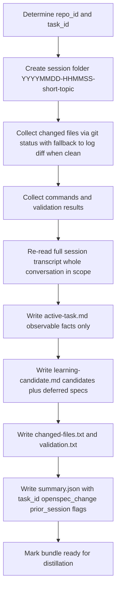
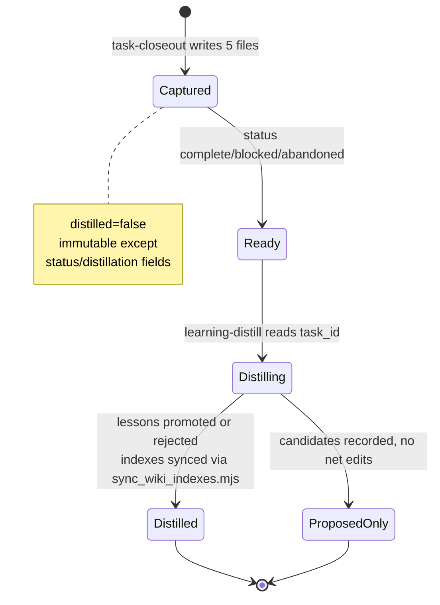

# task-closeout Skill

**Folder:** `.agents/skills/task-closeout/` · **Files:** `SKILL.md`, `CONTRACT.md`, `bootstrap/sessions/README.md`, `example/task-bundle/` (five filled-in reference files)

## Goal and trigger

Create a **temporary handoff packet** for later knowledge extraction. Run it at any meaningful stopping point — **completed, blocked, or abandoned** — when there were meaningful changes, debugging, validation, or reusable lessons. It is the **capture** half of the `capture → distill → sync → lint` loop described in [Task Lifecycle and Session Bundles](../architecture/task-lifecycle.md) and [Task Lifecycle and Distillation](../workflows/task-lifecycle-and-distill.md).

Unlike the learning phase, closeout performs **no curation or durable writes** — it only freezes raw evidence so a later `learning-distill` pass can route stable lessons to `.agents/` (prescriptive) or `openwiki/` (descriptive).

## Skill initialization (idempotent, once per repo)

Run after the skill appears under `.agents/skills/task-closeout/` (copy or package install). Safe to repeat.

1. Resolve repo root (directory containing `.git/` in normal layouts).
2. Ensure `.agents/sessions/` exists.
3. If `.agents/sessions/README.md` is missing, copy it from `bootstrap/sessions/README.md` in this skill. The README explains that bundles are **gitignored working memory** and that canonical identity lives in `summary.json:task_id`.
4. Ensure `.agents/.gitignore` exists. If missing, create it with exactly:
   ```gitignore
   sessions/*
   !sessions/README.md
   ```
   If it already exists, **merge** those two lines when absent; never remove unrelated rules.
5. If the repo does not track `.agents/.gitignore` and relies on the root `.gitignore`, ensure the equivalent patterns exist there: `.agents/sessions/*` and `!.agents/sessions/README.md`.

Deliberately **not created here:** `.agents/AGENTS.md`, `.agents/playbooks/`, or any `openwiki/` content — those belong to `learning-distill` initialization or a full kit merge.

Gitignore effect is verified by `scripts/check-agents-structure.sh`: `git ls-files` under `.agents/sessions` must equal exactly `sessions/README.md`; ignored bundles appear via `git status --short --ignored`.

## What the bundle is

`task-closeout` is the **sole writer** of `.agents/sessions/<session-folder>/`. Each folder holds **exactly one** five-file packet:

| File | Role |
| --- | --- |
| `summary.json` | Machine index: status, timestamps, **`task_id` (required)**, optional `repo_id`, optional `openspec_change`, optional `agent`/`agent_session_id`, optional `prior_session`, git metadata (`branch`, `head_commit`, `workspace_root`), distillation flags (`distilled`, `distillation_status`) |
| `active-task.md` | Observable facts only; sections: Task ID, Agent (optional), Agent Session ID (optional), Goal, Outcome, Files Changed, Commands Run, Validation, Remaining Work, Notes |
| `learning-candidate.md` | Candidate lessons only: Task, What failed, What worked, Reusable pattern, Candidate AGENTS update, Candidate troubleshooting note, Candidate repo decision, Candidate playbook, Spec updates deferred to archive time, Confidence |
| `changed-files.txt` | Paths or identifiers touched during the session |
| `validation.txt` | Checks run and outcomes (commands + pass/fail) |

A filled-in reference lives at `.agents/skills/task-closeout/example/task-bundle/` (fictional Monaco JSON worker fix) with all five files and an `openspec_change` example. The two markdown files are scoped to the **whole maintainer conversation** — mistakes, reversals, corrections — not just the final diff. Prose stays concise and bullet-oriented.

## Identity and metadata in `summary.json`

### Canonical vs label

- **Canonical task identifier:** `summary.json:task_id` (stable string, required). Every consumer, distiller, and cross-tool join must read it from there.
- **Storage label:** folder name `YYYYMMDD-HHMMSS-short-topic` — sortable, lowercase slug tied to the task goal. One bundle per folder; reuse only for the same bundle. Never infer identity from the label.
- **Repo context:** `repo_id` (optional but recommended) — stable project identifier.
- When handing work between agents, pass **both** the bundle path and the `task_id`.

### `openspec_change` — link with intent, do not mutate specs

When the session worked on an OpenSpec change, record its name in `summary.json:openspec_change` (capability `closeout-change-linking`):

```json
{
  "repo_id": "example-repo",
  "task_id": "t-20260407-143210-monaco",
  "status": "completed",
  "distilled": false,
  "openspec_change": "add-task-start"
}
```

- If no change was involved, the field is **absent or null** and closeout succeeds normally.
- **Closeout never edits anything under `openspec/`** for in-flight changes. Spec updates happen at `/opsx:archive` time, not closeout time. Pending spec changes are noted as prose in `learning-candidate.md` under *Spec updates deferred to archive time* for archiving to fold in. The `openspec_change` field is also the natural join key for `docs-lint`'s archived-change ↔ wiki coverage pairing.

> Global rule restated: include `openspec_change` in `summary.json` when a change was worked; do not modify specs during closeout.

### Optional `prior_session` chaining

Decision `optional-prior-session-in-session-summary-json` allows:

```json
{
  "task_id": "t-20260419-230724-v2-kit-closeout",
  "prior_session": ".agents/sessions/20260419-190500-knowledge-layer-layout/"
}
```

`prior_session` is a path pointer to an earlier bundle directory. It records linkage and ordering for multi-step maintainer work (adoption plus orchestrator meta-closeout, etc.) **without reopening or merging** earlier packets, which stay append-only after closeout. Distillation across linked bundles relies on `task_id`, timestamps, and `prior_session` together; agents reconstructing history may follow the pointer, but must not mutate closed session trees — prefer a new bundle that references the prior path.

### Git metadata and distillation flags

`summary.json` also carries `branch`, `head_commit`, `workspace_root`, `created_at`, `completed_at`, `status` (`completed`/`blocked`/`abandoned`), and `distilled`/`distillation_status`. After closeout, only `status` / distillation-related fields may be mutated by a later tool; everything else is frozen.

### Agent provenance (optional, independent)

Record `agent` and/or `agent_session_id` whenever the active tool supplies them, independently of each other. Mirror them as `Agent` / `Agent Session ID` sections in `active-task.md`. Never invent session IDs or require manual lookup outside the tool's supported session history.

## Mechanisms and control flow



1. **Determine or create `repo_id` and `task_id`.** `task_id` becomes canonical; folder name is only a label.
2. **Create the session folder.** Keep the slug short, lowercase, tied to the goal; extend the slug rather than changing the timestamp format on collision.
3. **Collect changed files** → `changed-files.txt`. See next section for the clean-tree fallback.
4. **Collect commands run and validation results** → `validation.txt` and the `Commands Run` / `Validation` sections of `active-task.md`.
5. **Re-read the full session or transcript** before drafting prose so notes are not scoped to the final edit only.
6. **Write `active-task.md`** (facts only) then **`learning-candidate.md`** (candidates only) — clearly separate what failed, what worked, and what is hypothesis.
7. **Write `summary.json`** with status, timestamps, ids, `openspec_change` when applicable, and optional provenance.
8. **Mark ready** for distillation. After this point the packet is immutable except for `summary.json` status/distillation fields.

## Deriving `changed-files.txt` when `git` is clean

The working tree is often clean at closeout because changes were already committed. An empty `git status` must not produce an empty evidence file.

Fallback hierarchy (match task scope):

- `git log -1 --name-only` — paths from the latest commit (single-commit task).
- `git log -N --name-only` — widen window for multi-commit arcs.
- `git diff --name-only <base>..HEAD` — explicit range for larger task scope.

`changed-files.txt` lists the resulting expected paths so `active-task.md:Files Changed` and later distillation have accurate evidence even after commits. This pattern is curated as troubleshooting `clean-git-status-but-you-need-touched-paths-for-closeout`.

## Validation evidence

- `validation.txt` is the machine-checkable record: each check run plus outcome (e.g., `npm test`, `bash scripts/check-agents-structure.sh`, `openwiki --help` probes). It is the bundle's proof that the session's claims were exercised.
- `active-task.md:Validation` and `Commands Run` mirror the same evidence in human-readable form.
- `learning-candidate.md` separates validated patterns (*What worked*) from failures and hypotheses, so distillers can reject low-confidence or one-off lessons.
- Keep evidence concise — no long raw dumps, no secrets.

## Write scope and immutability

- **Write scope:** all new files go under `.agents/sessions/<session-folder>/`. Closeout must never create or edit `.agents/AGENTS.md`, `openwiki/**`, `.agents/playbooks/**`, files under `.agents/skills/**`, or `openspec/` for in-flight changes. Proposed durable or skill changes are recorded as prose inside the bundle for `learning-distill` to apply.
- **Immutability:** after closeout the bundle is immutable **except** status / distillation-related fields in `summary.json` (`distilled`, `distillation_status`, and `status` transitions) when a later tool updates them. All other files remain frozen; earlier packets are never reopened to combine narratives (use `prior_session` instead).
- **No secrets upward:** neither bundles nor promoted pages may carry credentials, personal data, or long raw dumps.

## Relationships and lifecycle



- **This skill → `learning-distill` → `sync_wiki_indexes.mjs` → `docs-lint`.** `task-closeout` captures raw evidence; `learning-distill` consumes via `task_id`, classifies, and routes; `sync_wiki_indexes.mjs` rebuilds catalogs deterministically; `docs-lint` verifies wiring, coverage pairing via `openspec_change`, and curated-tree integrity. One writer per zone, no overlapping writers.
- **Proposed `task-start` sequencing (unshipped, `add-task-start`):** `task-start` would own creation by seeding `summary.json` with `task_id` (canonical), `created_at`, `status in_progress`, and optional `openspec_change`/`repo_id`/`agent` fields; `task-closeout` would own finalization by detecting the seeded file, preserving `task_id` and any seeded `openspec_change`, then appending `completed_at`, final `status` (`completed`/`blocked`/`abandoned`), git metadata and distillation flags plus the remaining four bundle files; `learning-distill` would consume only after finalization. Strict ordering is `start → work → closeout → distill` with no overlapping writers and `summary.json` as the single source of truth. When invoked without a prior `task-start`, closeout retains its current generation fallback. The reconciled proposal requires `task-start` to preserve and pass through `openspec_change` and distillation flags rather than redefining them.
- **Host awareness:** many tools hide `sessions/` because it is gitignored. Discovery during distillation must use an ignore-blind method (`ls`/`find` or `rg --no-ignore-vcs`), then filter `summary.json` by `task_id`/`distilled`/`status`, not by folder name.

## Invariants and failure semantics

| Invariant | If violated |
| --- | --- |
| `task_id` in `summary.json` is canonical; folder name is label only | Cross-tool joins break; wrong bundle distilled |
| `task_id` is required string; `openspec_change` only when a change was worked | Lint coverage pairing loses its join key or false-positives |
| `openspec/` untouched for in-flight changes; spec text deferred to archive | Intent layer corrupted mid-task |
| Session folder is one-bundle, write-only under `.agents/sessions/` | Durable knowledge or skill sources corrupted |
| Bundle immutable after closeout except `summary.json` distillation fields | Audit trail lost |
| `sessions/*` + `!sessions/README.md` in `.agents/.gitignore` | Bundles leak into commits or README becomes untracked |
| Bundles are temporary working memory; only distilled lessons become durable | Repo accumulates stale evidence; guidance bloat |

All bootstrap and peer-tool scripts are offline-safe and **fail closed with remediation** rather than silent fallback. Closeout itself has no peer-tool prerequisite — those gates belong to distillation — but violating write scope is treated as a hard error.

## Finding bundles under gitignore

Because everything under `sessions/` except `README.md` is ignored, ignore-aware searches may report *no bundles* when they exist.

Use at least one **ignore-blind** method:

- filesystem listing (`ls`, `find`, shell APIs) rather than an IDE index;
- ripgrep with `--no-ignore-vcs` (or `--no-ignore` scoped to the sessions subtree).

Then open each candidate's `summary.json`, treat `task_id` as canonical, and filter/prioritize by state fields (`distilled`, `status`, `distillation_status`). This failure mode is curated as `troubleshooting/session-discovery-fails-during-distillation-or-closeout`.

## Extension points

- **New `summary.json` metadata:** add optional fields alongside `prior_session` without changing the `task_id` contract; preserve `openspec_change` and distillation flags through any `task-start` sequencing (creation → finalization → consume).
- **Cloud persistence:** mirror `.agents/sessions/` to durable storage for ephemeral runners; restore the same path shape before distillation so `task_id`-based joins still work.
- **Adding a curated tree or marker family** affects distillation destinations, not bundle storage — no bundle-layout change required.
- **Proposed `task-start` (`add-task-start`):** closeout would finalize an existing seeded `summary.json` rather than generating identity from scratch, with the reconciled constraint that `task-start` **must preserve and pass through** `openspec_change` and distillation flags and that `summary.json` remains the single source of truth.

## Configuration and operations

| Probe | Command | What it proves |
| --- | --- | --- |
| Sessions dir present | `ls -la .agents/sessions/` | `README.md` tracked, bundles exist locally but untracked |
| Gitignore correct | `cat .agents/.gitignore` | Contains `sessions/*` and `!sessions/README.md` |
| Tracked-file check | `git ls-files .agents/sessions/README.md` | Exactly one file tracked there |
| Portable shape | `bash scripts/check-agents-structure.sh .agents` | Required bundle scaffold, JSON validity, frontmatter markers, plus the five example-bundle files |
| Bundle discovery (ignore-blind) | `rg --no-ignore-vcs summary.json .agents/sessions/` or `find .agents/sessions -name summary.json` | Enumeration works despite gitignore |
| Clean-tree fallback | `git log -1 --name-only` / `git diff --name-only <base>..HEAD` | `changed-files.txt` accurate after commits |
| Release hygiene | `bash scripts/check-publish.sh` / `npm run check` | Format + links + leakage + doubled-path `rg '\.agents/\.agents/'` hard fail |

## Related

- [Task Lifecycle and Session Bundles](../architecture/task-lifecycle.md) — identity, bundle shape, state machine, and the coding → closeout → distill → sync → lint flow.
- [Task Lifecycle and Distillation](../workflows/task-lifecycle-and-distill.md) — end-to-end worked example including `openspec_change` linking and deterministic index sync.
- [Session Identity and Storage](../concepts/session-identity-and-storage.md) — canonical `task_id` vs folder label, repo-local storage, `prior_session` chaining, and ignore-blind discovery.
- [learning-distill Skill](learning-distill.md) — consumes bundles via `task_id`, routes descriptive vs prescriptive lessons, and marks `distilled`.
- [The Knowledge Layer](../architecture/knowledge-layer.md) — where distilled lessons land.
- OpenSpec capabilities: `closeout-change-linking`, `distill-routing`.
- Validation: `scripts/check-agents-structure.sh`, `scripts/check-publish.sh`, `openwiki/skills/generate-example-and-scripts.md`.
