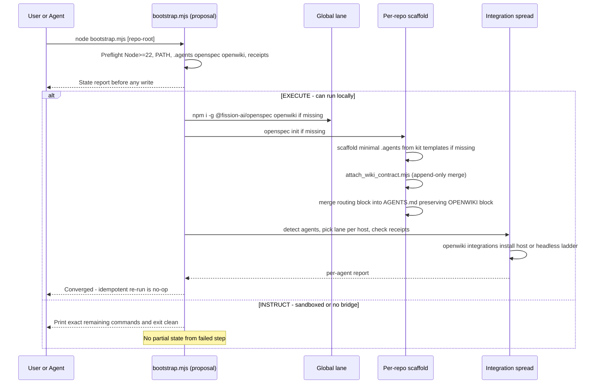

# Bootstrap and Attachment Workflow

One idempotent orchestrator takes any repository from bare to fully wired without ever leaving partial state. Preflight detection reports what exists, a once-per-user global lane installs peer tools, a per-repo lane scaffolds `openspec` and `.agents`, attaches the curation contract, merges the routing block, and spreads OpenWiki integration over detected agents. Every step is a deterministic Node `.mjs` script; if local execution is not possible the same script prints exact copy-paste commands and exits clean.

> **Proposal-only scope:** `openspec/changes/aksk-bootstrap-system/**` — the end-to-end bootstrap skill plus deterministic JS script, preflight/global/per-repo lanes, two-lane EXECUTE/INSTRUCT model, never-half-install guard, and agent-integration spread — is **not yet in `openspec/specs/**`**. This page labels that material explicitly and does not present it as shipped. Shipped scope is the four scripts under `.agents/skills/aksk-bootstrap/scripts/` and their marker contracts.

## Responsibilities and ownership

| Layer | Owner | What it owns |
| --- | --- | --- |
| Preflight + global lane | Proposal-only `bootstrap.mjs` | Node >=22 check, PATH checks, repo/receipt detection, `npm i -g` once per user |
| Per-repo scaffold | Proposal-only `bootstrap.mjs` delegating to shipped helpers | `openspec init`, minimal `.agents/` from kit templates, `attach_wiki_contract.mjs`, `attach_section.mjs` routing merge |
| Contract attachment | Shipped `attach_wiki_contract.mjs` + `wiki-contract-template.md` | `AKSK:WIKI-CONTRACT` block inside existing `openwiki/INSTRUCTIONS.md` |
| Managed-section attachment | Shipped `attach_section.mjs` + `routing-note-template.md` / `lifecycle-template.md` | `AKSK:ROUTING` and `AKSK:LIFECYCLE` blocks in root router files |
| Peer-tool verification | Shipped `check_peer_tools.mjs` | `INSTALL_COMMANDS` allowlist and PATH scan |
| Index sync | Shipped `sync_wiki_indexes.mjs` | Deterministic rebuild via global package helpers |
| Agent spread | Proposal-only `bootstrap.mjs` via `openwiki integrations install` / `list` | Lane selection, receipt ownership partition, per-agent report |
| Baseline seeding | Proposal-only `init_agents_md.mjs` + vendored baseline (from `add-agents-md-bootstrap`) | `AKSK:AGENTS-BASELINE` block at top of `AGENTS.md` |

Reuse boundary (D6): the curation-contract template, skill set, and append-only merge semantics are owned by the prerequisite change `adopt-openspec-openwiki`. Bootstrap copies them; variations belong in the source change.

## Invariants

All scripts under `.agents/skills/aksk-bootstrap/scripts/` share the kit execution contract:

* **Deterministic Node `.mjs` only.** No shellouts to an LLM, no network fetch during seeding or attachment, no runtime installation. `init_agents_md.mjs` (proposal-only), `refresh_agents_baseline.mjs` (proposal-only), `attach_section.mjs`, `attach_wiki_contract.mjs`, `check_peer_tools.mjs`, and `sync_wiki_indexes.mjs` are the surface. The orchestrator `bootstrap.mjs` is proposal-only and follows `js-preference-for-consumer-scripts` (Node >=22).
* **Never installs on failure.** Missing prerequisites print the verbatim install or init command and exit `2` with no writes. `INSTALL_COMMANDS` in `check_peer_tools.mjs` is the single source for `npm i -g @fission-ai/openspec@latest` and `npm i -g openwiki@latest`. The orchestrator never-half-installs: any step that cannot run prints exact remaining commands and exits clean without partial state from the failed step and without continuing past a failed prerequisite.
* **Fail-fast with remediation.** Unknown template names, a directory where a file is expected, a missing `openwiki/INSTRUCTIONS.md`, an unsupported Node version, or an unresolved `AGENTS.md` conflict all exit `2` naming the conflict and printing the exact next command. Interactive `stdin` prompts are never used — agents relay the printed question to the user. Sandboxed workers use the INSTRUCT lane: same command list, no execution.
* **Idempotent by detection, not a journal.** Every step derives done from observable state — tools on PATH, `openspec/` present, marker block equals template (after normalizing trailing whitespace and newline-at-EOF), receipt present with matching hashes. No separate bootstrap journal; re-runs converge without replaying history and without rewriting a current block.
* **No silent overwrite and zone isolation.** An existing `AGENTS.md` blocks seeding until the user explicitly chooses `--replace` or `--combine` (proposal-only). Refreshing one marker family never rewrites another; `docs-lint` checks each zone as an independent integrity unit.

## Control flow — end-to-end



*Caption: preflight → global lane → per-repo scaffold → spread, with EXECUTE running steps and INSTRUCT printing them.*

<!-- openwiki: mermaid parse failed and this diagram was converted to a text fence so it does not break rendering. Fix the diagram source and restore the mermaid fence. Parser error: Heuristic: an unescaped angle bracket inside a label breaks rendering; rephrase the label. -->
```text
flowchart TB
  P["Preflight<br>Node version, tools on PATH,<br>.agents openspec openwiki, receipts"]
  G["Global lane<br>npm i -g openspec openwiki<br>skip if already installed"]
  I["Per-repo init<br>openspec init when missing"]
  A["Scaffold .agents<br>minimal tree from kit templates"]
  C["Attach contract<br>AKSK WIKI-CONTRACT to<br>openwiki INSTRUCTIONS.md"]
  M["Merge routing block<br>into AGENTS.md below OPENWIKI block"]
  S["Spread integration<br>registry lane vs headless ladder<br>receipt ownership check"]
  V["Verify<br>openwiki integrations list<br>per-agent report"]

  P --> G --> I --> A --> C --> M --> S --> V
```

## Preflight — proposal-only

Before any write the orchestrator detects:

* Node.js major version — requires `>=22` (openwiki requirement). On `<22` it stops before installing and prints required version and upgrade instructions.
* Whether `openspec` and `openwiki` resolve on `PATH` — via `check_peer_tools.mjs` `onPath` scan of `PATH` directories with `PATHEXT` on Windows.
* Whether `.agents/`, `openspec/`, and `openwiki/` exist in the target repo.
* Whether OpenWiki install receipts `.openwiki-install.json` exist in known skill directories via `openwiki integrations list` / `inspectInstallation`.

It reports this state to the user before acting. Fresh-machine preflight with Node >=22 and neither tool installed reports sufficient Node, both tools missing, and proceeds to the global lane. Re-running against a fully bootstrapped repo detects completion, changes nothing, and reports idempotent completion.

## Global tool installation lane — proposal-only

Once per user:

```bash
npm i -g @fission-ai/openspec@latest openwiki@latest
```

* Skips any tool already at a compatible version and reports detected versions.
* Ordering is verified: `openwiki` must resolve on PATH before registering `openwiki mcp --host <target>` in host configs, so the global lane completes before any `openwiki integrations install` runs.

## Per-repo bootstrapping — proposal-only, delegates to shipped helpers

For the target repository, in order:

1. `openspec init` when `openspec/` is missing.
2. Scaffold a minimal `.agents/` tree from finalized kit templates when `.agents/` is missing or incomplete — copies the skill set rather than defining its own contract.
3. Attach the AKSK curation contract to `openwiki/INSTRUCTIONS.md` via `attach_wiki_contract.mjs` append-only merge semantics — never creates the wiki, only attaches to an initialized one.
4. Merge a thin routing block into root `AGENTS.md` without disturbing other content, including any existing `OPENWIKI:START/END` block. Ordering is `[baseline (proposal-only)] -> OpenWiki -> AKSK Routing -> AKSK Lifecycle`.

Bare-repo case (none of `openspec/`, `.agents/`, `openwiki/`): creates all three — initialized OpenSpec structure, scaffolded `.agents/`, and `INSTRUCTIONS.md` with contract attached. Already-bootstrapped repo: detects prior completion via markers and receipts, changes nothing.

### Zoned layout and attachment order

A fully bootstrapped `AGENTS.md` is a stack of owner-prefixed marker blocks, ordered upstream-first. Each template carries its own `AKSK` marker pair; scripts read markers from the template at runtime via `markersOf()` rather than hard-coding them.

| Order | Zone | Markers | Owner | Status |
| --- | --- | --- | --- | --- |
| 1 | FerroxLabs behavioral baseline | `AKSK:AGENTS-BASELINE:BEGIN/END` | `init_agents_md.mjs` (seed) + `refresh_agents_baseline.mjs` (update) | **Proposal-only** |
| 2 | OpenWiki | `OPENWIKI:START/END` | OpenWiki tooling | Shipped |
| 3a | AKSK Routing | `AKSK:ROUTING:BEGIN/END` | `attach_section.mjs` + `routing-note-template.md` | Shipped |
| 3b | AKSK Lifecycle | `AKSK:LIFECYCLE:BEGIN/END` | `attach_section.mjs` + `lifecycle-template.md` | Shipped |

<!-- openwiki: mermaid parse failed and this diagram was converted to a text fence so it does not break rendering. Fix the diagram source and restore the mermaid fence. Parser error: Heuristic: an unescaped angle bracket inside a label breaks rendering; rephrase the label. -->
```text
flowchart TB
  B["Zone 1 - FerroxLabs baseline - Proposal-only<br>AKSK AGENTS-BASELINE<br>vendored template plus provenance header"]
  O["Zone 2 - OpenWiki - Shipped<br>OPENWIKI START END<br>generated index"]
  R["Zone 3a - AKSK Routing - Shipped<br>AKSK ROUTING"]
  L["Zone 3b - AKSK Lifecycle - Shipped<br>AKSK LIFECYCLE"]
  B --> O --> R --> L
```

*Caption: stacked zone order — proposal-only baseline on top, OpenWiki middle, AKSK routing and lifecycle bottom.*

Supported composition is deterministic: `init_agents_md.mjs` seeds baseline first, then OpenWiki block attaches below it, then `attach_section.mjs` appends ROUTING and LIFECYCLE below OpenWiki. Seeding is a separate script from `attach_section.mjs` to preserve the latter's append-only invariant — existing content is never replaced.

### Proposal-only AGENTS.md seeding — `init_agents_md.mjs`

> This section describes `openspec/changes/add-agents-md-bootstrap/**` (and referenced by `aksk-bootstrap-system` per-repo lane). Not shipped.

Single entrypoint for seeding, upgrading, or combining `AGENTS.md`:

```bash
node .agents/skills/aksk-bootstrap/scripts/init_agents_md.mjs [repo-root]
node .agents/skills/aksk-bootstrap/scripts/init_agents_md.mjs [repo-root] --replace
node .agents/skills/aksk-bootstrap/scripts/init_agents_md.mjs [repo-root] --combine
```

* **Fresh repo:** copies vendored baseline at `.agents/skills/aksk-bootstrap/references/agents-md-baseline-template.md` — upstream FerroxLabs `AGENTS.md` wrapped in `AKSK:AGENTS-BASELINE` markers with provenance header (URL, capture date, MIT notice, refresh pointer) — verbatim including the header. Seeding never touches the network; `AKSK:` prefix signals kit ownership.
* **Idempotent re-run:** normalized compare — trailing whitespace and newline-at-EOF normalized — matching marked section is a no-op without rewrite.
* **Conflict path — exit 2, no writes:** existing `AGENTS.md` whose marked section does not match exits `2` naming the conflict and printing `Replace AGENTS.md with the FerroxLabs baseline, or combine both using the LLM?` plus `--replace` and `--combine` flags, without using stdin.
  * `--replace` overwrites `AGENTS.md` with the marked baseline including provenance header.
  * `--combine` never modifies the original; stages `existing.md`, `baseline.md`, and generated `COMBINE.md` brief side-by-side under `.agents/sessions/agents-md-combine/<timestamp>/` and prints LLM merge instructions. Brief constrains merge: preserve project learnings and sections 10-11, prefer baseline structure for 0-9, keep `AKSK` and `OPENWIKI` blocks verbatim. Present diff before writing. Only `sessions/README.md` is tracked; `sessions/[0-9]*` is ignored.

### Baseline refresh — `refresh_agents_baseline.mjs` — proposal-only

Opt-in updater, never run implicitly:

```bash
node .agents/skills/aksk-bootstrap/scripts/refresh_agents_baseline.mjs
```

Fetches upstream to a temp file, validates non-empty and expected section anchors, swaps only content between `AKSK:AGENTS-BASELINE` markers and updates provenance capture date leaving other zones byte-identical. Offline or validation failure exits non-zero and leaves previously vendored baseline intact. `docs-lint` surfaces stale capture date (>6 months) as informational advice.

## Managed-section attachment — `attach_section.mjs` — shipped

```bash
node .agents/skills/aksk-bootstrap/scripts/attach_section.mjs [repo-root] [target-file-name] [template-name]
```

Markers are parsed from the chosen template `markersOf()` extracting `AKSK:[A-Z-]+:BEGIN` and matching `END`; never hard-coded. Templates today:

| Template | Markers | Content |
| --- | --- | --- |
| `routing-note-template.md` (default) | `AKSK:ROUTING` | Discovery pointers into `.agents/` and `openwiki/` |
| `lifecycle-template.md` | `AKSK:LIFECYCLE` | Self-improvement loop mandate |

Behavior contract: existing content outside markers never replaced; idempotent and self-updating via in-place refresh when template changed; missing target file created containing only the section; unknown template name or target-is-directory exits `2`.

## OpenWiki contract attachment — `attach_wiki_contract.mjs` — shipped

```bash
node .agents/skills/aksk-bootstrap/scripts/attach_wiki_contract.mjs [repo-root]
```

Appends `wiki-contract-template.md` between `AKSK:WIKI-CONTRACT:BEGIN/END` to an **existing** `openwiki/INSTRUCTIONS.md`. If missing, exits `2` with prerequisite `openwiki --init` and performs no writes. Otherwise appends below existing content (stub-aware) or refreshes only between markers when template changed. Trimmed compare gives no-op when current. Downstream skills treat missing markers as no-contract.

<!-- openwiki: mermaid parse failed and this diagram was converted to a text fence so it does not break rendering. Fix the diagram source and restore the mermaid fence. Parser error: Heuristic: an unescaped angle bracket inside a label breaks rendering; rephrase the label. -->
```text
flowchart TB
  Check{"openwiki INSTRUCTIONS.md exists?"}
  Missing["Exit 2 - not found<br>print openwiki --init<br>no writes"]
  HasMarkers{"Contains AKSK WIKI-CONTRACT?"}
  Append["Append template below existing content"]
  Compare{"Marked section equals template?"}
  NoOp["No-op - already up to date"]
  Refresh["Refresh only between markers"]

  Check -->|no| Missing
  Check -->|yes| HasMarkers
  HasMarkers -->|no| Append
  HasMarkers -->|yes| Compare
  Compare -->|equal| NoOp
  Compare -->|changed| Refresh
```

## Peer-tool verification — `check_peer_tools.mjs` — shipped

```bash
node .agents/skills/aksk-bootstrap/scripts/check_peer_tools.mjs openspec openwiki
```

```js
import { requireBinaries } from "./check_peer_tools.mjs";
requireBinaries(["openspec", "openwiki"]);
```

Allowlist only: `INSTALL_COMMANDS` maps `openspec` and `openwiki`. Unknown names exit `2` with `unknown peer tool(s)` before any PATH lookup. `onPath` scans `PATH` directories with `PATHEXT` on Windows. `requireBinaries` prints one error per missing tool plus install commands then exits `2`. No-args also exits `2`.

## Deterministic index sync — `sync_wiki_indexes.mjs` — shipped

```bash
node .agents/skills/aksk-bootstrap/scripts/sync_wiki_indexes.mjs [repo-root]
```

Refreshes indexes with no LLM and no CLI: locates global package via `npm root -g`, dynamically imports `OpenWikiLocalShellBackend` (`docsOnly: true`, `virtualMode: true`) and `synchronizeWikiIndexes`, rebuilds while keeping curated page bodies byte-identical. Exits `2` when `openwiki/` missing or package not globally installed.

## OpenWiki integration spread — proposal-only

Spreads integration across detected agents with exactly one lane per agent — no intermediate `add-mcp` plus `npx skills add` lane.

| Lane | When | Command | Effect |
| --- | --- | --- | --- |
| Registry lane | Host is `codex`, `claude`, or `opencode` | `openwiki integrations install <host>` | Atomically copies skill bundle and edits host MCP config, writes `.openwiki-install.json` receipt |
| Headless ladder | Any other agent | Agent drives `openwiki --init -p` / `--update -p` directly | No MCP registration |

<!-- openwiki: mermaid parse failed and this diagram was converted to a text fence so it does not break rendering. Fix the diagram source and restore the mermaid fence. Parser error: Heuristic: an unescaped angle bracket inside a label breaks rendering; rephrase the label. -->
```text
flowchart TD
  D["Detect agents on machine"] --> C{"Host in registry?<br>codex or claude or opencode"}
  C -- Yes --> R["openwiki integrations install host<br>atomic skill plus MCP plus receipt"]
  C -- No --> H["Headless ladder<br>openwiki --init -p and --update -p"]
  R --> V["Verify via openwiki integrations list<br>installed unchanged modified"]
  H --> P["Agent reads openwiki pages<br>no MCP sequence tools"]
  V --> REP["Per-agent report<br>lane plus outcome plus installer output"]
  P --> REP
```

Registry lane details (v0.4.3 `HOST_TARGETS` with user/project scopes):

* Sources bundle from installed npm package `<npm-root>/openwiki/integrations/openwiki`, not a tag-pinned URL. Receipt records `package`, `version`, `target`, SHA-256 hashes, and exact `mcpServerCommand` (`openwiki mcp --host <target>`).
* Copies skill via staging then commit; rejects symlinked skill dirs or parents and non-directory parents.
* Edits host MCP config atomically in same transaction: codex `~/.codex/config.toml` TOML, claude JSON, opencode JSONC, with config-snapshot rollback and staging cleanup on failure. No separate `npx skills add` step.
* MCP sequence tools (`openwiki_begin` / `openwiki_submit_plan` / `openwiki_next_page` / `openwiki_submit_page` / `openwiki_finish`) require MCP registration; skill without MCP is inert. Headless ladder has no generic `openwiki mcp` service.

### Ownership partition via receipt

Before touching any skill directory, spread inspects via `openwiki integrations list` / `inspectInstallation`:

* Receipt present with matching `target` and intact hashes → official lane owns destination. Skip entirely and report owned; do not merge.
* `modified` → hash drift or hand-edits. Report `modified` and skip unless `--force` explicit; with `--force` overwrite after backup and report backup path; without it preserve uninstall integrity.
* `not-installed` → unowned; integrate through selected lane.

Installing two managers into one destination is prevented by this check plus symlink and non-directory-parent rejections. Bootstrap never guesses supported-host formats and never hard-codes skill paths — all paths derived from registry at runtime. Codex path drift (`~/.agents/skills/` vs `~/.codex/skills/`) is resolved by the registry.

### Spread result report

After running, spread produces one line per detected agent naming agent, chosen lane (`openwiki integrations install <host>` vs headless), outcome status (`installed` / `unchanged` / `modified` via `list`), and installer output including backup path on `--force`.

Bundle update lifecycle: `npm i -g openwiki@latest` then re-run `openwiki integrations install <target>` — idempotent when version, hashes, and command already match. No tag pin or `skills update` tracking. `uninstall` is transactional with rollback and removes receipt.

## Failure semantics and recovery

| Failure | Detection | Recovery |
| --- | --- | --- |
| Node < 22 | Preflight `node --version` | Stop before installing; print required version and upgrade instructions |
| Missing peer tools | `onPath` / `requireBinaries` | Exit 2 with exact `npm i -g …` lines, no writes |
| No execution capability | No bridge (INSTRUCT) | Print exact remaining commands, exit clean, no partial state |
| Missing `openwiki/INSTRUCTIONS.md` | `readFileSync` fail | Exit 2 with `openwiki --init`, no writes |
| Missing `openwiki/` or global package | `existsSync` / `npm root -g` | Exit 2 with remediation |
| Unknown template or target is directory | `existsSync` / `statSync` | Exit 2 naming unknown template or directory |
| Symlinked skill dir or non-directory parent | Installer preflight | Reject; user fixes filesystem, re-run |
| Modified skill or config | `openwiki integrations list` shows `modified` | Report and skip; `--force` overwrites with backup |
| Concurrent hand-edits to host config | Config snapshot comparison at commit | Roll back snapshot; remove staging; no partial install |
| AGENTS.md conflict | Marked section mismatch (normalized compare) | Exit 2 with replace vs combine question and flags |

## Operations and focused validation

| Probe | Command | What it proves |
| --- | --- | --- |
| Fresh seeding + idempotency | `node .agents/skills/aksk-bootstrap/scripts/init_agents_md.mjs` in empty temp dir, run twice | File created with marked baseline plus provenance header; second run no-op |
| Full zone order | Run init, then OpenWiki attach, then `attach_section.mjs` for routing and lifecycle | All families present, distinct, ordered baseline → OpenWiki → AKSK |
| Conflict replace | Temp dir with custom `AGENTS.md` → run init → exit 2 file untouched → `--replace` → marked baseline | No silent overwrite; explicit flag required |
| Conflict combine | Restore custom file → `--combine` → staged bundle under `.agents/sessions/agents-md-combine/<timestamp>/` | LLM merge staged, not applied; original untouched |
| Zone isolation | Modify content outside baseline markers, re-run init; damage one zone markers | Only baseline zone considered; lint reports that family |
| Preflight reports state | Re-run proposal bootstrap on fully bootstrapped fixture | Reports Node, tools, repo state, receipts; changes nothing |
| Partial fixture convergence | Re-run on partially bootstrapped fixture | Completes only missing steps |
| Supported host idempotency | `openwiki integrations install <host>` twice | Second run `unchanged` no-op; codex TOML `replaceableEntry` holds |
| Modified detection | Hand-edit skill dir then `openwiki integrations list` | Reports `modified`; install refuses without `--force` |
| Force with backup | `openwiki integrations install <host> --force` | Overwrites, creates backup, reports backup path |
| Headless ladder | Agent without registry host drives `openwiki --init -p` / `--update -p` | Pages initialize without MCP |
| Receipt ownership | Presence of `.openwiki-install.json` | Spread skips and reports owned |
| Peer tools | `node .agents/skills/aksk-bootstrap/scripts/check_peer_tools.mjs openspec openwiki` | Missing tools fail with exact install commands |
| Contract attachment | `node .agents/skills/aksk-bootstrap/scripts/attach_wiki_contract.mjs` twice | Second run no-op; template change refreshes only marked section |
| Structure + lint | `bash scripts/check-agents-structure.sh .agents` and `docs-lint` wiring | New `AKSK:AGENTS-BASELINE` zone integrity-checked alongside `ROUTING` / `LIFECYCLE` |

## Extension points

* **New managed section:** add a template under `.agents/skills/aksk-bootstrap/references/` carrying a unique `AKSK:NAME:BEGIN/END` pair; `attach_section.mjs` picks it up via `markersOf()` with no code change. Extend `docs-lint` wiring checks.
* **New baseline source:** provenance header inside `AKSK:AGENTS-BASELINE` identifies origin, so marker prefix stays `AKSK:` even if upstream vendor changes. Only reference template and refresh validation anchors need updating.
* **Tool wiring beyond AGENTS.md:** product overlays (Cursor rules, Copilot instructions, `CLAUDE.md`, `GEMINI.md`) reuse same `attach_section.mjs` mechanism with different target filename; durable guidance remains in `.agents/` and curated `openwiki/` trees.
* **New supported host:** add to upstream `HOST_TARGETS` registry; spread picks it up via `openwiki integrations list` with no kit path matrix change.

## Related pages

* [AGENTS.md Zoning and Baseline](../concepts/agents-md-zoning.md) — zone stack, vendored baseline, and routing-pattern exception.
* [Knowledge Curation Contract](../concepts/knowledge-curation-contract.md) — curated trees, `INSTRUCTIONS.md` attachment, and preserve-and-link semantics.
* [Distribution and Agent Spread](../integrations/distribution-and-agent-spread.md) — peer dependencies, Skills CLI distribution, and wiring mechanics.
* [aksk-bootstrap Skill](../skills/aksk-bootstrap.md) — precondition provider and marker-delimited attachment scripts.
