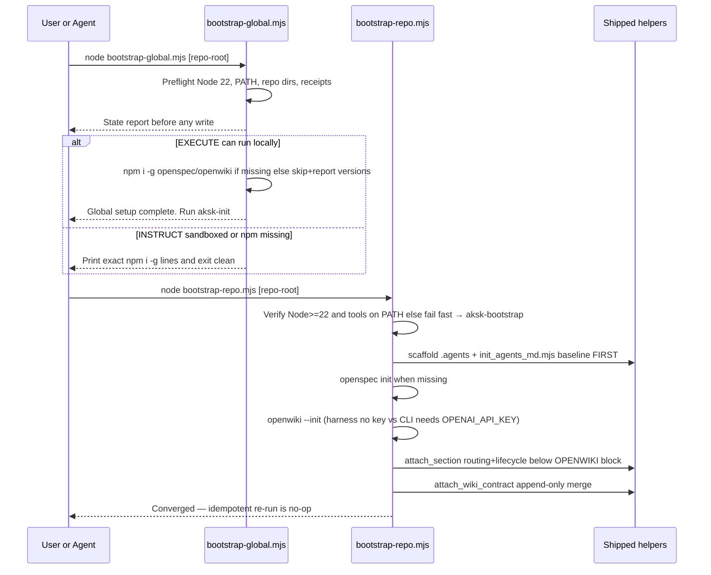
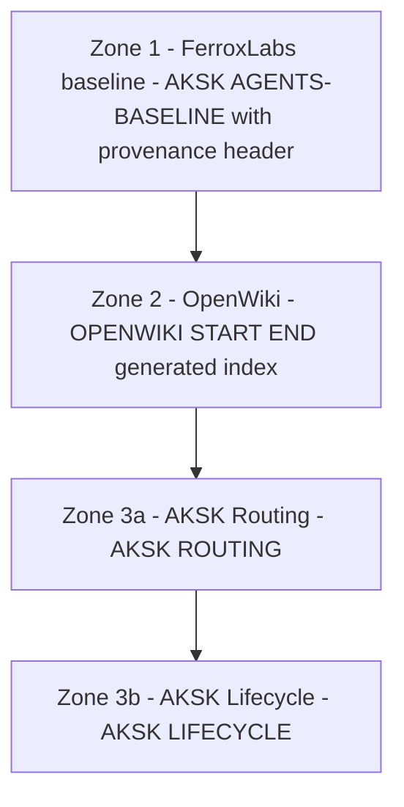
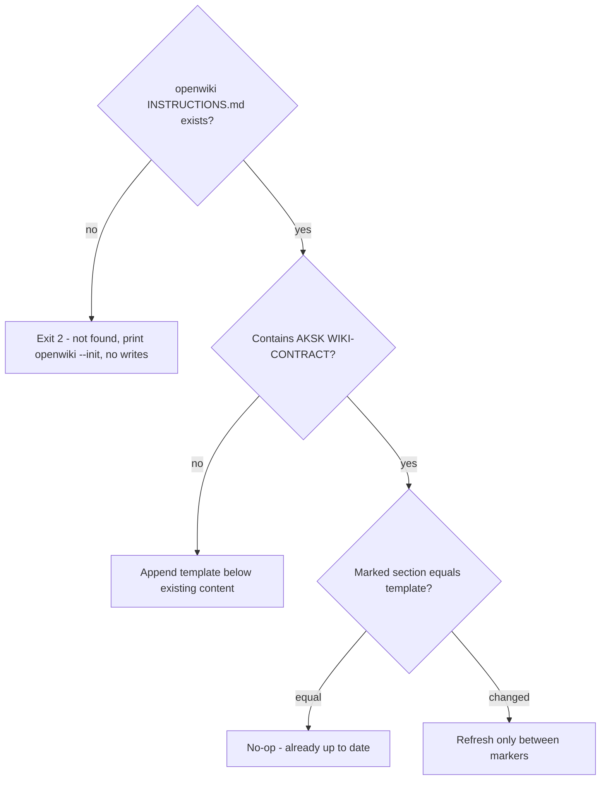
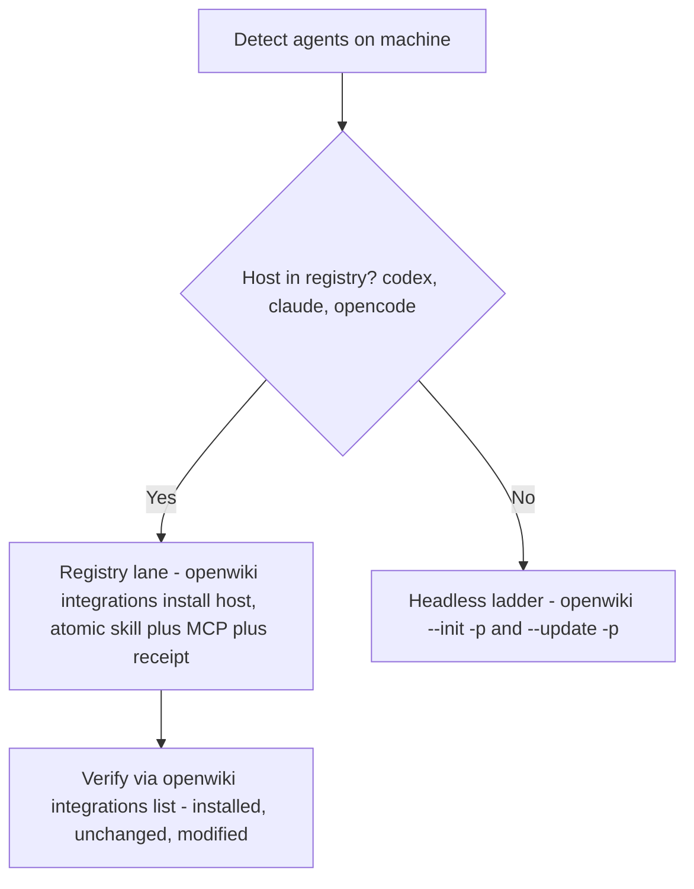

# Bootstrap and Attachment Workflow

Two idempotent phases take any repository from bare to fully wired without ever leaving partial state. A once-per-user **global lane** (`aksk-bootstrap`) verifies Node and installs peer tools per-user via `npm i -g`. A **per-repo lane** (`aksk-init`) scaffolds `.agents`, seeds the FerroxLabs baseline, initializes `openspec`/`openwiki`, and merges routing/lifecycle and the curation contract. Every step is a deterministic Node `.mjs` script; if local execution is not possible the same script prints exact copy-paste commands and exits clean with no partial state from the failed step (`EXECUTE` vs `INSTRUCT`).

## Responsibilities and ownership

| Layer | Owner | What it owns |
| --- | --- | --- |
| Global lane + preflight | `aksk-bootstrap/scripts/bootstrap-global.mjs` | Node >=22 check, PATH checks, receipt peek, `npm i -g` once per user via `versionsFromPackageJson()` |
| Shim orchestrator | `aksk-bootstrap/scripts/bootstrap.mjs` | Runs global lane then per-repo lane if present; otherwise directs to `aksk-init` |
| Per-repo scaffold | `aksk-init/scripts/bootstrap-repo.mjs` delegating to shipped helpers | `.agents/` tree, `init_agents_md.mjs` baseline, `openspec init`, `openwiki --init` (harness vs CLI), `attach_section.mjs`, `attach_wiki_contract.mjs` |
| Contract attachment | Shipped `attach_wiki_contract.mjs` + `wiki-contract-template.md` | `AKSK:WIKI-CONTRACT` block inside existing `openwiki/INSTRUCTIONS.md` |
| Baseline seeding | Shipped `init_agents_md.mjs` + vendored baseline `agents-md-baseline-template.md` | `AKSK:AGENTS-BASELINE` block at top of `AGENTS.md` |
| Managed-section attachment | Shipped `attach_section.mjs` + `routing-note-template.md` / `lifecycle-template.md` | `AKSK:ROUTING` and `AKSK:LIFECYCLE` blocks in root router files |
| Baseline refresh | Shipped `refresh_agents_baseline.mjs` | Opt-in upstream fetch, validation, swap inside vendored template |
| Peer-tool verification | Shipped `check_peer_tools.mjs` | `INSTALL_COMMANDS` allowlist and PATH scan with `PATHEXT` on Windows |
| Index sync | Shipped `sync_wiki_indexes.mjs` | Deterministic rebuild via global package helpers |

The curation-contract template, skill set, and append-only merge semantics were finalized by `adopt-openspec-openwiki`; bootstrap copies them, variations belong in the source. `aksk-bootstrap` is now strictly global-only — previous per-repo behavior was removed and is specified under `aksk-init`.

## Invariants

All scripts under `.agents/skills/*/scripts/` share the kit execution contract:

* **Deterministic Node `.mjs` only.** No shellouts to an LLM, no network fetch during seeding or attachment, no runtime installation. `init_agents_md.mjs`, `attach_section.mjs`, `attach_wiki_contract.mjs`, `check_peer_tools.mjs`, `sync_wiki_indexes.mjs` are the leaf helpers; orchestrators compose them. Only `refresh_agents_baseline.mjs` may fetch upstream, explicitly opt-in.
* **Global installs are per-user `npm i -g`, never `npx` or repo-local `node_modules`.** Versions come from `references/versions.json` caret range (`@fission-ai/openspec@^1.11.0`, `openwiki@^0.4.3`) via `versionsFromPackageJson()` which checks the consumer repo `package.json` first for a local override, then the bundled `versions.json`. Single source is `aksk-bootstrap/references/versions.json` — `aksk-init` does not duplicate it. Fallback is `@latest` only when unpinned.
* **Never installs on failure / never half-installs.** Helper scripts print the verbatim install or init command and exit `2` with no writes. Orchestrators never-half-install: any step that cannot run prints exact remaining copy-paste commands and exits clean without partial state from the failed step and without continuing past a failed prerequisite. Two lanes: `EXECUTE` runs locally, `INSTRUCT` prints commands when sandboxed, `npm` missing, Node <22, or no TTY. `INSTRUCT` is partitioned — the global lane prints only `npm i -g` lines, the repo lane prints only repo-scoped commands.
* **Non-interactive scripts; skill prompts.** Scripts never block on `stdin`. The `aksk-bootstrap` and `aksk-init` skills describe each planned action and prompt `[Y/n/skip]` before invoking the script. Scripts accept `--yes` / `--non-interactive` / `AKSK_YES=1` as passthrough and treat no-TTY as `INSTRUCT` (print commands, no writes).
* **Fail-fast with remediation.** Unknown template names, a directory where a file is expected, a missing `openwiki/INSTRUCTIONS.md`, an unsupported Node version, or an unresolved `AGENTS.md` conflict all exit `2` naming the conflict and printing the exact next command.
* **Verify peer tools before invoking.** Every skill or script that needs `openspec` or `openwiki` runs `check_peer_tools.mjs` / `requireBinaries(["openspec","openwiki"])` first. Verification only scans PATH (with `PATHEXT` on Windows) against the `INSTALL_COMMANDS` allowlist, never installs. Missing tools print one error per tool plus the exact `npm i -g` caret commands and exit `2`; unknown tool names exit `2` before any lookup. The repo lane fails fast directing to `aksk-bootstrap` when tools are missing and does not attempt global installs.
* **Idempotent by detection, not a journal.** Every step derives done from observable state — tools on PATH, `openspec/` present, marker block equals template (after normalizing trailing whitespace and newline-at-EOF), receipt present with matching hashes. No separate bootstrap journal; re-runs converge without replaying history.
* **No silent overwrite and zone isolation.** An existing `AGENTS.md` blocks seeding until the user explicitly chooses `--replace` or `--combine`. Refreshing one marker family never rewrites another; `docs-lint` checks each zone as an independent integrity unit.
* **Global lane scope restriction.** The global lane must not create or modify per-repo files (`.agents/`, `openspec/`, `AGENTS.md`, `openwiki/INSTRUCTIONS.md`) except as needed to verify receipts. Global skill installs (`npx skills add -g -a`, `openwiki integrations install`) are performed by the global lane by default; the repo lane inherits them and only installs repo-local skills when invoked with `--local-skills`.

## Control flow — end-to-end



*Caption: global lane (per-user installs) then per-repo lane (baseline-first scaffold through contract), each with EXECUTE executing and INSTRUCT printing.*

<!-- openwiki: mermaid parse failed and this diagram was converted to a text fence so it does not break rendering. Fix the diagram source and restore the mermaid fence. Parser error: Heuristic: an unescaped angle bracket inside a label breaks rendering; rephrase the label. -->
```text
flowchart TB
  P1["Global preflight — Node version, tools on PATH, repo trees, receipts --json if requested"]
  G["Global lane — npm i -g openspec+openwiki, skip if present, re-detect"]
  P2["Repo preflight — verify Node>=22 and openspec/openwiki on PATH else → aksk-bootstrap"]
  I["Scaffold .agents + seed baseline via init_agents_md FIRST"]
  O["Per-repo init — openspec init when missing"]
  W["openwiki --init — harness (no extra key) vs CLI (OPENAI_API_KEY)"]
  M["Merge routing and lifecycle into AGENTS.md below OPENWIKI block"]
  C["Attach contract — AKSK WIKI-CONTRACT to existing INSTRUCTIONS.md"]
  V["Verify — per-attachment no-ops when current"]
  P1 --> G --> P2 --> I --> O --> W --> M --> C --> V
```

*Caption: linear pipeline from global preflight/lane through repo preflight, baseline-first scaffold, init, and marker attachments.*

## Preflight

**Global lane** (`bootstrap-global.mjs`) before any write detects:

* Node.js major version — requires `>=22` (openwiki requirement). On `<22` it stops before installing, prints required version, and exits `2` with no changes.
* Whether `openspec` and `openwiki` resolve on `PATH` — via `onPath` scan of `PATH` directories with `PATHEXT` on Windows.
* Whether `.agents/`, `openspec/`, and `openwiki/` (and `openwiki/INSTRUCTIONS.md`) exist in the target repo.
* Whether specific marker blocks (`AKSK:WIKI-CONTRACT`, `AKSK:ROUTING`) are already attached.
* Whether OpenWiki install receipts exist via `openwiki integrations list --project` (best-effort, never throws). Supports `--json` for machine-readable output.

It reports this state before acting and re-detects after the global lane. Fresh-machine preflight with Node >=22 and neither tool installed reports sufficient Node, both tools missing, and proceeds to install. Re-running against a fully bootstrapped machine skips installs and reports detected versions.

**Repo lane** (`bootstrap-repo.mjs`) verifies global prerequisites first: Node >=22 and `openspec`/`openwiki` on PATH. If missing it fails fast, prints `Missing tools — run aksk-bootstrap first.` with versions from `aksk-bootstrap/references/versions.json` (caret) and exits `2` without attempting global installs. Only then does it scaffold.

## Global tool installation lane

Once per user, user scope only:

```bash
npm i -g @fission-ai/openspec@^1.11.0 openwiki@^0.4.3
```

Caret ranges are read via `versionsFromPackageJson(repoRoot)` — consumer repo `package.json` `devDependencies`/`dependencies` first, then bundled `references/versions.json` (`_note` describes caret bump via `npm install --save-dev` then copy). `INSTALL.md` and `SKILL.md` document this as `npm i -g` per-user, not repo-local `npx` or `node_modules`. When both tools are missing the orchestrator runs a single combined `npm i -g` invocation; when one is missing it installs only that one; when both are present it skips installation and reports detected versions via `openspec --version` / `openwiki --version`.

* Ordering is verified: `openwiki` must resolve on PATH before any `openwiki integrations install` or `openwiki mcp --host` registration, so the global lane completes and re-detects before host integration is considered.
* If `npm` is not on PATH, or the install exits non-zero, the global lane does not half-install: it prints `instructRemaining` with the exact `npm i -g` line(s) and exits clean (`0`) with no partial state, leaving completed steps intact. Host integrations are not auto-installed by the global lane script — they are manual opt-in (`openwiki integrations install codex|claude|opencode`).

`bootstrap.mjs` is a shim that sequentially spawns `bootstrap-global.mjs` then, if `aksk-init/scripts/bootstrap-repo.mjs` exists, spawns it; if not, it reports global completion and directs the user to run `aksk-init` separately.

## Per-repo bootstrapping — delegates to shipped helpers

For the target repository, in order (non-interactive; skill prompts `[Y/n/skip]`, `--yes` passthrough, no TTY → `INSTRUCT`):

1. Scaffold a minimal `.agents/` tree (`mkdir -p .agents/skills`, `.agents/sessions`) when missing, then seed the FerroxLabs behavioral baseline via `init_agents_md.mjs` **before** `openspec`/`openwiki`. On conflict (existing `AGENTS.md` with non-matching baseline) it prints the verbatim `Replace AGENTS.md with the FerroxLabs baseline, or combine both using the LLM?` prompt with `--replace` and `--combine` flags and exits via `INSTRUCT` without writing and without `stdin`.
2. `openspec init --tools none` when `openspec/` is missing. If `openspec` is not on PATH, this was already caught by preflight; otherwise failure prints remediation without leaving partial scaffolding for that step.
3. `openwiki --init` when `openwiki/` is missing — two paths documented: (a) via harness (agent + openwiki MCP/skill, no extra key) or (b) CLI (`openwiki --init` requires `OPENAI_API_KEY`). `bootstrap-repo.mjs` attempts CLI and on non-zero notes `set OPENAI_API_KEY or use harness path`; the skill describes both before invoking.
4. Merge thin routing and lifecycle blocks into root `AGENTS.md` via `attach_section.mjs` (`routing-note-template.md` then `lifecycle-template.md`) below any existing `OPENWIKI:START/END` block, preserving other content.
5. Attach the AKSK curation contract to `openwiki/INSTRUCTIONS.md` via `attach_wiki_contract.mjs` append-only merge — never creates the wiki, only attaches to an initialized one.

Bare-repo case (none of `openspec/`, `.agents/`, `openwiki/`): creates all — scaffolded `.agents/`, seeded `AGENTS.md`, initialized OpenSpec/OpenWiki structures, and `INSTRUCTIONS.md` with contract attached — either via `EXECUTE` or via printed `INSTRUCT` commands when sandboxed. Already-bootstrapped repo: detects prior completion via markers, changes nothing. Repo-local skills are inherited from the global install by default; `--local-skills` opts into `npx skills add` without `-g` and per-project receipts.

### Zoned layout and attachment order

A fully bootstrapped `AGENTS.md` is a stack of owner-prefixed marker blocks, ordered upstream-first. Each template carries its own `AKSK` marker pair; scripts read markers from the template at runtime via `markersOf()` rather than hard-coding them.

| Order | Zone | Markers | Owner | Status |
| --- | --- | --- | --- | --- |
| 1 | FerroxLabs behavioral baseline | `AKSK:AGENTS-BASELINE:BEGIN/END` | `init_agents_md.mjs` (seed) + `refresh_agents_baseline.mjs` (update) | Shipped |
| 2 | OpenWiki | `OPENWIKI:START/END` | OpenWiki tooling | Shipped |
| 3a | AKSK Routing | `AKSK:ROUTING:BEGIN/END` | `attach_section.mjs` + `routing-note-template.md` | Shipped |
| 3b | AKSK Lifecycle | `AKSK:LIFECYCLE:BEGIN/END` | `attach_section.mjs` + `lifecycle-template.md` | Shipped |



*Caption: stacked zone order — baseline on top, OpenWiki middle, AKSK routing and lifecycle bottom.*

Supported composition is deterministic: `init_agents_md.mjs` seeds baseline first, then OpenWiki block attaches below it, then `attach_section.mjs` appends ROUTING and LIFECYCLE below OpenWiki. Seeding is a separate script from `attach_section.mjs` to preserve the latter's append-only invariant — existing content is never replaced.

### AGENTS.md seeding — `init_agents_md.mjs` — shipped

Single entrypoint for seeding, upgrading, or combining `AGENTS.md`:

```bash
node .agents/skills/aksk-init/scripts/init_agents_md.mjs [repo-root]
node .agents/skills/aksk-init/scripts/init_agents_md.mjs [repo-root] --replace
node .agents/skills/aksk-init/scripts/init_agents_md.mjs [repo-root] --combine
```

* **Fresh repo:** copies vendored baseline at `references/agents-md-baseline-template.md` — upstream FerroxLabs `AGENTS.md` wrapped in `AKSK:AGENTS-BASELINE` markers with provenance header (URL, capture date, MIT notice, refresh pointer) — verbatim including the header. Seeding never touches the network; `AKSK:` prefix signals kit ownership. Single source of versions is `aksk-bootstrap/references/versions.json`; `aksk-init` reuses it for diagnostics.
* **Idempotent re-run:** normalized compare — trailing whitespace and newline-at-EOF normalized — matching marked section is a no-op without rewrite.
* **Conflict path — exit 2, no writes:** existing `AGENTS.md` whose marked section does not match exits `2` naming the conflict and printing `Replace AGENTS.md with the FerroxLabs baseline, or combine both using the LLM?` plus `--replace` and `--combine` flags, without using stdin.
  * `--replace` overwrites `AGENTS.md` with the marked baseline including provenance header, then caller restores OpenWiki and AKSK zones via attachment scripts.
  * `--combine` never modifies the original; stages `existing.md`, `baseline.md`, and generated `COMBINE.md` brief side-by-side under `.agents/sessions/agents-md-combine/<timestamp>/` and prints LLM merge instructions. Brief constrains merge: preserve project learnings and sections 10-11, prefer baseline structure for 0-9, keep `AKSK` and `OPENWIKI` blocks verbatim. Present diff before writing. Only `sessions/README.md` is tracked; `sessions/[0-9]*` is ignored.
* **Guards:** target is directory → exit 2; `--replace`/`--combine` without existing file → exit 2; both flags together → exit 2; markers read from template, never hard-coded.

### Baseline refresh — `refresh_agents_baseline.mjs` — shipped

Opt-in updater, never run implicitly:

```bash
node .agents/skills/aksk-bootstrap/scripts/refresh_agents_baseline.mjs
node .agents/skills/aksk-bootstrap/scripts/refresh_agents_baseline.mjs --check
```

Fetches upstream `https://raw.githubusercontent.com/FerroxLabs/agents-md/main/AGENTS.md` to a temp file, validates non-empty and expected section anchors (`Non-negotiables`, `Before writing code`, `Surgical changes`, `Goal-driven execution`), then swaps only content between `AKSK:AGENTS-BASELINE` markers in the vendored template, updating the provenance capture date leaving other zones byte-identical. Offline or validation failure exits non-zero and leaves previously vendored baseline intact. `docs-lint` surfaces stale capture date (>6 months) as informational advice. The pinned SHA in `references/versions.json` (`@ferroxlabs/agents-md`) is bumped alongside the vendored template.

## Managed-section attachment — `attach_section.mjs` — shipped

```bash
node .agents/skills/aksk-init/scripts/attach_section.mjs [repo-root] [target-file-name] [template-name]
# also available as aksk-bootstrap/scripts/attach_section.mjs (shipped duplicate)
```

Markers are parsed from the chosen template `markersOf()` extracting `AKSK:[A-Z-]+:BEGIN` and matching `END`; never hard-coded. Templates today:

| Template | Markers | Content |
| --- | --- | --- |
| `routing-note-template.md` (default) | `AKSK:ROUTING` | Discovery pointers into `.agents/` and `openwiki/` |
| `lifecycle-template.md` | `AKSK:LIFECYCLE` | Self-improvement loop mandate |

Behavior contract: existing content outside markers never replaced; idempotent and self-updating via in-place refresh when template changed (trimmed compare gives no-op when current); missing target file created containing only the section; unknown template name or target-is-directory exits `2`.

## OpenWiki contract attachment — `attach_wiki_contract.mjs` — shipped

```bash
node .agents/skills/aksk-init/scripts/attach_wiki_contract.mjs [repo-root]
```

Appends `wiki-contract-template.md` between `AKSK:WIKI-CONTRACT:BEGIN/END` to an **existing** `openwiki/INSTRUCTIONS.md`. If missing, exits `2` with prerequisite `openwiki --init` and performs no writes. Otherwise appends below existing content (stub-aware: `A code wiki for this repository.` reported as such) or refreshes only between markers when template changed. Trimmed compare gives no-op when current. Downstream skills treat missing markers as no-contract.



*Caption: contract attachment decision — missing file fails fast, otherwise append or refresh only between markers.*

## Peer-tool verification — `check_peer_tools.mjs` — shipped

```bash
node .agents/skills/aksk-bootstrap/scripts/check_peer_tools.mjs openspec openwiki
```

```js
import { requireBinaries } from "./check_peer_tools.mjs";
requireBinaries(["openspec", "openwiki"]);
```

Allowlist only: `INSTALL_COMMANDS` maps `openspec` and `openwiki` to `npm i -g` lines (fallback `@latest`; orchestrators substitute caret from `versions.json`). Unknown names exit `2` with `unknown peer tool(s)` before any PATH lookup. `onPath` scans `PATH` directories with `PATHEXT` on Windows. `requireBinaries` prints one error per missing tool plus install commands then exits `2`. No-args also exits `2`. Bootstrap and every sibling skill call this before invoking `openspec` or `openwiki`.

## Deterministic index sync — `sync_wiki_indexes.mjs` — shipped

```bash
node .agents/skills/aksk-bootstrap/scripts/sync_wiki_indexes.mjs [repo-root]
```

Refreshes indexes with no LLM and no CLI: locates global package via `npm root -g`, dynamically imports `OpenWikiLocalShellBackend` (`docsOnly: true`, `virtualMode: true`) and `synchronizeWikiIndexes`, rebuilds while keeping curated page bodies byte-identical. Exits `2` when `openwiki/` missing or package not globally installed.

## OpenWiki integration spread — manual opt-in

Host spread is not part of the global lane script. Users run it manually when needed:

| Lane | When | Command | Effect |
| --- | --- | --- | --- |
| Registry lane | Host is `codex`, `claude`, or `opencode` | `openwiki integrations install <host>` | Atomically copies skill bundle and edits host MCP config (`openwiki mcp --host <target>`), writes `.openwiki-install.json` receipt |
| Headless ladder | Any other agent | Agent drives `openwiki --init -p` / `--update -p` directly | No MCP registration |



*Caption: lane selection per detected agent — registry hosts get atomic skill plus MCP, others use headless openwiki commands.*

Details:

* Source bundle is the installed npm package `npm-root/openwiki/integrations/openwiki`, not a tag-pinned URL. Receipt records `package`, `version`, `target`, SHA-256 hashes, and exact `mcpServerCommand`.
* Installer copies via staging then commit; rejects symlinked skill dirs or parents and non-directory parents; edits host MCP config atomically with snapshot rollback.
* Before touching any skill directory, the installer inspects via `openwiki integrations list` / `inspectInstallation`: receipt with matching `target` and intact hashes → skip and report `installed`/`unchanged`; hash drift → `modified`, requires `--force` with backup; `not-installed` → integrate.
* Bundle update: `npm i -g openwiki@latest` (caret via `versions.json`) then re-run `openwiki integrations install <target>` — idempotent when version, hashes, and command match.

## Failure semantics and recovery

| Failure | Detection | Recovery |
| --- | --- | --- |
| Node < 22 | Preflight version check | Stop before installing; print required version, no writes (global lane exit 2, repo lane exit 2) |
| Missing peer tools | `onPath` / `requireBinaries` | Exit 2 with exact `npm i -g` lines (caret when via orchestrator), no writes; repo lane directs to `aksk-bootstrap` |
| No execution capability / `npm` missing | No bridge / `onPath npm` false | `INSTRUCT` lane: print exact remaining commands (partitioned), exit clean, no partial state from failed step |
| `npm i -g` fails | `spawnSync npm` non-zero | Print failing command, `instructRemaining`, exit clean without continuing |
| Missing `openwiki/INSTRUCTIONS.md` | `readFileSync` fail in `attach_wiki_contract.mjs` | Exit 2 with `openwiki --init`, no writes; repo orchestrator defers to INSTRUCT |
| Missing `openwiki/` or global package | `existsSync` / `npm root -g` | Exit 2 with remediation |
| Unknown template or target is directory | `existsSync` / `statSync` | Exit 2 naming unknown template or directory |
| Symlinked skill dir or non-directory parent | Installer preflight | Reject; user fixes filesystem, re-run |
| Modified skill or config | `openwiki integrations list` shows `modified` | Report and skip; `--force` overwrites with backup |
| AGENTS.md conflict | Marked section mismatch (normalized compare) | Exit 2 with replace vs combine question and flags |
| Upstream fetch offline / validation fails | `refresh_agents_baseline.mjs` fetch or anchor check | Exit non-zero, previously vendored baseline remains byte-identical |
| Global tools missing in repo lane | `bootstrap-repo.mjs` preflight | Exit 2 with `run aksk-bootstrap first` and `npm i -g` line from versions.json |

## Operations and focused validation

| Probe | Command | What it proves |
| --- | --- | --- |
| Fresh seeding + idempotency | `node .agents/skills/aksk-init/scripts/init_agents_md.mjs` in empty temp dir, run twice | File created with marked baseline plus provenance header; second run no-op |
| Full zone order | Run init, then OpenWiki attach, then `attach_section.mjs` for routing and lifecycle | All families present, distinct, ordered baseline → OpenWiki → AKSK |
| Conflict replace | Temp dir with custom `AGENTS.md` → run init → exit 2 file untouched → `--replace` → marked baseline | No silent overwrite; explicit flag required |
| Conflict combine | Restore custom file → `--combine` → staged bundle under `.agents/sessions/agents-md-combine/timestamp/` | LLM merge staged, not applied; original untouched |
| Zone isolation | Modify content outside baseline markers, re-run init; damage one zone markers | Only baseline zone considered; lint reports that family |
| Global preflight reports state | Re-run `bootstrap-global.mjs` on fully bootstrapped fixture | Reports Node, tools, repo state, receipts; changes nothing (`--json` for machine-readable) |
| Partial fixture convergence | Re-run `bootstrap-repo.mjs` on partially bootstrapped fixture | Completes only missing steps |
| Global lane caret | Inspect `npm i -g` line printed by `bootstrap-global.mjs` | Shows `^1.11.0` / `^0.4.3` from `references/versions.json`, not `@latest` |
| Global lane skip | Run `bootstrap-global.mjs` when tools already `npm i -g` installed | Skips install, prints detected versions |
| INSTRUCT fallback (global) | Run `bootstrap-global.mjs` sandboxed or with `npm` not on PATH | Prints exact global `npm i -g` commands, exits clean, no partial state |
| INSTRUCT fallback (repo) | Run `bootstrap-repo.mjs` without tools | Prints `run aksk-bootstrap first` + repo-only remaining commands, no global lines |
| Harness vs CLI | `openwiki --init` without `OPENAI_API_KEY` vs with harness | Skill describes harness (no key) vs CLI (needs key); repo script notes fallback |
| Peer tools | `node .agents/skills/aksk-bootstrap/scripts/check_peer_tools.mjs openspec openwiki` | Missing tools fail with exact install commands |
| Contract attachment | `node .agents/skills/aksk-init/scripts/attach_wiki_contract.mjs` twice | Second run no-op; template change refreshes only marked section |
| Structure + lint | `bash scripts/check-agents-structure.sh .agents` and `docs-lint` wiring | New `AKSK:AGENTS-BASELINE` zone integrity-checked alongside `ROUTING` / `LIFECYCLE` |

## Extension points

* **New managed section:** add a template under `references/` carrying a unique `AKSK:NAME:BEGIN/END` pair; `attach_section.mjs` picks it up via `markersOf()` with no code change. Extend `docs-lint` wiring checks.
* **New baseline source:** provenance header inside `AKSK:AGENTS-BASELINE` identifies origin, so marker prefix stays `AKSK:` even if upstream vendor changes. Only reference template and refresh validation anchors need updating.
* **Tool wiring beyond AGENTS.md:** product overlays (Cursor rules, Copilot instructions, `CLAUDE.md`, `GEMINI.md`) reuse same `attach_section.mjs` mechanism with different target filename; durable guidance remains in `.agents/` and curated `openwiki/` trees.
* **New supported host:** add to upstream `HOST_TARGETS` registry; manual `openwiki integrations install` picks it up with no kit path matrix change.

## Related pages

* [AGENTS.md Zoning and Baseline](../concepts/agents-md-zoning.md) — zone stack, vendored baseline, and routing-pattern exception.
* [Knowledge Curation Contract](../concepts/knowledge-curation-contract.md) — curated trees, `INSTRUCTIONS.md` attachment, and preserve-and-link semantics.
* [Distribution and Agent Spread](../integrations/distribution-and-agent-spread.md) — peer dependencies, Skills CLI distribution, and wiring mechanics.
* [aksk-bootstrap Skill](../skills/aksk-bootstrap.md) — per-user global lane and marker-delimited attachment scripts.
* [aksk-init Skill](../skills/aksk-init.md) — per-repo scaffold, baseline-first init, and harness vs CLI openwiki init.
