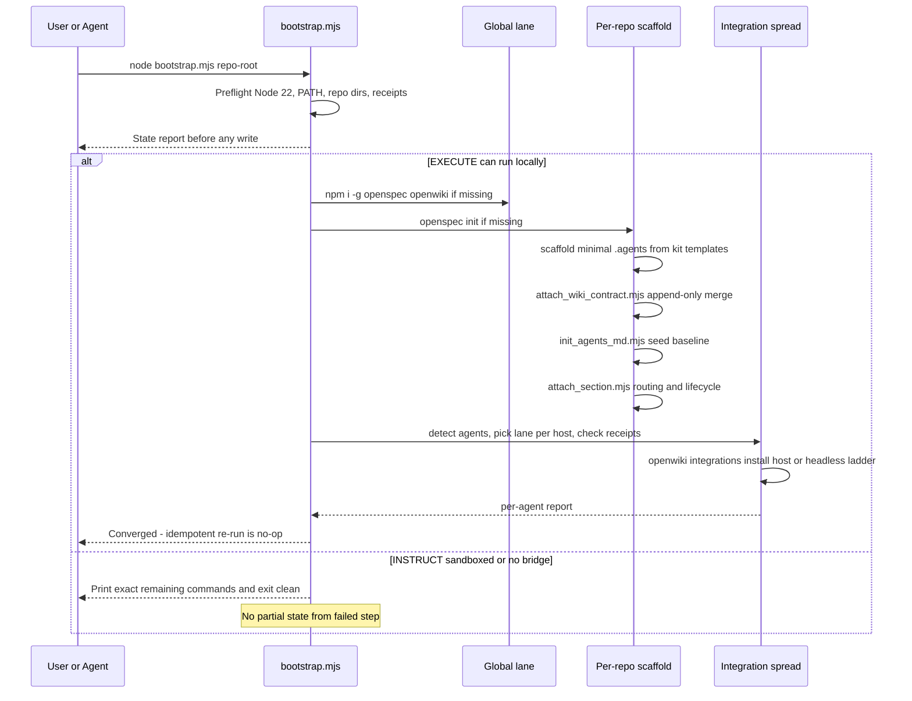
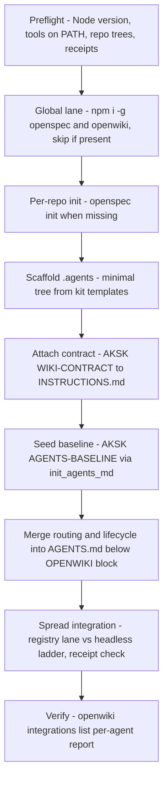
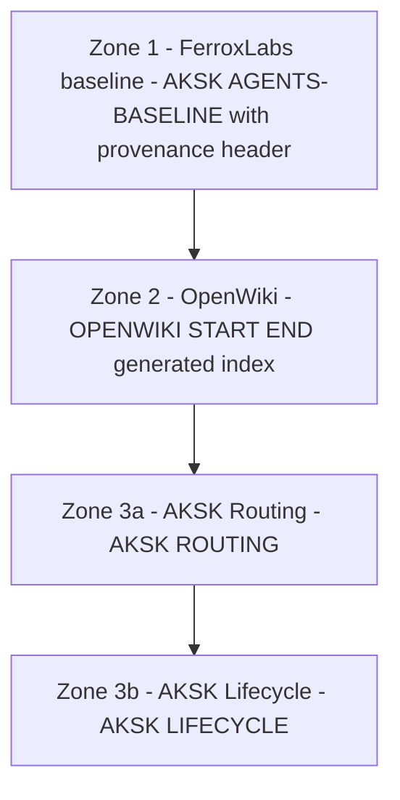
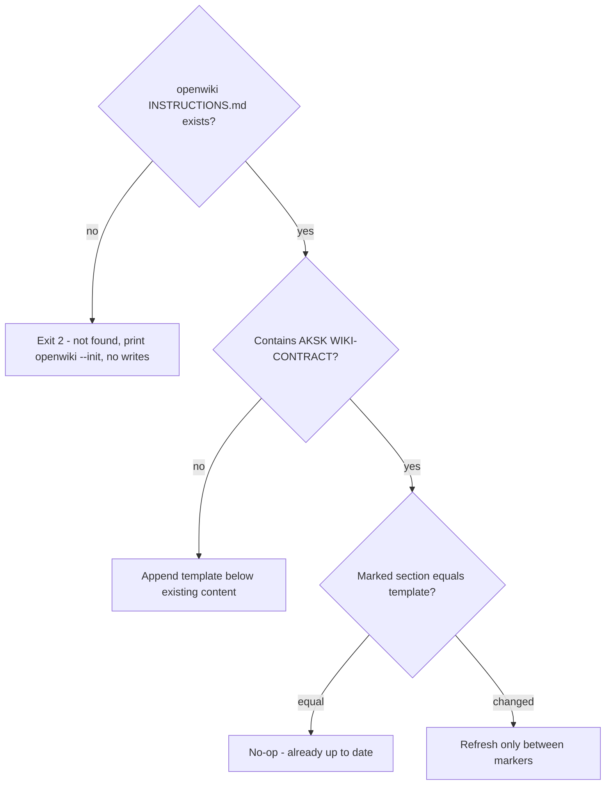
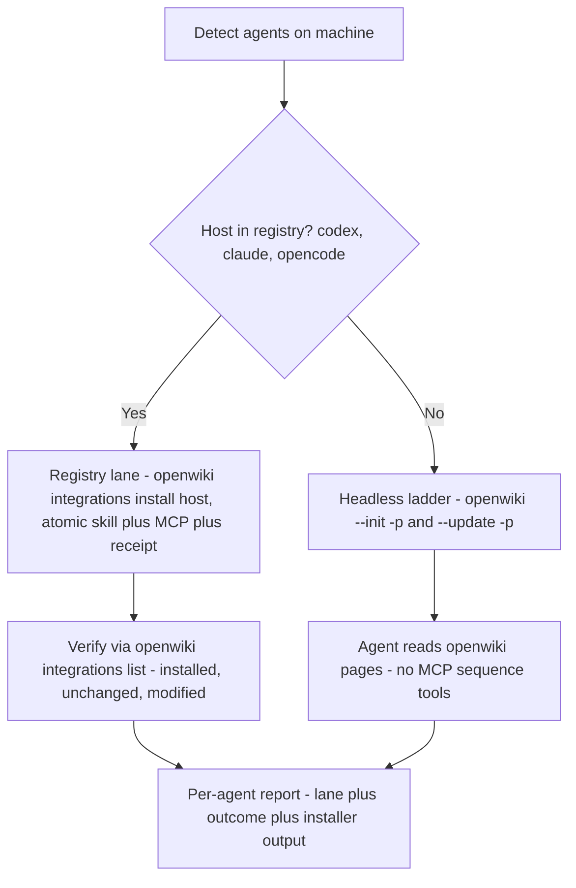

# Bootstrap and Attachment Workflow

One idempotent orchestrator takes any repository from bare to fully wired without ever leaving partial state. Preflight detection reports what exists, a once-per-user global lane installs peer tools per-user via `npm i -g`, a per-repo lane scaffolds `openspec` and `.agents`, attaches the curation contract and FerroxLabs baseline, merges the routing block, and spreads OpenWiki integration over detected agents. Every step is a deterministic Node `.mjs` script; if local execution is not possible the same script prints exact copy-paste commands and exits clean with no partial state from the failed step.

## Responsibilities and ownership

| Layer | Owner | What it owns |
| --- | --- | --- |
| Preflight + global lane | `bootstrap.mjs` | Node >=22 check, PATH checks, repo/receipt detection, `npm i -g` once per user via `versionsFromPackageJson()` |
| Per-repo scaffold | `bootstrap.mjs` delegating to shipped helpers | `openspec init`, minimal `.agents/` from kit templates, `attach_wiki_contract.mjs`, `init_agents_md.mjs`, `attach_section.mjs` routing/lifecycle merge |
| Contract attachment | Shipped `attach_wiki_contract.mjs` + `wiki-contract-template.md` | `AKSK:WIKI-CONTRACT` block inside existing `openwiki/INSTRUCTIONS.md` |
| Baseline seeding | Shipped `init_agents_md.mjs` + vendored baseline `agents-md-baseline-template.md` | `AKSK:AGENTS-BASELINE` block at top of `AGENTS.md` |
| Managed-section attachment | Shipped `attach_section.mjs` + `routing-note-template.md` / `lifecycle-template.md` | `AKSK:ROUTING` and `AKSK:LIFECYCLE` blocks in root router files |
| Baseline refresh | Shipped `refresh_agents_baseline.mjs` | Opt-in upstream fetch, validation, swap inside vendored template |
| Peer-tool verification | Shipped `check_peer_tools.mjs` | `INSTALL_COMMANDS` allowlist and PATH scan with `PATHEXT` on Windows |
| Index sync | Shipped `sync_wiki_indexes.mjs` | Deterministic rebuild via global package helpers |
| Agent spread | `bootstrap.mjs` via `openwiki integrations install` / `list` | Lane selection, receipt ownership partition, per-agent report |

Reuse boundary: the curation-contract template, skill set, and append-only merge semantics are owned by the prerequisite change `adopt-openspec-openwiki`. Bootstrap copies them; variations belong in the source change. Historical proposal archive under `openspec/changes/archive/2026-08-29-*` is superseded by shipped `openspec/specs/aksk-bootstrap/spec.md` and `openspec/specs/agents-md-bootstrap/spec.md`.

## Invariants

All scripts under `.agents/skills/aksk-bootstrap/scripts/` share the kit execution contract:

* **Deterministic Node `.mjs` only.** No shellouts to an LLM, no network fetch during seeding or attachment, no runtime installation. `init_agents_md.mjs`, `refresh_agents_baseline.mjs`, `attach_section.mjs`, `attach_wiki_contract.mjs`, `check_peer_tools.mjs`, `sync_wiki_indexes.mjs` are the leaf helpers; the orchestrator `bootstrap.mjs` composes them. Only `refresh_agents_baseline.mjs` is allowed to fetch upstream, explicitly opt-in.
* **Global installs are per-user `npm i -g`, never `npx` or repo-local `node_modules`.** Versions come from `references/versions.json` caret range (`@fission-ai/openspec@^1.11.0`, `openwiki@^0.4.3`) via `versionsFromPackageJson()` which checks the consumer repo `package.json` first for a local override, then the bundled `versions.json`. Fallback is `@latest` only when unpinned.
* **Never installs on failure / never half-installs.** Helper scripts print the verbatim install or init command and exit `2` with no writes. The orchestrator never-half-installs: any step that cannot run prints exact remaining copy-paste commands and exits clean without partial state from the failed step and without continuing past a failed prerequisite. Two lanes: `EXECUTE` runs locally, `INSTRUCT` prints commands when sandboxed, `npm` missing, or Node <22.
* **Fail-fast with remediation.** Unknown template names, a directory where a file is expected, a missing `openwiki/INSTRUCTIONS.md`, an unsupported Node version, or an unresolved `AGENTS.md` conflict all exit `2` naming the conflict and printing the exact next command. Interactive `stdin` prompts are never used — agents relay the printed question to the user.
* **Verify peer tools before invoking.** Every skill or script that needs `openspec` or `openwiki` runs `check_peer_tools.mjs` / `requireBinaries(["openspec","openwiki"])` first. Verification only scans PATH (with `PATHEXT` on Windows) against the `INSTALL_COMMANDS` allowlist, never installs. Missing tools print one error per tool plus the exact `npm i -g` caret commands and exit `2`; unknown tool names exit `2` before any lookup.
* **Idempotent by detection, not a journal.** Every step derives done from observable state — tools on PATH, `openspec/` present, marker block equals template (after normalizing trailing whitespace and newline-at-EOF), receipt present with matching hashes. No separate bootstrap journal; re-runs converge without replaying history and without rewriting a current block.
* **No silent overwrite and zone isolation.** An existing `AGENTS.md` blocks seeding until the user explicitly chooses `--replace` or `--combine`. Refreshing one marker family never rewrites another; `docs-lint` checks each zone as an independent integrity unit.

## Control flow — end-to-end



*Caption: preflight to global lane to per-repo scaffold to spread, with EXECUTE running steps and INSTRUCT printing them.*



*Caption: linear pipeline from preflight through global lane, per-repo scaffold, and spread to verification.*

## Preflight

Before any write the orchestrator detects:

* Node.js major version — requires `>=22` (openwiki requirement). On `<22` it stops before installing and prints required version and upgrade instructions, with no changes made.
* Whether `openspec` and `openwiki` resolve on `PATH` — via `onPath` scan of `PATH` directories with `PATHEXT` on Windows.
* Whether `.agents/`, `openspec/`, and `openwiki/` (and `openwiki/INSTRUCTIONS.md`) exist in the target repo.
* Whether specific marker blocks (`AKSK:WIKI-CONTRACT`, `AKSK:ROUTING`) are already attached.
* Whether OpenWiki install receipts `.openwiki-install.json` exist in known skill directories via `openwiki integrations list --project` (best-effort, never throws).

It reports this state to the user before acting. Fresh-machine preflight with Node >=22 and neither tool installed reports sufficient Node, both tools missing, and proceeds to the global lane. Re-running against a fully bootstrapped repo detects completion, changes nothing, and reports idempotent completion.

## Global tool installation lane

Once per user, user scope only:

```bash
npm i -g @fission-ai/openspec@^1.11.0 openwiki@^0.4.3
```

Caret ranges are read via `versionsFromPackageJson(repoRoot)` — consumer repo `package.json` `devDependencies`/`dependencies` first, then bundled `references/versions.json`. `INSTALL.md` and `SKILL.md` document this as `npm i -g` per-user, not repo-local `npx` or `node_modules`. When both tools are missing the orchestrator runs a single combined `npm i -g` invocation; when one is missing it installs only that one; when both are present it skips installation and reports detected versions via `openspec --version` / `openwiki --version`.

* Ordering is verified: `openwiki` must resolve on PATH before registering `openwiki mcp --host target` in host configs, so the global lane completes and re-detects before any `openwiki integrations install` runs.
* If `npm` is not on PATH, or the install exits non-zero, the orchestrator does not half-install: it prints `instructRemaining` with the exact `npm i -g` line(s) and exits clean (`0`) with no partial state, leaving completed steps intact.

## Per-repo bootstrapping — delegates to shipped helpers

For the target repository, in order:

1. `openspec init --tools none` when `openspec/` is missing. If `openspec` is not on PATH, the step is deferred to `INSTRUCT` (`openspec init --tools none`) and no partial scaffolding is left for that step.
2. Scaffold a minimal `.agents/` tree from finalized kit templates when `.agents/` is missing or incomplete — copies the skill set rather than defining its own contract (`mkdir -p .agents/skills`, `.agents/sessions`).
3. Attach the AKSK curation contract to `openwiki/INSTRUCTIONS.md` via `attach_wiki_contract.mjs` append-only merge — never creates the wiki, only attaches to an initialized one; if `openwiki/` is missing it records `openwiki --init` as remaining and skips.
4. Seed the FerroxLabs behavioral baseline via `init_agents_md.mjs` before OpenWiki/AKSK zones. On conflict (existing `AGENTS.md` with non-matching baseline) it prints the verbatim `Replace AGENTS.md with the FerroxLabs baseline, or combine both using the LLM?` prompt with `--replace` and `--combine` flags and exits via `INSTRUCT` without writing, without `stdin`.
5. Merge thin routing and lifecycle blocks into root `AGENTS.md` via `attach_section.mjs` (`routing-note-template.md` then `lifecycle-template.md`) below any existing `OPENWIKI:START/END` block, preserving other content.

Bare-repo case (none of `openspec/`, `.agents/`, `openwiki/`): creates all three — initialized OpenSpec structure, scaffolded `.agents/`, and `INSTRUCTIONS.md` with contract attached — either via `EXECUTE` or via printed `INSTRUCT` commands when sandboxed. Already-bootstrapped repo: detects prior completion via markers and receipts, changes nothing.

### Zoned layout and attachment order

A fully bootstrapped `AGENTS.md` is a stack of owner-prefixed marker blocks, ordered upstream-first. Each template carries its own `AKSK` marker pair; scripts read markers from the template at runtime via `markersOf()` rather than hard-coding them.

| Order | Zone | Markers | Owner | Status |
| --- | --- | --- | --- | --- |
| 1 | FerroxLabs behavioral baseline | `AKSK:AGENTS-BASELINE:BEGIN/END` | `init_agents_md.mjs` (seed) + `refresh_agents_baseline.mjs` (update) | Shipped |
| 2 | OpenWiki | `OPENWIKI:START/END` | OpenWiki tooling | Shipped |
| 3a | AKSK Routing | `AKSK:ROUTING:BEGIN/END` | `attach_section.mjs` + `routing-note-template.md` | Shipped |
| 3b | AKSK Lifecycle | `AKSK:LIFECYCLE:BEGIN/END` | `attach_section.mjs` + `lifecycle-template.md` | Shipped |



*Caption: stacked zone order — baseline on top, OpenWiki middle, AKSK routing and lifecycle bottom.*

Supported composition is deterministic: `init_agents_md.mjs` seeds baseline first, then OpenWiki block attaches below it, then `attach_section.mjs` appends ROUTING and LIFECYCLE below OpenWiki. Seeding is a separate script from `attach_section.mjs` to preserve the latter's append-only invariant — existing content is never replaced.

### AGENTS.md seeding — `init_agents_md.mjs` — shipped

Single entrypoint for seeding, upgrading, or combining `AGENTS.md`:

```bash
node .agents/skills/aksk-bootstrap/scripts/init_agents_md.mjs [repo-root]
node .agents/skills/aksk-bootstrap/scripts/init_agents_md.mjs [repo-root] --replace
node .agents/skills/aksk-bootstrap/scripts/init_agents_md.mjs [repo-root] --combine
```

* **Fresh repo:** copies vendored baseline at `.agents/skills/aksk-bootstrap/references/agents-md-baseline-template.md` — upstream FerroxLabs `AGENTS.md` wrapped in `AKSK:AGENTS-BASELINE` markers with provenance header (URL, capture date, MIT notice, refresh pointer) — verbatim including the header. Seeding never touches the network; `AKSK:` prefix signals kit ownership.
* **Idempotent re-run:** normalized compare — trailing whitespace and newline-at-EOF normalized — matching marked section is a no-op without rewrite.
* **Conflict path — exit 2, no writes:** existing `AGENTS.md` whose marked section does not match exits `2` naming the conflict and printing `Replace AGENTS.md with the FerroxLabs baseline, or combine both using the LLM?` plus `--replace` and `--combine` flags, without using stdin.
  * `--replace` overwrites `AGENTS.md` with the marked baseline including provenance header, then caller restores OpenWiki and AKSK zones via attachment scripts.
  * `--combine` never modifies the original; stages `existing.md`, `baseline.md`, and generated `COMBINE.md` brief side-by-side under `.agents/sessions/agents-md-combine/<timestamp>/` and prints LLM merge instructions. Brief constrains merge: preserve project learnings and sections 10-11, prefer baseline structure for 0-9, keep `AKSK` and `OPENWIKI` blocks verbatim. Present diff before writing. Only `sessions/README.md` is tracked; `sessions/[0-9]*` is ignored.
* **Guards:** target is directory → exit 2; `--replace`/`--combine` without existing file → exit 2; both flags together → exit 2; markers read from template, never hard-coded.

### Baseline refresh — `refresh_agents_baseline.mjs` — shipped

Opt-in updater, never run implicitly:

```bash
node .agents/skills/aksk-bootstrap/scripts/refresh_agents_baseline.mjs
node .agents/skills/aksk-bootstrap/scripts/refresh_agents_baseline.mjs --check
```

Fetches upstream `https://raw.githubusercontent.com/FerroxLabs/agents-md/main/AGENTS.md` to a temp file, validates non-empty and expected section anchors (`Non-negotiables`, `Before writing code`, `Surgical changes`, `Goal-driven execution`), then swaps only content between `AKSK:AGENTS-BASELINE` markers in the vendored template, updating the provenance capture date leaving other zones byte-identical. Offline or validation failure exits non-zero and leaves previously vendored baseline intact. `docs-lint` surfaces stale capture date (>6 months) as informational advice. The pinned SHA in `references/versions.json` (`@ferroxlabs/agents-md`) is bumped alongside the vendored template.

## Managed-section attachment — `attach_section.mjs` — shipped

```bash
node .agents/skills/aksk-bootstrap/scripts/attach_section.mjs [repo-root] [target-file-name] [template-name]
```

Markers are parsed from the chosen template `markersOf()` extracting `AKSK:[A-Z-]+:BEGIN` and matching `END`; never hard-coded. Templates today:

| Template | Markers | Content |
| --- | --- | --- |
| `routing-note-template.md` (default) | `AKSK:ROUTING` | Discovery pointers into `.agents/` and `openwiki/` |
| `lifecycle-template.md` | `AKSK:LIFECYCLE` | Self-improvement loop mandate |

Behavior contract: existing content outside markers never replaced; idempotent and self-updating via in-place refresh when template changed (trimmed compare gives no-op when current); missing target file created containing only the section; unknown template name or target-is-directory exits `2`.

## OpenWiki contract attachment — `attach_wiki_contract.mjs` — shipped

```bash
node .agents/skills/aksk-bootstrap/scripts/attach_wiki_contract.mjs [repo-root]
```

Appends `wiki-contract-template.md` between `AKSK:WIKI-CONTRACT:BEGIN/END` to an **existing** `openwiki/INSTRUCTIONS.md`. If missing, exits `2` with prerequisite `openwiki --init` and performs no writes. Otherwise appends below existing content (stub-aware: `A code wiki for this repository.` reported as such) or refreshes only between markers when template changed. Trimmed compare gives no-op when current. Downstream skills treat missing markers as no-contract.



*Caption: contract attachment decision — missing file fails fast, otherwise append or refresh only between markers.*

## Peer-tool verification — `check_peer_tools.mjs` — shipped

```bash
node .agents/skills/aksk-bootstrap/scripts/check_peer_tools.mjs openspec openwiki
```

```js
import { requireBinaries } from "./check_peer_tools.mjs";
requireBinaries(["openspec", "openwiki"]);
```

Allowlist only: `INSTALL_COMMANDS` maps `openspec` and `openwiki` to `npm i -g` lines (fallback `@latest`; orchestrator substitutes caret from `versions.json`). Unknown names exit `2` with `unknown peer tool(s)` before any PATH lookup. `onPath` scans `PATH` directories with `PATHEXT` on Windows. `requireBinaries` prints one error per missing tool plus install commands then exits `2`. No-args also exits `2`. Bootstrap and every sibling skill call this before invoking `openspec` or `openwiki`.

## Deterministic index sync — `sync_wiki_indexes.mjs` — shipped

```bash
node .agents/skills/aksk-bootstrap/scripts/sync_wiki_indexes.mjs [repo-root]
```

Refreshes indexes with no LLM and no CLI: locates global package via `npm root -g`, dynamically imports `OpenWikiLocalShellBackend` (`docsOnly: true`, `virtualMode: true`) and `synchronizeWikiIndexes`, rebuilds while keeping curated page bodies byte-identical. Exits `2` when `openwiki/` missing or package not globally installed.

## OpenWiki integration spread

Spreads integration across detected agents with exactly one lane per agent — no intermediate `add-mcp` plus `npx skills add` lane.

| Lane | When | Command | Effect |
| --- | --- | --- | --- |
| Registry lane | Host is `codex`, `claude`, or `opencode` | `openwiki integrations install host` | Atomically copies skill bundle and edits host MCP config, writes `.openwiki-install.json` receipt |
| Headless ladder | Any other agent | Agent drives `openwiki --init -p` / `--update -p` directly | No MCP registration |



*Caption: lane selection per detected agent — registry hosts get atomic skill plus MCP, others use headless openwiki commands.*

Registry lane details:

* Sources bundle from installed npm package `npm-root/openwiki/integrations/openwiki`, not a tag-pinned URL. Receipt records `package`, `version`, `target`, SHA-256 hashes, and exact `mcpServerCommand` (`openwiki mcp --host target`).
* Copies skill via staging then commit; rejects symlinked skill dirs or parents and non-directory parents.
* Edits host MCP config atomically in same transaction: codex `~/.codex/config.toml` TOML, claude JSON, opencode JSONC, with config-snapshot rollback and staging cleanup on failure. No separate `npx skills add` step.
* MCP sequence tools (`openwiki_begin` / `openwiki_submit_plan` / `openwiki_next_page` / `openwiki_submit_page` / `openwiki_finish`) require MCP registration; skill without MCP is inert. Headless ladder has no generic `openwiki mcp` service.
* When sandboxed, spread is deferred to `INSTRUCT` or headless fallback (`openwiki --init -p`).

### Ownership partition via receipt

Before touching any skill directory, spread inspects via `openwiki integrations list` / `inspectInstallation`:

* Receipt present with matching `target` and intact hashes → official lane owns destination. Skip entirely and report owned; do not merge.
* `modified` → hash drift or hand-edits. Report `modified` and skip unless `--force` explicit; with `--force` overwrite after backup and report backup path; without it preserve uninstall integrity.
* `not-installed` → unowned; integrate through selected lane.

Installing two managers into one destination is prevented by this check plus symlink and non-directory-parent rejections. Bootstrap never guesses supported-host formats and never hard-codes skill paths — all paths derived from registry at runtime. Codex path drift (`~/.agents/skills/` vs `~/.codex/skills/`) is resolved by the registry.

### Spread result report

After running, spread produces one line per detected agent naming agent, chosen lane (`openwiki integrations install host` vs headless), outcome status (`installed` / `unchanged` / `modified` via `list`), and installer output including backup path on `--force`.

Bundle update lifecycle: `npm i -g openwiki@latest` (caret via `versions.json` in bootstrap) then re-run `openwiki integrations install target` — idempotent when version, hashes, and command already match. No tag pin or `skills update` tracking. `uninstall` is transactional with rollback and removes receipt.

## Failure semantics and recovery

| Failure | Detection | Recovery |
| --- | --- | --- |
| Node < 22 | Preflight `bootstrap.mjs` version check | Stop before installing; print required version and upgrade instructions, no writes |
| Missing peer tools | `onPath` / `requireBinaries` | Exit 2 with exact `npm i -g` lines (caret when via orchestrator), no writes |
| No execution capability / `npm` missing | No bridge / `onPath npm` false | `INSTRUCT` lane: print exact remaining commands, exit clean, no partial state from failed step |
| `npm i -g` fails | `spawnSync npm` non-zero | Print failing command, `instructRemaining`, exit clean without continuing |
| Missing `openwiki/INSTRUCTIONS.md` | `readFileSync` fail in `attach_wiki_contract.mjs` | Exit 2 with `openwiki --init`, no writes; orchestrator converts to `INSTRUCT` |
| Missing `openwiki/` or global package | `existsSync` / `npm root -g` | Exit 2 with remediation |
| Unknown template or target is directory | `existsSync` / `statSync` | Exit 2 naming unknown template or directory |
| Symlinked skill dir or non-directory parent | Installer preflight | Reject; user fixes filesystem, re-run |
| Modified skill or config | `openwiki integrations list` shows `modified` | Report and skip; `--force` overwrites with backup |
| Concurrent hand-edits to host config | Config snapshot comparison at commit | Roll back snapshot; remove staging; no partial install |
| AGENTS.md conflict | Marked section mismatch (normalized compare) | Exit 2 with replace vs combine question and flags; orchestrator prints both `INSTRUCT` commands |
| Upstream fetch offline / validation fails | `refresh_agents_baseline.mjs` fetch or anchor check | Exit non-zero, previously vendored baseline remains byte-identical |

## Operations and focused validation

| Probe | Command | What it proves |
| --- | --- | --- |
| Fresh seeding + idempotency | `node .agents/skills/aksk-bootstrap/scripts/init_agents_md.mjs` in empty temp dir, run twice | File created with marked baseline plus provenance header; second run no-op |
| Full zone order | Run init, then OpenWiki attach, then `attach_section.mjs` for routing and lifecycle | All families present, distinct, ordered baseline → OpenWiki → AKSK |
| Conflict replace | Temp dir with custom `AGENTS.md` → run init → exit 2 file untouched → `--replace` → marked baseline | No silent overwrite; explicit flag required |
| Conflict combine | Restore custom file → `--combine` → staged bundle under `.agents/sessions/agents-md-combine/timestamp/` | LLM merge staged, not applied; original untouched |
| Zone isolation | Modify content outside baseline markers, re-run init; damage one zone markers | Only baseline zone considered; lint reports that family |
| Preflight reports state | Re-run `bootstrap.mjs` on fully bootstrapped fixture | Reports Node, tools, repo state, receipts; changes nothing (`--json` for machine-readable) |
| Partial fixture convergence | Re-run on partially bootstrapped fixture | Completes only missing steps |
| Global lane caret | Inspect `npm i -g` line printed by `bootstrap.mjs` | Shows `^1.11.0` / `^0.4.3` from `references/versions.json`, not `@latest` |
| Global lane skip | Run `bootstrap.mjs` when tools already `npm i -g` installed | Skips install, prints detected versions |
| INSTRUCT fallback | Run `bootstrap.mjs` sandboxed or with `npm` not on PATH | Prints exact remaining commands, exits clean, no partial state |
| Supported host idempotency | `openwiki integrations install host` twice | Second run `unchanged` no-op; codex TOML `replaceableEntry` holds |
| Modified detection | Hand-edit skill dir then `openwiki integrations list` | Reports `modified`; install refuses without `--force` |
| Force with backup | `openwiki integrations install host --force` | Overwrites, creates backup, reports backup path |
| Headless ladder | Agent without registry host drives `openwiki --init -p` / `openwiki --update -p` | Pages initialize without MCP |
| Receipt ownership | Presence of `.openwiki-install.json` | Spread skips and reports owned via `list` |
| Peer tools | `node .agents/skills/aksk-bootstrap/scripts/check_peer_tools.mjs openspec openwiki` | Missing tools fail with exact install commands |
| Contract attachment | `node .agents/skills/aksk-bootstrap/scripts/attach_wiki_contract.mjs` twice | Second run no-op; template change refreshes only marked section |
| Structure + lint | `bash scripts/check-agents-structure.sh .agents` and `docs-lint` wiring | New `AKSK:AGENTS-BASELINE` zone integrity-checked alongside `ROUTING` / `LIFECYCLE` |

## Extension points

* **New managed section:** add a template under `.agents/skills/aksk-bootstrap/references/` carrying a unique `AKSK:NAME:BEGIN/END` pair; `attach_section.mjs` picks it up via `markersOf()` with no code change. Extend `docs-lint` wiring checks.
* **New baseline source:** provenance header inside `AKSK:AGENTS-BASELINE` identifies origin, so marker prefix stays `AKSK:` even if upstream vendor changes. Only reference template and refresh validation anchors need updating.
* **Tool wiring beyond AGENTS.md:** product overlays (Cursor rules, Copilot instructions, `CLAUDE.md`, `GEMINI.md`) reuse same `attach_section.mjs` mechanism with different target filename; durable guidance remains in `.agents/` and curated `openwiki/` trees.
* **New supported host:** add to upstream `HOST_TARGETS` registry; spread picks it up via `openwiki integrations list` with no kit path matrix change.

## Related pages

* [AGENTS.md Zoning and Baseline](../concepts/agents-md-zoning.md) — zone stack, vendored baseline, and routing-pattern exception.
* [Knowledge Curation Contract](../concepts/knowledge-curation-contract.md) — curated trees, `INSTRUCTIONS.md` attachment, and preserve-and-link semantics.
* [Distribution and Agent Spread](../integrations/distribution-and-agent-spread.md) — peer dependencies, Skills CLI distribution, and wiring mechanics.
* [aksk-bootstrap Skill](../skills/aksk-bootstrap.md) — precondition provider and marker-delimited attachment scripts.
