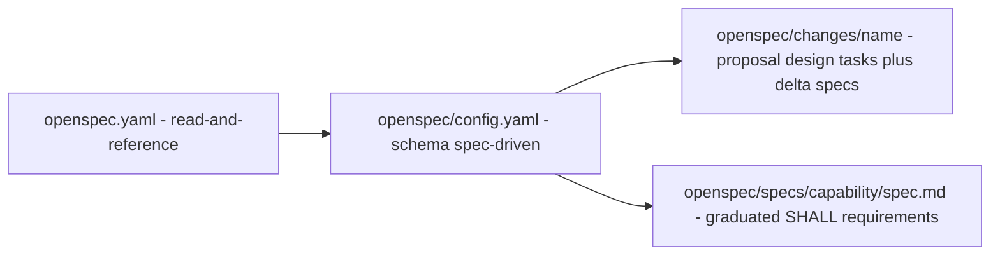
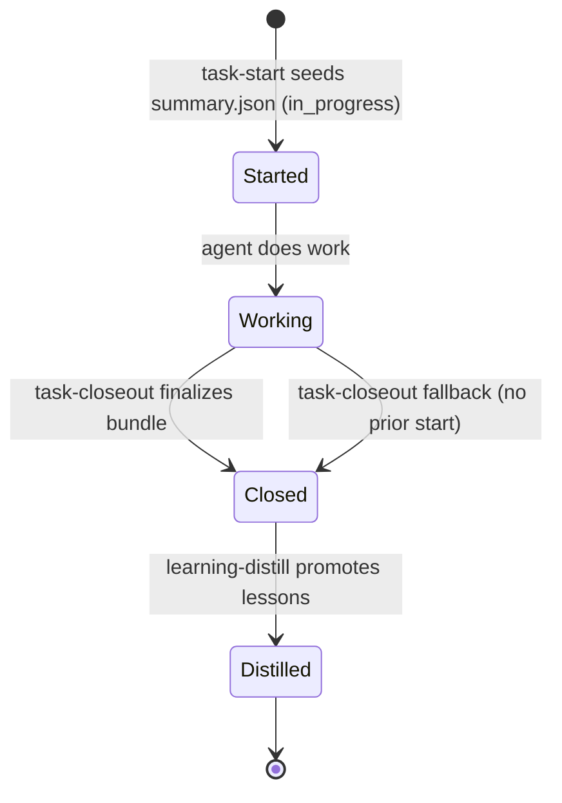
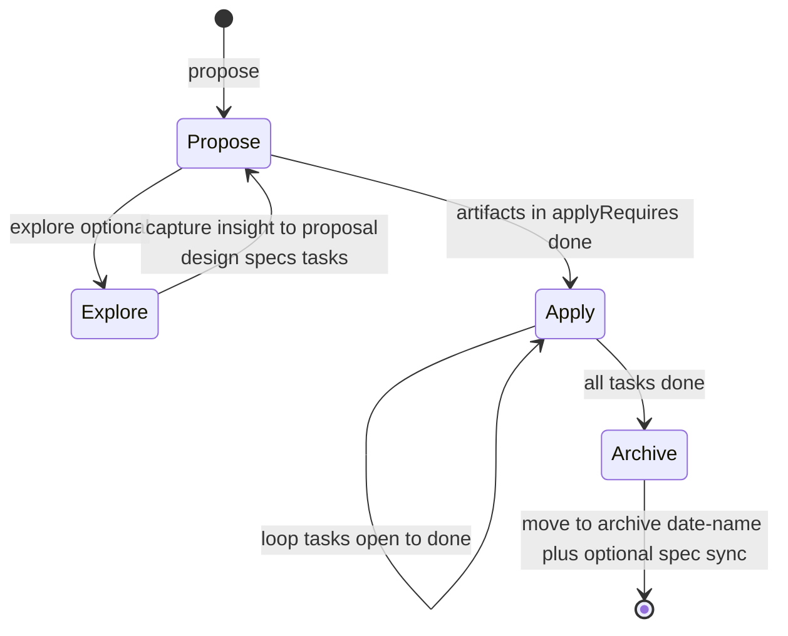
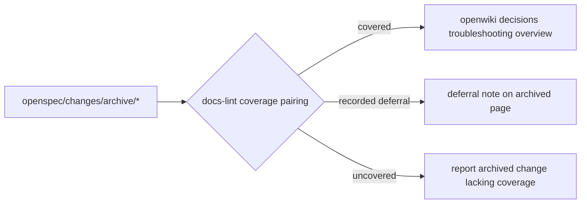

# OpenSpec Governance

OpenSpec is the intent and process layer of this repository. It owns *what* should be built and *in what order*, while OpenWiki owns descriptive knowledge and `.agents/` owns prescriptive behavior. Since May 2026 substantive work flows through `openspec/` instead of ad-hoc maintainer plans.

The mechanism is specification-driven change management: every meaningful unit of work is a **change** with explicit artifacts (`proposal.md`, `design.md`, `tasks.md`, delta specs), driven by four `opsx` agent workflows and validated at archive time. Graduated requirements live under `openspec/specs/`; in-flight deltas live under the change itself. Archived changes are paired with wiki coverage by `docs-lint`.

> **Contract note:** Only `openspec/specs/**` is the current contract. `openspec/changes/archive/**` is historical. Active entries under `openspec/changes/<name>/` are proposals, not yet graduated — cite them as **Proposal-only** until `opsx:archive` promotes deltas via spec sync.

## Configuration — two YAML entrypoints

### Root guardrail: `openspec.yaml`

The repository root carries a minimal rule file that tells OpenSpec-aware agents where durable knowledge lives:

```yaml
rules:
  - name: AKSK Knowledge Persistence
    patterns: [.agents/**/*.md, docs/**/*.md]
    action: read-and-reference
```

It does not encode behavior — it enforces that agents read and reference the knowledge layer before proposing changes.

### Schema and rules: `openspec/config.yaml`

The authoritative configuration selects the **spec-driven** schema and embeds project context and artifact rules:

```yaml
schema: spec-driven
context: |
  The Agent Knowledge Starter Kit (AKSK) is a tool-agnostic system ...
rules:
  proposal: [focus on durable knowledge layer impact, ...]
  design:   [Mermaid diagrams, .agents/ structure, cross-tool compatibility]
  tasks:    [always end with task-closeout, include learning-distill, verify via docs-lint]
```

* `schema: spec-driven` fixes the artifact graph: `proposal.md` → `design.md` → `tasks.md` plus optional `specs/<capability>/spec.md` delta files. Only artifacts listed in `applyRequires` gate implementation.
* `context` is an LLM-facing briefing — constraints for the proposing agent, never copied into artifacts.
* `rules` are per-artifact constraints. Proposal rules keep changes knowledge-aware; design rules enforce Mermaid and `.agents/` layout; tasks rules bind every change to the closeout → distill → lint maintenance loop.

The context block still references pre-consolidation paths (`.agents/docs/decisions/`, `log.md`). That staleness is intentional documentation debt surfaced by lint's stale-page check rather than fixed by hand.



## Change and spec anatomy

### Active change layout

Every active change is a directory under `openspec/changes/`:

```
openspec/changes/<kebab-name>/
├── .openspec.yaml          # { schema: spec-driven, created: YYYY-MM-DD }
├── proposal.md             # what & why, impact on knowledge layer
├── design.md               # how, decisions D1…Dn, Mermaid, migration plan
├── tasks.md                # checklist: - [ ] / - [x], always ends with closeout
└── specs/<capability>/     # optional delta specs
    └── spec.md             # ADDED / MODIFIED / REMOVED / RENAMED requirements
```

* `.openspec.yaml` is the change-local schema receipt — two keys only.
* `proposal.md` is mandatory. `design.md` and `tasks.md` are generated in dependency order via `openspec instructions <artifact> --change <name> --json`.
* Delta specs are capability-scoped. They use delta semantics against the corresponding `openspec/specs/<capability>/spec.md` — the main spec is never edited while the change is active.

Example active set (11 at time of writing): `add-task-start`, `add-integrations`, `add-script-tests`, `adopt-workflows-taxonomy`, `implement-operating-contract-and-triggers`, `consumer-upgrade-path`, plus five supporting proposals. Each carries the shape above. `canonical-universal-install` has graduated and is now archived.

### Graduated versus delta specs

| Location | Lifecycle | Meaning | Written by |
| --- | --- | --- | --- |
| `openspec/changes/<name>/specs/<cap>/spec.md` | in-flight | delta requirements for this change | `opsx:propose` / author |
| `openspec/specs/<cap>/spec.md` | graduated | durable SHALL requirements for the repo | `opsx:archive` sync step |
| `openspec/changes/archive/YYYY-MM-DD-<name>/` | archived | frozen record of what shipped | `opsx:archive` move |

Twelve capabilities are currently graduated: `openspec-integration`, `remove-write-plan` (pre-2.0), plus `wiki-contract`, `distill-routing`, `cross-tool-lint`, `closeout-change-linking` (from `adopt-openspec-openwiki`), `install-lanes`, `aksk-bootstrap`, `agent-integration-spread`, `agents-md-bootstrap` (from the 2026-08-29 wave), `canonical-user-skills-scope` (from `canonical-universal-install`), and `aksk-init` (from `split-bootstrap-init`). Requirements live only here — distillation never duplicates a SHALL as a wiki page; it cites the capability instead (see [Knowledge Curation Contract](../concepts/knowledge-curation-contract.md)).

Legacy hand-authored proposals predating the structured spec format survive as flat files under `openspec/changes/archive/*.md` with the same intent but without delta semantics.

### Graduated change: `canonical-universal-install` (archived 2026-08-29)

`openspec/changes/archive/2026-08-29-canonical-universal-install/` is **graduated** — its deltas have been promoted to `openspec/specs/**` and are now contract. Do not cite the archive directory as proposal; cite the graduated specs.

What it shipped (BREAKING):

* **Canonical store:** `~/.agents/skills` (universal, Codex default) plus the self-reported current host's dir (`~/.codex/skills`, `~/.claude/skills`, etc.) via `npx skills add -g -a <self-reported> <source>`. Applies to `Hypercubed/Agent-Knowledge-Starter-Kit` and `langchain-ai/openwiki` (`--full-depth` for openwiki). Extra `-a <other>` or `--all` only when the user explicitly asked at install time — no wide spread by default, no persistent consent artifact.
* **`npx` required, clone fallback removed:** `git clone --depth 1 && cp -r .agents/skills` is deleted. Missing `npx` is reported as a prerequisite in the bootstrap INSTRUCT lane, not silently copied.
* **Graduated specs:** `ADDED` `canonical-user-skills-scope` with `~/.agents/skills` canonical, `npx` required, universal+current default, `references/versions.json` via `versionsFromPackageJson()` for version pins (caret, fallback `@latest`), and verification asserting `~/.agents/skills/<name>/SKILL.md`; `MODIFIED` `agent-integration-spread` (same universal+current scoping, `openwiki integrations install` vs `npx skills add -g` + `npx add-mcp` ladder, verified via `openwiki integrations list` vs `list --project`). `aksk-bootstrap` is now global-only — per-repo scaffolding moved to `aksk-init` via `split-bootstrap-init`, but the canonical store invariant remains enforced by both lanes.

The graduated specs `canonical-user-skills-scope` and `agent-integration-spread` now describe the `~/.agents/skills` default with `npx` required and registry-vs-`add-mcp` ladder. Repo-local `./.agents/skills` is an explicit override (documented as override A), not the default.

### Pending proposal: `add-task-start` (Proposal-only)

`openspec/specs/**` remains truth for this capability. `openspec/changes/add-task-start/` is **not** yet graduated — do not treat its deltas as contract until archived.

What it proposes:

* **New capability `task-start`:** Proactive initialization before work begins. Creates `.agents/sessions/YYYYMMDD-HHMMSS-short-topic/` (sortable label, not identity) and seeds `summary.json` per `task-closeout/CONTRACT.md` with `task_id` (canonical), `created_at`, `status: in_progress`, and optional `openspec_change`, `repo_id`, `agent`, `agent_session_id`. Does not yet contain `completed_at`, final validation, or changed-files content. Idempotently ensures `.agents/sessions/README.md` and `.agents/.gitignore` entries (`sessions/*`, `!sessions/README.md`) exist.
* **Modified `task-closeout` continuity:** Closeout detects the seeded `summary.json` and finalizes it in place — preserving `task_id` (and `openspec_change` if seeded) and appending `completed_at`, final `status` (`completed`/`blocked`/`abandoned`), git metadata, `openspec_change`, and distillation flags, then writing the remaining four bundle files (`active-task.md`, `learning-candidate.md`, `changed-files.txt`, `validation.txt`). When invoked without a prior `task-start`, it retains its current generation fallback.
* **Exclusive ownership and strict sequencing:** `task-start` owns creation, `task-closeout` owns finalization, `learning-distill` consumes the finalized bundle only after closeout marks it ready. No other writer mutates the bundle. No durable writes happen at start or closeout — `openwiki/`, `.agents/AGENTS.md`, `.agents/playbooks/`, `.agents/skills/` are untouched; proposed durable changes stay as prose inside the bundle for distillation.
* **Config and routing update (proposal-only):** Updates `openspec/config.yaml` context (replace stale `.agents/docs/` references with `openwiki/` + `.agents/sessions/` (gitignored) + `.agents/AGENTS.md`) and `.agents/AGENTS.md` routing/lifecycle to include `task-start` as the mandatory start-of-task trigger alongside the existing `task-closeout` end trigger.



Until `opsx:archive` promotes this delta, the shipped lifecycle remains `work → task-closeout → learning-distill` with `task-closeout` creating the bundle from scratch.

## The four opsx workflows

The four workflows were previously shipped as local copies under `.agents/workflows/opsx-*.md` (local copies of `openspec init` agent integration). Per `adopt-openspec-openwiki` they have been deleted; the native `openspec` CLI now provides the same slash commands. Behavior and CLI contracts are unchanged.



### `opsx:propose` — create a change and generate artifacts in dependency order

Entrypoint: `/opsx:propose <kebab-name|description>` → `openspec new change`.

1. Derive a kebab-case name if a description was given; ask via `AskUserQuestion` if no input.
2. Scaffold: `openspec new change "<name>"` → `openspec/changes/<name>/.openspec.yaml`.
3. Poll: `openspec status --change "<name>" --json` → read `applyRequires` and `artifacts[]` with per-artifact `status`.
4. Loop in dependency order until every ID in `applyRequires` is `done`:
   * `openspec instructions <artifact-id> --change "<name>" --json` → `template`, `outputPath`, `dependencies`, `context`/`rules`.
   * Read completed dependency files for context, render `template` at `outputPath` applying `context`/`rules` as constraints (never copy them verbatim).
   * Re-run `openspec status` to reassess readiness.
5. `openspec status --change "<name>"` summary and prompt to `/opsx:apply`.

Guardrails: verify each file exists before proceeding; ask if the name already exists; prefer reasonable defaults over blocking on clarification.

### `opsx:explore` — thinking partner stance, not a workflow

Entrypoint: `/opsx:explore [idea|problem|change-name]`. There are no fixed steps — it is a stance.

* **Never implements.** It may read files, search code, and create OpenSpec artifacts (proposals, designs, specs) as thinking capture, but never writes application code.
* Checks `openspec list --json` for active changes at start; if a change is named, reads its artifacts and references them naturally.
* Offers to capture insights into the correct destination (`specs/<cap>/spec.md` for requirements, `design.md` for decisions, `proposal.md` for scope, `tasks.md` for new work) but the user decides — no auto-capture.
* Ends optionally by flowing into a proposal offer, updating artifacts, or just providing clarity.

### `opsx:apply` — implement tasks from a change

Entrypoint: `/opsx:apply [change-name]` (infers from context or auto-selects if only one active change; prompts via `AskUserQuestion` when ambiguous).

1. `openspec status --change "<name>" --json` → `schemaName`, task artifact location.
2. `openspec instructions apply --change "<name>" --json` → `contextFiles` (concrete file paths per schema), progress counts, task list, dynamic instruction. If `state: "blocked"` or `"all_done"` handle accordingly.
3. Read every path in `contextFiles` — for spec-driven: proposal, specs, design, tasks.
4. Loop pending tasks: show `Working on task N/M`, make minimal focused edits, mark `- [ ]` → `- [x]` immediately after each task, pause on ambiguity, design mismatch, error, or interrupt.

Fluid model: can be invoked before all artifacts are done (if tasks exist), after partial implementation, or interleaved with artifact updates.

### `opsx:archive` — verify, optionally sync specs, and freeze the change

Entrypoint: `/opsx:archive [change-name]` (always prompts for selection if omitted — never auto-selects).

1. `openspec list --json` for selection; `openspec status --change "<name>" --json` for artifact completion — warn on any `status != done`, confirm to proceed.
2. Read tasks file, count `- [ ]` vs `- [x]` — warn on incomplete tasks, confirm.
3. Delta spec sync assessment: if `openspec/changes/<name>/specs/` exists, compare each delta against `openspec/specs/<capability>/spec.md` (adds, modifications, removals, renames), show combined summary. Prompt:
   * changes needed → "Sync now (recommended)" vs "Archive without syncing"
   * already synced → "Archive now" vs "Sync anyway" vs "Cancel"
   * On sync, delegates to `openspec-sync-specs` via the Skill tool.
4. `mkdir -p openspec/changes/archive` then `mv openspec/changes/<name> openspec/changes/archive/YYYY-MM-DD-<name>/`. Fail if target already exists. `.openspec.yaml` moves with the directory.

Spec updates happen here, not at closeout time — this is the `closeout-change-linking` contract. Closeout captures `openspec_change` in `summary.json` and leaves `openspec/` untouched for in-flight changes.

## Archived changes and wiki coverage

Archiving freezes intent. But intent without descriptive follow-through is debt. The lint-time pairing closes the loop.

### The archive tree

`openspec/changes/archive/` is date-prefixed (`YYYY-MM-DD-<name>/`) plus the legacy flat-file entries. Five waves are visible:

* **2026-05-16** — `add-openspec-integration` (adopted OpenSpec itself).
* **2026-07-18/19** — five wiki-related proposals marked Overcome-By-Events by `integrate-openwiki-skills`, plus `remove-write-plan`.
* **2026-08-23** — `adopt-openspec-openwiki` archived as fully applied (four specs graduated), plus superseded retirements (`integrate-openwiki-skills`, `aksk-install-tools`, `aksk-openspec-bridge`, `escalate-quick-reference`).
* **2026-08-29** — `add-agents-md-bootstrap` (seed `AGENTS.md` from vendored baseline), `aksk-bootstrap-system` (orchestrator skill + deterministic `bootstrap.mjs`), `reorder-install-lanes-drop-example` (lanes reordered, `example/` removed), `canonical-universal-install` (canonical `~/.agents/skills` + universal+current, `npx` required, `canonical-user-skills-scope` ADDED), and `split-bootstrap-init` (`aksk-bootstrap` global-only, `aksk-init` per-repo).

Each archived directory preserves proposal/design/tasks and delta specs as the audit trail.

### Pairing with wiki coverage — a docs-lint wiring check

The third wiring check in [Validation and Cross-Tool Lint](../operations/validation-and-lint.md) walks `openspec/changes/archive/*/` and pairs each change with descriptive outcomes in `openwiki/`:



* **Covered** — descriptive outcomes appear as curated OKF pages.
* **Recorded deferral** — some changes produce no durable descriptive knowledge (pure process retirements such as `escalate-quick-reference` built on the deleted `docs-compile` generator). The deferral is recorded **on the archived page itself**, not as a separate manifest. Lint honors these and does not flag them.
* **Uncovered** — lint reports the change as wiki debt.

This is the explicit link between change lifecycle and curation: archiving does not automatically create wiki pages — distillation does — but lint ensures every archived change is accounted for either by a page or by an intentional deferral. The governance page `openwiki/governance/openspec-workflow.md` documents the supersession lineage that justifies each deferral.

### Index ownership

Do not regenerate hand-maintained indexes. OpenWiki tooling owns all generated catalogs:

* `openwiki/index.md` and `openwiki/{decisions,troubleshooting}/index.md` are rebuilt deterministically by `node .agents/skills/aksk-bootstrap/scripts/sync_wiki_indexes.mjs` (via `OpenWikiLocalShellBackend` with `docsOnly: true`, `virtualMode: true`, calling `synchronizeWikiIndexes`).
* `.last-update.json` and `.run.json` are OpenWiki-owned run metadata.

Distillation calls `sync_wiki_indexes.mjs` after authoring curated pages. `docs-lint` reports index drift as informational guidance to rerun sync, not as a wiring failure. Never hand-edit OpenWiki-owned files.

## Invariants, failure semantics, and operations

**Never installs.** Every bootstrap script and every `opsx` invocation that needs `openspec`/`openwiki` checks the binary on `PATH` first and exits `2` printing the exact `npm i -g @fission-ai/openspec@latest` / `npm i -g openwiki@latest` remediation. Verification is directory-scan based, rejects unknown tool names, and never attempts installation.

**State-driven gating.** `openspec status --json` is the single source for artifact graph, `applyRequires`, and progress. `opsx:apply` handles `blocked` (missing prerequisites) and `all_done` explicitly before implementing.

**Idempotent markers.** `attach_section.mjs` and `attach_wiki_contract.mjs` are template-driven — `markersOf()` extracts `<!-- AKSK:*:BEGIN/END -->` from the template itself. Re-running when the marked section already matches (after normalizing trailing whitespace and newline-at-EOF) is a no-op.

**Tasks as state.** Tasks are markdown checkboxes; the loop invariant is `- [ ]` → `- [x]` immediately after completing the corresponding code change. Collocated delta specs in `specs/<cap>/spec.md` are the only spec mutation during the change; graduated specs are untouched until `opsx:archive` sync.

**No silent archive on warnings.** Archive warns on incomplete artifacts or incomplete tasks but does not block — it confirms and proceeds, recording warnings in the summary.

| Operation | Command | What it proves |
| --- | --- | --- |
| List active changes | `openspec list --json` | Active set, schemas, status |
| Artifact graph | `openspec status --change "<n>" --json` | `applyRequires`, per-artifact `status` |
| Artifact instructions | `openspec instructions <id> --change "<n>" --json` | `template`, `outputPath`, `context`, `rules` |
| Apply instructions | `openspec instructions apply --change "<n>" --json` | `contextFiles`, progress, task list |
| Create scaffold | `openspec new change "<n>"` | Directory + `.openspec.yaml` |
| Refresh indexes | `node .agents/skills/aksk-bootstrap/scripts/sync_wiki_indexes.mjs` | Deterministic index rebuild |

Preflight before any `openspec`/`openwiki` use: `node .agents/skills/aksk-bootstrap/scripts/check_peer_tools.mjs openspec openwiki`.

## Relationships and extension points

* **OpenSpec ↔ OpenWiki** — peer dependencies, never installed by AKSK. The `wiki-contract` spec appends the curation contract to `openwiki/INSTRUCTIONS.md`; OpenWiki honors `AKSK-curated` trees as preserve-and-link. See [Knowledge Curation Contract](../concepts/knowledge-curation-contract.md).
* **OpenSpec ↔ Task Lifecycle** — task-closeout links bundles to changes via `summary.json:openspec_change` and defers spec edits to archive time per `closeout-change-linking`. The bundle identity is `summary.json:task_id`; `add-task-start` (Proposal-only) would split identity creation vs finalization. See [Task Lifecycle and Session Bundles](../architecture/task-lifecycle.md) and [Session Identity and Storage](../concepts/session-identity-and-storage.md).
* **OpenSpec ↔ Validation** — `cross-tool-lint` consumes the archive tree for coverage pairing; `check-agents-structure.sh` / `check-publish.sh` guard portable structure independently of OpenSpec. See [Validation and Cross-Tool Lint](../operations/validation-and-lint.md).

**Adding a new capability:**

1. Propose a change with `specs/<new-capability>/spec.md` containing SHALL requirements.
2. Implement via `opsx:apply` (tasks may reference the delta spec).
3. Archive with sync — delta becomes `openspec/specs/<new-capability>/spec.md`.

**Adding a marker family:** add `references/<name>-template.md` with its `<!-- AKSK:NAME:BEGIN/END -->` pair — `attach_section.mjs` picks it up via `markersOf()` with no code change — and extend `docs-lint`'s routing-block table.

**Adding a curated tree:** extend `wiki-contract-template.md` and the `INSTRUCTIONS.md` marker content, then update the docs-lint curated-tree table.

## Focused checks — when to run what

| Probe | Command | Signal |
| --- | --- | --- |
| Change graph | `openspec status --change "<n>" --json` | Are all `applyRequires` `done`? |
| Complete lint wiring pass | Follow `.agents/skills/docs-lint/SKILL.md` (read-only inputs, reports) | Routing blocks intact, coverage paired, no stale pages |
| Coverage pairing (quick) | Enumerate `openspec/changes/archive/*/` vs `openwiki/{decisions,troubleshooting}/` | Every archived change has a page or deferral |
| Index drift (informational) | `node .agents/skills/aksk-bootstrap/scripts/sync_wiki_indexes.mjs` | Catalogs reflect curated pages; exit `2` if wiki uninitialized |
| Contract presence | `grep -c "AKSK:WIKI-CONTRACT" openwiki/INSTRUCTIONS.md` | Wiki contract attached |
| Structure gate (portable) | `bash scripts/check-agents-structure.sh .agents` | Required files, session tracking, frontmatter headers |
