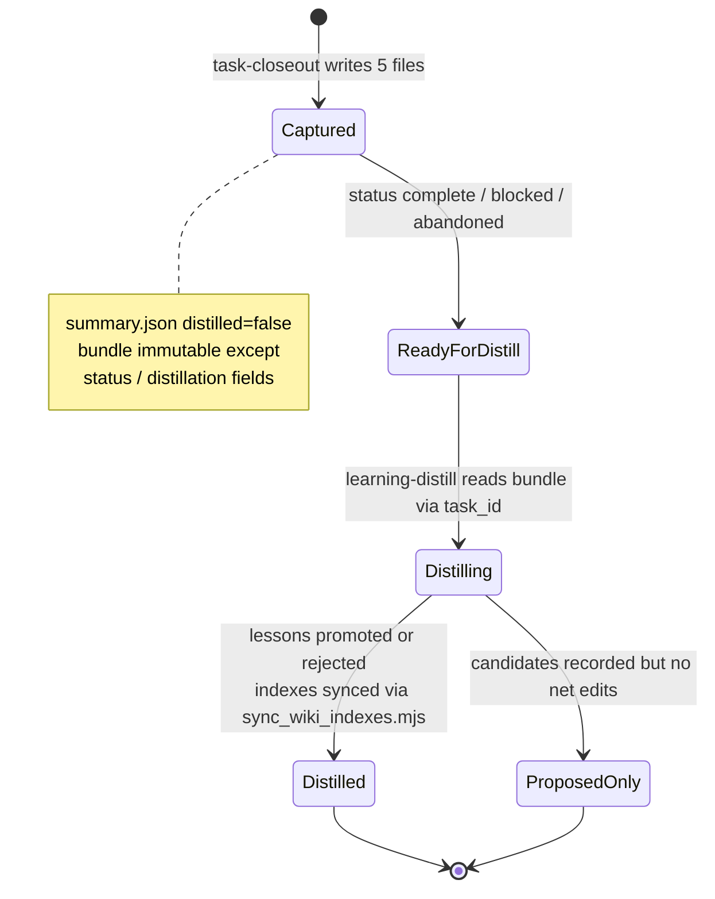
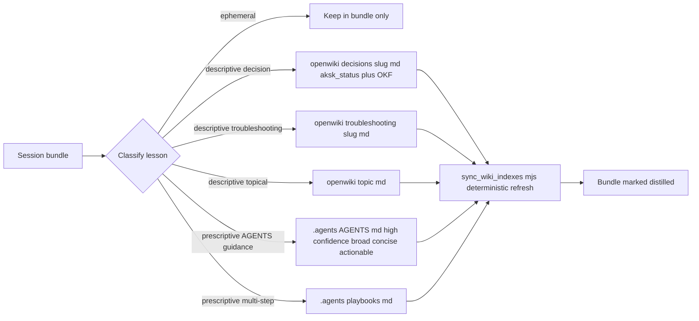

# Task Lifecycle and Distillation

Every substantive unit of agent work moves through a fixed loop: **capture** at a stopping point, **distill** into durable knowledge routed by kind, **sync** wiki indexes deterministically, and **lint** the wiring. When adopted, a proactive **task-start** would seed state at the beginning; until then the enforced loop is `work → closeout → distill → sync → lint`. This page traces `task-start (Proposal-only) → closeout → distill → index sync → lint`, linking session-bundle layout, canonical identity, OpenSpec change linkage, the descriptive→OpenWiki / prescriptive→`.agents` split, curation-contract prerequisites, and `sync_wiki_indexes.mjs`.

> **Proposal-only: `add-task-start`** — `task-start` lives only under `openspec/changes/add-task-start/` (proposal + `specs/task-start/spec.md` + design) and has **not** been archived to `openspec/specs/task-start/`. It is not an active capability until archived. Durable writes (`openwiki/`, `.agents/AGENTS.md`, `.agents/playbooks/`, `.agents/skills/`) happen **only during `learning-distill`**, never during `task-start` or `task-closeout` — start/closeout write only under `.agents/sessions/<session-folder>/` (plus idempotent `README.md`/`.gitignore` init) and record proposed durable changes as prose in the bundle.

Skill procedures are indexed at [task-closeout](../skills/task-closeout.md) and [learning-distill](../skills/learning-distill.md); the complementary data contract is [Knowledge Curation Contract](../concepts/knowledge-curation-contract.md) and the knowledge-layer shape is [The Knowledge Layer](../architecture/knowledge-layer.md).

## Canonical identity: `task_id` vs folder label

- The **canonical** task/session identifier is the `task_id` field inside `.agents/sessions/<session-folder>/summary.json`. Consumers, distillers, and cross-tool joins must read it from there.
- The **folder name is only a sortable storage label** with pattern `YYYYMMDD-HHMMSS-short-topic` (lowercase slug tied to the goal). Never infer identity from it.
- `repo_id` carries stable repository context; `prior_session` (decision `optional-prior-session-in-session-summary-json`) is an optional pointer linking related closeouts without merging folders.

```text
Bundle path: .agents/sessions/20260411-122921-auth-timeout-fix/
Task ID:     t-20260411-122921-auth-timeout-fix   ← from summary.json task_id
Repo ID:     agent-knowledge-starter
```

When handing work between agents, pass both the bundle path and the `task_id`. During distillation, filter and prioritize bundles by `summary.json` state fields (`distilled`, `status`, `distillation_status`), not by folder names.

## Bundle shape: the five-file closeout packet

`task-closeout` writes **only** under `.agents/sessions/<session-folder>/` (see [Write scope](#write-scope-and-immutability)). Each bundle directory must contain exactly five files:

| File | Role |
| --- | --- |
| `summary.json` | Status, timestamps, optional `repo_id`, **required `task_id`**, optional `agent`/`agent_session_id`, optional **`openspec_change`**, git metadata (`branch`, `head_commit`, `workspace_root`), distillation flags (`distilled`, `distillation_status`) |
| `active-task.md` | Observable facts only; sections: Task ID, Agent (optional), Agent Session ID (optional), Goal, Outcome, Files Changed, Commands Run, Validation, Remaining Work, Notes |
| `learning-candidate.md` | Candidate lessons only: Task, What failed, What worked, Reusable pattern, Candidate AGENTS update, Candidate troubleshooting note, Candidate repo decision, Candidate playbook, Spec updates deferred to archive time, Confidence |
| `changed-files.txt` | Paths touched during the session |
| `validation.txt` | Checks run and outcomes |

A filled-in reference lives at `.agents/skills/task-closeout/example/task-bundle/` (its `summary.json` carries `"openspec_change": "add-task-start"` and `"task_id": "t-20260407-143210-monaco"`). The two markdown files are scoped to the **whole maintainer conversation** — mistakes, reversals, and corrections — not just the final diff. Bundle prose stays concise and bullet-oriented.

### The `openspec_change` link and deferred spec updates

When the session worked on an OpenSpec change, `summary.json` records its name in `openspec_change` (capability `closeout-change-linking`):

```json
{
  "repo_id": "example-repo",
  "task_id": "t-20260407-143210-monaco",
  "status": "completed",
  "distilled": false,
  "openspec_change": "add-task-start"
}
```

- If no change was involved, the field is absent or null and closeout succeeds normally.
- **Closeout never edits `openspec/`** for in-flight changes. `learning-candidate.md` notes pending spec updates ("Spec updates deferred to archive time") for `/opsx:archive` to fold in. Archiving moves the change to `openspec/changes/archive/YYYY-MM-DD-<name>/` and optionally syncs delta specs via `openspec-sync-specs`. This gives `docs-lint`'s archived-change ↔ wiki coverage pairing a natural join key.

## Proposed task-start (Proposal-only)

`add-task-start` is **Proposal-only** and must be labeled as such. Until archived, do not treat `task-start` as an active skill or capability.

If adopted, intended ownership is exclusive and **no durable writes** occur at start:

- **`task-start` owns creation**: creates `.agents/sessions/YYYYMMDD-HHMMSS-short-topic/`, ensures `.agents/sessions/README.md` and `.agents/.gitignore` entries (`sessions/*`, `!sessions/README.md`) exist, and **seeds `summary.json`** with `task_id` (canonical), `created_at`, `status: in_progress`, and optionally `openspec_change`/`repo_id`/`agent`/`agent_session_id`. It does **not** yet contain `completed_at` or final validation/changed-files content, which are reserved for closeout.
- **`task-closeout` owns finalization**: detects the seeded `summary.json`, **preserves `task_id` (and `openspec_change` if seeded)**, appends `completed_at`, final `status` (`completed`/`blocked`/`abandoned`), git metadata, and distillation flags, then writes the remaining four bundle files. When invoked without a prior `task-start`, it retains its current generation fallback.
- **Strict sequencing**: `task-start` → work → `task-closeout` → `learning-distill` → `sync_wiki_indexes.mjs` → `docs-lint`. Only `task-start` (creation) → `task-closeout` (finalization) → `learning-distill` (consume + mark `distilled`/`distillation_status`) touch `summary.json`; durable updates remain owned exclusively by `learning-distill`.
- **No other writer mutates the bundle**: only the three lifecycle owners touch `summary.json`; nothing else writes durable knowledge during start/closeout.

## State machine



*Caption: bundle states enforced by the task-closeout contract (immutable after closeout except status/distillation fields) and learning-distill's final step (mark distilled). There is no activity log to append — accountability lives in bundle flags plus git history. Proposal would prepend `Started (task-start seeds summary.json in_progress) --> Working --> Captured` before this diagram.*

Lifecycle ordering (enforced today):

1. Coding task begins; agent creates or adopts `repo_id` and `task_id`.
2. At completion, blockage, or abandonment, agent runs `task-closeout` → five files written.
3. Learning agent runs `learning-distill` on the bundle, reading `task_id` from `summary.json`; fail-closed prerequisites must pass before any wiki write.
4. Durable lessons land in routed homes (see [Routing](#routing-descriptiveopenwiki-vs-prescriptiveagents)).
5. Learning agent runs `sync_wiki_indexes.mjs` then marks `summary.json` `distilled: true` / `distillation_status`.
6. Periodically, lint agent runs `docs-lint` and deterministic validators.

*Proposal path (not yet enforced): `task-start` would seed `summary.json` with `status in_progress` at step 1, making the bundle discoverable from the moment work begins, before step 2 finalizes it. Closeout would then preserve `task_id`/`openspec_change` rather than generating new identity.*

## Write scope and immutability

- **task-closeout** writes only under `.agents/sessions/<session-folder>/`. It never creates or edits `.agents/AGENTS.md`, `openwiki/**`, `.agents/playbooks/**`, files under `.agents/skills/**`, or anything under `openspec/` for in-flight changes. Proposed skill or policy changes are recorded as prose inside the bundle for `learning-distill` to apply.
- **Proposed `task-start`** (if adopted) would likewise write only under `.agents/sessions/<session-folder>/` plus idempotent init artifacts (`.agents/sessions/README.md`, `.agents/.gitignore` entries). It never creates or edits durable knowledge (`openwiki/`, `.agents/AGENTS.md`, `.agents/playbooks/`, `.agents/skills/`).
- **Durable writes are exclusive to `learning-distill`**: only `learning-distill` may edit `.agents/AGENTS.md`, `.agents/playbooks/`, and curated `openwiki/**` trees, and only after fail-closed prerequisites pass. Start and closeout capture prose proposals; distill promotes them.
- **After closeout** the bundle is **immutable except status / distillation-related fields** in `summary.json` that a later tool updates (`distilled`, `distillation_status`). All other files remain frozen.
- **No secrets upward**: neither bundles nor promoted pages may carry credentials, personal data, or long raw dumps. `learning-distill` rejects low-confidence or one-off lessons.

## Routing: descriptive→OpenWiki vs prescriptive→`.agents`

`learning-distill` (capability `distill-routing`) classifies each candidate lesson and routes it by kind. Descriptive lessons never land in `.agents/`; prescriptive rules never land in `openwiki/`.



*Caption: learning-distill routing by lesson kind with zone separation and deterministic index sync.*

| Category | Destination | Bar to clear |
| --- | --- | --- |
| `ephemeral` | stays in bundle | one-off detail not worth promoting |
| `AGENTS guidance` | `.agents/AGENTS.md` | high confidence, broadly useful, likely to recur, concise, actionable |
| `playbook` | `.agents/playbooks/<name>.md` | durable multi-step procedure |
| `decision record` | `openwiki/decisions/<slug>.md` | rationale needing explanation later; `aksk_status` required |
| `troubleshooting record` | `openwiki/troubleshooting/<slug>.md` | recurring failure + fix |
| `descriptive lesson` | topical page under `openwiki/` | stable fact or pattern worth keeping |

Two hard boundaries:

- **No duplication with OpenSpec.** If a candidate restates a SHALL requirement already codified in `openspec/specs/`, distillation cites the spec capability instead — wiki pages record facts and rationale; requirements live only in OpenSpec.
- **Never cross the zone boundary.** Violations surface as `docs-lint` misplaced-content reports.

Curated pages follow OpenWiki OKF base frontmatter (`type`, `title`, `description`, `tags`, `timestamp`) plus AKSK extensions: `aksk_status` (`accepted` / `superseded` / `provisional`) on decisions, optional `aksk_superseded_by` (successor slug + relative link), optional `aksk_depends_on` (list of qualified `decisions/<slug>` or `troubleshooting/<slug>`). Filename stem is the entry identity, unique within its tree.

## Curation-contract prerequisites (fail-closed)

Distillation **fails closed before any wiki write**. Two checks must pass, otherwise the run stops without writing and prints remediation:

1. **Peer binaries on PATH** — `node .agents/skills/aksk-bootstrap/scripts/check_peer_tools.mjs openspec openwiki` verifies both `openspec` and `openwiki` resolve via directory scan (not shell lookup). On failure it prints one error per missing tool plus exact install commands (`npm i -g @fission-ai/openspec@latest`, `npm i -g openwiki@latest`) and exits `2`. Unknown tool names also exit `2`.

2. **Curation contract attached** — `openwiki/INSTRUCTIONS.md` must exist and carry the AKSK markers. The contract is bounded by:

   ```html
   <!-- AKSK:WIKI-CONTRACT:BEGIN -->
   ... curated trees and curation rules ...
   <!-- AKSK:WIKI-CONTRACT:END -->
   ```

   The owner is `node .agents/skills/aksk-bootstrap/scripts/attach_wiki_contract.mjs`, which reads the desired section verbatim from `references/wiki-contract-template.md`. Behavior:
   - If `openwiki/INSTRUCTIONS.md` does not exist, exits `2` printing `openwiki --init` and performs no writes.
   - If markers absent, appends the templated section below existing content (stub-aware for the default `A code wiki for this repository.` stub).
   - If markers present and section already equals template (after trimming), no-op with `already up to date`; if template changed (kit upgrade), refreshes only between markers.
   - Never creates the wiki; only attaches to an already-initialized one.

Treating an absent contract as "nothing curated" could silently regenerate away hand-curated pages on the next `openwiki --update` (design decision D3 of `adopt-openspec-openwiki`, now spec'd under `distill-routing`), so absence fails closed.

### Procedure after prerequisites pass

1. Locate bundle via an ignore-blind method (see [Finding bundles](#finding-bundles-under-gitignore)), read `task_id` from `summary.json`.
2. Grep `openwiki/` (plain Markdown) and, for decision/requirement-shaped candidates, `openspec/specs/` for existing coverage; remove duplication.
3. Classify lessons per table above.
4. For wiki-bound lessons, load authoring guidance at runtime from the installed package and author the page directly under the correct curated tree:

   ```bash
   NPM_ROOT="$(npm root -g)" node --input-type=module -e '
     import { pathToFileURL } from "node:url"; import path from "node:path";
     const m = await import(pathToFileURL(path.join(process.env.NPM_ROOT, "openwiki/dist/agent/prompt.js")).href);
     console.log(m.createSystemPrompt(process.argv[1] ?? "init"));
   ' init
   ```

   Validate with:

   ```bash
   NPM_ROOT="$(npm root -g)" node --input-type=module -e '
     import { readFileSync } from "node:fs";
     import { pathToFileURL } from "node:url"; import path from "node:path";
     const fm = await import(pathToFileURL(path.join(process.env.NPM_ROOT, "openwiki/dist/okf/frontmatter.js")).href);
     const file = process.argv[1];
     console.log(JSON.stringify(fm.validateOkfFrontmatter(readFileSync(file, "utf8"), file)));
   ' openwiki/<path>.md
   ```

   Fix every reported issue before continuing.
5. Draft minimal updates to `.agents/AGENTS.md` or playbooks for prescriptive lessons (keep AGENTS guidance small and actionable; use playbooks for multi-step procedures).
6. Refresh indexes deterministically (next section) and mark the bundle distilled (`distilled: true`, `distillation_status`).

Distillation never invokes `openwiki --update`; it authors pages directly and refreshes indexes via the deterministic script.

## Deterministic index sync: `sync_wiki_indexes.mjs`

`node .agents/skills/aksk-bootstrap/scripts/sync_wiki_indexes.mjs [repo-root]` is the **only** supported way to rebuild wiki catalogs outside the scheduled `openwiki --update` run.

Control flow:

- Resolves repo root (`process.argv[2] ?? process.cwd()`); if `openwiki/` directory missing, exits `2` with `openwiki --init` remediation.
- Locates the global package via `npm root -g`; if `npm` unavailable or `openwiki/dist` missing, exits `2` with `npm i -g openwiki@latest` remediation.
- Dynamically imports `openwiki/dist/agent/docs-only-backend.js` and `openwiki/dist/okf/index-sync.js`.
- Constructs `OpenWikiLocalShellBackend` with `{ docsOnly: true, virtualMode: true, maxOutputBytes: 100_000, timeout: 120 }` and calls `synchronizeWikiIndexes(backend, "repository")`.
- Keeps curated page bodies **byte-identical** while rebuilding `openwiki/index.md` and directory `index.md` catalogs plus run metadata the CLI would otherwise regenerate.

Never hand-edit OpenWiki-owned files (`index.md` catalogs, `.last-update.json`, `.run.json`); `docs-lint` reports index drift as informational guidance to rerun this script rather than as a wiring failure.

## Finding bundles under gitignore

Per-task folders under `.agents/sessions/` are deliberately gitignored — `.agents/.gitignore` carries:

```gitignore
sessions/*
!sessions/README.md
```

Only `README.md` is tracked. Many search tools skip ignored paths by default, so **never conclude no bundles exist based on an ignore-aware search or glob**. Locate bundles with at least one ignore-blind method:

- Filesystem listing (`ls`, `find`, shell APIs) rather than an IDE index.
- Ripgrep with `--no-ignore-vcs` (or `--no-ignore` when scoped to the sessions subtree).

Then open each candidate's `summary.json` and filter by `task_id` canonical identity plus state flags (`distilled`, `status`, `distillation_status`). This invariant is also documented as troubleshooting entry `session-discovery-fails-during-distillation-or-closeout`.

## Failure handling

| Failure | When detected | Behavior |
| --- | --- | --- |
| `openwiki` binary missing | `check_peer_tools.mjs` before any wiki write | Exit `2`, per-tool error + `npm i -g openwiki@latest`, no pages written |
| `openspec` binary missing | Same check | Same semantics with `npm i -g @fission-ai/openspec@latest` |
| `openwiki/INSTRUCTIONS.md` missing | `attach_wiki_contract.mjs` / distill prerequisite | Exit `2`, prerequisite `openwiki --init`, no writes |
| `INSTRUCTIONS.md` exists but lacks `AKSK:WIKI-CONTRACT` markers (including default stub) | Distill prerequisite | Stop before any wiki write, point to `attach_wiki_contract.mjs` |
| Wiki uninitialized for index sync | `sync_wiki_indexes.mjs` | Exit `2`, `openwiki --init` hint, no index writes |
| Global `openwiki` package missing | `sync_wiki_indexes.mjs` | Exit `2`, `npm i -g openwiki@latest` |
| Spec updates during closeout | `closeout-change-linking` contract | Closeout leaves `openspec/` untouched; records deferral in `learning-candidate.md` for archive time |
| `task-start` invoked without durables | Proposal guard | Writes only under `.agents/sessions/<folder>/` + init artifacts; no durable knowledge created |

All bootstrap scripts are offline-safe and never attempt installation — they verify and exit with remediation. `check-publish.sh` gates optional probes (`remark`, `jq`, `rg`, `markdown-link-check`) behind `--no-install` and `timeout` so missing tools degrade to `WARN` skip rather than false pass/fail.

## Lint and validation follow-up

After distillation, two complementary layers guard the result:

- **Deterministic validators** — `bash scripts/check-agents-structure.sh [target]` enforces portable shape (required files, session tracking via `git ls-files`, SKILL.md frontmatter markers, JSON validity with `jq` when present). `bash scripts/check-publish.sh` (wired to `npm run check`) delegates to it and adds release hygiene: `remark` formatting, `markdown-link-check`, leakage scans for secrets/local paths, and doubled-path hygiene `rg '\.agents/\.agents/'` (hard fail).
- **`docs-lint` wiring pass** — procedure-and-checklist skill that verifies routing-block integrity (exactly one of each `AKSK:AGENTS-BASELINE`, `OPENWIKI:START/END`, `AKSK:ROUTING`, `AKSK:LIFECYCLE` block per root instruction file), wiki-contract presence, archived-change ↔ wiki coverage pairing (`openspec/changes/archive/*/` vs `openwiki/` — uncovered changes flagged unless a deferral note exists on the archived page), and stale curated knowledge (superseded status mismatches, dead `aksk_depends_on` targets, retired-skill references). It also reports index drift as guidance to rerun `sync_wiki_indexes.mjs`.

Pre-publish playbook sequences: refresh indexes → run `docs-lint` → run `check-publish.sh`.

## Relationships

- **task-closeout ↔ learning-distill** — closeout captures and marks ready; distill consumes only after closeout marks ready, with strict write-scope separation and no overlapping writers. Reconciliation with proposed `task-start` (`add-task-start`): task-start owns `manifest.json` creation, closeout owns finalization, distill consumes only after finalization, preserving `openspec_change` and distillation flags. Until archived, enforced lifecycle remains `coding → task-closeout → learning-distill`.
- **Proposed `task-start` → closeout → distill** — if adopted, `task-start` seeds `summary.json` (`task_id`, `created_at`, `status: in_progress`, optional `openspec_change`); closeout finalizes the same file preserving identity; distill consumes only after finalization. Fallback: closeout generates identity when no seed exists.
- **OpenSpec ↔ bundles** — `openspec_change` links bundles to intent; coverage pairing closes the loop for archived changes.
- **OpenWiki ↔ curated trees** — `INSTRUCTIONS.md` contract declares `openwiki/{decisions,troubleshooting}/`, `overview.md`, `maintenance-format.md` as AKSK-curated preserve-and-link targets; `distill-routing` enforces the zone boundary.
- **Validation ↔ curation** — validators own structure; `docs-lint` owns wiring; neither regenerates indexes.

## Operations and focused tests

| Probe | Command | What it proves |
| --- | --- | --- |
| Portable shape | `bash scripts/check-agents-structure.sh .agents` | Required bundle scaffold, session tracking, frontmatter headers, JSON validity |
| Release hygiene | `bash scripts/check-publish.sh` | Format + links + leakage + doubled-path gates |
| Peer tools present | `node .agents/skills/aksk-bootstrap/scripts/check_peer_tools.mjs openspec openwiki` | Binaries resolvable on PATH |
| Contract attached | `grep -c "AKSK:WIKI-CONTRACT" openwiki/INSTRUCTIONS.md` | Curation contract markers present |
| Attach contract (idempotent) | `node .agents/skills/aksk-bootstrap/scripts/attach_wiki_contract.mjs` | No-op when up to date, refresh only between markers |
| Index resync | `node .agents/skills/aksk-bootstrap/scripts/sync_wiki_indexes.mjs` | Deterministic catalog rebuild without LLM |
| Frontmatter valid | `validateOkfFrontmatter` via `openwiki/dist/okf/frontmatter.js` + schemas under `learning-distill/references/` | Curated pages satisfy OKF + `aksk_*` contract |

## Extension points

- **Adding a curated tree** — extend `wiki-contract-template.md` and the `INSTRUCTIONS.md` markers, then update `docs-lint`'s curated-tree table. No validator change unless the tree ships as a required file.
- **Adding a marker family** — add `references/<name>-template.md` with its `<!-- AKSK:NAME:BEGIN/END -->` pair; `attach_section.mjs` picks it up via `markersOf()` with no code change.
- **Adding a capability** — propose a change with `specs/<capability>/spec.md` delta SHALL requirements; archive with sync to graduate to `openspec/specs/<capability>/spec.md`.
- **Adding a debuggable lifecycle check** — gate on tool presence and route to `warn` rather than `fail` for non-load-bearing artifacts, following the `jq`/`rg` optional-tool pattern.

## Related

- Skill procedures: [task-closeout](../skills/task-closeout.md), [learning-distill](../skills/learning-distill.md), [docs-lint](../skills/docs-lint.md), [aksk-bootstrap](../skills/aksk-bootstrap.md)
- Knowledge contracts: [Knowledge Curation Contract](../concepts/knowledge-curation-contract.md), [The Knowledge Layer](../architecture/knowledge-layer.md)
- Governance: [OpenSpec Governance](../workflows/openspec-governance.md), [Validation and Cross-Tool Lint](../operations/validation-and-lint.md)
- Architecture: [Task Lifecycle and Session Bundles](../architecture/task-lifecycle.md)
- Proposal: `openspec/changes/add-task-start/` (task-start spec, proposal, design)
